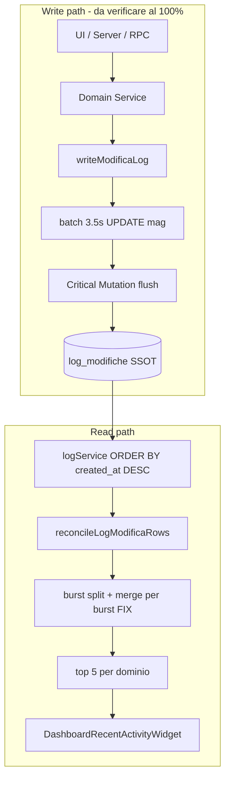

# Root Cause Analysis + Fix Definitivo — Dashboard "Ultime Attività" (v2)

## Stato del piano

**Non implementare finché non sono completate Fase 0 (SSOT) e Fase 1 (Write Coverage Audit).**

Il merge all-time in `groupLogsByEntity` è la **prima root cause individuata nel feed builder**, ma **non va dichiarata root cause primaria** finché i test di copertura scrittura non dimostrano che ogni operazione rilevante arriva in `log_modifiche`. Se metà delle operazioni non viene mai registrata, correggere il feed risolve solo un sintomo.

---

## Ipotesi da verificare (in ordine)

| # | Ipotesi | Dove | Verifica |
|---|---------|------|----------|
| H1 | Operazioni non scrivono mai su `log_modifiche` | Service, RPC, import, server paths | Write Coverage Audit (Fase 1) |
| H2 | Scritture falliscono silenziosamente (`autore_id`, errori DB) | `audit-log.ts` | Test + log inspection |
| H3 | Log pendenti in batch magazzino (3.5s) al return della mutazione | `log-modifiche-batcher.ts` | Test contratto Critical Mutation |
| H4 | Feed builder fonde burst distanti nella stessa entità | `control-tower-selectors.ts` | Test semantica burst |
| H5 | Retention 100/tipo riduce diversità feed | DB trigger | **Differita** — improbabile per attività di pochi minuti fa |

Solo dopo aver escluso H1–H3 con evidenza si attribuisce la **root cause primaria** definitiva.

---

## Fase 0 — Verifica SSOT (`log_modifiche`)

### Obiettivo

Dimostrare che `log_modifiche` è la SSOT **completa** per il feed operativo, non solo la SSOT **di lettura** della Dashboard.

### Albero decisionale per ogni operazione mancante

```
Ultima operazione eseguita (es. fattura creata)
  ↓
Esiste riga in log_modifiche?
  ├─ SÌ → problema a valle (feed, cache, merge)
  └─ NO → cercare altrove:
        ├─ auth_logs?
        ├─ app_settings_audit?
        ├─ document_capture_events?
        ├─ workshop_schedule_history?
        ├─ inventory_label_events?
        ├─ localStorage change-log (magazzino/preventivi/documenti)?
        ├─ payload realtime / entity table only?
        └─ solo UI state?
```

### Esito atteso

Documentare per ogni store alternativo:

| Store | Chi scrive | Chi legge | Usato da Dashboard activity? | Decisione |
|-------|-----------|-----------|-------------------------------|-----------|
| `log_modifiche` | `writeModificaLog()` | `logService`, control tower | **Sì** | SSOT ufficiale |
| `auth_logs` | login/logout | security dashboard | No | Dominio separato |
| `app_settings_audit` | trigger `app_settings` | admin settings | No | Dominio separato |
| localStorage change-log | UI client | moduli magazzino/preventivi | No | Legacy UX — non SSOT feed |
| … | … | … | … | … |

### Criterio di uscita Fase 0

Conferma scritta (con evidenza codice):

> **Tutte le operazioni che devono comparire nel feed Dashboard devono scrivere su `log_modifiche`.**  
> Le operazioni che oggi non lo fanno sono **gap di copertura**, non design intenzionale — salvo documentazione esplicita contraria.

---

## Fase 1 — Write Coverage Audit (obbligatoria prima del feed fix)

### Obiettivo

Matrice completa per dominio. **Nessuna modifica al feed builder finché questa matrice non è compilata e i gap sono classificati.**

### Template matrice (per ogni operazione)

| Operazione | Service / path | Scrive `log_modifiche` | Meccanismo | Test esistente | Gap |
|------------|----------------|------------------------|------------|----------------|-----|
| Crea lavorazione | `lavorazioni.service.ts` | ✔ | `writeModificaLog` CREATE | da verificare | |
| Modifica lavorazione | `lavorazioni.service.ts` | ✔ | `writeModificaLog` UPDATE | da verificare | |
| Cambio stato kanban | `use-lavorazione-stato-move-mutation` → service | ✔ | UPDATE | da verificare | |
| Import AI / capture scheda UPDATE | `capture-intervento-write-deps.server.ts` | ✘ | — | ✘ | **GAP** |
| Nota credito | `invoices.service.ts` `createCreditNote` | ✘ | RPC only | ✘ | **GAP** |
| Pagamento multi-cliente | `registerCustomerPaymentMulti` | ✘ | RPC only | ✘ | **GAP** |
| DDT replace (annulla vecchio) | SQL `replace_ddt_for_preventivo` | ✘ | solo CREATE nuovo | ✘ | **GAP** |
| Import listino magazzino | `listino-import-execute.server.ts` | ✘ | direct INSERT | ✘ | **GAP** |
| … | … | … | … | … | … |

### Domini da coprire integralmente

1. **Lavorazioni** — create, update, stato, assegnazione, delete, restore, conclude, schede, capture, import
2. **Magazzino** — entrata/uscita, carico/scarico, movimento, inventario, import, trasferimento, modifica articolo, delete
3. **Preventivi** — create, update, invio/stato, duplica, conversione, delete, import
4. **DDT** — create, replace, confirm, stampato, consegnato, cancel, delete draft
5. **Fatture** — create, update, issue, pagamento singolo, pagamento multi, nota credito, cancel, delete

### Deliverable Fase 1

- File: `docs/activity-feed-write-coverage-audit.md` (matrice completa + gap list prioritizzata)
- Test statico: `lib/regression/activity-write-coverage-audit.test.ts` (grep/AST su service paths noti)

### Criterio di uscita Fase 1

- 100% operazioni feed-eligible mappate
- Ogni gap classificato: `fix_required` | `out_of_scope` (con motivazione)
- Root cause primaria attribuita con evidenza: **write gap** vs **feed transform** vs **entrambi**

---

## Fase 2 — Decisione trigger DB (documentazione, non implementazione)

### Contesto

Migration [`20260211120000_officina_gestionale_core.sql`](supabase/migrations/20260211120000_officina_gestionale_core.sql) annota:

```
-- Trigger su INSERT/UPDATE/DELETE che scrivono su log_modifiche.
```

**Verifica richiesta:**

- Erano previsti e mai implementati?
- Oppure decisione consapevole: audit solo application-layer?

### Deliverable

Sezione in `docs/activity-feed-write-coverage-audit.md`:

| Opzione | Pro | Contro | Decisione progetto |
|---------|-----|--------|-------------------|
| Solo application layer (`writeModificaLog`) | Payload ricchi, diff, context, batching | Opt-in, gap RPC/import | **Attuale** |
| Trigger DB su entity tables | Garanzia 100% write | Duplicazione log, payload poveri, conflitto con batching | **Non adottare** |

**Regola:** non aggiungere trigger DB (rischio duplicazione log). Chiudere gap con `writeModificaLog` nei path mancanti + contratto Critical Mutation.

---

## Fase 3 — Test di riproduzione (prima di qualsiasi fix)

Per ogni dominio, sequenza:

1. Eseguire operazione
2. `SELECT * FROM log_modifiche WHERE entita = ? ORDER BY created_at DESC LIMIT 5`
3. Confrontare con output `buildControlTowerActivityFeedSlice`
4. Documentare divergenza: **manca log** | **log ok, feed sbagliato** | **cache stale**

### Test semantica burst (feed)

- Due UPDATE stessa lavorazione < 30s → **1** attività
- Terzo UPDATE stessa lavorazione dopo 5+ min → **2** attività distinte
- Ripetere per magazzino, preventivo, DDT, fattura

File: `lib/dashboard/control-tower-activity-feed-semantics.test.ts`

---

## Fase 4 — Chiudere gap di scrittura (solo gap classificati `fix_required`)

Per ogni bypass dalla matrice Fase 1:

| File | Fix |
|------|-----|
| [`invoices.service.ts`](src/services/invoices.service.ts) | log dopo `createCreditNote`, `registerCustomerPaymentMulti` |
| [`ddt.service.ts`](src/services/ddt.service.ts) | log UPDATE annullamento vecchio DDT post-replace |
| [`capture-intervento-write-deps.server.ts`](lib/document-capture/capture-intervento-write-deps.server.ts) | log UPDATE scheda |
| import server paths | log summary per batch |
| [`settings-rename-propagation.service.ts`](src/services/settings-rename-propagation.service.ts) | log UPDATE scheda |

**Un solo writer per operazione** — no trigger DB duplicati.

---

## Fase 5 — Contratto Critical Mutation (batch magazzino)

### Problema

Batch 3.5s su UPDATE `magazzino_ricambi` / `movimenti_ricambi` può lasciare log pendenti al return.

### Soluzione (non flush selettivo)

Contratto unico per **ogni mutazione che deve comparire nel feed**:

```
Critical mutation
  ↓
commit DB (entity)
  ↓
flush audit (await flushPendingModificaLogs / write immediato)
  ↓
invalidate cache (QK.log)
  ↓
return
```

### Implementazione

- Wrapper `withCriticalAuditFlush(client, fn)` in [`audit-log.ts`](src/services/internal/audit-log.ts) o layer domain entry
- Applicare a tutti i path magazzino/movimenti che terminano con navigazione o invalidazione feed
- Hardening `writeModificaLog`: `autore_id` assente → errore propagato, non skip silenzioso

---

## Fase 6 — Fix feed builder (solo dopo Fase 1 chiusa)

### Prima root cause individuata (feed)

[`groupLogsByEntity`](lib/dashboard/control-tower-selectors.ts) fonde **tutti** i log di una entità in una riga, ignorando gap temporali. Contrasta con semantica richiesta:

- Burst ravvicinati (priorità + addetto insieme) → **1 attività**
- Eventi distanti (priorità ora, completata 5 ore dopo) → **2 attività**

### Algoritmo target (semplificato)

```
input: log rows (già passati da reconcileLogModificaRows)
  ↓
bucket per activityGroupKey
  ↓
split bucket per burst temporale (gap > LOG_AGGREGATION_WINDOW_MS)
  ↓
mergeEntityActivityRows su ogni burst (non sull'intera entità)
  ↓
flat list di burst-items
  ↓
sort DESC per burst.newest.created_at
  ↓
slice(0, CONTROL_TOWER_ACTIVITY_PER_CARD)
```

**Il merge non è più sull'entità. È sul burst.**

### Scope

- Modificare [`control-tower-selectors.ts`](lib/dashboard/control-tower-selectors.ts) — **non** il widget React
- Aggiornare [`control-tower-selectors.test.ts`](lib/dashboard/control-tower-selectors.test.ts)

---

## Fase 7 — Sync (senza polling)

- Aggiungere `invoices`, `invoice_payments`, `ddt_documents` a [`CabSyncEntity`](lib/sync/cab-sync-bus.ts) + [`GESTIONALE_TABLE_QUERY_KEYS`](src/lib/react-query/invalidate-targets.ts)
- Fallback invalidation `QK.log` su entity change in [`use-dashboard-sync-invalidation.ts`](src/hooks/view/use-dashboard-sync-invalidation.ts)
- Allineare BFF prefetch: `ddt_documents`, `invoice_payments` in [`dashboard-data-fetch-server.ts`](lib/bff/dashboard-data-fetch-server.ts)

---

## Fase 8 — Retention (differita)

**Non toccare** finché Fase 1–7 non sono corrette e verificate.

Retention 100/tipo è stretta ma **improbabile** spiegazione per attività di pochi minuti fa. Rivalutare solo se i test post-fix mostrano perdita di diversità nel pool log.

---

## Fase 9 — Test anti-regressione (obbligatorio)

### Test SSOT fidelity (quello che manca oggi)

```
CRUD operazione
  ↓
SELECT ultime N righe log_modifiche (per dominio, post-reconcile)
  ↓
buildControlTowerActivityFeedSlice
  ↓
deepEqual su:
  - stesso ordine
  - stesso id (o burst id deterministico)
  - stesso timestamp (burst newest)
  - stesso tipo evento
  - stessa entità / group key
```

**Non** confrontare solo `length === 5`. La Dashboard deve essere una **trasformazione fedele** della SSOT, non un dataset diverso.

File: `lib/dashboard/control-tower-activity-ssot-fidelity.test.ts`

### Altri test

| Test | Scopo |
|------|-------|
| `control-tower-activity-feed-semantics.test.ts` | burst vs separazione temporale |
| `activity-write-coverage-audit.test.ts` | ogni service path noto chiama `writeModificaLog` |
| `minimal-invalidation-contract-policy.test.ts` | estendere per entità dominio |
| Integration smoke | CRUD end-to-end per 4 domini |

---

## Mappa architettura (invariata)



**SSOT lettura/scrittura:** `log_modifiche` via `writeModificaLog()` — **da dimostrare completa** con Fase 0–1.

---

## Ordine di esecuzione (vincolante)

1. **Fase 0** — Verifica SSOT + albero decisionale
2. **Fase 1** — Write Coverage Audit (matrice completa)
3. **Fase 2** — Documentazione decisione trigger
4. **Fase 3** — Test riproduzione (evidenza root cause definitiva)
5. **Fase 4** — Chiudere gap scrittura
6. **Fase 5** — Contratto Critical Mutation
7. **Fase 6** — Fix feed builder (burst merge)
8. **Fase 7** — Sync fallback
9. **Fase 8** — Retention (solo se necessario)
10. **Fase 9** — Test SSOT fidelity deepEqual

---

## Cosa NON fare

- Non dichiarare root cause primaria prima di Fase 1
- Non modificare feed builder prima di Write Coverage Audit
- Non aggiungere trigger DB (duplicazione log)
- Non usare polling o aumentare staleTime come workaround
- Non hotfix solo sul widget Dashboard
- Non toccare retention fino a verifica post-fix

---

## Deliverable finale

1. Root cause primaria **attribuita con evidenza** (non ipotesi)
2. Matrice Write Coverage Audit completa
3. Decisione trigger documentata
4. SSOT `log_modifiche` verificata al 100% per operazioni feed-eligible
5. Fix scrittura + Critical Mutation contract + burst feed
6. Test `deepEqual` SSOT ↔ feed
7. Conferma: card Dashboard = trasformazione fedele di `log_modifiche`, aggiornamento senza refresh manuale
