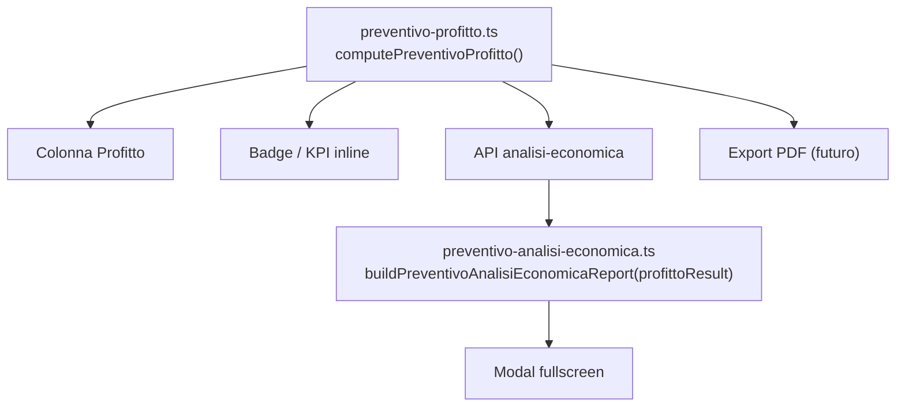

# Analisi economica Preventivo (v3 — SSOT + modello stabile)

## 1. `preventivo-profitto.ts` = unica fonte di verità (priorità alta)

**Una sola funzione pubblica di calcolo.** Nessun `computePreventivoProfittoDettaglio` parallelo.



### [`computePreventivoProfitto(input)`](lib/preventivi/preventivo-profitto.ts)

Input: `preventivo`, `bundle?`, `magazzinoById?`.

Output tipizzato **`PreventivoProfittoResult`** — tutto calcolato qui, una volta:

```ts
interface PreventivoProfittoResult {
  summary: {
    ricavi: number;              // totaleFinale netto (v1)
    ricavoPreventivato: number;  // v1 = ricavi; campo separato per consuntivo futuro
    ricavoFinale: number;        // v1 = ricavi
    costi: number;
    profitto: number;
    margine: number | null;      // profitto / ricavi × 100
    markup: number | null;       // profitto / costi × 100
  };

  breakdown: {
    manodopera: PreventivoProfittoManodoperaBreakdown;
    ricambi: PreventivoProfittoRicambiBreakdown;
    altriCosti: PreventivoProfittoAltriCostiBreakdown; // v1: totale 0, placeholder
  };

  indicatori: {
    margineTier: "verde" | "giallo" | "rosso" | null;
    profittoDirezione: "utile" | "pareggio" | "perdita";
    warningCount: number;        // righe vendutoSottoCosto
    lossCount: number;             // righe profittoNegativo
    lossReason: "manodopera" | "ricambi" | "entrambi" | null;
  };

  timeline: {
    preventivato: number;        // ricavoPreventivato
    costo: number;
    utile: number;               // profitto
    margine: number | null;
  };

  confronto: {
    ore: { preventivato: number; reale: number; scostamento: number };
    ricambiQty: { preventivato: number; reale: number | null; scostamento: number | null };
  };

  kpi: {
    roiCommessa: number | null;
    costoMedioOra: number | null;
    prezzoMedioOra: number | null;
    ricaricoMedioRicambi: number | null;
    valoreMedioRicambio: number | null;
    costoMedioRicambio: number | null;
    ricavoMedioRicambio: number | null;
  };

  footerKpi: PreventivoProfittoFooterKpiRow[]; // righe tabella finale (#9)
}
```

**Consumer tabella:** `profittoResult.summary.profitto` + `profittoResult.summary.margine` — niente altro.

Helper opzionale `profittoTabellaCell(profittoResult)` per evitare ripetizione in view.

### [`preventivo-analisi-economica.ts`](lib/preventivi/preventivo-analisi-economica.ts) — zero calcolo

```ts
buildPreventivoAnalisiEconomicaReport({
  preventivoMeta,      // numero, cliente, mezzo, stato preventivo, stato lavorazione, codice lav., ore lav.
  profittoResult,      // output computePreventivoProfitto — GIÀ CALCOLATO
  metadata,            // generatedAt, generatedBy, version
}): PreventivoAnalisiEconomicaApiResponse
```

Solo mapping/layout fields per UI. **Vietato** ricalcolare profitto, costi, margine, scostamenti, `lossReason`, conteggi.

---

## 2. Modello API stabile (contratto lungo)

Response `GET /api/preventivi/[id]/analisi-economica`:

```ts
interface PreventivoAnalisiEconomicaApiResponse {
  metadata: {
    generatedAt: string;
    generatedBy: string;
    version: string;           // es. "1"
  };
  header: PreventivoAnalisiHeader;
  summary: PreventivoProfittoResult["summary"];
  breakdown: PreventivoProfittoResult["breakdown"];
  indicatori: PreventivoProfittoResult["indicatori"];
  timeline: PreventivoProfittoResult["timeline"];
  confronto: PreventivoProfittoResult["confronto"];
  kpi: PreventivoProfittoResult["kpi"];
  footerKpi: PreventivoProfittoResult["footerKpi"];
  costiPerCategoria: PreventivoAnalisiCategoriaVoce[];  // v1: manodopera + ricambi
  ricaviPerCategoria: PreventivoAnalisiCategoriaVoce[];
}
```

`buildReport` espone `profittoResult` quasi verbatim + `header`/`metadata`. Contratto pronto per PDF senza cambi API.

---

## 3. Scostamenti **nelle tabelle** (#3 iterazione)

Non solo sezione Extra. Colonne integrate:

### Manodopera — sottotabella confronto ore

| Voce | Preventivo | Reale | Scostamento |
|------|------------|-------|-------------|
| Ore  | 10         | 13    | +3 h        |

Più tabella economica esistente (costo €/h, costo reale, prezzo vendita, ricavo, profitto, margine).

Dati da `breakdown.manodopera` + `confronto.ore`.

### Ricambi — colonne o riga totale confronto qty

| Voce | Preventivo | Reale | Scostamento |
|------|------------|-------|-------------|
| Quantità totale | 8 | 9 | +1 |

Per riga ricambio: colonne costo/ricavo/profitto/margine + flag `vendutoSottoCosto` / `profittoNegativo` (distinti, #5).

Sezione Extra opzionale: solo alert testuali (`lossReason`, liste righe sotto costo) — **non** duplicare scostamenti.

---

## 4. `lossReason` (#4)

Calcolato in `preventivo-profitto.ts` dentro `indicatori`:

```ts
lossReason:
  | "manodopera"   // breakdown.manodopera.profitto < 0
  | "ricambi"      // breakdown.ricambi.totale.profitto < 0
  | "entrambi"     // entrambi negativi
  | null           // profitto globale >= 0
```

UI senza ricalcolo:
- «Perdita dovuta alla manodopera»
- «Perdita dovuta ai ricambi»
- «Perdita dovuta a manodopera e ricambi»

---

## 5. Due flag distinti per righe ricambi (#5)

```ts
vendutoSottoCosto: boolean   // prezzo vendita netto < costo unitario — warning
profittoNegativo: boolean    // profitto riga < 0 — riga rossa
```

Un ricambio sotto costo **non** implica perdita globale. UI:
- riga rossa solo se `profittoNegativo`
- badge/amber se solo `vendutoSottoCosto`

Stesso per riga manodopera aggregata.

---

## 6. Header più ricco (#6)

`header` (da `preventivoMeta` + `profittoResult`):

- Numero preventivo, cliente, mezzo (`macchinaRiassunto`)
- Stato preventivo, data
- **Stato lavorazione** (se `lavorazioneId` — da row lavorazione o preventivo)
- **Numero/codice lavorazione**
- **Totale ore lavorazione** (`confronto.ore.reale` o ore scheda)
- Importo preventivo cliente (`summary.ricavoFinale`)
- Totale costi, profitto, margine (da `summary` — stessi numeri SSOT)

---

## 7. KPI per categoria nel riepilogo (#7)

`breakdown.manodopera.totale` e `breakdown.ricambi.totale` includono **quattro valori**:

```
Manodopera:  Ricavo | Costo | Profitto | Margine %
Ricambi:     Ricavo | Costo | Profito | Margine %
```

Più incidenze % su ricavi/costi totali. Non solo costi/incidenze.

Cards riepilogo categoria in modal.

---

## 8. `metadata` API (#8)

Route aggiunge:

```ts
metadata: {
  generatedAt: new Date().toISOString(),
  generatedBy: autoreDaSessione,
  version: "1",
}
```

Pronto per export PDF senza cambi contratto.

---

## 9. KPI visivi (#9)

Nel riepilogo modal, **barre di sintesi** (CSS design system, no nuove librerie):

```
Ricavo cliente  ████████████ 12.300 €
Costo reale     ███████      8.100 €
Profitto        ████         4.200 €
```

Larghezza barra = valore / `summary.ricavoPreventivato` (cap 100%). Componente locale `PreventivoAnalisiBarSummary` o token esistenti.

Timeline card (#6 precedente) resta affiancata.

---

## Breakdown interno (calcolato in SSOT)

### `breakdown.manodopera`

- Righe confronto ore (preventivato/reale/scostamento)
- Costo €/h interno, costo reale, prezzo vendita €/h
- `totale`: { ricavo, costo, profitto, margine }
- `profittoNegativo` a livello categoria

### `breakdown.ricambi`

- `righe[]`: codice, descrizione, qty, costo unit., costo tot., prezzo vendita, ricavo netto, profitto, margine, `vendutoSottoCosto`, `profittoNegativo`
- `totale`: { ricavo, costo, profitto, margine }
- Riga confronto qty (preventivato/reale/scostamento)

### `breakdown.altriCosti`

- `totale`: 0, `voci`: [] — placeholder future (verniciatura, trasporti, …)

---

## Server & API

[`preventivo-analisi-economica.server.ts`](lib/preventivi/preventivo-analisi-economica.server.ts):

1. `fetchPreventivoRecordServer(id)`
2. Parallel: schede bundle (`lavorazioneId`), magazzino scoped ids, **lavorazione row** (per stato/codice header)
3. `profittoResult = computePreventivoProfitto({ preventivo, bundle, magazzinoById })`
4. `buildPreventivoAnalisiEconomicaReport({ preventivoMeta, profittoResult, metadata })`

[`app/api/preventivi/[id]/analisi-economica/route.ts`](app/api/preventivi/[id]/analisi-economica/route.ts): `GET`, `preventivi.read`, `Cache-Control: no-store`.

---

## UI modal

[`preventivo-analisi-economica-modal.tsx`](components/preventivi/preventivo-analisi-economica-modal.tsx):

- `LavorazioniModalShell` `modalSize="fullscreen"`, readonly
- Ordine: Header ricco → Timeline + barre KPI visivi → Manodopera (confronto ore in tabella) → Ricambi (confronto qty + righe) → Altri costi placeholder → Summary categorie (R/C/P/M) → Alert `lossReason` → Footer KPI tabella
- Indicatori doppi: freccia profitto + pill margine tier
- Azione: [`PreventivoRowActions`](components/preventivi/preventivi-view.tsx) «Analisi Economica» (`canReadPreventivi`)

---

## Tabella Preventivi

[`preventivi-view.tsx`](components/preventivi/preventivi-view.tsx): `profittoByPreventivoId` usa **solo** `computePreventivoProfitto` → `summary.profitto` / `summary.margine`. Stessi numeri del report header.

---

## Test

- [`preventivo-profitto.test.ts`](lib/preventivi/preventivo-profitto.test.ts): result completo, `lossReason`, confronti, KPI, flag distinti
- [`preventivo-analisi-economica.test.ts`](lib/preventivi/preventivo-analisi-economica.test.ts): `buildReport` non modifica numeri; metadata presente
- Parità: colonna tabella === `profittoResult.summary`

---

## Fuori scope v1

- Export PDF (metadata già predisposto)
- `ricavoFinale` ≠ `ricavoPreventivato` (consuntivo)
- Popolamento `altriCosti` oltre placeholder

---

## Acceptance

- Colonna Profitto, badge, report, futuro PDF: **stesso** `computePreventivoProfitto`
- Scostamenti visibili **nelle tabelle** manodopera/ricambi
- `lossReason` + flag `vendutoSottoCosto` / `profittoNegativo` separati
- Summary per categoria con Ricavo/Costo/Profitto/Margine
- Timeline + barre visive + footer KPI
- Header con lavorazione e ore
- Nessuna regressione azioni esistenti
