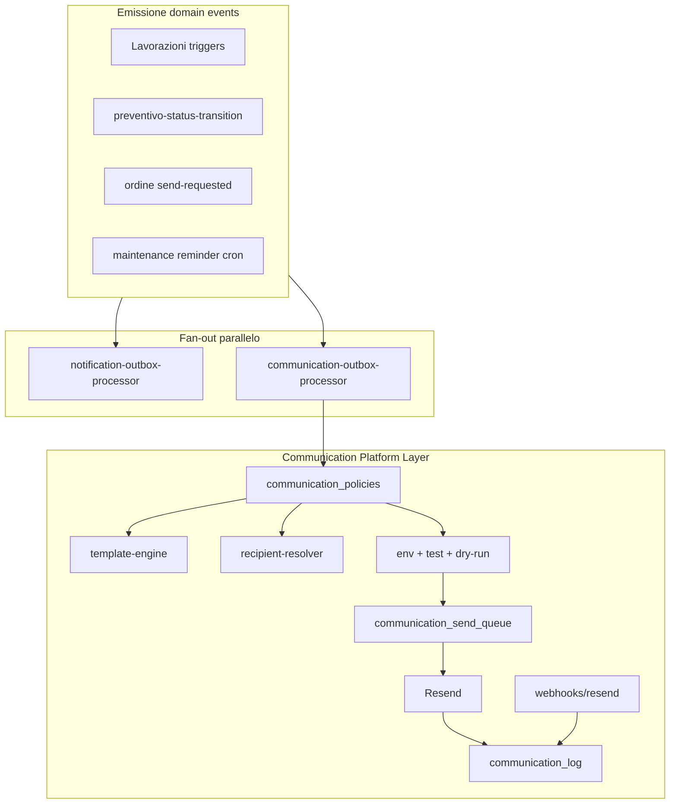

# Communication Platform Layer (v3 — revisione finale)

## Mandato pre-implementazione (obbligatorio)

Prima di implementare:

1. **Eseguire audit completo** del sistema notifiche SSOT v4 ([`docs/adr/ADR-002-notification-ssot-architecture.md`](docs/adr/ADR-002-notification-ssot-architecture.md), [`lib/notifications/`](lib/notifications/)).
2. Documentare riuso in [`docs/communications/ARCHITECTURE.md`](docs/communications/ARCHITECTURE.md).

**Riutilizzare:**

- outbox pattern
- claim RPC
- worker cron
- tracing ([`notification-trace`](lib/notifications/observability/notification-trace.ts), [`pipeline-trace`](lib/notifications/observability/pipeline-trace.server.ts))
- osservabilità ([`runtime-coordination-tracer`](lib/observability/runtime-coordination-tracer.server.ts))

**NON** creare un secondo event bus.

Il Communication Engine **consuma gli stessi domain events** del gestionale (fan-out parallelo a staff notifications).

**Predisposto per futuri canali:** email, WhatsApp, SMS, Portale Cliente.

**Implementare inizialmente solamente:** Email tramite Resend.

### Modalità iniziale obbligatoria (deploy)

```env
testMode=true                  # UI default
clientEmailEnabled=false       # UI default
ALLOW_EXTERNAL_EMAILS=false    # env kill switch — obbligatorio
```

Nessuna email reale a clienti/fornitori finché **tutti e tre** non sono allineati per production.

---

## Sicurezza ambiente — `ALLOW_EXTERNAL_EMAILS`

Protezione **oltre** i toggle UI (`testMode`, `clientEmailEnabled`).

```text
ALLOW_EXTERNAL_EMAILS=false
        |
        └── nessuna email può uscire verso clienti/fornitori reali
            (solo test address se testMode=true, altrimenti skipped)

ALLOW_EXTERNAL_EMAILS=true
        |
        └── rispettare impostazioni UI + policy + preferenze cliente
```

Implementazione: [`external-email-guard.server.ts`](lib/communications/guards/external-email-guard.server.ts) — **prima** di policy resolver e send worker.

Motivo: se qualcuno abilita accidentalmente "Invio Email ai Clienti" dalla UI, **nessuna email reale** parte finché non viene autorizzato anche il deploy (`ALLOW_EXTERNAL_EMAILS=true`).

```env
ALLOW_EXTERNAL_EMAILS=false   # default produzione iniziale
RESEND_API_KEY=
RESEND_FROM=
RESEND_WEBHOOK_SECRET=
```

---

## Analisi preliminare (sintesi)

| Area | Stato attuale | Riuso |
|------|---------------|-------|
| Email outbound | Solo Supabase Auth | Resend |
| Notifiche staff | SSOT v4 | Pattern outbox + cron; **non** `delivery_queue` |
| Domain events | [`domain-event.ts`](lib/notifications/domain/domain-event.ts) | SSOT emissione — fan-out staff + communication |
| PDF | [`deliverPdfArtifact`](lib/pdf-artifacts/pdf-artifact-generate.server.ts) | Attachment builder |
| Tagliandi | [`maintenance-forecast-notify`](lib/maintenance-plans/forecast/maintenance-forecast-notify.server.ts) | **Stessa sorgente forecast** — zero nuovi calcoli |
| Impostazioni | `app_settings` satellite | `communications.prefs` |
| Scheda Cliente | [`cliente-anagrafica-hub-modal.tsx`](components/dashboard/settings/cliente-anagrafica-hub-modal.tsx) | Tab Comunicazioni |
| Ordini | Editor + PDF | Preview modal + send |

---

## Architettura — Domain Event fan-out

### Domain events (SSOT — non duplicare per canale)

- `work_order.created`
- `work_order.completed`
- `preventivo.status_changed` (`payload.to`: `inviato` / `confermato`)
- `invoice.issued` (predisposto, no emitter fase 1)
- `supplier_order.send_requested` (azione manuale ordini)
- `maintenance.reminder` (cron tagliandi)

`estimate.published` è **template_key**, non domain event.



**Fan-out implementazione:** trigger DB chiama **sia** `cab_enqueue_notification_outbox` **sia** `cab_enqueue_communication_outbox` con stesso `domain_event_type` + payload. Nessun event bus in-process.

---

## Pipeline (policy prima del template)

```text
Domain Event (+ payload)
  → Communication Policy Resolver     ← communication_policies
  → Template Engine
  → Recipient Resolver
  → Guards (ALLOW_EXTERNAL_EMAILS → dry-run → testMode)
  → Send Queue
  → Resend
  → communication_log (+ webhook aggiorna status)
```

---

## `communication_policies`

Tabella DB + catalogo codice default (come `NOTIFICATION_POLICIES`).

```sql
CREATE TABLE communication_policies (
  event_type           text PRIMARY KEY,   -- domain event, es. work_order.completed
  enabled              boolean NOT NULL DEFAULT true,
  allowed_channels     jsonb NOT NULL DEFAULT '["email"]',
  recipient_type       text NOT NULL       -- customer | supplier | internal | system
    CHECK (recipient_type IN ('customer','supplier','internal','system')),
  conditions           jsonb NOT NULL DEFAULT '{}',
  template_key         text NOT NULL,
  attachment_types     jsonb NOT NULL DEFAULT '[]',
  updated_at           timestamptz,
  updated_by           uuid
);
```

Esempio `conditions`:

```json
{
  "email_exists": true,
  "payload": { "to": "inviato" }
}
```

Vantaggi:

- disabilitare un tipo di email senza deploy (`enabled=false`)
- personalizzare clienti futuri
- aggiungere WhatsApp cambiando solo `allowed_channels`

Policy resolver ordine:

1. Riga DB `communication_policies` (se presente)
2. Catalogo codice default
3. `cliente_communication_preferences` (se `recipient_type=customer`)
4. `conditions` (`email_exists`, match payload)
5. Guards env/UI

---

## `communication_target_type`

Colonna su `communication_log` (e policy):

```sql
communication_target_type text NOT NULL
  CHECK (communication_target_type IN (
    'customer',
    'supplier',
    'internal',
    'system'
  ))
```

| Contesto | `communication_target_type` |
|----------|------------------------------|
| Lavorazioni, preventivi, tagliandi | `customer` |
| Invia ordine fornitore | `supplier` |
| Digest interni futuri | `internal` |
| Alert sistema | `system` |

Separato da `recipient_email`: domani clienti, fornitori, tecnici, amministrazione con resolver distinti.

---

## `communication_log` (leggero — NO body_html/body_text)

| Colonna | Note |
|---------|------|
| `domain_event_type` | es. `work_order.created` |
| `communication_target_type` | `customer` \| `supplier` \| … |
| `template_key` | chiave template |
| `template_version` | integer — increment on edit |
| `rendered_payload` | jsonb variabili render |
| `subject` | corto, per lista UI |
| `intended_recipient_email`, `intended_recipient_name` | |
| `actual_recipient_email` | |
| `test_mode_active`, `client_send_enabled`, `dry_run` | |
| `attachment_refs` | jsonb |
| `status` | vedi lifecycle sotto |
| `message_id`, `retry_count`, `duration_ms`, `error_message` | |
| `cliente_id` | filtro scheda cliente |
| `idempotency_key` | unique |

### `rendered_payload` (esempio)

```json
{
  "cliente": "AMIU Bari",
  "mezzo": "Ravo 540",
  "targa": "AB123CD",
  "preventivo": "PRE-2026-001",
  "totale": 3500
}
```

**Ricostruzione:** `template_engine.render(template_key, template_version, rendered_payload)` on demand in dettaglio storico.

Motivi: DB leggero, audit, template aggiornabili, no HTML duplicato.

### Lifecycle `status`

```text
pending → simulated (dry-run)
pending → sent (Resend accept)
sent → delivered (webhook)
sent → bounced / failed (webhook o API error)
skipped (policy/guard/pref)
```

---

## `cliente_communication_preferences` (predisposizione — no UI iniziale)

```sql
CREATE TABLE cliente_communication_preferences (
  cliente_id                        uuid PRIMARY KEY
    REFERENCES clienti_anagrafiche(id),
  receive_work_order_updates        boolean NOT NULL DEFAULT true,
  receive_quotes                    boolean NOT NULL DEFAULT true,
  receive_maintenance_reminders     boolean NOT NULL DEFAULT true,
  updated_at                        timestamptz,
  updated_by                        uuid
);
```

Mapping policy → preferenza:

| Policy / evento | Colonna |
|-----------------|---------|
| `work_order.created`, `work_order.completed` | `receive_work_order_updates` |
| `preventivo.status_changed` (inviato/confermato) | `receive_quotes` |
| `maintenance.reminder` | `receive_maintenance_reminders` |

Default: tutte `true`. UI tab Comunicazioni cliente in fase successiva.

---

## Channel abstraction (email only fase 1)

```
lib/communications/channels/
  communication-channel.ts
  channel-registry.ts
  email-channel-provider.server.ts
```

Futuro: `whatsapp-channel-provider`, `portal-channel-provider`, `sms-channel-provider`.

---

## Database — altre tabelle

### `communication_outbox`

Mirror `notification_outbox`: `domain_event_type`, `entity_type`, `entity_id`, `payload`, `idempotency_key`, status, attempts.

### `communication_send_queue`

Mirror `delivery_queue`: payload renderizzato, retry, `next_attempt_at`.

### `communication_templates`

`template_key`, `version`, `subject_template`, `body_template`, `updated_at`, `updated_by`.

### RPC (service_role)

- `cab_enqueue_communication_outbox`
- `cab_claim_communication_outbox_batch` / `cab_complete_communication_outbox`
- `cab_claim_communication_send_batch` / `cab_complete_communication_send`

### Trigger DB

Estendere `trg_lavorazioni_outbox_*` → enqueue communication con `work_order.created` / `work_order.completed`.

Trigger `preventivi` → `preventivo.status_changed` + `{from, to}`.

---

## Guards — test mode, dry run, env

### Settings UI (`communications.prefs`)

```
☑ Modalità Test              (default ON)
Email test: _______________
☐ Invio Email ai Clienti     (default OFF)
☐ Simulazione invio          (default OFF)
```

### Risoluzione invio (ordine stretto)

1. `ALLOW_EXTERNAL_EMAILS=false` → no destinatari reali; test address solo se `testMode`, else `skipped`
2. `dryRunEnabled` / `Simulazione invio` → genera template + PDF + log `simulated`, **no Resend**
3. `testMode` → actual = test email + header test block
4. `clientEmailEnabled=false` (senza test) → `skipped`
5. Production: env `true` + UI allineati → destinatario reale

---

## Resend — invio + webhook (ciclo delivery completo)

### Invio

- Dipendenza `resend`
- [`resend-email-provider.server.ts`](lib/communications/providers/resend-email-provider.server.ts)

### Webhook

[`app/api/webhooks/resend/route.ts`](app/api/webhooks/resend/route.ts) → [`resend-webhook-handler.server.ts`](lib/communications/webhooks/resend-webhook-handler.server.ts)

Eventi gestiti:

```text
email.sent
email.delivered
email.bounced
email.complained
```

Aggiorna `communication_log.status` via `message_id`:

- `email.sent` → conferma `sent` (se ancora `pending`)
- `email.delivered` → `delivered`
- `email.bounced` / `email.complained` → `bounced` / `failed` + `error_message`

Verifica firma (`RESEND_WEBHOOK_SECRET`).

Senza webhook il gestionale sa solo "ho chiamato Resend", non se il cliente ha ricevuto la mail.

---

## Cron workers

| Route | Funzione |
|-------|----------|
| `app/api/cron/communication-outbox-processor/route.ts` | policy → render → enqueue send |
| `app/api/cron/communication-send-worker/route.ts` | Resend (skip se simulated) |

Registrare in [`vercel.json`](vercel.json) + `CRON_SECRET`.

---

## Wiring eventi

### Lavorazioni

Trigger DB — zero cambio [`lavorazioni.service.ts`](src/services/lavorazioni.service.ts).

### Preventivi

[`preventivo-status-transition.server.ts`](lib/preventivi/preventivo-status-transition.server.ts) o trigger DB → `preventivo.status_changed`. Policy mappa `to=inviato` / `to=confermato`.

### Ordini fornitore — anteprima obbligatoria

**Invia ordine NON invia direttamente.**

```text
[Invia ordine]
        ↓
Preview modal
  Destinatario: fornitore@email.it
  Oggetto: Ordine ricambi n. 123
  Allegato: ordine_123.pdf
  [Annulla] [Invia]
```

- `GET /api/ordini-fornitori/[id]/send-preview`
- `POST /api/ordini-fornitori/[id]/send` dopo conferma
- UI: [`OrdineFornitoreSendEmailModal`](components/ordini-fornitori/ordine-fornitore-send-email-modal.tsx)
- `communication_target_type: supplier`

### Tagliandi — stessa sorgente, zero nuovi calcoli

**Obbligo:**

```text
vehicle_maintenance_forecasts (SSOT)
        |
        +--> staff notification (maintenance-forecast-notify)
        |
        +--> customer communication (maintenance-communication-reminders)
```

- **NON** creare nuovi calcoli date/ore
- Riutilizzare query e filtri confidence da [`maintenance-forecast-notify.server.ts`](lib/maintenance-plans/forecast/maintenance-forecast-notify.server.ts)
- Finestre comunicazione: 30 / 14 / 7 / 0 giorni (`daysUntil` su `next_date_estimated`)
- **NON** toccare `computeMaintenanceUrgency` né `tagliando-due` (staff, ore-based)
- Idempotency: `comm:maintenance.reminder:{configId}:{window}:{date}`
- Rispetta `receive_maintenance_reminders`

Cron: `app/api/cron/maintenance-communication-reminders/route.ts`

### Fattura

Policy + attachment predisposti; no emitter fase 1.

---

## Impostazioni → Comunicazioni

[`settings-workspace-types.ts`](components/dashboard/settings/settings-workspace-types.ts): `sys-comunicazioni`

Sub-tab: **Configurazione** | **Storico**

Badge [`communication-test-mode-badge.tsx`](components/communications/communication-test-mode-badge.tsx): `EMAIL IN MODALITÀ TEST`.

---

## Scheda Cliente — tab Comunicazioni

[`cliente-anagrafica-hub-modal.tsx`](components/dashboard/settings/cliente-anagrafica-hub-modal.tsx):

- Tab `comunicazioni`: timeline da `communication_log`
- Preferenze: **DB only** fase 1 (no UI edit)
- `GET /api/communications/log?clienteId=`

---

## Storico + reinvio

- Dettaglio: ricostruzione da `template_key` + `template_version` + `rendered_payload`
- `POST /api/communications/[id]/retry` per `failed` / `bounced`
- Email fallita **non** blocca flusso business

---

## Modulo `lib/communications/`

```
lib/communications/
  domain/communication-template-keys.ts
  policy/
    communication-policy-catalog.ts
    communication-policy-resolver.server.ts
  application/communication-dispatcher.server.ts
  outbox/communication-outbox-processor.server.ts
  channels/...
  template/...
  attachments/attachment-builder.server.ts
  recipients/
    recipient-resolver.server.ts
    customer-preferences-resolver.server.ts
  guards/
    external-email-guard.server.ts
    test-mode-resolver.server.ts
    dry-run-resolver.server.ts
  queue/communication-send-worker.server.ts
  providers/resend-email-provider.server.ts
  settings/communication-settings.ts
  logging/communication-trace.server.ts
  webhooks/resend-webhook-handler.server.ts
```

---

## Test e regression

| File | Copertura |
|------|-----------|
| `communication-policy-resolver.test.ts` | policy DB + conditions + cliente prefs |
| `template-engine.test.ts` | render + ricostruzione da `rendered_payload` |
| `external-email-guard.test.ts` | `ALLOW_EXTERNAL_EMAILS` priorità su UI |
| `dry-run-resolver.test.ts` | `simulated` senza Resend |
| `resend-webhook-handler.test.ts` | delivered/bounced status |
| `communication-engine-audit.test.ts` | no Resend fuori providers; no second bus |
| `smoke-regression-lists.ts` | nuovi file |

---

## Rischi e mitigazioni

| Rischio | Mitigazione |
|---------|-------------|
| Toggle UI sbagliato in prod | `ALLOW_EXTERNAL_EMAILS=false` default |
| Log DB pesante | `rendered_payload` jsonb, no HTML |
| Doppio calcolo tagliandi | Shared forecast query only |
| Invio fornitore errato | Preview modal obbligatoria |
| Deliverability unknown | Webhook Resend |
| Opt-out futuro | `cliente_communication_preferences` |

---

## Ordine implementazione

1. Audit SSOT v4 → `docs/communications/ARCHITECTURE.md`
2. Migration (tabelle + RPC + preferences boolean)
3. Policy catalog + resolver + `communication_target_type`
4. Template engine + log con `rendered_payload`
5. Guards: `ALLOW_EXTERNAL_EMAILS` → dry-run → testMode
6. Outbox processor + send worker + cron
7. Resend provider + `app/api/webhooks/resend/route.ts`
8. Trigger lavorazioni + preventivi
9. Settings UI (3 toggle)
10. Storico + retry + dettaglio ricostruito
11. Ordini: preview modal + send
12. Tagliandi cron (shared forecast, no new math)
13. Tab Comunicazioni cliente (timeline only)
14. Regression audit + unit test
