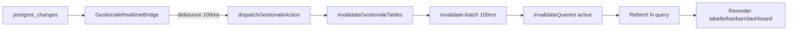
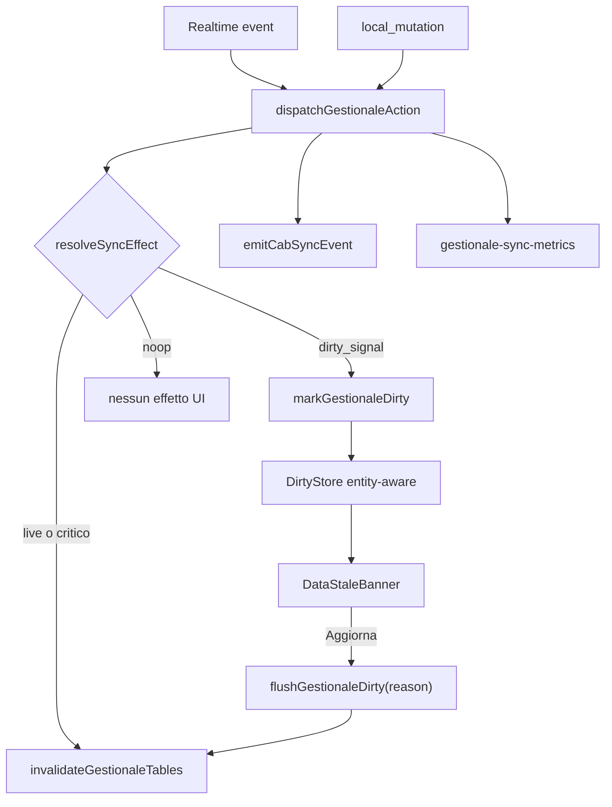

# Sistema Dirty Signal per sync gestionale (v2)

> **Principio guida:** non un sistema "l'utente deve ricordarsi di aggiornare", ma "il gestionale avvisa quando la tua vista non rappresenta più lo stato corrente".

## 1. Valutazione

### Il nuovo approccio migliora le performance?

**Sì, in modo misurabile** sulle pagine dove oggi ogni `postgres_changes` su tabelle hub innesca `invalidateQueries({ refetchType: "active" })` su molte query montate contemporaneamente.

Il costo attuale non è il WebSocket (leggero) ma la **cascata downstream**:



Ogni evento su `lavorazioni` invalida almeno `QK.lavorazioniQueries` + `QK.mezzoQueries` ([`invalidate-targets.ts`](src/lib/react-query/invalidate-targets.ts)). Su `/lavorazioni` sono montate liste attive/chiuse, bundle schede lazy, log feed — **un singolo UPDATE remoto può causare 5–15 refetch + rerender pesanti**.

Con dirty signal: **0 refetch finché l'utente non clicca "Aggiorna"**. Il realtime resta attivo (nessun cambio transport), cambia solo l'effetto collaterale su React Query.

**Impatto atteso (pilota Lavorazioni):** riduzione **70–90%** invalidazioni/ora (`invalidateQueries/hour`, `gestionale_dispatch_skipped_invalidation`).

### Dove migliora di più

| Area | Perché | Stima impatto |
|------|--------|---------------|
| [`/lavorazioni`](components/gestionale/lavorazioni/lavorazioni-view.tsx) (lista + kanban) | Hub `lavorazioni`; quasi ogni tabella operativa la tocca; `useSchedeBundlesQuery` lazy | **Alto** |
| [`/dashboard`](components/dashboard/control-tower-metrics-provider.tsx) | 7+ feed `QK.log` + widget metriche + `useDashboardSyncInvalidation` | **Alto** |
| [`/magazzino`](components/gestionale/magazzino/magazzino-view.tsx) | Tabella densa + movimenti + 2 log feed | **Alto** |
| [`/report`](lib/report/use-report-live-data.ts) | Universo multi-dominio, aggregati costosi | **Alto** |
| Schede modal hub | Bundle cache + reconcile | **Medio-alto** |
| `/mezzi`, `/preventivi`, `/documenti` | Liste dense, fan-out moderato | **Medio** |

### Dove è rischioso

| Caso | Rischio | Mitigazione |
|------|---------|-------------|
| **RBAC** (`user_permissions`, `profiles`) | Permessi obsoleti | Restare **live** (`ALWAYS_LIVE_TABLES`) |
| **Mutazioni locali** | Utente non vede proprie modifiche | Restare **live** (`source: "local_mutation"`) |
| **Editing concorrente** su stessa entità | Conflitto save | Entity-aware banner (MVP); conflict detection (Fase 3) |
| **Agenda** | Calendario time-sensitive | Restare **live** |
| **Notifiche inbox** | Canale separato leggero | Restare **live** (`RealtimeInboxCoordinator`) |
| **Polling fallback** | Stato dirty inutile su tab nascosta | `markDirty` solo se `document.visibilityState === "visible"` |
| **Reconnect / tab focus** | Gap dati | Banner "Connessione ripristinata" + refresh manuale |
| **`useCabSyncListener` diretti** | Bypass dispatch | Guard policy su listener |

### Conclusione valutativa

**Approvato.** Estensione del pipeline esistente — **nessun secondo sistema di sincronizzazione**. Ganci già presenti: `skipCacheInvalidation`, `refetchType: "none"`, `SystemBannerShell` (PWA update).

---

## 2. Raccomandazione UX

### Formato MVP: **banner persistente senza dismiss**

| Pattern | MVP | Fase successiva |
|---------|-----|-----------------|
| **Banner persistente** (`SystemBannerShell`) | **Sì — unico canale** | Invariato |
| CTA "Aggiorna" | **Sì** | Invariato |
| "Più tardi" / dismiss | **No** | Valutare badge toolbar (Fase 3) |
| Toast | Solo eventi critici (`entity_deleted` su entità visibile) | — |
| Badge toolbar | **No in MVP** | Fase 3, dopo validazione banner |

**Motivo no dismiss in MVP:** evita stato UX complesso (dove ricordarlo, riproporlo, cambio pagina/tab nascosta). Il banner **sparisce solo dopo refresh** — segnale chiaro che la vista non è aggiornata.

```
┌─────────────────────────────────────┐
│  Nuovi dati disponibili             │
│  Un altro operatore ha modificato   │
│  i dati di questa sezione.          │
│                                     │
│  [ Aggiorna ]                       │
└─────────────────────────────────────┘
```

### Comportamento MVP

1. **Evento remoto rilevante** per scope attivo → banner appare (sotto PWA banner se presente), `role="status"`, `aria-live="polite"`.
2. **Eventi successivi** → aggiornare contatore interno; UI debounce 2s (no spam banner).
3. **Evento su entità diversa da quelle visibili** → **nessun banner** (entity-aware, vedi §3).
4. **Evento su entità visibile** (es. lavorazione #123 aperta, update su #123) → banner specifico: *"Questa lavorazione è stata modificata da un altro utente"*.
5. **"Aggiorna"** → `flushGestionaleDirty({ reason: "user_requested" })` → spinner → banner scompare.
6. **Mutazione locale** → nessun banner; dirty cleared per entità toccata.
7. **Form dirty** → banner visibile, CTA disabilitata con tooltip *"Salva o annulla prima di aggiornare"*.

### Testi suggeriti

| Contesto | Titolo | Descrizione |
|----------|--------|-------------|
| Lista/kanban | "Nuovi dati disponibili" | "Un altro operatore ha modificato le lavorazioni." |
| Entità visibile | "Dati aggiornati" | "Questa lavorazione è stata modificata da un altro utente." |
| Reconnect | "Connessione ripristinata" | "I dati potrebbero non essere allineati." |
| Polling degradato | "Sincronizzazione in modalità ridotta" | "Aggiorna per allineare i dati." |

---

## 3. Architettura consigliata

### Principio: un solo pipeline, scope registrato (non pathname)

**Non usare `pathname → dominio` come SSOT.** Pathname è fragile (`/lavorazioni/[id]`, `?view=kanban`, filtri).

Ogni pagina/modal registra il proprio **SyncContext**:

```typescript
// lib/sync/gestionale-sync-scope.ts
export type GestionaleSyncDomain =
  | "lavorazioni" | "magazzino" | "dashboard" | "report"
  | "mezzi" | "preventivi" | "documenti" | "agenda"
  | "dipendenti" | "sicurezza" | "impostazioni" | "portale";

export type GestionaleSyncScopeRegistration = {
  scopeId: string;           // es. "lavorazioni-view" | "schede-modal-123"
  domain: GestionaleSyncDomain;
  route?: string;            // informativo, non usato per policy
  tables: readonly string[]; // tabelle osservate da questa vista
  mountedQueryKeys?: readonly unknown[][]; // opzionale, per flush mirato
  visibleEntities?: ReadonlyArray<{
    table: string;
    entityId: string;
  }>;
};

export function registerGestionaleSyncScope(reg: GestionaleSyncScopeRegistration): () => void;
export function getActiveSyncContexts(): readonly GestionaleSyncScopeRegistration[];
```

**Esempio in Lavorazioni:**

```typescript
useGestionaleSyncScope({
  scopeId: "lavorazioni-view",
  domain: "lavorazioni",
  tables: ["lavorazioni", "scheda_lavorazione", "lavorazione_documents", "log_modifiche"],
  visibleEntities: openLavorazioneId ? [{ table: "lavorazioni", entityId: openLavorazioneId }] : [],
});
```

La policy risponde a: *"questa pagina sta osservando queste entità"* — non deduce dal percorso URL.

### Flusso completo



### Moduli (SSOT)

```
lib/sync/
  gestionale-sync-policy.ts    # resolveSyncEffect
  gestionale-sync-scope.ts     # registerGestionaleSyncScope (NUOVO)
  gestionale-dirty-state.ts    # DirtyEntry entity-aware
  gestionale-dirty-flush.ts    # flush con reason
  gestionale-sync-metrics.ts   # dirty_marked / flushed / skipped (NUOVO)
```

### Dirty state entity-aware (requisito MVP)

Ogni evento remoto produce una **`DirtyEntry`**, non solo un flag booleano:

```typescript
// lib/sync/gestionale-dirty-state.ts
export type DirtyEntryType = "create" | "update" | "delete";

export type DirtyEntry = {
  domain: GestionaleSyncDomain;
  table: string;
  entityId: string | null;  // null = bulk/unknown
  type: DirtyEntryType;
  timestamp: number;
  source: GestionaleActionSource;
  // Fase 3: version fields
  remoteVersion?: number | string;
};

export type DirtySnapshot = {
  entries: ReadonlyMap<string, DirtyEntry>; // key: `${table}:${entityId ?? "*"}`
  changeCount: number;
  firstSeenAt: number;
  lastSeenAt: number;
};

export function markGestionaleDirty(entry: DirtyEntry): void;
export function getDirtyForScope(scope: GestionaleSyncScopeRegistration): DirtyEntry[];
export function isDirtyRelevantForScope(entry: DirtyEntry, scope: GestionaleSyncScopeRegistration): boolean;
export function clearGestionaleDirty(scope?: { domain?: GestionaleSyncDomain; entityId?: string }): void;
export function subscribeGestionaleDirty(fn: () => void): () => void;
```

**Regole di rilevanza (MVP):**

| Caso | Comportamento |
|------|---------------|
| Utente su lavorazione #123, arriva UPDATE #900 | `noop` UI — nessun banner |
| Utente su lavorazione #123, arriva UPDATE #123 | Banner entity-specific |
| Utente su lista kanban, arriva UPDATE qualsiasi su `lavorazioni` | Banner dominio |
| `entityId` sconosciuto (bulk) | Banner dominio se tabella in `scope.tables` |

### Versionamento dati (Fase 3 — preparare interfaccia in MVP)

Oltre a `dirty=true`, tracciare versioni per evitare refresh inutili:

```typescript
// Fase 3 — estensione DirtyEntry + cache metadata
type VersionedDirtyState = {
  lastKnownVersion: number | string;  // versione in cache locale
  dirtyVersion: number | string;      // versione remota segnalata
};
```

**Fonte versione (da valutare in Fase 3):** `updated_at` epoch, row version Postgres, o RPC `get_operational_data_version` già stubbato in [`use-operational-data-version-check.ts`](lib/sync/use-operational-data-version-check.ts).

**Comportamento futuro:** se `dirtyVersion === lastKnownVersion` dopo flush parziale → skip refetch. MVP: campi opzionali su `DirtyEntry`, logica attiva in Fase 3.

### resolveSyncEffect — input e regole

```typescript
// lib/sync/gestionale-sync-policy.ts
export type SyncRefreshMode = "live" | "dirty_signal" | "manual_only";

export type SyncEffect =
  | { kind: "invalidate"; tables: string[]; entityIdByTable: Map<string, string> }
  | { kind: "mark_dirty"; entries: DirtyEntry[] }
  | { kind: "noop" };

export function resolveSyncEffect(input: {
  source: GestionaleActionSource;
  tables: string[];
  entityIdByTable: Map<string, string>;
  cabEvents: CabSyncEvent[];
  activeScopes: readonly GestionaleSyncScopeRegistration[];
  flag: GestionaleDirtySyncFlag;
}): SyncEffect;
```

**Regole di risoluzione:**

1. `source === "local_mutation"` → sempre `invalidate` (immediate)
2. Tabella in `ALWAYS_LIVE_TABLES` (`user_permissions`, `profiles`) → `invalidate`
3. Flag `off` → comportamento attuale (`invalidate`)
4. Nessuno scope attivo interessato → `noop` (zero costo UI)
5. Evento su entità in `visibleEntities` di uno scope → `mark_dirty` con entry entity-specific
6. Evento su tabella in `scope.tables` ma entità diversa e scope ha `visibleEntities` → `noop` (non disturbare)
7. Evento su tabella in `scope.tables`, scope senza `visibleEntities` (lista) → `mark_dirty` dominio
8. `entity_deleted` su entità visibile → `mark_dirty` + toast warning (non auto-invalidate in dirty mode)

### Flush con refresh reason

```typescript
// lib/sync/gestionale-dirty-flush.ts
export type GestionaleFlushReason =
  | "user_requested"
  | "reconnect_catchup"
  | "polling_fallback"
  | "form_saved"
  | "navigation";

export function flushGestionaleDirty(
  qc: QueryClient,
  options: {
    reason: GestionaleFlushReason;
    domains?: GestionaleSyncDomain[];
    entityIds?: Array<{ table: string; entityId: string }>;
  },
): Promise<void>;
```

**Metriche** ([`gestionale-sync-metrics.ts`](lib/sync/gestionale-sync-metrics.ts)):

```typescript
incrementSyncMetric("dirty_marked", 1);
incrementSyncMetric("dirty_flushed", 1, { reason });
incrementSyncMetric("invalidation_skipped", 1);
// Analytics future: refresh automatici eliminati vs manuali richiesti
```

### Polling fallback — visibility gate

In [`gestionale-realtime-bridge.tsx`](src/components/gestionale-realtime-bridge.tsx), quando dirty mode attivo:

```typescript
onPoll: () => {
  if (document.visibilityState !== "visible") return; // NON accumulare dirty su tab nascosta
  if (isDirtySyncEnabled()) {
    markGestionaleDirty({ /* dominio da scope attivi o bulk operativo */ });
    incrementSyncMetric("dirty_marked", 1, { reason: "polling_fallback" });
    return;
  }
  refetchActiveOperationalSnapshot(qc, { onlyActive: true });
},
```

Su tab visible dopo periodo hidden: valutare replay dirty pendenti o banner reconnect (Fase 2).

### Integrazione dispatch

In [`dispatchGestionaleAction`](lib/sync/gestionale-sync-dispatch.ts):

```typescript
const activeScopes = getActiveSyncContexts();
const effect = resolveSyncEffect({
  source: options.source,
  tables: uniqueTables,
  entityIdByTable,
  cabEvents,
  activeScopes,
  flag: getGestionaleDirtySyncFlag(),
});

if (effect.kind === "mark_dirty") {
  for (const entry of effect.entries) {
    if (typeof document !== "undefined" && document.visibilityState !== "visible") continue;
    markGestionaleDirty(entry);
    incrementSyncMetric("dirty_marked", 1);
  }
  incrementSyncMetric("invalidation_skipped", uniqueTables.length);
  // cab-sync + notifiche gated continuano
} else if (effect.kind === "invalidate") {
  invalidateGestionaleTables(qc, tablesForCache, { ... });
}
```

### Feature flag

```typescript
// lib/feature-flags/gestionale-dirty-sync-flag.ts
// app_settings: gestionale_dirty_sync_mode
// env: NEXT_PUBLIC_GESTIONALE_DIRTY_SYNC
// Valori: "off" | "pilot_lavorazioni" | "pilot_heavy" | "all"
```

---

## 4. Piano operativo (roadmap rivista)

### MVP (Fase 1)

1. `gestionale-sync-policy.ts` — policy basata su scope, non pathname
2. `gestionale-sync-scope.ts` — register/unregister + hook `useGestionaleSyncScope`
3. `gestionale-dirty-state.ts` — `DirtyEntry` entity-aware
4. `gestionale-dirty-flush.ts` — flush con `reason`
5. `gestionale-sync-metrics.ts` — counter base
6. `DataStaleBanner` — solo "Aggiorna", no dismiss
7. Gate in `dispatchGestionaleAction`
8. Pilot `/lavorazioni` con `registerGestionaleSyncScope`
9. Test unitari policy + scope + dirty relevance

**Metriche before/after (pilota):**

| Prima | Dopo |
|-------|------|
| `invalidateQueries/hour` | `dirty_marked/hour` |
| `network requests/hour` | `dirty_flushed/hour` |
| `render commits` (profiler) | `invalidation_skipped/hour` |

**Target:** −70/−90% invalidazioni su sessione multiutente 10 min.

**Criterio uscita:** modifica remota su lavorazione non visibile → 0 banner; su lavorazione aperta → banner entity-specific; click Aggiorna → dati allineati; mutazione locale → immediata.

### Fase 2

1. Dashboard, Magazzino, Report — `registerGestionaleSyncScope` per ciascuno
2. `useDashboardSyncInvalidation` / `useReportLiveData` — guard dirty mode
3. Polling fallback visibility-gated
4. Reconnect banner
5. Test multi-tab

### Fase 3

1. **Versionamento dati** (`lastKnownVersion` / `dirtyVersion`) — skip refresh inutili
2. **Entity conflict detection** su save (check `updated_at`)
3. **Analytics performance** dashboard (automatici eliminati vs manuali)
4. Badge toolbar (solo se serve dopo validazione banner senza dismiss)
5. Policy per-tenant in `app_settings`
6. Flag `all` per tutti i domini

### Cosa rimandare

- `manual_only` — troppo rischioso
- Dismiss "Più tardi" — Fase 3 al più, dopo dati UX
- Auto-refresh selettivo per sotto-sezioni

---

## 5. Rischi e mitigazioni

| Rischio | Mitigazione | Segnale regressione |
|---------|-------------|---------------------|
| Vista obsoleta troppo a lungo | Banner persistente fino ad Aggiorna; entity-specific su entità aperta | Ticket "non vedevo modifiche" |
| Banner su update irrilevanti | Entity-aware relevance rules | Banner su #900 mentre utente su #123 |
| Scope non registrato → noop silenzioso | Dev warning se pagina pilota senza scope; test integrazione | Pagina pilota senza banner su update atteso |
| Tab nascosta accumula dirty | `visibilityState === "visible"` gate | Dirty count alto su tab background |
| RBAC regression | `ALWAYS_LIVE_TABLES` + test | Permessi errati post-cambio ruolo |
| Doppio refresh | `flushGestionaleDirty` unifica toolbar + banner | Spike dispatch post-flush |
| UX "devo ricordarmi di aggiornare" | Banner sempre visibile finché dirty; copy orientata a "vista non aggiornata" | Feedback utenti pilota |

---

## 6. Deliverable finale

### File da creare

| File | Tipo |
|------|------|
| [`lib/sync/gestionale-sync-policy.ts`](lib/sync/gestionale-sync-policy.ts) | Policy SSOT |
| [`lib/sync/gestionale-sync-scope.ts`](lib/sync/gestionale-sync-scope.ts) | Scope registration SSOT |
| [`lib/sync/gestionale-dirty-state.ts`](lib/sync/gestionale-dirty-state.ts) | DirtyEntry store |
| [`lib/sync/gestionale-dirty-flush.ts`](lib/sync/gestionale-dirty-flush.ts) | Flush con reason |
| [`lib/sync/gestionale-sync-metrics.ts`](lib/sync/gestionale-sync-metrics.ts) | Metriche |
| [`lib/feature-flags/gestionale-dirty-sync-flag.ts`](lib/feature-flags/gestionale-dirty-sync-flag.ts) | Feature flag |
| [`src/hooks/gestionale/use-gestionale-sync-scope.ts`](src/hooks/gestionale/use-gestionale-sync-scope.ts) | Hook scope |
| [`src/context/gestionale-dirty-context.tsx`](src/context/gestionale-dirty-context.tsx) | React binding |
| [`components/gestionale/data-stale-banner.tsx`](components/gestionale/data-stale-banner.tsx) | Banner MVP |
| [`lib/sync/gestionale-sync-policy.test.ts`](lib/sync/gestionale-sync-policy.test.ts) | Test policy |
| [`lib/sync/gestionale-sync-scope.test.ts`](lib/sync/gestionale-sync-scope.test.ts) | Test scope |
| [`lib/sync/gestionale-dirty-state.test.ts`](lib/sync/gestionale-dirty-state.test.ts) | Test relevance |

### File da modificare

| File | Modifica |
|------|----------|
| [`lib/sync/gestionale-sync-dispatch.ts`](lib/sync/gestionale-sync-dispatch.ts) | Gate `resolveSyncEffect` + metrics |
| [`src/components/gestionale-realtime-bridge.tsx`](src/components/gestionale-realtime-bridge.tsx) | Polling visibility-gated → dirty mark |
| [`components/app-providers-gestionale.tsx`](components/app-providers-gestionale.tsx) | `GestionaleDirtyProvider` + `DataStaleBanner` |
| [`components/gestionale/lavorazioni/lavorazioni-view.tsx`](components/gestionale/lavorazioni/lavorazioni-view.tsx) | `useGestionaleSyncScope` + flush toolbar |
| [`src/hooks/view/use-dashboard-sync-invalidation.ts`](src/hooks/view/use-dashboard-sync-invalidation.ts) | Guard (Fase 2) |
| [`lib/report/use-report-live-data.ts`](lib/report/use-report-live-data.ts) | Guard (Fase 2) |
| [`lib/regression/sync-invalidation-policy.test.ts`](lib/regression/sync-invalidation-policy.test.ts) | Assert tabelle critiche live |

### Criteri di accettazione MVP

1. Scope registrato in Lavorazioni; policy **non** usa pathname
2. UPDATE su entità non visibile → 0 banner, 0 refetch
3. UPDATE su entità in `visibleEntities` → banner entity-specific
4. UPDATE su lista (no visibleEntities) → banner dominio
5. Click Aggiorna → `flushGestionaleDirty({ reason: "user_requested" })` → dati allineati → banner gone
6. Nessun pulsante "Più tardi" in MVP
7. `local_mutation` e `user_permissions`/`profiles` → invalidate immediato
8. Polling fallback: dirty mark solo con tab visible
9. Flag `off` → comportamento attuale
10. Riduzione ≥70% invalidazioni in scenario pilota misurato

---

## Decisione finale

| Domanda | Risposta |
|---------|----------|
| **Procedere?** | **Sì** |
| **Strategia** | Estendere `dispatchGestionaleAction`; scope registrato; dirty entity-aware; banner senza dismiss |
| **Pilota** | `/lavorazioni` |
| **UX MVP** | Banner persistente `SystemBannerShell`, solo "Aggiorna", sparisce dopo refresh |
| **Minimo set MVP** | 5 moduli sync + 1 hook scope + 1 banner + dispatch gate + flag + test — **zero cambi DB/transport** |
| **Fase 3 prioritaria** | Versionamento dati + conflict detection + analytics |
