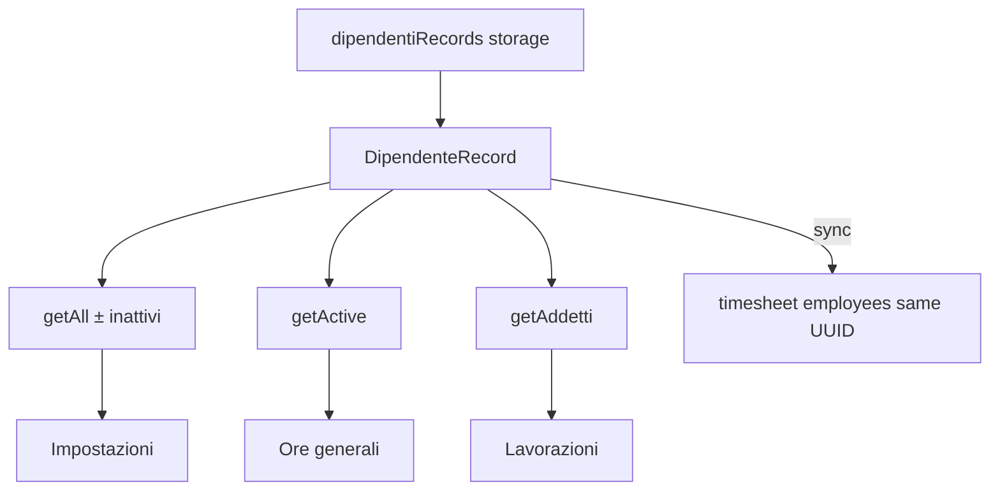

# Evoluzione gestione dipendenti — Piano v3 (approvato)

Revisione v2 + **5 correzioni puntuali**: storage JSON obbligatorio, flusso legacy unidirezionale, policy `attivo` esplicita, UUID timesheet stabile, invariant test.

**Principio di dominio:**

> **Addetto** = dipendente autorizzato nei flussi di lavorazione/intervento/produttività.
> **Altro dipendente** = valido per ore generali/personale, non per produzione lavorazioni.
> Il tipo **corrente** non riscrive la **storia**.

---

## Regola di compatibilità semantica

Non modificare retroattivamente il significato dei dati storici.

`employeeType` = stato anagrafico **corrente**. Lavorazioni/interventi già registrati mantengono riferimenti e snapshot anche dopo `ADDETTO → ALTRO`.

- Display storico: snapshot scheda, `employee_display_name_snapshot`, `lavorazioni.addetto` — non ricalcolati dal tipo attuale.
- Statistiche produttive su periodi passati: ore da schede/mapping — non ri-classificate.
- Nuovo tipo vale solo per **nuovi utilizzi** (selettori, nuove assegnazioni).

---

## SSOT dei concetti

**`DipendenteRecord`** — dominio ufficiale.

Resolver centrali (**nessun** `.filter()` nei componenti):

| Resolver | Risultato |
|----------|-----------|
| `getAllDipendentiRecords(records)` | **Tutti** — attivi **+ inattivi** (Impostazioni default) |
| `getActiveDipendentiRecords(records)` | Solo `attivo === true` |
| `getAddettiRecords(records)` | `employeeType === ADDETTO && attivo` |
| `getAltriDipendentiRecords(records)` | `employeeType === ALTRO && attivo` |

I consumer **non** leggono `addettiRecords` dallo storage né interpretano il payload raw.

**Non introdurre una seconda anagrafica.**

### Storage JSON — decisione obbligatoria (non opzionale)

```text
app_settings.lavorazioni.prefs
└── dipendentiRecords[]     ← SSOT fisico anagrafica (OBBLIGATORIO)

resolved (mai persistito come seconda verità modificabile):
├── dipendenti.dipendentiRecords   ← parse da storage
├── lavorazioni.addettiRecords     ← getAddettiRecords(dipendentiRecords)
└── lavorazioni.addetti[]          ← nomi legacy da getAddettiRecords (vedi sotto)

legacy storage (solo transizione):
└── addettiRecords[]   ← migrate-on-read → dipendentiRecords; non usato come write target
```

**Migrazione on-read / first-save:**

```text
vecchio storage:
  addettiRecords = [A, B, C]

nuovo storage:
  dipendentiRecords = [
    A + employeeType=ADDETTO + attivo=true,
    B + employeeType=ADDETTO + attivo=true,
    C + employeeType=ADDETTO + attivo=true,
  ]

resolved:
  lavorazioni.addettiRecords = [A, B, C]   ← derivato
  lavorazioni.addetti = ["nomeA", ...]   ← derivato
```

Write path: **solo** `dipendentiRecords`. Non estendere `addettiRecords` come storage dell'anagrafica completa.

### Flusso `addetti[]` legacy — una sola direzione

```text
dipendentiRecords (storage)
        ↓ parse
DipendenteRecord[]
        ↓ getAddettiRecords()
addetti[] legacy (resolved only)
```

**Vietato:**

```text
dipendentiRecords ↔ addettiRecords ↔ addetti[]
```

- `addetti[]` **non** è input di serializzazione né viene ricalcolato in modo bidirezionale.
- `syncLavorazioniAddettiFromRecords` (o equivalente) produce `addetti[]` **solo** da `getAddettiRecords()` al resolve — non al write.
- `addettiRecords` nel **resolved** è derivato; non è una fonte modificabile parallela.

### `attivo` e timesheet

- `attivo` = proprietà del **dipendente** in `dipendentiRecords` (SSOT).
- `dipendenti_timesheet_employees.attivo`, `employee_type`, `in_settings` = **mirror derivato** dal sync.
- `in_settings` = in anagrafica **e** `attivo === true` — non seconda verità.

### Invariante UUID timesheet (cambio tipo / stato)

Se Mario passa da `ADDETTO` a `ALTRO`:

- Il record `dipendenti_timesheet_employees` **rimane lo stesso** (stesso UUID).
- Aggiornare solo mirror: `employee_type = ALTRO`, `attivo` coerente con anagrafica.
- **Vietato:** delete + reinsert del registry row su cambio tipo/stato.

Preserva: FK `dipendente_id` su entries, report, mapping, riferimenti futuri.

```text
INVARIANT (test obbligatorio):

stesso DipendenteRecord.id
    ↓ source_addetto_id
stesso dipendenti_timesheet_employees.id

indipendentemente da:
    ADDETTO → ALTRO
    ALTRO → ADDETTO
    ATTIVO → INATTIVO
    INATTIVO → ATTIVO
```

---

## Struttura finale approvata

```text
                    app_settings
                         │
                         ▼
                dipendentiRecords[]
                         │
                         ▼
                DipendenteRecord
                         │
          ┌──────────────┼──────────────┐
          ▼              ▼              ▼
     tutti           attivi         classificazione
  (± inattivi)          │              │
          │              │        ┌─────┴─────┐
          │              │        ▼           ▼
          │              │     ADDETTO       ALTRO
          │              │        │           │
          │              └────────┤           │
          │                       │           │
          ▼                       ▼           ▼
   Impostazioni             Lavorazioni    Ore generali
   tutti                    interventi     presenze
                            produttività   personale
```

Timesheet = **registro derivato/storico**, non anagrafica:

```text
DipendenteRecord (dipendentiRecords)
      │
      │ syncFromAddettiRecords (nome invariato)
      ▼
dipendenti_timesheet_employees  ← stesso UUID su transizioni
      │
      ▼
dipendenti_timesheet_entries
```

---

## A. Struttura attuale (audit)

| Layer | Oggi | Target |
|-------|------|--------|
| Storage anagrafica | `addettiRecords[]` | `dipendentiRecords[]` |
| Resolved addetti | = storage | derivato `getAddettiRecords()` |
| Timesheet registry | sync da addetti | sync da tutti `dipendentiRecords` |
| Ore interventi | schede JSON snapshot | invariato (storico) |

File chiave: [`resolve-from-rows.ts`](src/lib/app-settings/resolve-from-rows.ts), [`use-global-options.ts`](src/hooks/use-global-options.ts), [`dipendenti-timesheet.service.ts`](src/services/dipendenti-timesheet.service.ts).

---

## B. Consumer map (sintesi)

| Consumer | Deve usare |
|----------|------------|
| Picker lavorazioni / interventi | **A** `getAddettiRecords` / `AddettoPicker mode="addetti"` |
| Ore generali / timesheet | **B** `getActiveDipendentiRecords` |
| Impostazioni CRUD | `getAllDipendentiRecords` (**include inattivi**) |
| Display storico schede/PDF | snapshot — no rewrite |
| Statistiche produttive | schede storiche — **A**, no retroattivo |

---

## C. Database

| Tabella | Modifica |
|---------|----------|
| `app_settings` JSON | `dipendentiRecords[]` write SSOT; migrate da `addettiRecords` |
| `dipendenti_timesheet_employees` | `employee_type`, `attivo` mirror; `in_settings` derivato; **no delete on type change** |
| Entries / mapping | Nessuna DDL |

SQL migration: backfill `employee_type = 'ADDETTO'`; sync job aggiorna mirror.

---

## D. Implementazione

### 1. JSON migrate + dominio

- [`lib/dipendenti/dipendente-record.ts`](lib/dipendenti/dipendente-record.ts): tipo + resolver con policy tabella sopra.
- [`resolve-from-rows.ts`](src/lib/app-settings/resolve-from-rows.ts):
  - Read: `dipendentiRecords` → se assente, migrate da `addettiRecords`.
  - Write serialize: solo `dipendentiRecords` (+ campi lavorazioni non dipendenti).
  - Resolved: `dipendenti.dipendentiRecords`, `lavorazioni.addettiRecords` = `getAddettiRecords()`, `lavorazioni.addetti` = nomi da `getAddettiRecords()`.
- [`settings-workspace-snapshot.ts`](lib/configurazione/settings-workspace-snapshot.ts): state `dipendentiRecords`.

### 2. Hooks

- `useDipendentiRecords()` → tutti (attivi + inattivi).
- `useActiveDipendentiRecords()` → consumer B.
- `useAddettiRecords()` → consumer A.
- `AddettoPicker`: `mode?: 'addetti' | 'all'` (default `addetti`).

### 3. Timesheet sync

- `syncFromAddettiRecords(dipendentiRecords)` — nome **invariato**.
- Bootstrap/match per `source_addetto_id` = `DipendenteRecord.id`.
- Su cambio tipo/stato: **UPDATE** mirror fields, never delete row se id anagrafica stabile.
- `planEmployeeBootstrap`: tutti record in `dipendentiRecords`; `in_settings` solo se `attivo`.

### 4. Transizione ADDETTO → ALTRO

| Aspetto | Regola |
|---------|--------|
| Selettori | Immediato esclusione da `getAddettiRecords` |
| Timesheet row | Stesso UUID; `employee_type` mirror aggiornato |
| Interventi aperti | Assegnazione storica mantenuta; no nuove assegnazioni produttive |
| Statistiche | Periodo già salvato — invariato |

### 5. Impostazioni

- Nav **Dipendenti** (`op-addetti` id compat).
- CRUD su `dipendentiRecords`; vista default = tutti (`getAllDipendentiRecords`).
- Soft `attivo: false` preferito a hard-delete.

### 6. Test obbligatori

**Fixture base:**

```text
2 ADDETTI + 2 ALTRI attivi
→ picker lavorazione / intervento: 2
→ ore generali / timesheet attivi: 4
→ Impostazioni (getAll): 4
```

**Policy `attivo` (espliciti):**

```text
getAllDipendentiRecords()     → include inattivi
getActiveDipendentiRecords()  → solo attivi
getAddettiRecords()           → ADDETTO + attivo
getAltriDipendentiRecords()   → ALTRO + attivo
```

**INVARIANT UUID:**

```text
stesso DipendenteRecord.id → stesso timesheet_employee.id
attraverso ADDETTO↔ALTRO e ATTIVO↔INATTIVO
```

**Altri:** storico display post `ADDETTO→ALTRO`; regression no raw `addettiRecords` storage read.

### 7. Audit finale

Grep: consumer su storage `addettiRecords`; flussi bidirezionali legacy; `in_settings` come fonte `attivo`.

---

## E. Rischi

| Rischio | Mitigazione |
|---------|-------------|
| Debito semantico in DB | Solo `dipendentiRecords` come write storage |
| `addetti[]` bidirezionale | Flusso unidirezionale documentato + test |
| `getAll` = solo attivi | Test espliciti con inattivi |
| Reinsert timesheet su cambio tipo | Invariant UUID + UPDATE only |
| Retroattivo statistiche | Regola compatibilità semantica |

---

## Criterio di successo



Piano **approvato per esecuzione** con storage `dipendentiRecords[]` obbligatorio e invariante UUID timesheet.
