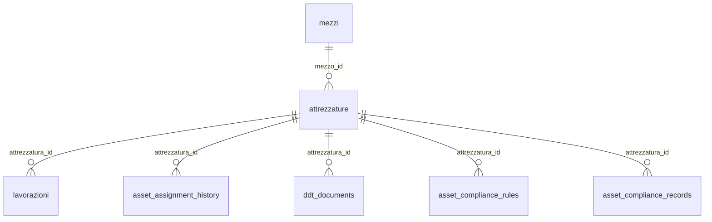
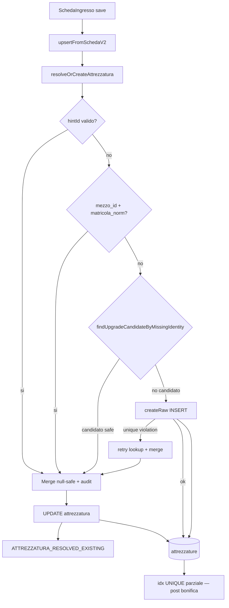

# Fix duplicazione attrezzature mezzi da schede ingresso

**Stato: ready for implementation**

## Analisi dominio attuale

### Modello dati (V2)



- **SSOT attrezzature**: tabella [`attrezzature`](supabase/migrations/20260801120000_attrezzature_core.sql) con FK `mezzo_id`
- **`numero_scuderia` è sul mezzo**, non su `attrezzature` — colonna `mezzi.numero_scuderia`
- La pagina Mezzi legge da `attrezzature` (batch + `pickPrimaryAttrezzatura`), non dalle schede JSON
- **Nessun vincolo UNIQUE** oggi su `(mezzo_id, matricola)`

### Flusso scheda ingresso attuale

Entry point: [`upsertMezzoFromSchedaIngresso`](lib/mezzi/upsert-mezzo-from-scheda.ts) → [`upsertFromSchedaV2`](lib/domain/mezzo-attrezzatura/upsert-from-scheda-v2.ts)

Lookup attuale (priorità):

1. `fields.attrezzaturaId` → UPDATE diretto
2. `findByMatricola(mezzoId, matricola)` → UPDATE (solo se matricola valorizzata)
3. altrimenti → **INSERT nuova riga**

### Root cause identificate

| Problema | Effetto |
|----------|---------|
| Prima scheda crea attrezzatura **senza matricola** (solo n. scuderia/mezzo), seconda con matricola | lookup fallisce → duplicato (**caso storico principale**) |
| Lookup **case-sensitive** client (`.eq`) vs server capture (`.ilike`) | stessa matricola con casing diverso → duplicato |
| Update usa `schedaToAttrezzaturaPayload` (overwrite) invece di merge null-safe | perde dati; va corretto insieme |
| `maybeSingle()` con duplicati già presenti | errore/lookup fallito → sistema non si auto-ripara |
| [`mezzi-edit-modal.tsx`](components/gestionale/mezzi/mezzi-edit-modal.tsx) passa sempre `attrezzaturaId: null` | ogni modifica hub crea nuova attrezzatura |
| `resolveTargetTypeFromScheda` ignora `matricola`/`tipoAttrezzatura` se `targetType` assente | scheda senza marca può non scrivere attrezzatura al primo giro |
| INSERT diretti da più writer (scheda, import, capture, form) | logica duplicata, comportamenti incoerenti |
| Race condition su salvataggi concorrenti | due INSERT stessa matricola prima del vincolo UNIQUE |

### Nota su `numero_scuderia` nella regola di matching

`numero_scuderia` è attributo del mezzo. Una volta risolto `mezzo_id` la tripletta è già implicita. Regola SSOT operativa:

```
stesso mezzo_id + stessa matricola normalizzata (lower(trim))
```

Non serve aggiungere `numero_scuderia` su `attrezzature`.

---

## Fase 1 — Regola SSOT `resolveOrCreateAttrezzatura`

Nuovo modulo: [`lib/domain/mezzo-attrezzatura/resolve-or-create-attrezzatura.ts`](lib/domain/mezzo-attrezzatura/resolve-or-create-attrezzatura.ts)

```typescript
resolveOrCreateAttrezzatura({
  mezzoId,
  incoming: AttrezzaturaInsert,
  hintId?: string | null,
  deps: { findByIdentity, findUpgradeCandidateByMissingIdentity, createRaw, update },
})
```

### Lookup priority (ordine obbligatorio)

```
1. hintId valido e appartenente a mezzoId
2. mezzo_id + matricola_normalizzata (lower(trim))
3. FALLBACK UPGRADE — findUpgradeCandidateByMissingIdentity()
4. INSERT via createRaw() (solo se nessun match)
5. ON unique violation → retry lookup (2) → merge (race recovery)
```

### `findUpgradeCandidateByMissingIdentity(mezzoId, incoming)`

Priorità candidato upgrade quando `incoming.matricola` valorizzata:

```
1. unica attrezzatura con matricola NULL sul mezzo → upgrade safe
2. più attrezzature con matricola NULL:
   a. se UNA SOLA è "riga vuota tecnica" → upgrade quella
   b. altrimenti → warning, no upgrade automatico
```

**Riga vuota tecnica** = tutti i campi anagrafici NULL/vuoti eccetto `mezzo_id` (e placeholder `marca`/`modello` = `"—"` se presenti):

```
isAttrezzaturaEmptyShell(row):
  matricola IS NULL
  AND tipo_attrezzatura IS NULL
  AND portata IS NULL
  AND anno IS NULL
  AND note IS NULL
  AND (marca IS NULL OR marca = '—')
  AND (modello IS NULL OR modello = '—')
```

Esempio safe upgrade con più NULL:

```
Attrezzatura 1: matricola NULL, tipo NULL        → riga vuota → upgrade candidate
Attrezzatura 2: matricola NULL, tipo Gru           → dati reali → non toccare
Incoming: matricola ABC123, tipo Spazzatrice
→ upgrade Attrezzatura 1
```

Esempio bloccato:

```
Attrezzatura 1: matricola NULL, tipo Cassone
Attrezzatura 2: matricola NULL, tipo Gru
→ warning, no upgrade automatico
```

#### Esempio caso storico (fallback upgrade)

DB esistente:

```
id A | mezzo_id 10 | matricola NULL | tipo NULL
```

Nuova scheda:

```
mezzo_id 10 | matricola ABC123 | tipo Spazzatrice
```

Risultato corretto:

```
id A aggiornato: matricola ABC123, tipo Spazzatrice
```

**Non** creare `id B`.

### Merge policy (campi anagrafici)

Campi: `tipo_attrezzatura`, `marca`, `modello`, `portata`, `anno`, `note`

| Situazione | Regola |
|----------|--------|
| NULL → valore | aggiorna |
| valore → NULL | mantieni esistente |
| stesso valore | nessuna azione |
| valori diversi (conflitto) | **mantieni storico** + audit `ATTREZZATURA_CONFLICT_KEPT` |

**Nessun overwrite silenzioso** su conflitti anagrafici. Il resolver espone `conflicts[]` per eventuale conferma UI futura.

Helper: `mergeAttrezzaturaPatch(existing, incoming) → { patch, conflicts }` — puro, testabile.

### Soft duplicate detection (livello applicativo)

Prima di ogni INSERT, il resolver esegue regola 3 (`findUpgradeCandidateByMissingIdentity`).

Telemetry: `attrezzature.duplicate_prevented` quando scatta.

**Nessun vincolo DB su matricola NULL** — rischio falsi positivi con più attrezzature reali senza matricola.

### Race condition recovery

Due salvataggi concorrenti stessa matricola:

```
Request A: find → null → INSERT
Request B: find → null → INSERT → UNIQUE violation
```

Comportamento atteso:

```
catch unique_violation (23505)
→ retry findByIdentity(mezzo_id, matricola_norm)
→ merge su record esistente
→ ritorna canonical
→ nessun errore utente
```

Implementare in `resolveOrCreateAttrezzatura` attorno a `createRaw()`.

### Audit eventi (log_modifiche esistente)

Non serve tabella nuova. Usare `writeModificaLog` con azioni dedicate:

**`ATTREZZATURA_RESOLVED_EXISTING`** — quando match impedisce INSERT:

```json
{
  "mezzo_id": "...",
  "incoming_matricola": "ABC123",
  "matched_by": "matricola_norm | null_upgrade | hint_id | race_recovery",
  "existing_attrezzatura_id": "...",
  "conflicts": []
}
```

**`ATTREZZATURA_CONFLICT_KEPT`** — quando conflitto anagrafico mantiene valore esistente:

```json
{
  "mezzo_id": "...",
  "attrezzatura_id": "...",
  "field": "tipo_attrezzatura",
  "existing_value": "Spazzatrice",
  "incoming_value": "Compattatore",
  "resolution": "kept_existing"
}
```

### Lookup unificato

Nuovo layer repository: [`src/services/attrezzature.repository.ts`](src/services/attrezzature.repository.ts) (o `lib/domain/mezzo-attrezzatura/attrezzature.repository.ts`)

```
createRaw()     ← solo chiamato da resolveOrCreateAttrezzatura
updateRaw()
findByMatricolaNorm()
findNullMatricolaByMezzo()
```

[`attrezzature.service.ts`](src/services/attrezzature.service.ts):
- `create()` → **deprecato/rimosso** dalla API pubblica
- `listByMezzo`, `getById`, `update`, `remove` restano per CRUD esplicito hub
- tutti i path "upsert da dati incompleti" → `resolveOrCreateAttrezzatura`

Allineare [`capture-intervento-write-deps.server.ts`](lib/document-capture/capture-intervento-write-deps.server.ts).

---

## Fase 2 — Refactor write paths (un solo punto INSERT)

**Regola architetturale**: `attrezzature INSERT` consentito **solo** da `resolveOrCreateAttrezzatura()` → `createRaw()`.

```
attrezzature.repository.ts
   createRaw()
        ^
        |
resolveOrCreateAttrezzatura()
```

Nessuna API pubblica `service.create()` tentatrice — deprecata o eliminata.

Sostituire logica inline in [`upsert-from-scheda-v2.ts`](lib/domain/mezzo-attrezzatura/upsert-from-scheda-v2.ts) (righe 184–208).

Estendere [`resolveTargetTypeFromScheda`](lib/domain/mezzo-attrezzatura/intervento-target.ts):

```typescript
const hasAttrezzatura = Boolean(
  input.marcaAttrezzatura?.trim() ||
  input.attrezzaturaId?.trim() ||
  input.matricola?.trim() ||
  input.tipoAttrezzatura?.trim()
);
```

Riutilizzare `resolveOrCreateAttrezzatura` in:

- [`persist-mezzo-form.ts`](lib/mezzi/persist-mezzo-form.ts)
- [`mezzi-import-attrezzatura.server.ts`](lib/data-import/entities/mezzi/mezzi-import-attrezzatura.server.ts)
- [`capture-intervento-write-deps.server.ts`](lib/document-capture/capture-intervento-write-deps.server.ts)
- [`mezzi-hub-attrezzature-panel.tsx`](components/gestionale/mezzi/mezzi-hub-attrezzature-panel.tsx)

Nessuna nuova server action: funzione domain condivisa client/server.

---

## Fase 3 — Vincolo database + controlli applicativi

### Ordine migration (critico)

Il vincolo UNIQUE va creato **dopo** bonifica completa. Durante bonifica, evitare stati intermedi che violano l'indice:

```
1. merge campi su canonical (senza ancora scrivere matricola duplicata sul canonical)
2. DELETE duplicati
3. UPDATE canonical con matricola/tipo dal source
4. CREATE UNIQUE INDEX (o CONCURRENTLY in produzione)
```

**Non fare**: `UPDATE canonical SET matricola='ABC'` mentre il duplicato con stessa matricola esiste ancora → violazione temporanea.

Alternativa produzione: `CREATE UNIQUE INDEX CONCURRENTLY` in migration separata post-bonifica.

### Migration UNIQUE parziale

`supabase/migrations/YYYYMMDDHHMMSS_attrezzature_mezzo_matricola_unique.sql`

```sql
CREATE UNIQUE INDEX IF NOT EXISTS idx_attrezzature_mezzo_matricola_norm_unique
ON public.attrezzature (mezzo_id, lower(btrim(matricola)))
WHERE matricola IS NOT NULL AND btrim(matricola) <> '';
```

Protegge: `ABC123` / `abc123` / ` ABC123 ` (stesso mezzo).

**Non copre**: `matricola NULL` vs `matricola ABC123` — gestito da resolver + bonifica.

Non serve `DEFERRABLE` se si rispetta l'ordine sopra. Il resolver gestisce race post-index via catch + retry.

### Controlli applicativi complementari

- Resolver: `findUpgradeCandidateByMissingIdentity` + race recovery
- Telemetry: `duplicate_prevented`, `conflict_kept_existing`
- Audit: `ATTREZZATURA_RESOLVED_EXISTING`, `ATTREZZATURA_CONFLICT_KEPT`

---

## Fase 4 — Bonifica dati esistenti

Migration one-shot: `supabase/migrations/YYYYMMDDHHMMSS_attrezzature_dedup_backfill.sql`

### Concetto formale: `canonical_id` ≠ `source_of_truth_fields`

```
canonical = record che sopravvive (preserva FK storiche)
source    = record con dati migliori (matricola/tipo valorizzati)
```

Procedura per cluster NULL+valorizzata:

```
id A — created 2024 — matricola NULL — FK lavorazioni 1000  → CANONICAL
id B — created 2025 — matricola ABC — tipo Spazzatrice     → SOURCE

1. Merge campi da B → A (null-safe)
2. DELETE B
3. Nessun UPDATE FK necessario (A già referenziato)
```

Per duplicati esatti (stessa matricola): canonical = più vecchio con più FK; source = più completo.

### Audit 1 — Duplicati esatti (matricola valorizzata)

```sql
SELECT mezzo_id, lower(btrim(matricola)) AS mat_norm, array_agg(id ORDER BY ...)
FROM attrezzature
WHERE matricola IS NOT NULL AND btrim(matricola) <> ''
GROUP BY mezzo_id, lower(btrim(matricola))
HAVING count(*) > 1;
```

### Audit 2 — Cluster sospetti (caso storico principale)

```sql
SELECT a_null.mezzo_id, a_null.id AS null_id, a_val.id AS val_id, ...
FROM attrezzature a_null
JOIN attrezzature a_val ON a_null.mezzo_id = a_val.mezzo_id
WHERE a_null.matricola IS NULL
  AND a_val.matricola IS NOT NULL AND btrim(a_val.matricola) <> ''
```

### Canonical / source selection

**Canonical** (sopravvive):

1. più FK referenzianti (se misurabile)
2. `created_at` più vecchio (preserva storico)

**Source** (fonte dati per merge):

1. `tipo_attrezzatura` valorizzato
2. `matricola` valorizzata
3. più campi non-null
4. `created_at` più recente

### Merge procedure (per gruppo, in transazione)

1. Identifica `canonical_id` e `source_id`
2. Merge campi null-safe: `UPDATE canonical SET ... FROM source`
3. Reindirizza FK solo se `canonical_id ≠ source_id` e source ha FK:
   - `lavorazioni.attrezzatura_id`
   - `ddt_documents.attrezzatura_id`
   - `document_capture_links.attrezzatura_id`
   - `asset_assignment_history.attrezzatura_id`
   - `asset_compliance_rules.attrezzatura_id`
   - `asset_compliance_records.attrezzatura_id`
4. Chiudi/merge `asset_assignment_history` aperti sul source
5. `DELETE source`
6. Report in `attrezzature_dedup_report` (`canonical_id`, `source_id`, `merged_ids`, `mezzo_id`, `matricola`, `cluster_type`, `fk_updates_count`)

Verifica post-bonifica: 0 righe in entrambi gli audit.

---

## Fase 5 — Audit statico insert paths

Nuovo test: [`lib/regression/attrezzature-insert-ssot-audit.test.ts`](lib/regression/attrezzature-insert-ssot-audit.test.ts)

Cercare:

```
.from("attrezzature").insert
```

Whitelist:

- `attrezzature.repository.ts` → `createRaw()` (unico INSERT runtime)
- test/migration SQL (esclusi)

Writer da redirectare:

- `upsert-from-scheda-v2.ts`
- `capture-intervento-write-deps.server.ts`
- `persist-mezzo-form.ts`
- `mezzi-import-attrezzatura.server.ts`
- `mezzi-hub-attrezzature-panel.tsx`
- `attrezzature.service.ts` `create()` — rimuovere/deprecare

---

## Fase 6 — Audit pagina Mezzi

File da verificare:

- [`mezzi-view.tsx`](components/gestionale/mezzi/mezzi-view.tsx) / [`mezzi-table.tsx`](components/gestionale/mezzi/mezzi-table.tsx)
- [`mezzi-hub-attrezzature-panel.tsx`](components/gestionale/mezzi/mezzi-hub-attrezzature-panel.tsx)
- [`mezzi-edit-modal.tsx`](components/gestionale/mezzi/mezzi-edit-modal.tsx)

Checklist post-deploy:

- mezzo con duplicato noto → 1 sola attrezzatura in tab Attrezzature
- scheda che completa matricola/tipo su record esistente NULL → upgrade, no nuovo record
- modifica anagrafica hub → aggiorna esistente
- storico ingressi coerente con SSOT attrezzature
- log `ATTREZZATURA_RESOLVED_EXISTING` visibile per casi di prevenzione duplicato

---

## Fase 7 — Test regressione

Nuovo file: [`lib/domain/mezzo-attrezzatura/resolve-or-create-attrezzatura.test.ts`](lib/domain/mezzo-attrezzatura/resolve-or-create-attrezzatura.test.ts)

| # | Caso | Atteso |
|---|------|--------|
| 1 | A: matricola+scuderia tipo NULL → B: stessa matricola tipo Spazzatrice | 1 record, tipo aggiornato |
| 2 | A: tipo Spazzatrice → B: tipo Compattatore | 1 record, tipo resta Spazzatrice, audit CONFLICT_KEPT |
| 3 | A: matricola A → B: matricola B (stesso mezzo) | 2 record |
| 4 | A: matricola A scuderia 10 → B: matricola A scuderia 11 (mezzi diversi) | 2 record |
| 5 | casing `ATT123` vs `att123` | 1 record |
| 6 | duplicati pre-esistenti in DB | lookup canonical, no INSERT |
| 7 | upgrade NULL: DB matricola NULL → scheda matricola ABC + tipo | UPDATE esistente, no INSERT |
| 8 | multi NULL con dati reali (Cassone + Gru) → scheda con matricola | no upgrade, warning |
| 8b | multi NULL: una riga vuota + una con tipo → scheda con matricola | upgrade solo riga vuota |
| 9 | **concorrenza**: due `resolveOrCreate` stessa matricola | 1 record, seconda recupera existing, no errore utente |

Integrazione: estendere [`mezzo-occ-enforcement.test.ts`](lib/domain/mezzo/mezzo-occ-enforcement.test.ts) per `upsertFromSchedaV2` + caso 7.

---

## Diagramma flusso target



---

## Rischi e mitigazioni

| Rischio | Mitigazione |
|---------|-------------|
| Bonifica rompe FK | canonical_id preserva FK; UPDATE FK solo quando necessario |
| Più NULL con dati reali | `isAttrezzaturaEmptyShell` + warning |
| Conflitto tipo silenzioso | mantieni esistente + `ATTREZZATURA_CONFLICT_KEPT` |
| INSERT fuori dal resolver | audit statico CI + `createRaw` privato |
| Race condition concorrente | catch 23505 + retry lookup |
| Violazione UNIQUE durante bonifica | ordine merge → DELETE → UPDATE → CREATE INDEX |
| `syncIngressoAfterSave` non aggiorna `attrezzatura_id` su edit v1 | documentare; fuori scope minimo |

---

## Deliverable

1. `resolveOrCreateAttrezzatura` + `findUpgradeCandidateByMissingIdentity` + `mergeAttrezzaturaPatch`
2. `attrezzature.repository.ts` con `createRaw()` privato
3. Refactor tutti i write path → resolver unico
4. Migration bonifica (canonical/source split) + report
5. Migration UNIQUE parziale (post-bonifica, ordine corretto)
6. Audit eventi `ATTREZZATURA_RESOLVED_EXISTING` / `ATTREZZATURA_CONFLICT_KEPT`
7. Race condition recovery
8. Audit statico insert paths
9. Test 9 casi + integrazione scheda ingresso
10. Verifica pagina Mezzi
