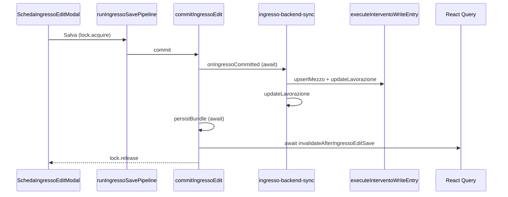

# Fix edit lavorazione save loop + phantom matricola

## Principi guida (determinanti)

1. **Un solo writer lavorazioni in edit** — solo [`ingresso-backend-sync.ts`](lib/schede/ingresso-backend-sync.ts) chiama `updateLavorazione`. La saga **non conosce** `updateLavorazione` nel percorso edit.
2. **`mezzo_id` immutabile in edit** — una lavorazione già collegata non cambia `mezzo_id` durante l'edit, salvo azione esplicita dell'utente ("Cambia mezzo").
3. **Snapshot wins (assoluto)** — quando esiste snapshot Scheda Ingresso, la UI legge **solo** la snapshot. `matricola = NULL` → UI mostra NULL. Nessuna catena snapshot → mezzo → legacy → default.

Entrambe le anomalie sono compatibili con la violazione di questi principi.

---

## Analisi — stato attuale

### Flusso save edit (problematico)



**File SSOT già presenti:**

- Pipeline: [`lib/schede/scheda-ingresso-save-pipeline.ts`](lib/schede/scheda-ingresso-save-pipeline.ts)
- Commit hub: [`components/lavorazioni/schede/schede-lavorazione-modal.tsx`](components/lavorazioni/schede/schede-lavorazione-modal.tsx) (`commitIngressoEdit`)
- Backend sync: [`lib/schede/ingresso-backend-sync.ts`](lib/schede/ingresso-backend-sync.ts)
- View: [`components/gestionale/lavorazioni/lavorazioni-view.tsx`](components/gestionale/lavorazioni/lavorazioni-view.tsx)
- Policy test: [`lib/regression/lavorazione-edit-save-pending-policy.test.ts`](lib/regression/lavorazione-edit-save-pending-policy.test.ts)

### Cause save loop / pending

| # | Causa | File |
|---|--------|------|
| 1 | Due UPDATE + due responsabilità (saga + backend-sync) | saga L321–330, backend-sync L117–125 |
| 2 | Invalidazione `await`ata nel commit | `commitIngressoEdit` L922 |
| 3 | Nessun single-flight a livello mutation | solo `createSubmitLock` form |
| 4 | Nessun saveToken / correlationId in-flight map | pipeline |
| 5 | Path parallelo note panoramica | `schede-lavorazione-modal.tsx` L843 |

### Cause matricola fantasma

| # | Causa | File |
|---|--------|------|
| 1 | Catena fallback display scheda → mezzo → legacy | [`resolve-intervento-display.ts`](lib/domain/intervento-context/resolve-intervento-display.ts) |
| 2 | Synthetic attrezzatura da colonne legacy | [`compose-mezzo-gestito.ts`](lib/domain/mezzo-attrezzatura/compose-mezzo-gestito.ts) L146–161 |
| 3 | Resolver/suggest attivo in edit | [`use-scheda-ingresso-mezzo-prompt.ts`](src/hooks/use-scheda-ingresso-mezzo-prompt.ts) |
| 4 | Prefill al link (create) | `mergeSchedaIngressoWithMezzoPriority` + `copyLastSchedaIngresso` |

---

## Implementazione

### Fase A — Save: un solo UPDATE, un solo writer

#### A1. Saga edit → `WriteResult`, zero `updateLavorazione`

**Contratto nuovo** (tipo in [`intervento-write-types.ts`](lib/domain/intervento-context/intervento-write-types.ts) o adiacente):

```ts
type InterventoEditWriteResult = {
  ok: true;
  mezzoPatch?: MezzoUpsertOutcome;   // esito upsert mezzo (già eseguito)
  lavorazionePatch: LavorazioneUpdate; // patch calcolata, NON applicata
} | { ok: false; error: string; stage: string };
```

**Flusso target:**

```
Saga (edit)
    ↓
upsertMezzo (side-effect mezzi/attrezzature)
    ↓
ritorna WriteResult { mezzoPatch, lavorazionePatch }

ingresso-backend-sync
    ↓
merged = merge(writeResult.lavorazionePatch, buildConsolidatedIngressoLavorazionePatch(...))
    ↓
if (Object.keys(merged).length) updateLavorazione(id, merged)   // UNICO punto autorizzato
```

**Modifiche:**

- [`intervento-write-saga.ts`](lib/domain/intervento-context/intervento-write-saga.ts): rimuovere `await deps.updateLavorazione` in edit; accumulare patch in `lavorazionePatch`.
- [`write-contract.ts`](lib/domain/intervento-context/write-contract.ts) path v1 edit: stesso comportamento (saga/write senza update diretto).
- [`ingresso-backend-sync.ts`](lib/schede/ingresso-backend-sync.ts): merge + singola chiamata `deps.updateLavorazione`.
- **Create path invariato** — create può mantenere il proprio flusso transaction.

**Guard `mezzo_id` immutabile:**

In `ingresso-backend-sync`, prima del merge:

```ts
if (row.mezzo_id && lavorazionePatch.mezzo_id && lavorazionePatch.mezzo_id !== row.mezzo_id) {
  // consentito solo se writeContext indica cambio mezzo esplicito (Cambia mezzo)
  if (!options.explicitMezzoChange) throw / strip mezzo_id from patch
}
```

Policy test: assert **zero** occorrenze `updateLavorazione` in saga/write-contract edit; **una sola** in backend-sync.

#### A2. Invalidazioni fire-and-forget con error reporting

In [`schede-lavorazione-modal.tsx`](components/lavorazioni/schede/schede-lavorazione-modal.tsx) `commitIngressoEdit`:

```ts
void onInvalidateAfterIngressoSave?.(lav.id, mezzo?.id).catch(reportInvalidateFailure);
```

- `reportInvalidateFailure` in [`lib/schede/scheda-ingresso-save-pipeline-log.ts`](lib/schede/scheda-ingresso-save-pipeline-log.ts) o `lib/observability/`: log strutturato + `gestToast` dev-only / telemetry; **mai** reject verso la pipeline.
- Policy test: `commitIngressoEdit` non contiene `await onInvalidateAfterIngressoSave`.

#### A3. Single-flight: `Map<lavorazioneId, InFlightEntry>`

Helper `lib/schede/lavorazione-edit-single-flight.ts`:

```ts
type InFlightEntry = { runId: number; correlationId: string; startedAt: number };

const inFlight = new Map<string, InFlightEntry>();

function acquire(lavorazioneId, runId, correlationId): boolean
function release(lavorazioneId, runId): void  // release solo se runId matcha
```

- Secondo click stesso `lavorazioneId` → log `SAVE_DUPLICATE_BLOCKED` con entry esistente (runId, correlationId, startedAt) + return early.
- Usato dal wrapper `updateLavorazione` in [`lavorazioni-view.tsx`](components/gestionale/lavorazioni/lavorazioni-view.tsx) e da `commitPanoramicaNote` quando hub lock attivo.

#### A4. saveToken (generation counter)

In pipeline + commit + sync:

- `saveGenerationRef` incrementato a ogni `SAVE_START`
- Prima di `updateLavorazione` e `persistBundle` post-sync: abort con `SAVE_ABORT` se `runId !== currentGeneration`

#### A5. Telemetria — eventi canonici

Estendere [`scheda-ingresso-save-pipeline-log.ts`](lib/schede/scheda-ingresso-save-pipeline-log.ts):

| Evento | Quando |
|--------|--------|
| `SAVE_START` | lock acquired, correlationId generato |
| `SAVE_DB` | prima di upsertMezzo / updateLavorazione |
| `SAVE_COMMIT` | persistBundle scheda JSON |
| `SAVE_INVALIDATE` | fire-and-forget invalidation avviata |
| `SAVE_DONE` | pipeline ok, lock released |
| `SAVE_ABORT` | cancelled / stale runId |
| `SAVE_ERROR` | eccezione |
| `SAVE_DUPLICATE_BLOCKED` | single-flight reject |

Ogni evento include `{ correlationId, runId, lavorazioneId, durationMs? }`.

Flag: `NEXT_PUBLIC_DEBUG_INGRESSO_SAVE=1`.

#### A6. Note panoramica

`commitPanoramicaNote`: rispetta single-flight map + disabilita se `submitLock.isLocked()`.

---

### Fase B — Phantom matricola: snapshot wins assoluto

#### B1. Regola display — snapshot only (fix principale)

Quando `ctx.schedaIngresso.campi` esiste (snapshot presente):

- **Tutti** i campi permanenti (`MEZZO_PERMANENT_FIELDS` + ident) leggono **solo** `scheda.campi[key]`.
- Valore vuoto / NULL / alias (`—`, `Non assegnata`) → UI mostra vuoto.
- **Nessun** fallback a `lavorazione`, `mezzo`, legacy embed.

Implementazione:

- Nuova `resolveInterventoDisplayFromSnapshot(ctx)` o branch in [`resolve-intervento-display.ts`](lib/domain/intervento-context/resolve-intervento-display.ts) attivato quando `campi` presente.
- Form edit: [`scheda-ingresso-anagrafica-fields.tsx`](components/gestionale/lavorazioni/scheda-ingresso-anagrafica-fields.tsx) — verificare che non ci siano placeholder da `mezziCatalog` su campi vuoti.

**Senza snapshot** (es. lavorazione senza scheda salvata): comportamento attuale mezzo/lavorazione resta valido.

#### B2. Fix compose `MezzoGestito` (contesto non-scheda)

[`compose-mezzo-gestito.ts`](lib/domain/mezzo-attrezzatura/compose-mezzo-gestito.ts): rimuovere/restringere synthetic attrezzatura L146–161. Mezzo V2 senza attrezzature → matricola assente, non `row.matricola` legacy.

#### B3. Resolver disabilitato in edit

**Regola esplicita:**

```
preferredMezzoId presente (o row.mezzo_id in edit)
        ↓
resolver disabilitato
        ↓
nessun ranking · nessun suggest · nessun relink
```

Attivo **solo** su:
- create (nessun mezzo collegato)
- azione esplicita utente "Cambia mezzo" (nuovo stato `mezzoLinkMode: "change"`)

Modifiche:

- [`use-scheda-ingresso-mezzo-prompt.ts`](src/hooks/use-scheda-ingresso-mezzo-prompt.ts): early return su ident handlers se `linkedSnapshot` / `bootstrapMezzoId` attivo e non in change mode.
- [`scheda-ingresso-ident-autocomplete-field.tsx`](components/gestionale/lavorazioni/scheda-ingresso-ident-autocomplete-field.tsx): disabilitare suggest in edit linked.
- [`syncIngressoBackendFromFrozenCatalog`](lib/schede/ingresso-backend-sync.ts): `preferredMezzoId: row.mezzo_id` sempre quando presente.

#### B4. Preservare NULL su save attrezzatura

Test esplicito: scheda `matricola: ""` + attrezzatura DB valorizzata → dopo upsert, matricola DB invariata ([`merge-attrezzatura-patch.ts`](lib/domain/mezzo-attrezzatura/merge-attrezzatura-patch.ts) già safe).

#### B5. SQL audit (read-only, no schema change)

- [`lavorazioni-list-fetch.ts`](lib/lavorazioni/lavorazioni-list-fetch.ts) + enrich attrezzature
- View portal `m.matricola` legacy — documentare; fix lato app via snapshot wins

---

### Fase C — Test e verifica

#### C1. Unit / policy

| Test | Assert |
|------|--------|
| `lavorazione-edit-save-pending-policy.test.ts` | zero `updateLavorazione` in saga edit; una in backend-sync; no await invalidate |
| `ingresso-lavorazione-single-update.test.ts` | merge WriteResult + consolidated |
| `resolve-intervento-display.test.ts` | snapshot matricola NULL → display NULL, zero fallback |
| `mezzo-id-immutable-edit.test.ts` | patch con mezzo_id diverso strippato/errore senza explicit change |
| `scheda-ingresso-edit-resolver-disabled.test.ts` | suggest no-op con linkedSnapshot |

#### C2. E2E — [`e2e/smoke/13-lavorazioni-scheda-ingresso.spec.ts`](e2e/smoke/13-lavorazioni-scheda-ingresso.spec.ts)

- **edit-e2e:** per ogni click Salva → **esattamente 1** richiesta HTTP PATCH/PUT verso `/lavorazioni` (network listener).
- **phantom-e2e:** mezzo solo scuderia → scheda solo scuderia → save → reopen → matricola vuota in form + hub.

#### C3. Manuale

`NEXT_PUBLIC_DEBUG_INGRESSO_SAVE=1` → sequenza completa `SAVE_START` → `SAVE_DB` → `SAVE_COMMIT` → `SAVE_INVALIDATE` → `SAVE_DONE` senza duplicati né `SAVE_DUPLICATE_BLOCKED` spurio.

---

## Acceptance criteria

- [ ] Un solo `UPDATE` SQL `lavorazioni` per salvataggio edit.
- [ ] **Una sola** chiamata HTTP verso `/lavorazioni` per click Salva.
- [ ] `mutateAsync` / pipeline terminano al commit server; invalidazioni non bloccano.
- [ ] Nessun loop invalidazioni/refetch nel critical path.
- [ ] `SAVE_DUPLICATE_BLOCKED` su doppio click; nessun secondo UPDATE.
- [ ] **`mezzo_id` invariato** in edit salvo "Cambia mezzo" esplicito.
- [ ] Con snapshot presente: **snapshot wins** — `matricola NULL` resta NULL in UI.
- [ ] Resolver/suggest/ranking **disabilitati** in edit con mezzo collegato.
- [ ] Nessun dato di altri mezzi in scheda/hub/lista.

---

## Rischi residui

- Refactor saga `WriteResult` tocca v1 + v2 write path — create deve restare invariato.
- Snapshot-only display cambia hub/lista per lavorazioni con scheda: campi vuoti in snapshot non mostrano più dati mezzo (comportamento desiderato).
- View SQL portal legacy: fuori scope schema; mitigato da snapshot wins lato app.
- Note + ingresso in tab diverse: mitigato da single-flight map, non eliminato del tutto.

## Ordine di esecuzione

1. A5 telemetria eventi (base osservabilità)
2. A1 saga `WriteResult` + unico writer backend-sync + guard `mezzo_id`
3. A2 fire-and-forget + `reportInvalidateFailure`
4. A3 + A4 single-flight map + saveToken
5. B1 snapshot wins assoluto (fix matricola principale)
6. B3 resolver disabled edit
7. B2 compose legacy cleanup
8. C1 → C2 test + acceptance checklist
