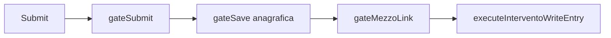
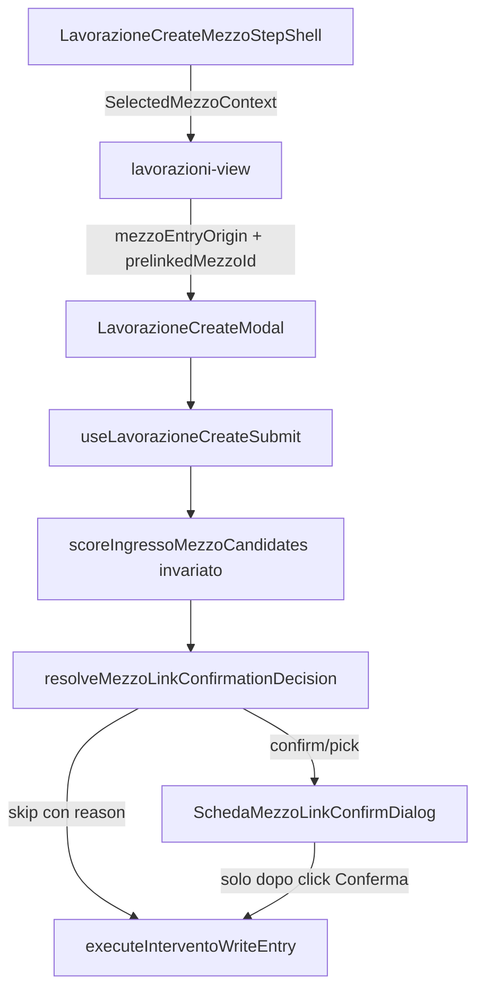

# Fix mezzo-link confirmation flow

## Analisi

### Stato attuale

Il salvataggio lavorazione passa da due gate sequenziali in [`use-lavorazione-create-submit.ts`](src/hooks/use-lavorazione-create-submit.ts):



- **Riepilogo modifiche** (`MezzoAnagraficaConfirmDialog` / "Aggiornamento anagrafica mezzo"): [`use-scheda-ingresso-save-gate.tsx`](src/hooks/use-scheda-ingresso-save-gate.tsx) — da mantenere invariato.
- **Conferma collegamento** (`SchedaMezzoLinkConfirmDialog`): [`use-scheda-ingresso-mezzo-link-gate.tsx`](src/hooks/use-scheda-ingresso-mezzo-link-gate.tsx) — usa `collectMezzoCandidates` + `scoreIngressoMezzoCandidates` da [`scheda-ingresso-mezzo-match.ts`](lib/schede/scheda-ingresso-mezzo-match.ts).

Il wizard step 1 distingue già i percorsi via [`SelectedMezzoContext`](lib/lavorazioni/selected-mezzo-context.ts) (`mode: "existing" | "new"`), ma **questa informazione non viene propagata** al link gate: oggi lo skip dipende solo da `preferredMezzoId` + `linkedOrigin` nel prompt state, che può non essere sufficiente se l'utente modifica identificativi o se il bootstrap link fallisce.

Inoltre, lo scorer attuale può proporre collegamento con **solo scuderia** (`confidence: "low"` → `needs_confirm`) o con **matricola senza conferma marca/modello** (`confidence: "medium"` con cliente).

### Gap rispetto ai requisiti

| Scenario | Comportamento atteso | Comportamento attuale |
|----------|---------------------|----------------------|
| Creazione da Anagrafica Mezzi | Nessun modal collegamento; solo riepilogo se dati mezzo cambiati | Skip solo se link state intatto |
| Catalog + targa modificata verso altro mezzo | NO link modal; SÌ riepilogo; FK resta sul mezzo originale | Rischio rematch e dialog collegamento |
| Nuovo mezzo, match targa/VIN | Modal collegamento | OK (parziale) |
| Nuovo mezzo, match matricola | Modal solo se marca+modello attrezzatura coincidono | Modal anche con solo matricola+cliente |
| Nuovo mezzo, solo scuderia | Nessun modal | Modal `needs_confirm` o `ambiguous` |

---

## Architettura target

Separazione netta tra **matching** (scorer) e **decisione UI** (policy):



**Principio**: `scoreIngressoMezzoCandidates()` continua a produrre candidati + score per suggerimenti, diagnostica, capture, import. Solo la policy decide se aprire il modal.

### Regole identità affidabili (confermate)

| Campo match | Affidabile per modal? | Condizione |
|-------------|----------------------|------------|
| Targa | Sì | match esatto normalizzato |
| VIN | Sì | match esatto normalizzato |
| Matricola | Condizionale | richiede anche **marca attrezzatura + modello attrezzatura** equivalenti (`isEquipmentIdentityEquivalent`) |
| N. scuderia | No da sola | può aumentare score in `softBonus`, mai sufficiente per aprire il modal |

---

## Implementazione

### 1. Tipo e propagazione entry flow

Estendere [`selected-mezzo-context.ts`](lib/lavorazioni/selected-mezzo-context.ts):

```typescript
export type LavorazioneMezzoEntryOrigin = "catalog_selected" | "new_mezzo";

export function resolveMezzoEntryOrigin(ctx: SelectedMezzoContext | null): LavorazioneMezzoEntryOrigin;
export function resolvePrelinkedMezzoId(ctx: SelectedMezzoContext | null): string | null;
```

Propagare fino al save:

- [`lavorazioni-view.tsx`](components/gestionale/lavorazioni/lavorazioni-view.tsx) → passa `mezzoEntryOrigin` e `prelinkedMezzoId` a `LavorazioneCreateModal`
- [`lavorazione-create-modal.tsx`](components/gestionale/lavorazioni/lavorazione-create-modal.tsx) → forward a `useLavorazioneCreateSubmit`
- [`use-lavorazione-create-submit.ts`](src/hooks/use-lavorazione-create-submit.ts) → passa a `useSchedaIngressoMezzoLinkGate`; opzionale in `writeContext` per audit
- [`capture-scheda-compile-step.tsx`](components/document-capture/capture-scheda-compile-step.tsx) → default `"new_mezzo"`; `"catalog_selected"` quando l'utente sceglie mezzo esistente dal picker capture

**Non dedurre** l'origine dai campi scheda: usare solo il contesto wizard/capture.

`prelinkedMezzoId` è **immutabile** per tutta la sessione di creazione (ref/set al bootstrap wizard, non sovrascrivibile da rematch inline).

### 2. SSOT policy — nuovo file

Creare [`lib/schede/scheda-ingresso-mezzo-link-confirmation-policy.ts`](lib/schede/scheda-ingresso-mezzo-link-confirmation-policy.ts):

```typescript
export type MezzoLinkSkipReason =
  | "catalog_prelinked"   // wizard Anagrafica Mezzi — inviolabile
  | "already_linked"      // preferredMezzoId + origin confermato (edit/capture)
  | "no_trusted_match"    // scorer ha candidati ma nessuno trusted → nessun modal
  | "create_new";         // scorer not_found → crea nuovo mezzo

export type MezzoLinkConfirmationDecision =
  | {
      action: "skip";
      reason: MezzoLinkSkipReason;
      preferredMezzoId: string | null;
      linkOrigin: MezzoLinkOrigin;
    }
  | { action: "confirm"; match: /* needs_confirm, solo candidati trusted */ }
  | { action: "pick"; match: /* ambiguous, solo candidati trusted */ };

export function resolveMezzoLinkConfirmationDecision(input: {
  entryOrigin: LavorazioneMezzoEntryOrigin;
  scheda: SchedaIngressoFields;
  catalog: readonly MezzoGestito[];
  prelinkedMezzoId?: string | null;
  preferredMezzoId?: string | null;
  linkedOrigin?: MezzoLinkOrigin | null;
}): MezzoLinkConfirmationDecision;
```

#### Ordine di valutazione (inviolabile)

La policy **inizia sempre** con il guard catalog — prima di scoring, lookup o fallback:

```typescript
// REGOLA #1 — priorità assoluta, nessun resolver può bypassarla
if (entryOrigin === "catalog_selected" && prelinkedMezzoId?.trim()) {
  return {
    action: "skip",
    reason: "catalog_prelinked",
    preferredMezzoId: prelinkedMezzoId.trim(),
    linkOrigin: "selected_by_user",
  };
}
```

Poi, in ordine:

2. **`preferredMezzoId` + origin `selected_by_user` | `auto_confirmed`** → `skip` con `reason: "already_linked"` (edit/capture già collegati).
3. **`entryOrigin === "new_mezzo"`** (o edit senza prelink):
   - Eseguire `resolveIngressoMezzoMatchFromCatalog` (scorer **invariato**)
   - Filtrare candidati con `isTrustedMezzoMatch(scheda, candidate)`
   - Nessun candidato trusted → `skip` con `reason: "no_trusted_match"`, `preferredMezzoId: null`, `linkOrigin: "created_new"`
   - `not_found` dallo scorer → `skip` con `reason: "create_new"`
   - Trusted + `needs_confirm` → `confirm`
   - Trusted + `ambiguous` → `pick` (solo tra candidati trusted)

#### Helper trusted match

```typescript
export function isTrustedMezzoMatch(
  scheda: SchedaIngressoFields,
  candidate: IngressoMezzoScoredCandidate,
): boolean;
```

- `targa` o `vin` nei `matchedFields` ident → trusted
- `matricola` → trusted solo se `isEquipmentIdentityEquivalent` su marca **e** modello attrezzatura
- solo `nScuderia` (con o senza soft bonus cliente/marca) → **non** trusted

#### Helper equivalenza attrezzatura

```typescript
export function isEquipmentIdentityEquivalent(
  schedaMarca: string,
  schedaModello: string,
  mezzoMarca: string,
  mezzoModello: string,
): boolean;
```

Gestisce esplicitamente: trim, lowercase, accenti, null, `"—"`, `"nessuna marca"`, separatori (`x-200` ≡ `X200`).

Esempio atteso:

```
Scheda:     matricola ABC123, marca ROSSI,  modello X200
Anagrafica: matricola ABC123, marca Rossi,  modello x-200
→ isTrustedMezzoMatch = true
```

Attenzione ai mezzi con marca/modello mancanti in anagrafica: se marca o modello è empty/placeholder su uno dei due lati, `isEquipmentIdentityEquivalent` restituisce `false` → matricola da sola non apre il modal.

### 3. Scorer — nessuna modifica

[`scheda-ingresso-mezzo-match.ts`](lib/schede/scheda-ingresso-mezzo-match.ts) e [`scheda-ingresso-mezzo-match.test.ts`](lib/schede/scheda-ingresso-mezzo-match.test.ts) restano **invariati**.

Motivo: lo scorer serve anche suggerimenti UI, diagnostica, capture, import. La fiducia del match e la decisione di mostrare un modal sono concetti separati.

Il filtro `isTrustedMezzoMatch` vive **esclusivamente** nella policy.

### 4. Collegare la policy al link gate

In [`use-scheda-ingresso-mezzo-link-gate.tsx`](src/hooks/use-scheda-ingresso-mezzo-link-gate.tsx):

- Aggiungere props `entryOrigin`, `prelinkedMezzoId`
- Sostituire la logica inline con `resolveMezzoLinkConfirmationDecision`
- `action: "skip"` → `finish(...)` senza dialog; loggare `reason` in telemetry (`logInterventoTelemetry`)
- `action: "confirm" | "pick"` → aprire dialog

#### Nessun side-effect prima della conferma utente

Nel flusso `new_mezzo → match → modal`:

**Prima del click** (dialog aperto o in valutazione policy `confirm`/`pick`):
- NON aggiornare anagrafica mezzo
- NON cambiare FK lavorazione
- NON creare `linkedSnapshot` definitivo
- NON chiamare `bootstrapLinkedMezzo` / `confirmAutoMatchedMezzo`

**Solo dopo click "Collega mezzo esistente"**:
```
Conferma → preferredMezzoId + linkOrigin auto_confirmed → save gate (eventuale update anagrafica) → write
```

**Dopo click "Crea nuovo mezzo"**:
```
Decline → preferredMezzoId null + linkOrigin created_new → write crea nuovo record
```

Verificare che `use-lavorazione-create-submit.ts` non chiami `confirmAutoMatchedMezzo` prima del resolve del gate (oggi è post-gate — mantenere così).

### 5. Riepilogo modifiche — nessuna modifica

[`use-scheda-ingresso-save-gate.tsx`](src/hooks/use-scheda-ingresso-save-gate.tsx) e [`scheda-save-conflict-dialog.tsx`](components/lavorazioni/schede/scheda-save-conflict-dialog.tsx) restano invariati.

Nel percorso `catalog_selected`, `bootstrapLinkedMezzo` + `linkedSnapshot` (baseline = mezzo wizard) garantiscono il riepilogo su modifiche permanenti, **indipendentemente** da eventuali match ident verso altri mezzi.

### 6. Edit flow

[`scheda-ingresso-form-modal.tsx`](components/gestionale/lavorazioni/scheda-ingresso-form-modal.tsx): nessun `entryOrigin` wizard. Il link gate riceve `entryOrigin` opzionale default `"new_mezzo"` ma continua a skippare via `reason: "already_linked"` per schede già collegate. Comportamento edit invariato; il filtro trusted nella policy evita falsi positivi scuderia-only.

---

## Test

### Unit test — policy (fonte di verità)

Nuovo file [`scheda-ingresso-mezzo-link-confirmation-policy.test.ts`](lib/schede/scheda-ingresso-mezzo-link-confirmation-policy.test.ts):

| Caso | Assert |
|------|--------|
| `catalog_selected` + prelinked | `skip`, `reason: "catalog_prelinked"`, nessun dialog |
| **`catalog_selected` + targa modificata verso altro mezzo** | `skip`, `reason: "catalog_prelinked"`, `preferredMezzoId` = originale; save gate separato mostra riepilogo |
| `catalog_selected` + resolver trova altro match | policy ritorna `catalog_prelinked` **prima** dello scorer — scorer mai consultato |
| `new_mezzo`, no match | `skip`, `reason: "create_new"` |
| `new_mezzo`, match non trusted (solo scuderia) | `skip`, `reason: "no_trusted_match"` |
| `new_mezzo`, match targa | `confirm` |
| `new_mezzo`, match matricola + marca/modello equivalenti | `confirm` |
| `new_mezzo`, match matricola senza marca/modello | `skip`, `reason: "no_trusted_match"` |
| `isEquipmentIdentityEquivalent`: ROSSI/X200 vs Rossi/x-200 | `true` |
| `isEquipmentIdentityEquivalent`: marca mancante | `false` |
| confirm handler → `auto_confirmed` + preferredMezzoId | (gate handler) |
| decline handler → `created_new` | (gate handler) |

**Non modificare** `scheda-ingresso-mezzo-match.test.ts` — lo scorer non cambia.

### Smoke e2e (4 scenari critici)

Estendere [`e2e/helpers/lavorazioni-scheda.ts`](e2e/helpers/lavorazioni-scheda.ts) con helper per assert assenza/presenza dialog collegamento, poi in [`e2e/smoke/13-lavorazioni-scheda-ingresso.spec.ts`](e2e/smoke/13-lavorazioni-scheda-ingresso.spec.ts):

1. **Catalog → nessun modal collegamento** — `selectMezzoFromSearchByTarga` + save diretto
2. **Catalog + modifica targa → solo riepilogo, no link modal** — estende test esistente riga 119; assert esplicito che "Collega mezzo esistente" **non** compare; FK resta sul mezzo wizard
3. **Nuovo mezzo + targa esistente → modal collegamento** — crea mezzo via fixture, poi nuovo mezzo con stessa targa
4. **Nuovo mezzo + solo scuderia duplicata → nessun modal** — skip condizionale se DB smoke non ha duplicati; coperto da unit test policy

---

## File toccati (riepilogo)

| File | Azione |
|------|--------|
| `lib/lavorazioni/selected-mezzo-context.ts` | +`LavorazioneMezzoEntryOrigin`, helper |
| `lib/schede/scheda-ingresso-mezzo-link-confirmation-policy.ts` | **nuovo** SSOT (policy + `isTrustedMezzoMatch` + `isEquipmentIdentityEquivalent`) |
| `lib/schede/scheda-ingresso-mezzo-link-confirmation-policy.test.ts` | **nuovo** |
| `lib/schede/scheda-ingresso-mezzo-match.ts` | **nessuna modifica** |
| `lib/schede/scheda-ingresso-mezzo-match.test.ts` | **nessuna modifica** |
| `src/hooks/use-scheda-ingresso-mezzo-link-gate.tsx` | usa policy + telemetry su `reason` |
| `src/hooks/use-lavorazione-create-submit.ts` | propaga entry origin + `prelinkedMezzoId` immutabile |
| `components/gestionale/lavorazioni/lavorazione-create-modal.tsx` | nuove props |
| `components/gestionale/lavorazioni/lavorazioni-view.tsx` | passa contesto wizard |
| `components/document-capture/capture-scheda-compile-step.tsx` | entry origin capture |
| `e2e/helpers/lavorazioni-scheda.ts` | helper dialog link |
| `e2e/smoke/13-lavorazioni-scheda-ingresso.spec.ts` | 3–4 smoke test |

---

## Rischi residui

- **Matricola + marca/modello mancanti**: `isEquipmentIdentityEquivalent` conservativo — meglio non proporre link che link errato.
- **Capture path**: ha matching proprio a monte; la policy evita doppio prompt ma non sostituisce la UX capture inline.
- **Smoke scuderia-only**: dipende da dati DB; unit test policy è la rete di sicurezza principale.
