# Fix sincronizzazione Portale Cliente ↔ Lavorazioni

## Analisi — causa principale (probabilità ≈85–90%)

Il portale e la pagina Lavorazioni **condividono già la stessa funzione di fetch** per le liste:

- SSOT fetch: [`lib/lavorazioni/lavorazioni-list-fetch.ts`](lib/lavorazioni/lavorazioni-list-fetch.ts) (`fetchLavorazioniListRows` / `fetchLavorazioniListAuthorized`)
- Portale: sempre legacy PostgREST con `clientPortal: true` ([`use-client-lavorazioni-queries.ts`](src/hooks/gestionale/use-client-lavorazioni-queries.ts))
- Gestionale: può usare RPC `list_lavorazioni_paginated` quando il flag pagination è attivo — **divergenza secondaria**, non la causa primaria dello stale realtime

La propagazione si interrompe **prima di React Query**, nel layer dirty-sync:

```mermaid
flowchart TD
  subgraph broken [Percorso attuale portale cliente]
    RT[Realtime lavorazioni INSERT/UPDATE]
    Dispatch[dispatchGestionaleAction]
    Policy[resolveSyncEffects pilot_heavy]
    Domain[domain = lavorazioni]
    DirtyOn[isDirtySyncEnabled = true]
    Scopes[interestedScopes = 0]
    Drop[continue — né invalidate né dirty]
    Stale[Cache portale stale]
    RT --> Dispatch --> Policy --> Domain --> DirtyOn --> Scopes --> Drop --> Stale
  end

  subgraph fixed [Con scope portale registrato]
    RT2[Realtime event]
    Dispatch2[dispatchGestionaleAction]
    Policy2[resolveSyncEffects]
    Domain2[domain = portale da scope]
    LiveOn[isDirtySyncEnabled portale = false]
    Invalidate[invalidateTables.push lavorazioni]
    PortalKeys[CLIENT_PORTAL_QUERY_KEYS invalidati]
    Fresh[Portale aggiornato]
    RT2 --> Dispatch2 --> Policy2 --> Domain2 --> LiveOn --> Invalidate --> PortalKeys --> Fresh
  end
```



Confermato in [`lib/sync/gestionale-sync-policy.ts`](lib/sync/gestionale-sync-policy.ts) righe 156–167: con dirty-sync attivo per `lavorazioni`, se `interestedScopes.length === 0` l'evento viene **silenziosamente ignorato**.

**Il portale non registra alcuno scope** — zero `useGestionaleSyncScope` in `components/lavorazioni-clienti/`. La pagina Lavorazioni lo registra in [`lavorazioni-view.tsx`](components/gestionale/lavorazioni/lavorazioni-view.tsx), ma un cliente sul portale non ha quel componente montato.

Default env: `pilot_heavy` ([`gestionale-dirty-sync-flag.ts`](lib/feature-flags/gestionale-dirty-sync-flag.ts)) → `lavorazioni` in dirty mode, `portale` **no**.

**Punto di rottura preciso**: `resolveSyncEffects` con `interestedScopes.length === 0` — non un problema generico di React Query o realtime.

---

## Ordine di intervento (priorità corretta)

### Fase 0 — Audit upstream (prima di qualsiasi fix)

Lo scope non risolve nulla se l'evento non viene emesso o non arriva alla subscribe.

#### 0a. Audit mutazioni → `dispatchGestionaleAction`

Verificare che **tutte** le mutazioni lavorazioni eseguono sempre il dispatch:

| Operazione | Hook / entry | Path atteso |
|------------|--------------|-------------|
| CREATE | `useLavorazioneCreateMutation` → `commitLavorazioneCreateSuccess` | MIC + `dispatchGestionaleAction(scheda_lavorazione)` |
| UPDATE | `useLavorazioneUpdateMutation` | MIC `invalidateEntity` → `invalidateOperationalTruth` |
| ARCHIVE (conclude) | `useLavorazioneConcludeMutation` | `invalidateAfterLavorazioneMutations` + cab event |
| RESTORE | `useLavorazioneRestoreMutation` | idem |
| DELETE | `useLavorazioneRemoveMutation` | `evictLavorazioneDomainCache` + invalidate |
| Schede save | `persistSchedeBundle` in lavorazioni-view | `dispatchGestionaleLocalMutation` |

File da tracciare: [`use-lavorazione-mutations.ts`](src/hooks/gestionale/use-lavorazione-mutations.ts), [`invalidate-related.ts`](src/lib/react-query/invalidate-related.ts), [`minimal-invalidation-contract.ts`](lib/cache/minimal-invalidation-contract.ts), [`ingresso-backend-sync.ts`](lib/schede/ingresso-backend-sync.ts).

Per ogni path: confermare che `dispatchGestionaleAction(qc, tables, { source: "local_mutation", ... })` viene chiamato **dopo commit DB**.

#### 0b. Audit subscribe realtime

Verificare in [`gestionale-realtime-bridge.tsx`](src/components/gestionale-realtime-bridge.tsx) e [`postgres-changes-channel.ts`](lib/realtime/postgres-changes-channel.ts):

```
postgres_changes
  schema: public
  table: lavorazioni (e CLIENT_PORTAL_SYNC_TABLES)
  filter: (nessun filtro che esclude UPDATE su archived)
  event: INSERT | UPDATE | DELETE
```

Casi critici da testare:

- **ARCHIVE** = `UPDATE` con `archived: true` — non deve essere filtrato
- **RESTORE** = `UPDATE` con `archived: false`
- **CREATE** = `INSERT`
- **DELETE** = soft delete (`deleted_at`) — verificare se è UPDATE o DELETE nel payload

Confermare che ogni operazione produce `cabSyncEventFromPostgresChange` → `dispatchGestionaleAction(source: "realtime")`.

#### 0c. Audit query key alignment

Causa molto comune: query key registrata ≠ query key invalidata.

In dev, stampare per ogni ciclo sync:

```
queryKey registrata   (hook portale)
queryKey invalidata   (invalidate-targets / predicate)
queryKey rifetchata   (refetch attivo post-invalidazione)
```

Chiavi portale da verificare ([`query-keys.ts`](src/lib/react-query/query-keys.ts), [`invalidate-targets.ts`](src/lib/react-query/invalidate-targets.ts)):

| Superficie | Query key |
|------------|-----------|
| Lista in corso | `["lavorazioniQueries", "list", fk, "portal"]` |
| Lista archivio | idem con `archived: true` |
| Count archivio | `[...listKey, "count"]` |
| Dettaglio | `["client_lavorazioni_detail", id]` |
| Documenti | `["client_lavorazione_documents", id]` |
| Foto | `["client_lavorazione_photos", id, ...]` |
| Schede | `["schede", "bundles"]` + ensure `"portal"` suffix |
| Timeline (log) | `QK.log` |

---

### Fase 1 — Fix primario: registrare scope portale

Aggiungere `useGestionaleSyncScope` in:

- [`client-lavorazioni-view.tsx`](components/lavorazioni-clienti/client-lavorazioni-view.tsx) — lista
- [`client-lavorazione-detail-view.tsx`](components/lavorazioni-clienti/client-lavorazione-detail-view.tsx) — detail

```ts
useGestionaleSyncScope({
  scopeId: "client-portal-lavorazioni",
  domain: "portale",
  route: "/lavorazioni-clienti",
  tables: CLIENT_PORTAL_SYNC_TABLES,
  visibleEntities: detailId ? [{ table: "lavorazioni", entityId: detailId }] : undefined,
});
```

`domain: "portale"` è intenzionale: con `pilot_heavy`, `isDirtySyncEnabledForDomain("portale")` → `false` → **invalidate live** invece di dirty-only.

**Dopo questo step**: verificare con dev trace che eventi realtime arrivano a `invalidateTables` e non vengono dropati.

---

### Fase 2 — Verificare se lo scope basta (NON modificare subito il motore sync)

**Non** aggiungere subito `portale` a `ALWAYS_LIVE_SYNC_DOMAINS`.

Ordine:

1. Registrare scope
2. Verificare che gli eventi arrivano a invalidate (dev trace su `resolveSyncEffects` output)
3. **Solo se insufficiente** (es. flag `all` → portale in dirty mode, banner invece di auto-refresh) → modificare `ALWAYS_LIVE_SYNC_DOMAINS`

Motivo: modificare il motore sync globale prima del fix locale rischia di **mascherare il vero bug**.

---

### Fase 3 — Invalidazione completa portale (non solo count)

Estendere [`invalidateGestionaleTablesForEntity`](src/lib/react-query/invalidate-targets.ts) e verificare copertura su **tutte** le superfici portale dipendenti dalla lavorazione:

| Superficie | Invalidata su mutazione lavorazione? |
|------------|--------------------------------------|
| Liste (in corso + archivio) | `isLavorazioniListCacheQueryKey` predicate |
| Count archivio | `isLavorazioniListCountQueryKey` — **attualmente escluso** |
| Dettaglio | `QK.clientLavorazioniDetail` |
| Schede | `QK.schede` |
| Timeline | `QK.log` (via `log_modifiche` sync table) |
| Documenti ufficiali | `QK.clientLavorazioneDocuments` |
| Foto | `QK.clientLavorazionePhotos` |

Preferito: invalidare count keys in parallelo alle list keys in `invalidateGestionaleTablesForEntity` (evita side-effect su optimistic — vedi [`lavorazioni-archive-membership.test.ts`](lib/regression/lavorazioni-archive-membership.test.ts) riga 90).

### Fase 4 — Allineare schede detail

[`client-lavorazione-detail-view.tsx`](components/lavorazioni-clienti/client-lavorazione-detail-view.tsx):

```ts
useSchedeBundlesQuery(ids, { clientPortal: true })
```

### Fase 5 — Pipeline debug (dev-only, temporaneo)

Estendere [`lavorazioni-list-pipeline-debug.ts`](lib/lavorazioni/lavorazioni-list-pipeline-debug.ts) e [`gestionale-sync-dispatch.ts`](lib/sync/gestionale-sync-dispatch.ts):

- `correlationId` da `getActiveCorrelationId()`
- `phase`: mutation → db → realtime emit → dispatch → invalidate → refetch → render
- `queryKeyRegistered` / `queryKeyInvalidated` / `queryKeyRefetched`
- Solo `NODE_ENV === "development"`

---

## Gap secondari

| Gap | File | Impatto |
|-----|------|---------|
| Count archivio escluso da entity-scoped invalidation | `invalidate-targets.ts` | Badge count stale |
| Schede detail senza `clientPortal: true` | `client-lavorazione-detail-view.tsx` | Cache `"core"` vs `"portal"` |
| Portale senza scope | `client-lavorazioni-view.tsx` | Eventi realtime dropati |
| Mutation path senza dispatch | vari hooks | Scope non aiuta |
| Realtime filter errato | `postgres-changes-channel.ts` | ARCHIVE UPDATE filtrato |
| Query key mismatch | hooks vs invalidate-targets | Invalidate non rifetcha |

---

## Acceptance criteria

### Realtime sync (due browser)

- **Browser A** (gestionale `/lavorazioni`): operatore crea/modifica/archivia/ripristina/elimina lavorazione
- **Browser B** (portale `/lavorazioni-clienti`): cliente vede ogni modifica **entro pochi secondi senza refresh manuale**
- Copertura: INSERT, UPDATE stato, ARCHIVE (`archived=true`), RESTORE, DELETE
- Nessun record duplicato o fantasma
- Due tab portale contemporanei → coerenti
- Reconnect realtime → recovery entro polling window (20s max)

### Cold fetch (senza realtime)

- Mutazioni avvengono **prima** di aprire il portale
- Prima fetch SSR + hydration client → dati **corretti e completi** senza dipendere da eventi realtime
- Verifica: create + archive + restore con portale chiuso, poi apertura

### Consistenza dati

- Portale mostra gli stessi record della pagina Lavorazioni (per lo stesso cliente)
- Nessuna view/query legacy duplicata
- Nessuna cache obsoleta può mantenere dati vecchi dopo invalidate

---

## Test di regressione

**Unit** — [`lib/regression/client-portal-sync-policy.test.ts`](lib/regression/client-portal-sync-policy.test.ts):

- `pilot_heavy` + realtime + **no scope** → `invalidateTables` vuoto (regression documentata)
- Con scope `portale` → `invalidateTables` include `lavorazioni`
- ALWAYS_LIVE test **solo se** step condizionale attivato

**Unit** — estendere [`lavorazioni-archive-membership.test.ts`](lib/regression/lavorazioni-archive-membership.test.ts):

- Entity invalidation copre count + liste portal

**Unit** — invalidation coverage matrix (liste, detail, schede, log, docs, photos)

**E2E** — [`client-portal-realtime-sync.spec.ts`](e2e/smoke/client-portal-realtime-sync.spec.ts):

- Two-browser: A gestionale + B cliente, update senza refresh
- Cold open: mutazioni prima, portale dopo → fetch corretta
- Credenziali `SMOKE_CLIENT_*`; fallback polling 20s se realtime flaky in CI

---

## Verifica manuale (checklist)

1. **Audit**: tracciare dispatch su create/update/archive/restore/delete
2. **Audit**: confermare postgres_changes riceve INSERT/UPDATE/DELETE su `lavorazioni`
3. **Audit**: dev trace queryKey registered/invalidated/refetched
4. Registrare scope portale
5. Browser A portale + Browser B gestionale → sync realtime tutte le transizioni
6. Mutazioni con portale chiuso → cold open corretto
7. Archivio collassato → count aggiornato; espansione → lista corretta
8. Reconnect realtime

---

## Rischi residui

- **RPC V2 gestionale vs PostgREST portale**: divergenza secondaria; portale non usa RPC
- **Archivio on-demand**: lista archivio fetch solo su expand; count deve essere sempre corretto
- **ALWAYS_LIVE_SYNC_DOMAINS**: applicare solo se scope insufficiente con flag `all`
- **Piano banner scoping** ([`fix_update_banner_scoping.plan.md`](fix_update_banner_scoping.plan.md)): complementare, non blocker

## File principali

- [`client-lavorazioni-view.tsx`](components/lavorazioni-clienti/client-lavorazioni-view.tsx)
- [`client-lavorazione-detail-view.tsx`](components/lavorazioni-clienti/client-lavorazione-detail-view.tsx)
- [`invalidate-targets.ts`](src/lib/react-query/invalidate-targets.ts)
- [`gestionale-sync-policy.ts`](lib/sync/gestionale-sync-policy.ts)
- [`gestionale-realtime-bridge.tsx`](src/components/gestionale-realtime-bridge.tsx)
- [`use-lavorazione-mutations.ts`](src/hooks/gestionale/use-lavorazione-mutations.ts)
- [`lavorazioni-list-pipeline-debug.ts`](lib/lavorazioni/lavorazioni-list-pipeline-debug.ts)
- [`gestionale-dirty-sync-flag.ts`](lib/feature-flags/gestionale-dirty-sync-flag.ts) — **solo se condizionale**
