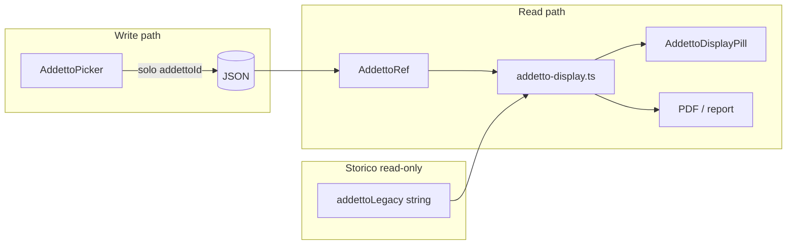

# Uniformazione selettori Addetti SSOT (v3)

## Regole architetturali (vincolanti)

```yaml
architecture_rules:
  - "addettoId è unica SSOT per nuove scritture"
  - "addettoLegacy è solo fallback storico read-only"
  - "tutti i display passano da addetto-display.ts"
  - "tutti i picker passano da AddettoPicker"
  - "il colore pill è stabile e non dipende dal nome"
  - "PDF/report non leggono mai direttamente la stringa addetto"
```

---

## Principi architetturali vincolanti

### P0 — Write freeze: solo `addettoId`

| Contesto | Nuove scritture | Storico |
|----------|-----------------|---------|
| Schede ingresso/lavorazioni/ricambi | `addettoAccettazioneId` / `addettoId` | `addetto` / `addettoAccettazione` stringa **read-only** |
| Preventivi manodopera | `righeAddetti[].addettoId` | `addetto` stringa legacy read-only |
| Lavorazioni inline | `addettoId` | stringa legacy read-only |

**Vietato** popolare `addetto` stringa nelle nuove scritture — nessuna eccezione "in transizione".

```json
// ✅ Nuovo record
{ "addettoId": "uuid-123" }

// ✅ Storico (immutato dal backfill)
{ "addetto": "Mario", "addettoId": null }

// ❌ Dual-write — crea doppia SSOT
{ "addettoId": "uuid-123", "addetto": "Mario" }
```

Implementazione:

- Guard in ogni save path (schede, preventivi, capture compile)
- Strip `addetto` / `addettoAccettazione` dal payload in uscita se `addettoId` presente
- Test: `lib/regression/addetti-write-freeze.test.ts`

Todo: `freeze-addetto-string-write`

### P0 — Colore pill: `getAddettoColorKey`, mai nome

**Non mantenere** `getAddettoNomeKey` / `resolveAddettoNomeKey` — il nome non è identificatore stabile (rename, omonimi, collisioni).

```ts
export function getAddettoColorKey(
  records: readonly AddettoRecord[],
  ref: AddettoRef,
): string;
```

**Priorità lookup colore:**

1. `record.colorKey` se presente (immutabile alla creazione; default = `record.id`)
2. `record.id`
3. Fallback hash legacy **solo** per storico senza record match (`hash(addettoLegacy)` come ultima risorsa — da evitare su nuovi dati)

```ts
export function getAddettoPillStyle(
  records: readonly AddettoRecord[],
  ref: AddettoRef,
  colorMap: Record<string, string>,
): CSSProperties;
// lookup: colorMap[getAddettoColorKey(...)] → hash(id)
// MAI: lookup per nome, hash(nome)
```

**Migrazione `addettoColors`:**

- Oggi: `Record<nome, hex>`
- Target: `Record<id | colorKey, hex>`
- Al load settings: copia colore `map[rec.nome]` → `map[rec.id]`; rimuovi chiavi nome orfane
- `syncAddettoColorMap` opera su `records.map(r => r.id)` non su `addettiLegacyNomi`
- Deprecare: `addettoPillShellStyleForName`, `addettoDisplayColor(nome)`, `addettoThemeColor(nome)` per nuovo codice

`AddettoRecord` esteso:

```ts
type AddettoRecord = {
  id: string;
  nome: string;
  cognome?: string | null;
  colorKey?: string;  // default = id; immutabile
};
```

### `AddettoRef` — legacy esplicito

```ts
export type AddettoRef = {
  addettoId?: string | null;

  /**
   * Legacy storico.
   * Non usare per nuove scritture.
   */
  addettoLegacy?: string | null;
};
```

Il nome `addettoLegacy` (non `addetto`) impedisce uso accidentale come campo write in nuovo codice.

**Risoluzione display** (`getAddettoDisplayName`):

1. `addettoId` → record → `addettoDisplayName(rec)` (Nome Cognome)
2. Solo se id assente → `addettoLegacy` → `findAddettoByStoredName` → enrich
3. Unknown legacy → stringa grezza (audit)

---

## Analisi (stato attuale)

| Layer | SSOT esistente | Gap |
|-------|----------------|-----|
| Modello | [`addetto-model.ts`](lib/lavorazioni/addetto-model.ts) | Manca `AddettoRef`, `getAddettoColorKey` |
| Display | [`resolve-addetto-display.ts`](lib/lavorazioni/resolve-addetto-display.ts) | Usa `resolveAddettoNomeKey` (nome) — **da sostituire** |
| Colori | [`addetto-colors-assign.ts`](lib/lavorazioni/addetto-colors-assign.ts) | Chiave = `nome` |
| Picker pill | [`AddettoSelectField`](components/gestionale/lavorazioni/lavorazioni-inline-select.tsx) | Solo lavorazioni |
| Picker grey | [`GlobalSettingsListSelect`](components/gestionale/global-input/global-settings-list-select.tsx) | Schede — eliminare |
| Preventivi | input libero + `"Officina"` | Picker strict + migrazione preservativa |
| PDF | [`schede-pdf-layout.ts`](lib/pdf/schede-pdf-layout.ts) | Legge stringa diretta |



---

## Fase 0 — Foundation (P0, prerequisito UI swap)

### 0.1 `freeze-addetto-string-write`

Audit write path: `schede-*-save`, `patchRiga`, `preventivi-storage`, `generate-preventivo-from-lavorazione`, capture compile, lavorazioni inline save.

### 0.2 Migrazione colori + `getAddettoColorKey`

File:

- [`addetto-model.ts`](lib/lavorazioni/addetto-model.ts) — `colorKey`
- [`addetto-colors-assign.ts`](lib/lavorazioni/addetto-colors-assign.ts) — `syncAddettoColorMapById`, `addettoDisplayColorById`
- [`lavorazioni-theme.ts`](lib/lavorazioni/lavorazioni-theme.ts) — `addettoThemeColorFromId`
- [`resolve-from-rows.ts`](src/lib/app-settings/resolve-from-rows.ts) — migrate map al load
- [`lavorazioni-settings-ui.tsx`](components/gestionale/lavorazioni/lavorazioni-settings-ui.tsx) — color picker su `rec.id`

Rimuovere dal nuovo codice: `getAddettoNomeKey`, `resolveAddettoNomeKey`, `lavorazioneAddettoNomeKey` → delegano a `getAddettoColorKey` fino a rimozione.

Test: `lib/lavorazioni/addetto-color-key-migrate.test.ts`

### 0.3 Layer display SSOT — [`addetto-display.ts`](lib/lavorazioni/addetto-display.ts)

```ts
export type AddettoRef = { addettoId?: string | null; addettoLegacy?: string | null };

export function resolveAddettoRecord(records, ref): AddettoRecord | null;
export function getAddettoDisplayName(records, ref): string;
export function getAddettoColorKey(records, ref): string;
export function getAddettoPillStyle(records, ref, colorMap): CSSProperties;
```

**Unico modulo autorizzato** per display name + colore pill.

Wrapper deprecati (thin, chiamano `addetto-display.ts`):

- `addettoDisplayNameFromNome` → solo dentro allowlist migration
- `resolveAddettoNomeKey` → `getAddettoColorKey`
- `addettoPillShellStyleForName` → `getAddettoPillStyle`

---

## Fase 1 — Tipi persistenza + migrate runtime

### 1.1 Tipi schede

[`types/schede.ts`](types/schede.ts) — campi write `*Id`; campi stringa legacy marcati `@deprecated read-only`.

### 1.2 Tipi preventivi

[`lib/preventivi/types.ts`](lib/preventivi/types.ts):

```ts
type RigaAddettoPreventivo = {
  addettoId: string | null;   // null = riga legacy non convertita
  ore: number;
  /** Solo storico — popolato in migrazione, mai in nuove scritture */
  addettoLegacy?: string;
  /** Es. "Addetto storico non convertibile: Officina" */
  legacyWarning?: string;
};
```

### 1.3 Migrate runtime (read-only backfill schede)

[`schede-store-migrate.ts`](lib/schede/schede-store-migrate.ts):

- Match stringa → set **solo** `addettoId`
- **Non** cancellare/aggiornare stringa legacy
- **Non** aggiungere stringa su record già con id

### 1.4 Migrazione preventivi `"Officina"` — preservativa

**Non** svuotare `righeAddetti`. **Non** perdere ore.

Input legacy:

```json
{ "addetto": "Officina", "ore": 4 }
```

Output migrazione:

```json
{
  "addettoId": null,
  "addettoLegacy": "Officina",
  "legacyWarning": "Addetto storico non convertibile: Officina",
  "ore": 4
}
```

UX editor:

- Riga con `legacyWarning` → pill grigia/warning + messaggio
- Utente deve selezionare addetto valido per risolvere
- `legacyWarning`/`addettoLegacy` rimossi solo dopo selezione picker
- Nuovo preventivo: `righeAddetti: []` (no default Officina)

Test: `lib/preventivi/preventivi-officina-migrate.test.ts`

---

## Fase 2 — Domain components

Percorso: **`components/domain/addetti/`** (gestionale, preventivi, PDF, report, portale, capture).

```
components/domain/addetti/
├── addetto-picker.tsx
├── addetto-display-pill.tsx
├── addetto-badge.tsx      # variante compatta (timeline, tabelle dense)
└── index.ts
```

### `AddettoPicker`

- Unico entry point selezione
- `value: string | null` (id), `onChange: (id: string) => void`
- `variant`: `"pill"` | `"filter"`
- Hook [`useAddettiPickerOptions`](src/hooks/gestionale/use-addetti-picker-options.ts)
- `AddettoSelectField` → legacy interno

### `AddettoDisplayPill` / `AddettoBadge`

- Props: `ref: AddettoRef`
- Solo `addetto-display.ts` per label + colore
- `AddettoBadge` per spazi ristretti (timeline, celle tabella)

---

## Fase 3 — Sostituzione call site

### 3.1 Selettori → `AddettoPicker`

| File | Azione |
|------|--------|
| [`lavorazione-table-row.tsx`](components/gestionale/lavorazioni/lavorazione-table-row.tsx) | Picker id |
| [`lavorazione-mobile-cards.tsx`](components/gestionale/lavorazioni/lavorazione-mobile-cards.tsx) | Idem |
| [`lavorazioni-modals.tsx`](components/gestionale/lavorazioni/lavorazioni-modals.tsx) | Idem |
| [`scheda-ingresso-form-modal.tsx`](components/gestionale/lavorazioni/scheda-ingresso-form-modal.tsx) | Idem |
| [`scheda-lavorazioni-form-body.tsx`](components/lavorazioni/schede/scheda-lavorazioni-form-body.tsx) | Rimuovere `GlobalSettingsListSelect` |
| [`scheda-ricambi-form-body.tsx`](components/lavorazioni/schede/scheda-ricambi-form-body.tsx) | Idem |
| [`schede-lavorazione-modal.tsx`](components/lavorazioni/schede/schede-lavorazione-modal.tsx) | Idem |
| [`lavorazioni-advanced-filter-panel.tsx`](components/gestionale/lavorazioni/lavorazioni-advanced-filter-panel.tsx) | `variant="filter"`, value=id |
| [`preventivo-lavorazioni-editor-section.tsx`](components/preventivi/preventivo-lavorazioni-editor-section.tsx) | Picker strict |

### 3.2 Readonly → `AddettoDisplayPill` / `AddettoBadge`

Table archivio, kanban, portale, schede RO, timeline, capture review.

### 3.3 Fuori scope diretto

- Dipendenti timesheet (layout due righe)
- Header PDF "Operatore" (utente auth)
- DDT, notifiche

---

## Fase 4 — Resolver, filtri, analytics

Tutti delegano a `addetto-display.ts`. **Mai** lettura diretta `campi.addetto` / `storedName` in output utente.

1. [`resolve-addetto-display.ts`](lib/lavorazioni/resolve-addetto-display.ts) — costruisce `AddettoRef`, delega
2. [`lavorazioni-list-row-labels.ts`](lib/lavorazioni/lavorazioni-list-row-labels.ts)
3. [`lavorazioni-advanced-filters.ts`](lib/lavorazioni/lavorazioni-advanced-filters.ts) — filter `addettoId`
4. [`resolve-operator-identity.ts`](lib/report/recidivita/resolve-operator-identity.ts)
5. [`qualita-interventi.ts`](lib/report/recidivita/qualita-interventi.ts) — `segmentLabel` via `getAddettoDisplayName`
6. [`client-portal-timeline.ts`](lib/lavorazioni/client-portal-timeline.ts)
7. [`log-summary.ts`](lib/gestionale-log/log-summary.ts) — enrich display; payload immutati
8. [`capture-field-display-value.ts`](lib/document-capture/capture-field-display-value.ts)

---

## Fase 5 — PDF e testi generati

| File | Regola |
|------|--------|
| [`schede-pdf-layout.ts`](lib/pdf/schede-pdf-layout.ts) | `getAddettoDisplayName(ref)` — no `a.addetto` diretto |
| [`ingresso-pdf-layout.ts`](lib/pdf/ingresso-pdf-layout.ts) | id-first ref |
| [`lavorazioni-pdf-map.ts`](lib/lavorazioni/lavorazioni-pdf-map.ts) | id-first |
| [`generate-preventivo-from-lavorazione.ts`](lib/preventivi/generate-preventivo-from-lavorazione.ts) | Ore per `addettoId` |

Bump `LAVORAZIONI_IN_CORSO_PDF_MAP_VERSION` se mapping cambia.

---

## Fase 6 — Policy anti-regressione

### 6.1 [`selector-domain-policy-audit.test.ts`](lib/regression/selector-domain-policy-audit.test.ts)

Estendere: tutti i picker addetto importano da `components/domain/addetti/`.

### 6.2 Nuovo [`addetti-domain-policy-audit.test.ts`](lib/regression/addetti-domain-policy-audit.test.ts)

Scan `components/` + `app/` (allowlist esplicita):

| Vietato | Motivo |
|---------|--------|
| `GlobalSettingsListSelect` + `listKey="lavorazioni:addetti"` | Usare `AddettoPicker` |
| `{addetto.nome}` / `.addetto` in TSX UI | Usare `AddettoRef` + display components |
| `addettoDisplayNameFromNome(` | Solo in allowlist `lib/lavorazioni/addetto-*.ts`, migration scripts |
| `getAddettoNomeKey` / `resolveAddettoNomeKey` | Sostituiti da `getAddettoColorKey` |
| `addettoPillShellStyleForName` | Usare `getAddettoPillStyle` |
| `storedName` in componenti report UI | Usare `getAddettoDisplayName` |
| Lettura diretta `.addetto` in layout PDF | Usare `addetto-display.ts` |

**Allowlist:** `addetto-display.ts`, `addetto-model.ts`, `resolve-addetto-display.ts`, `addetto-colors-assign.ts`, migration/backfill scripts, test fixtures.

### 6.3 Suite test

| Test | Verifica |
|------|----------|
| `addetto-display.test.ts` | id-first, legacy fallback, `getAddettoColorKey` |
| `addetto-color-key-migrate.test.ts` | rename non cambia hex |
| `addetti-write-freeze.test.ts` | no dual-write, no stringa su nuovo save |
| `schede-addetto-id-migrate.test.ts` | backfill id, stringa intatta |
| `preventivi-officina-migrate.test.ts` | riga preservata + `legacyWarning` |
| `schede-pdf-layout.test.ts` | full name via display helper |
| `addetti-rename-historical.test.ts` | propagation su id |

---

## Rischi e mitigazioni

| Rischio | Mitigazione |
|---------|-------------|
| Dual-write id + stringa | Write freeze P0 + test + strip payload |
| Colore su rename/omonimi | `getAddettoColorKey` → id/colorKey |
| Preventivi Officina persi | Riga preservata + `legacyWarning` |
| Schede senza match id | `addettoLegacy` display |
| Filtri bookmark nome | `normalizeAddettoFilterValue` nome→id |
| Capture OCR solo nome | Match → `addettoId` al apply |
| Regressione futura | `addetti-domain-policy-audit.test.ts` |

---

## Ordine implementazione

1. P0 write freeze + guard save
2. P0 colori nome→id + `getAddettoColorKey`
3. `addetto-display.ts` + `AddettoRef`
4. `components/domain/addetti/` (picker, pill, badge)
5. Lavorazioni → id
6. Schede (rimuovere grey combobox)
7. Filtri
8. PDF + report (via display helper)
9. Preventivi strict + migrazione preservativa Officina
10. Backfill DB (solo aggiunta id)
11. `addetti-domain-policy-audit.test.ts` + regression suite
