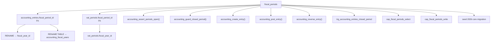

# CAB Accounting — FASE 4 Pre-Audit (Periodi contabili)

**Date:** 2026-09-10  
**Scope:** Read-only inventory before FASE 4 migration  
**Gate:** Migration `20270111120000` eseguita solo dopo approvazione dependency graph

---

## 1. Stato attuale

### 1.1 Tabelle periodo (FASE 3)

| Tabella | Granularità | Status | FK inbound |
|---------|-------------|--------|------------|
| `fiscal_periods` | Annuale `(company_id, year)` | `open\|closed\|locked` | `accounting_entries.fiscal_period_id`, `vat_periods.fiscal_period_id` |
| `accounting_periods` | Annuale parallela | `open\|closed\|locked` | `accounting_entries.accounting_period_id` |

Seed: esercizio 2026 `open` per company default.

### 1.2 Entry

- `fiscal_period_id`, `accounting_period_id`: **nullable** → guard saltati
- `fiscal_year` integer: impostato solo al post
- Storno: `reverses_entry_id`, `reversed_by_entry_id`, `entry_origin = 'reversed'`
- Immutabilità posted parziale (trigger esistenti)

### 1.3 RPC esistenti

`accounting_create_entry`, `update_entry`, `get_entry`, `list_entries`, `post_entry`, `cancel_entry`, `reverse_entry`, `accounting_rbac_can`

**Assenti:** resolve period, open/close/lock periodo, close esercizio, adjustment, audit events

### 1.4 Bypass identificati

| # | Bypass | Rischio |
|---|--------|---------|
| B1 | `accounting_rbac_can`: `admin` → `return true` | Admin bypassa tutti i check RBAC |
| B2 | RLS `contabilita.admin` write diretto su `fiscal_periods`/`accounting_periods` | Chiusura periodo senza audit |
| B3 | FK periodo nullable | Guard `accounting_guard_closed_period` no-op |
| B4 | Client può passare `fiscal_period_id` in payload | Periodo scelto dal client |
| B5 | `accounting_reverse_entry` usa `current_date` | Data contabile non deterministica |
| B6 | Storno eredita period FK originali | Fallimento o posting in periodo chiuso |

### 1.5 App layer

- [`lib/accounting/accounting-engine.server.ts`](../lib/accounting/accounting-engine.server.ts): wrapper RPC, 0 consumer
- UI: [`fatturazione-contabilita-section.tsx`](../../components/fatturazione/sections/fatturazione-contabilita-section.tsx) — solo read + CSV

---

## 2. Dependency graph — `fiscal_periods`



### Ordine migration pianificato

1. `CREATE OR REPLACE` funzioni che useranno `accounting_fiscal_years` (in migration FASE 4)
2. `DROP FK` `accounting_entries.fiscal_period_id`, `vat_periods.fiscal_period_id`
3. `ALTER TABLE fiscal_periods RENAME TO accounting_fiscal_years`
4. Evolvi colonne esercizio (audit, status uppercase)
5. `ALTER TABLE accounting_entries RENAME COLUMN fiscal_period_id TO fiscal_year_id`
6. Ricrea FK `fiscal_year_id → accounting_fiscal_years`
7. `vat_periods`: rename colonna + ricrea FK
8. Drop/ricrea `accounting_periods` (mensile)
9. Backfill 12 periodi + entry FK
10. `NOT NULL` su `fiscal_year_id`, `period_id`
11. Drop RLS write su periodi; REVOKE direct write

---

## 3. Dependency graph — `accounting_periods` (annuale → mensile)

| Oggetto | Azione |
|---------|--------|
| `accounting_entries.accounting_period_id` | RENAME → `period_id`, FK nuova tabella mensile |
| `accounting_assert_periods_open` | Sostituito da `accounting_resolve_period` |
| `accounting_guard_closed_period` | Aggiornato per `period_id` + resolve |
| RLS `cap_accounting_periods_*` | Ricreate su nuova tabella |
| Seed annuale 2026 | Sostituito da 12 periodi mensili |

---

## 4. Strutture riutilizzabili

- `SET LOCAL accounting.write_ssot` + trigger `accounting_guard_write_ssot`
- Pattern `accounting_journal_sequences` + `FOR UPDATE` numbering
- `reverses_entry_id` / `reversed_by_entry_id` (mantenere nomi)
- Deferred balance trigger
- Manifest RPC + REVOKE su entries

---

## 5. Gap vs FASE 4

| Requisito | Stato |
|-----------|-------|
| `accounting_fiscal_years` | Da rename `fiscal_periods` |
| 12 periodi mensili obbligatori | Da creare |
| `accounting_resolve_period` | Da creare |
| FK NOT NULL su draft | Da implementare post-backfill |
| `p_reversal_date` esplicita | Da aggiungere a reverse RPC |
| `corrects_entry_id` / adjustment | Da aggiungere |
| Period close/lock RPC | Da creare |
| `accounting_audit_events` | Da creare |
| Admin bypass | Da rimuovere |
| UI periodi/storno | Da creare |

---

## 6. Query audit pre-backfill

```sql
-- Entry senza periodo
SELECT id, competence_date, fiscal_period_id, accounting_period_id
FROM accounting_entries
WHERE fiscal_period_id IS NULL OR accounting_period_id IS NULL;

-- Entry con date fuori esercizio seed
SELECT e.id, e.competence_date, fp.start_date, fp.end_date
FROM accounting_entries e
LEFT JOIN fiscal_periods fp ON fp.id = e.fiscal_period_id
WHERE e.competence_date IS NOT NULL
  AND (fp.id IS NULL OR e.competence_date < fp.start_date OR e.competence_date > fp.end_date);

-- Esercizi senza 12 periodi (post-migration check)
SELECT fy.id, fy.year, count(ap.id) AS period_count
FROM accounting_fiscal_years fy
LEFT JOIN accounting_periods ap ON ap.fiscal_year_id = fy.id
GROUP BY fy.id, fy.year
HAVING count(ap.id) <> 12;
```

---

## 7. Rischi

- `vat_periods.fiscal_period_id` rename richiede migration coordinata
- Entry legacy senza `journal_id` possono bloccare post (pre-esistente FASE 3)
- `btree_gist` extension su Supabase hosted — verificare disponibilità

---

## 8. Piano modifica

Vedi migration `20270111120000`–`20270111120200` e documentazione FASE 28.

**Approvazione dependency graph:** COMPLETO — procedere con migration dependency-safe.
