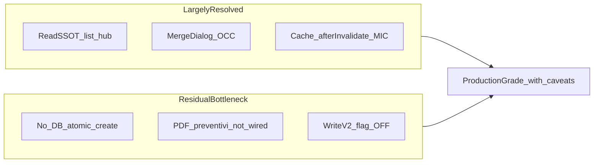
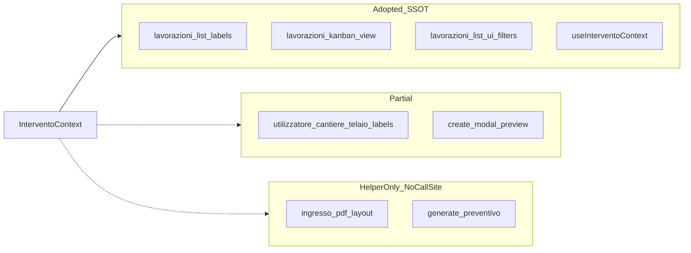

# Architecture Audit — Post Hardening

**Data:** 2026-06-12  
**Auditor role:** Principal Software Architect (review esterno)  
**Scope:** dominio Mezzi / Scheda ingresso / Lavorazioni — post Domain Consistency Layer + Write Consistency & Cache Hardening  
**Metodo:** verifica codice reale (call site, production path, feature flags), non solo documentazione.

**Documenti correlati:**

- [`mezzi-schede-ingresso-dataflow-audit.md`](mezzi-schede-ingresso-dataflow-audit.md) — dataflow storico e dettaglio flussi
- [`architecture-intervento-write-v2.md`](architecture-intervento-write-v2.md) — riferimento implementativo write v2 (con note doc drift sotto)

**Correzione critica vs contesto implementativo:** gli helper `buildIngressoAnagraficaPdfSectionsFromContext` e `anagraficaFromInterventoContext` **esistono** ma hanno **zero call site** in produzione. Il PDF e i preventivi non sono ancora context-based nel path live.

---

# Executive Summary

Il gestionale ha attraversato un hardening significativo: read model canonico (`InterventoContext`), orchestrazione write client, merge UX per concorrenza scheda, invalidazione cache mezzo→schede, e scaffold Write Contract v2 con saga + ledger.

**Verdict operativo:** il sistema è **production-grade con riserve documentate** per uso single-tenant / team piccolo con concorrenza moderata. Non è ancora **enterprise-grade** per multi-utente concorrente intensivo senza completare rollout write v2 e atomicità DB.

**P0 attuali:** nessuno. L'ex-P0 concurrency (OCC senza merge UX) è mitigato.

**Tre colli di bottiglia reali residui:**

1. **Atomicità DB assente** su create intervento — tre write client separate (mezzo → lavorazione → scheda).
2. **Export PDF/preventivi non allineati** al read SSOT adottato in lista/kanban/hub — helper pronti, wiring mancante.
3. **Write path dual v1/v2 non rollout** — flag `INTERVENTO_WRITE_V2` default OFF; edit bypassa saga e usa `syncIngressoAfterSave` diretto dopo persist scheda.

**Cosa non è più un problema:**

- Read multi-source caotico su surface principali (lista, kanban, hub).
- Cache schede stale post-invalidate (policy `afterInvalidate` default ON).
- Concorrenza scheda senza UX su edit path.
- MIC mezzo→schede assente su mutazioni singole con `mezzoId`.

---

# Architecture Score

## **7.5 / 10**

| Dimensione | Score | Note |
|------------|-------|------|
| Domain consistency (read) | 8.5 | SSOT su ~85% surface; export e alcune label parziali |
| Domain consistency (write) | 6.5 | Orchestrato ma non atomico; edit ordering scheda-first |
| Cache / RQ ownership | 8.0 | Hardened; residui LOW cross-tab e localStorage |
| Concurrency | 8.0 | Merge dialog edit; create senza merge UX |
| Transactional integrity | 5.5 | Nessuna transazione DB; partial create mitigato |
| Observability | 5.0 | Audit dev-only |
| Maintainability | 7.5 | Domain layer chiaro; leakage in `lavorazioni-view.tsx` |
| Scalability (multi-user) | 6.0 | Richiede NA-2/NA-3 per carico concorrente alto |

**Penalità applicate rispetto a score ottimistico 8/10:**

- −0.5 Write v2 + ledger non esercitati in produzione (flag OFF)
- −0.5 PDF/preventivi helper non wired
- −0.5 Edit path v1 scheda-first; W3/W5 attivi
- −0.5 RPC atomico stub, mai integrato

---

# What Improved

| Area | Prima | Dopo | Evidenza codice |
|------|-------|------|-----------------|
| Read SSOT | Regole diverse per lista/hub/lookup | `InterventoContext` + `resolveInterventoDisplay` | `lib/domain/intervento-context/`, `lavorazioni-list-row-labels.ts` |
| Copy last scheda | Due entry point scollegati | `copyLastSchedaIngresso` con mode `merge-empty` / `full-snapshot` | `lib/domain/scheda-ingresso/copy-last-scheda.ts` |
| Resolve mezzo | Inline in upsert | `resolveMezzoFromScheda` — ident > preferredMezzoId | `lib/domain/mezzo/resolve-mezzo-from-scheda.ts` |
| Concurrency UX | Ultimo writer, OCC opaco | `SchedaConcurrencyMergeDialog` + typed result | `scheda-concurrency-merge-dialog.tsx`, `schede-sync-adapter.ts` |
| Cache post-invalidate | skip-if-present | `markSchedeEnsureAfterInvalidate` default ON | `schede-ensure-options.ts`, `invalidate-targets.ts` |
| MIC mezzo→schede | Non invalidava bundle | `refreshSchedeBundlesForMezzoId` | `invalidate-related.ts`, `schede-bundle-cache-patch.ts` |
| Soft delete bundle | Slice RQ orfana | `evictSchedeBundleForLavorazioneId` | `evict-lavorazione-domain-cache.ts` |
| FK sync mezzo_id | Solo se FK vuoto (storico) | Patch se `resolved !== currentFk` | `write-contract.ts` L201–202 |
| Create UX gate | Nessun warning | Toast se `meta.mezzoId` ≠ resolved | `lavorazione-create-modal.tsx` |
| Write orchestration | Sparso in modal/view | `createInterventoTransaction` + `executeInterventoWrite` entry | `write-contract.ts`, `write-contract-v2.ts` |
| Background persist race | Possibile overlap submit | `submitLock` guard | `schede-lavorazione-modal.tsx` |

---

# Remaining Risks

Panoramica dei rischi ancora materiali, ordinati per impatto business × probabilità.

| Cluster | Severità max | Probabilità | Impatto business |
|---------|--------------|-------------|------------------|
| Partial create / non-atomic write | P1 | Media (rete instabile) | Lavorazione senza scheda; retry manuale |
| Edit scheda-before-sync drift | P1 | Media | Scheda salvata, mezzo/FK non aggiornati |
| Export ≠ UI SSOT | P1 | Media (dopo edit mezzo) | PDF/preventivo con anagrafica diversa da lista |
| Write v2 non validato | P1 | Bassa oggi / Alta se rollout frettoloso | Saga/ledger non testati in prod |
| Observability assente | P1 | Bassa | Drift invisibile fino a segnalazione utente |
| Cache edge cases | P2–P3 | Bassa | UI stale temporanea |
| Dead code / doc drift | P2 | — | Confusione manutenzione |

---

# P0 Issues

**Nessun P0 identificato.**

L'ex-P0-4 (concorrenza scheda senza merge UX) è **mitigato** tramite `PersistSchedeResult` con `kind: "concurrency"` e `SchedaConcurrencyMergeDialog` nel path edit (`lavorazioni-view.tsx`).

Residuo LOW: doppio conflict se utente sceglie "mantieni mie" mentre il server avanza di nuovo — non classificabile P0.

---

# P1 Issues

## ARCH-001 — Create intervento non atomico (partial create)

| Campo | Valore |
|-------|--------|
| **Severità** | P1 |
| **Probabilità** | Media (timeout/rete instabile) |
| **Impatto** | Medio |

**File coinvolti:** `lib/domain/intervento-context/write-contract.ts`, `components/gestionale/lavorazioni/lavorazione-create-modal.tsx`, `src/services/intervento-write.service.ts`

**Root cause:** tre operazioni Supabase separate (upsert mezzo → INSERT lavorazione → INSERT scheda) senza transazione DB. RPC `create_intervento_atomic` è stub e non chiamato.

**Scenario riproduzione:** create lavorazione; rete cade dopo INSERT `lavorazioni` e prima di `persistSchedeStore` → lavorazione esiste senza scheda ingresso.

**Rischio business:** intervento incompleto in lista; operatore deve riaprire modal e ritentare (mitigato da `createdLavorazioneIdRef` in-sessione).

**Soluzione consigliata:** NA-3 — implementare RPC atomico dopo validazione saga in staging (NA-2).

**Complessità:** Alta | **ROI:** Medio-Alto | **Classificazione:** **SHOULD DO** (post NA-2)

---

## ARCH-002 — Write v2 flag OFF; saga/ledger non esercitati

| Campo | Valore |
|-------|--------|
| **Severità** | P1 |
| **Probabilità** | Bassa oggi; Alta se abilitato senza staging |
| **Impatto** | Medio |

**File coinvolti:** `lib/domain/intervento-context/intervento-write-flags.ts`, `intervento-write-saga.ts`, `intervento-write-ledger.ts`

**Root cause:** `NEXT_PUBLIC_INTERVENTO_WRITE_V2` default OFF (`!== "1"`). `executeInterventoWrite` delega a v1 `createInterventoTransaction`.

**Scenario riproduzione:** produzione usa sempre v1; ledger idempotency e stage saga mai validati con traffico reale.

**Rischio business:** benefici v2 (idempotency create, FK sync edit unificato) non disponibili; rischio regressioni se rollout improvviso.

**Soluzione consigliata:** NA-2 — abilitare in staging, test saga + ledger, poi rollout graduale.

**Complessità:** Media | **ROI:** Alto | **Classificazione:** **SHOULD DO**

---

## ARCH-003 — Edit: scheda persist prima di sync mezzo/FK (W3)

| Campo | Valore |
|-------|--------|
| **Severità** | P1 |
| **Probabilità** | Media |
| **Impatto** | Medio |

**File coinvolti:** `components/lavorazioni/schede/schede-lavorazione-modal.tsx`, `components/gestionale/lavorazioni/lavorazioni-view.tsx` (`syncIngressoToBackend` → `syncIngressoAfterSave`)

**Root cause:** ordering intenzionale scheda-first: `persistSchedeBundle` completa prima di `onIngressoCommitted` → sync mezzo. Se sync fallisce, scheda è già in DB.

**Scenario riproduzione:** salva scheda ingresso con nuovo ident; `upsertMezzoFromSchedaIngresso` fallisce (rete/permessi) → toast warning, scheda aggiornata, mezzo/FK stale.

**Rischio business:** drift scheda↔mezzo↔FK; display hub mostra scheda (corretto per SSOT read) ma catalogo mezzi e FK lavorazione non allineati.

**Soluzione consigliata:** NA-4 — unificare edit via `executeInterventoWrite`; valutare rollback scheda su sync fail o retry esplicito.

**Complessità:** Media | **ROI:** Alto | **Classificazione:** **SHOULD DO**

---

## ARCH-004 — Stale row snapshot in sync edit (W5)

| Campo | Valore |
|-------|--------|
| **Severità** | P1 |
| **Probabilità** | Bassa |
| **Impatto** | Medio |

**File coinvolti:** `lavorazioni-view.tsx` (callback `onIngressoCommitted` passa `schedeRow.row`)

**Root cause:** `syncIngressoAfterSave` confronta `note`, `data_ingresso`, `mezzo_id` contro row snapshot catturato all'apertura hub, non refetch post-list-invalidate.

**Scenario riproduzione:** tab A modifica note lavorazione; tab B salva scheda → sync usa row stale → patch `note`/`mezzo_id` omessa o sovrascrive valore recente.

**Rischio business:** campi lavorazione non sincronizzati con ultimo stato scheda.

**Soluzione consigliata:** NA-4 + refetch row prima di sync, o passare row fresca da query cache.

**Complessità:** Media | **ROI:** Alto (con NA-4) | **Classificazione:** **SHOULD DO**

---

## ARCH-005 — PDF/preventivi non wired a read SSOT

| Campo | Valore |
|-------|--------|
| **Severità** | P1 |
| **Probabilità** | Media (dopo edit mezzo senza re-save scheda) |
| **Impatto** | Medio |

**File coinvolti:** `lib/pdf/ingresso-pdf-layout.ts`, `lib/schede/schede-pdf-generate.ts`, `lib/preventivi/generate-preventivo-from-lavorazione.ts`, `lib/pdf/anagrafica-pdf-fields.ts`, `lib/preventivi/preventivo-anagrafica-map.ts`

**Root cause:** PDF usa `buildIngressoPdfSections(scheda.campi)` su snapshot persistito. Preventivi usa `mergeAnagraficaPreventivo(ing, mezzo, lav)` legacy. Helper context (`buildIngressoAnagraficaPdfSectionsFromContext`, `anagraficaFromInterventoContext`) hanno zero call site.

**Scenario riproduzione:** operatore aggiorna mezzo in catalogo; lista/hub mostrano valore da `resolveInterventoDisplay` (scheda > lav > mezzo); PDF ingresso stampa solo snapshot scheda obsoleto.

**Rischio business:** documenti ufficiali (PDF/preventivo) discordanti da UI operativa — rischio compliance e fiducia utente.

**Soluzione consigliata:** NA-1 — wire helper esistenti in `schede-pdf-generate.ts` e `generate-preventivo-from-lavorazione.ts`.

**Complessità:** Bassa (1–2 giorni) | **ROI:** Alto | **Classificazione:** **SHOULD DO**

---

## ARCH-006 — Observability solo development

| Campo | Valore |
|-------|--------|
| **Severità** | P1 |
| **Probabilità** | Bassa (drift silenzioso) |
| **Impatto** | Basso–Medio |

**File coinvolti:** `lib/domain/intervento-context/intervento-audit.ts`

**Root cause:** `auditInterventoContext` attivo solo in dev o con `localStorage.INTERVENTO_AUDIT=1`. Nessun structured log in produzione.

**Scenario riproduzione:** mismatch ident/mezzo in produzione; nessun trail oltre `log_modifiche` parziale.

**Rischio business:** debug lento su segnalazioni utente; difficile correlare write path.

**Soluzione consigliata:** NA-5 — sampling structured log da payload audit (senza PII eccessiva).

**Complessità:** Media | **ROI:** Medio | **Classificazione:** **NICE TO HAVE**

---

# P2 Issues

## ARCH-007 — RPC `create_intervento_atomic` stub, mai chiamato

| Campo | Valore |
|-------|--------|
| **Severità** | P2 |
| **Probabilità** | — |
| **Impatto** | Basso (fino a NA-3) |

**File:** `src/services/intervento-write.service.ts` — zero import nel codebase.

**Root cause:** scaffold preparatorio; non integrato in `executeInterventoWrite`.

**Soluzione:** NA-3 dopo NA-2. **Classificazione:** **SHOULD DO** (fase 2)

---

## ARCH-008 — `linkedOperationalTables` in MIC registry non consumato

| Campo | Valore |
|-------|--------|
| **Severità** | P2 |
| **Probabilità** | Bassa |
| **Impatto** | Basso |

**File:** `lib/cache/mic-registry.ts` L32 (`linkedOperationalTables: ["scheda_lavorazione"]`); `minimal-invalidation-contract.ts` non legge il campo.

**Root cause:** config dead; refresh bundle avviene solo via chiamata esplicita in `invalidateAfterMezzoMutations`.

**Soluzione:** implementare in MIC contract oppure rimuovere config morta. **Classificazione:** **NICE TO HAVE**

---

## ARCH-009 — Bulk mezzo invalidate senza `mezzoId`

| Campo | Valore |
|-------|--------|
| **Severità** | P2 |
| **Probabilità** | Bassa |
| **Impatto** | Basso |

**File:** `invalidate-related.ts` L55–56 — path senza `mezzoId` chiama solo `invalidateOperationalTruth(domain: "mezzi")`, no `refreshSchedeBundlesForMezzoId`.

**Scenario:** batch rename settings → invalidate mezzi globale → bundle schede non refreshed fino a prossimo ensure.

**Soluzione:** audit call site bulk invalidate; aggiungere refresh se necessario. **Classificazione:** **NICE TO HAVE**

---

## ARCH-010 — Righe DB `scheda_lavorazione` orfane su soft delete

| Campo | Valore |
|-------|--------|
| **Severità** | P2 |
| **Probabilità** | — (by design) |
| **Impatto** | Basso |

**File:** `evict-lavorazione-domain-cache.ts`, `lavorazioni.service.ts`

**Root cause:** soft delete marca `lavorazioni.deleted_at`; RQ slice evicted; righe scheda restano in DB.

**Rischio business:** storage DB; nessun impatto UI se evict funziona.

**Soluzione:** documentare; eventuale job cleanup — **non prioritario**. **Classificazione:** **DO NOT DO** cascade automatico (rischio perdita dati audit)

---

## ARCH-011 — `onSaveMezzo` unwired

| Campo | Valore |
|-------|--------|
| **Severità** | P2 |
| **Probabilità** | — |
| **Impatto** | Basso |

**File:** `components/gestionale/schede/scheda-ingresso-anagrafica-fields.tsx` — prop esiste, nessun caller.

**Soluzione:** wire o rimuovere bottone. **Classificazione:** **NICE TO HAVE**

---

## ARCH-012 — `lavorazione-edit-modal` non migrato a context

| Campo | Valore |
|-------|--------|
| **Severità** | P2 |
| **Probabilità** | Bassa |
| **Impatto** | Basso |

**File:** `components/gestionale/lavorazioni/lavorazione-edit-modal.tsx` — update subset mezzo diretto.

**Soluzione:** migrare a `resolveInterventoDisplay` se si unifica UX edit. **Classificazione:** **NICE TO HAVE**

---

# P3 Issues

## ARCH-013 — Cross-tab passive tab stale

**Probabilità:** Bassa | **Impatto:** Basso  
**File:** nessun `schede_bundle_revision_bump` broadcast  
**Soluzione:** NA-6 | **Classificazione:** **NICE TO HAVE**

## ARCH-014 — localStorage LRU non sync con MIC

**Probabilità:** Bassa | **Impatto:** Basso  
**File:** `lib/schede/lavorazioni-schede-storage.ts` — TTL 30gg, max 150 bundle; RQ è SSOT sessione  
**Soluzione:** accettabile; opzionale invalidate LRU on MIC | **NICE TO HAVE**

## ARCH-015 — List labels parziali vs SSOT

**Probabilità:** Bassa | **Impatto:** Basso  
**File:** `lavorazioni-list-row-labels.ts` L32–39, L86–90 — `utilizzatore`, `cantiere`, `telaio` non usano `resolveInterventoDisplay`  
**Soluzione:** allineare 3 helper a context | **NICE TO HAVE**

## ARCH-016 — Create senza merge dialog OCC

**Probabilità:** Bassa | **Impatto:** Basso  
**File:** `lavorazione-create-modal.tsx` usa `persistSchedeStore`, non loop merge come edit  
**Soluzione:** estendere merge UX a create se concorrenza su nuova scheda diventa frequente | **NICE TO HAVE**

## ARCH-017 — Partial create state perso su close/reopen modal

**Probabilità:** Bassa | **Impatto:** Basso  
**File:** `lavorazione-create-modal.tsx` L264 — `createdLavorazioneIdRef` azzerato su reopen  
**Scenario:** utente chiude modal dopo partial success, riapre → può creare seconda lavorazione  
**Soluzione:** persistere `lavorazioneId` in sessionStorage o mostrare resume dialog | **NICE TO HAVE**

## ARCH-018 — Reconciliation scheda↔mezzo forward-only (E11)

**Classificazione:** **DO NOT DO** — comportamento by design, non bug. Edit catalogo non propaga a schede esistenti; display SSOT su scheda.

---

# Domain Consistency Review

## Comportamento attuale

- **Read model:** `InterventoContext` composto da scheda + lavorazione + mezzo. Precedence: **scheda (campi presenti) > lavorazione legacy > mezzo**.
- **Write model:** tripartito su tre tabelle + cache derivata. Forward reconciliation scheda → mezzo on save; backward (mezzo → scheda) solo manuale.

## Valutazione

| Aspetto | Corretto? | Note |
|---------|-----------|------|
| Read precedence | Sì | Coerente con business (snapshot accettazione) |
| Write tripartito | Sì (by design) | Non è mancanza SSOT |
| Domain boundaries `lib/domain/` | Sì | Tipi, build, display, write ben separati |
| Leakage orchestrazione | Parziale | `lavorazioni-view.tsx` concentra persist + concurrency + sync |
| Doc drift | No | `architecture-intervento-write-v2.md` §5 claim "unica fonte pdf/preventivo" — **impreciso** |

## Doc drift da correggere (solo documentazione)

- `architecture-intervento-write-v2.md` §5: surface pdf/preventivo/draft non adottate in produzione
- Saga types definiscono stage `resolve`/`finalize` non implementati in `intervento-write-saga.ts`
- Edit `persist-scheda` resta in modal, non in saga come suggerisce doc §2 stage order edit

---

# Write Path Review

## Production default (flag OFF)

```mermaid
flowchart TD
  subgraph createPath [Create_Default]
    CreateModal[LavorazioneCreateModal] --> executeWrite[executeInterventoWrite]
    executeWrite -->|V2_flag_OFF| v1Create[createInterventoTransaction]
    v1Create --> upsertMezzo[upsertMezzoFromScheda]
    upsertMezzo --> createLav[INSERT_lavorazioni]
    createLav --> persistScheda[persistSchedeStore]
  end
  subgraph editPath [Edit_Default]
    SchedeModal[SchedeLavorazioneModal] --> persistBundle[persistSchedeBundle_OCC_merge]
    persistBundle --> onCommitted[onIngressoCommitted]
    onCommitted --> syncBackend[syncIngressoToBackend]
    syncBackend --> syncIngresso[syncIngressoAfterSave]
  end
  rpcStub[createInterventoAtomic_stub] -.->|never_called| unused[unused]
```

## Valutazione per criterio

| Criterio | Stato | Severità residua |
|----------|-------|------------------|
| Coerenza logica stage | Adeguata | — |
| Integrità transazionale | Assente lato DB | P1 ARCH-001 |
| Atomicità | No | P1 |
| Idempotency create | Solo con v2 ON | P1 ARCH-002 |
| Ordering edit | Scheda-first | P1 ARCH-003 |
| FK sync mezzo_id | Patch se resolved ≠ FK (v1 attivo) | Mitigato |
| Failure handling partial create | Retry in-session | Mitigato; perso on reopen P3 |

**Corretto:** orchestrazione client esplicita, stage naming, retry `existingLavorazioneId`.

**Non corretto per integrità forte:** assenza transazione; edit sync non rollback scheda su failure.

---

# Read Path Review

## Adozione surface

| Surface | Stato | File |
|---------|-------|------|
| Lista macchina/cliente/ident | Adottato | `lavorazioni-list-row-labels.ts` |
| Kanban + filtri search | Adottato | `lavorazioni-kanban-view.tsx`, `lavorazioni-list-ui-filters.ts` |
| Hub schede | Adottato | `use-intervento-context.ts` |
| Utilizzatore/cantiere/telaio lista | Parziale | `lavorazioni-list-row-labels.ts` L32–39, L86–90 |
| PDF ingresso | Non wired | `ingresso-pdf-layout.ts` → raw `scheda.campi` |
| Preventivo da lavorazione | Legacy merge | `generate-preventivo-from-lavorazione.ts` L35 |
| Create draft preview | Parziale | warning mezzoId sì; no `composeInterventoContextFromDraft` |
| `lavorazione-edit-modal` | Non migrato | subset mezzo diretto |

**Corretto** dove adottato. **Rischio reale** solo su export e label secondarie.

---

# Cache Review

## React Query ownership

- **SSOT sessione:** `SCHEde_BUNDLES_QUERY_KEY` con `staleTime: Infinity` — corretto per UX editing.
- **Disciplina invalidation:** hardened post-invalidate + MIC — corretto.

## Cosa è fixato

| Meccanismo | File | Valutazione |
|------------|------|-------------|
| `afterInvalidate` force refetch | `schede-ensure-options.ts` | Corretto |
| `_revision` / `_fetchedAt` meta | `types/schede.ts` | Corretto |
| Surgical patch singola scheda | `schede-bundle-cache-patch.ts` | Corretto |
| Mezzo → refresh bundles | `invalidate-related.ts` L52 | Corretto (con mezzoId) |
| Soft delete evict slice | `evict-lavorazione-domain-cache.ts` | Corretto |

## Residui stale-risk

| Path | Severità | Probabilità |
|------|----------|-------------|
| `void refreshSchedeBundlesForMezzoId` fire-and-forget | P3 race | Bassa |
| Cross-tab senza broadcast | P3 | Bassa |
| localStorage LRU vs RQ | P3 | Bassa |
| Bulk mezzo invalidate no mezzoId | P2 | Bassa |

**Nessun corruption path** identificato — solo stale temporaneo UI.

---

# Concurrency Review

## Comportamento attuale

1. OCC su `scheda_lavorazione.updated_at` (`schede.service.update` → `PGRST116`)
2. Adapter typed: `{ ok: false, kind: "concurrency", serverBundle, clientBundle }`
3. UI: `SchedaConcurrencyMergeDialog` — server / merge-fields / keep-client / cancel
4. Retry loop max 4 tentativi (`lavorazioni-view.tsx`)
5. `submitLock` defer background persist (`schede-lavorazione-modal.tsx`)

## Valutazione

| Scenario | Corretto? | Rischio |
|----------|-----------|---------|
| Edit concorrente stessa scheda | Sì | LOW residuo doppio conflict |
| Background vs submit | Sì | Improbabile |
| Create concorrente | Parziale | No merge UX su create |
| Concurrent mezzo INSERT stesso ident | Parziale | DB unique constraint dipendente da schema |

**Corretto** per uso operativo tipico. **Non enterprise** senza test e2e merge dialog.

---

# Performance Review

## Comportamento attuale

- `ensureSchedeBundlesInCache`: skip-if-present evitato post-invalidate — evita refetch storm inutile solo quando non invalidato.
- `refreshSchedeBundlesForMezzoId`: batch fetch per tutte le lavorazioni del mezzo — O(N) lavorazioni per mezzo.
- Bundle store: `JSON.stringify` per revision fingerprint in lista — accettabile per bundle size tipico.
- localStorage LRU: max 150 bundle, TTL 30 giorni — bounded.

## Memory leak

**Nessun memory leak significativo identificato.**

- Ledger `sessionStorage` bounded per chiave idempotency
- RQ cache gestita da evict su soft delete
- Listener merge dialog: cleanup on close (verificare in code review futura — rischio P3 basso)

## Race fire-and-forget

`void refreshSchedeBundlesForMezzoId` può completare dopo ensure concorrente — risultato eventual consistency, non corruption.

---

# Scalability Review

| Scenario | Adeguato? | Nota |
|----------|-----------|------|
| Single-tenant, team piccolo | Sì | Production-grade con riserve |
| Multi-utente stessa scheda | Parziale | Merge UX mitiga; serve NA-2/NA-3 per carico alto |
| Alto volume create | Parziale | Client saga + 3 round-trip; RPC futuro |
| Molte lavorazioni per mezzo | Monitorare | Batch refresh mezzo→schede lineare in N |
| Realtime multi-tab | Parziale | ARCH-013 |

**Scalabilità futura:** dipende da NA-3 (RPC) e osservabilità (NA-5) prima di scaling team.

---

# Technical Debt Review

| Debito | Tipo | Impatto manutenzione |
|--------|------|---------------------|
| Dual write v1/v2 + flag | Architetturale | Medio — due path da mantenere |
| Dead helpers PDF/preventivi | Codice morto | Medio — false sense of completion |
| `executeInterventoWrite` edit branch unused | Dead code | Basso |
| `linkedOperationalTables` unused | Config morta | Basso |
| `onSaveMezzo` unwired | UI dead | Basso |
| Doc drift write-v2.md | Documentazione | Medio — fuorvia review |
| Orchestrazione in `lavorazioni-view.tsx` | God-component tendency | Medio |

**Non proporre refactor globale** — ROI negativo. Chiudere debito incrementalmente via NA-1, NA-2, NA-4.

---

# Recommended Next Actions

| ID | Azione | Class | Costo impl | Rischio impl | Beneficio | ROI |
|----|--------|-------|------------|--------------|-----------|-----|
| **NA-1** | Wire PDF/preventivi a context helpers | **SHOULD DO** | Basso (1–2 gg) | Basso | Alto — parità export/UI | **Alto** |
| **NA-2** | `INTERVENTO_WRITE_V2=1` staging + test saga/ledger | **SHOULD DO** | Medio (3–5 gg) | Medio | Alto — valida path v2 | **Alto** |
| **NA-4** | Edit via `executeInterventoWrite` in `lavorazioni-view` | **SHOULD DO** | Medio (3–5 gg) | Medio | Alto — chiude W3/W5 | **Alto** |
| **NA-3** | RPC `create_intervento_atomic` | **SHOULD DO** (post NA-2) | Alto (1–2 sett) | Medio | Medio-Alto — integrità create | **Medio-Alto** |
| **NA-5** | Observability prod structured log | **NICE TO HAVE** | Medio | Basso | Medio — debug | Medio |
| **NA-6** | Cross-tab bundle revision broadcast | **NICE TO HAVE** | Medio | Basso | Basso — UX multi-tab | Basso |
| **NA-7** | `composeInterventoContextFromDraft` in create | **NICE TO HAVE** | Basso | Basso | Basso | Basso |
| — | Refactor globale domain | **DO NOT DO** | Alto | Alto | Basso | Negativo |
| — | Cascade delete schede su soft delete | **DO NOT DO** | Medio | Alto dati | Basso | Negativo |
| — | Abilitare v2 in prod senza staging | **DO NOT DO** | — | Alto | — | — |

**Ordine esecuzione consigliato:** NA-1 → NA-2 + NA-4 (parallelo in staging) → NA-3 → NA-5 → NA-6/NA-7.

---

# Things That Should NOT Be Changed

1. **Forward-only reconciliation scheda↔mezzo (E11)** — edit catalogo non deve propagare a schede storiche senza esplicita UX.
2. **Snapshot semantics `SchedaIngressoFields`** — ogni intervento conserva accettazione al momento ingresso.
3. **OCC su `updated_at` row-level** — funziona; merge UX è il complemento corretto.
4. **`copyLastSchedaIngresso` mode split** — `merge-empty` vs `full-snapshot` è intenzionale.
5. **RBAC entry points** — non alterare permessi come side-effect di consistency fix.
6. **Schema DB** — vincolo progetto; atomicità via RPC senza breaking schema.
7. **RQ `staleTime: Infinity` su bundles** — corretto con invalidation discipline attuale.

---

# Final Verdict

| Metrica | Valore |
|---------|--------|
| **Architecture score** | **7.5 / 10** |
| **Production-grade** | **Sì, con riserve** |
| **Enterprise-grade** | **No** — richiede NA-1, NA-2, NA-4, NA-3 |
| **P0** | Nessuno |
| **P1 aperti** | 6 (ARCH-001..006) |
| **Collo di bottiglia** | Atomicità DB create + export non wired + write v2 non rollout |

Il hardening ha risolto i problemi strutturali più gravi (read caotico, cache stale, concurrency senza UX). Il sistema è affidabile per l'uso operativo corrente. I gap residui sono **misurabili, bounded e addressable** senza refactor architetturale.

**Confronto triplo:**

| | Audit originale | Post-DCL | Post-hardening (questo doc) |
|--|-----------------|----------|----------------------------|
| Score | ~4–5 | 7 | **7.5** |
| Read | Caotico | ~70% | **~85%** |
| Write | Sparso | Orchestrato client | Orchestrato + v2 pronto, flag OFF |
| Cache | Stale frequente | Debole | **Hardened** |
| Concurrency | Ultimo writer | OCC no UX | **Merge UX** |

---

## Se fossi io il responsabile tecnico, le prossime 3 attività che farei sarebbero:

1. **NA-1 — Wire PDF/preventivi ai context helpers**  
   ROI altissimo, costo basso, rischio basso. Chiude ARCH-005 e allinea documenti ufficiali alla UI in giorni, non settimane.

2. **NA-2 + NA-4 — Staging write v2 + edit path unificato**  
   ROI alto. Valida saga/ledger in condizioni reali e chiude ARCH-003/004 (W3/W5) senza aspettare RPC.

3. **NA-3 — RPC `create_intervento_atomic`**  
   ROI medio-alto, costo alto. Da fare **dopo** NA-2, quando il contratto write è stabilizzato — unica via per integrità transazionale create senza breaking changes.

---

*Audit generato 2026-06-12. Verifica basata su codice in `lib/domain/intervento-context/`, `lavorazioni-view.tsx`, `lavorazione-create-modal.tsx`, `schede-bundle-cache-patch.ts`, `ingresso-pdf-layout.ts`, `generate-preventivo-from-lavorazione.ts`.*
