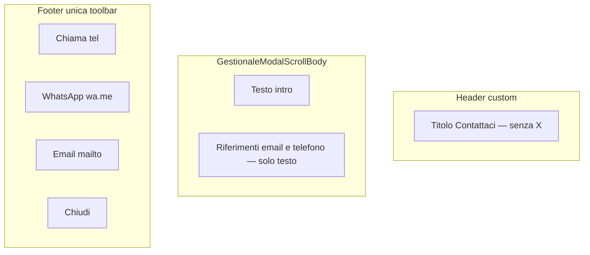

# Audit — Modal Contattaci (Portale Clienti)

**Data:** 2026-06-08  
**Scope:** [`client-contattaci-dialog.tsx`](../components/lavorazioni-clienti/client-contattaci-dialog.tsx)  
**SSOT contatti:** [`client-portal-contact.ts`](../lib/lavorazioni/client-portal-contact.ts)

---

## Struttura finale modal

| Zona | Contenuto |
|------|-----------|
| Header | Titolo accessibile (`client-contattaci-title`), **nessun** CloseButton |
| Corpo | Intro + email/telefono come testo (`
`), non link |
| Footer | Chiama (primary), WhatsApp, Email (anchor nativi), Chiudi (button) |

Chiusura: footer **Chiudi**, ESC, click overlay (shell invariata).

---

## Pulsanti rimossi / mantenuti

| Rimosso | Motivo |
|---------|--------|
| X in header (`CloseButton`) | Duplicava Chiudi |
| Link mailto inline nel body | Duplicava bottone Email |
| Link tel inline nel body | Duplicava bottone Chiama |
| Bottoni azione nel corpo scroll | Spostati nel footer |

| Mantenuto | Ruolo |
|-----------|--------|
| Chiama | `tel:+393480712791` |
| WhatsApp | `https://wa.me/393480712791` |
| Email | `mailto:service@autocompattatori.it` |
| Chiudi | Unico dismiss esplicito in UI |

---

## Coerenza UI

- Token design system: `dsLabel`, `dsBtnPrimary`, `dsBtnNeutral`, `dsModalFormFooter`, header tokens (`dsLavorazioniModalWindowHeader`, …)
- Testo muted: `var(--cab-text-muted)` / `var(--cab-text)`
- Touch: `min-h-11`, `touch-manipulation`, `w-full` su azioni footer
- Safe area iOS: `pb-[max(0.75rem,env(safe-area-inset-bottom))]` sul footer

---

## Verifica funzionamento link

### Telefono — `tel:+393480712791`

- Implementazione: `<a href={telHref}>` nativo, **nessun** `onClick`
- Desktop: apre app telefonia / handler OS
- Mobile: apre dialer

### WhatsApp — `https://wa.me/393480712791`

- Implementazione: `<a href={whatsappHref} target="_blank" rel="noopener noreferrer">`
- Mobile: app WhatsApp o fallback browser
- Desktop: WhatsApp Web o prompt app

### Email — `mailto:service@autocompattatori.it` (critico)

- Implementazione: `<a href={mailtoHref}>` nativo nel footer, **nessun** `preventDefault` / `onClick`
- Non intercettato da router SPA (anchor esterno al client routing)
- Desktop: client email predefinito
- Mobile iOS/Android: sheet app Mail / intent Gmail

---

## Test eseguiti

### Statici (gate)

| Test | Esito |
|------|-------|
| `lib/regression/client-portal-contattaci-audit.test.ts` | PASS |
| `npm run ci:tsc` | PASS |

### E2E

[`e2e/smoke/11-client-portal.spec.ts`](../e2e/smoke/11-client-portal.spec.ts):

- href tel / wa.me / mailto
- Testo email e telefono visibile
- Un solo bottone «Chiudi» nel dialog
- Chiusura via `smoke-contattaci-close`

### Manuale (checklist)

| Ambiente | Checklist |
|----------|-----------|
| Desktop Chrome/Edge | Chiama → app tel; Email → client mail; WhatsApp → wa.me |
| Desktop Safari | Idem mailto/tel |
| iOS Safari | Tap target ≥44px; Email → Mail; no popup block |
| Android Chrome | Dialer, mail intent, WhatsApp app |

*Esecuzione manuale browser: da fare in QA pre-release se non automatizzata.*

---

## Problemi trovati (pre-refactor)

1. Doppia chiusura: X header + Chiudi footer
2. Sei tap target per tre azioni (link body + bottoni body)
3. Classi `text-zinc-*` non allineate ai token CAB

## Correzioni applicate

1. Header custom senza `CloseButton`
2. Corpo solo informativo (testo, no link)
3. Toolbar unificata nel footer con anchor nativi
4. Test statico + assert E2E su singolo Chiudi
5. Safe-area padding footer mobile

---

## Rischi residui

1. **mailto su desktop senza client configurato** — comportamento OS, non mitigabile in SPA
2. **WhatsApp Web bloccato da popup** — mitigato con `target="_blank"` (navigazione utente, non `window.open`)
3. **ESC / overlay** chiudono ancora il modal mentre l’utente potrebbe voler completare un’azione — comportamento shell standard, invariato

---

## Regression scope

**Non impattato:** altri modal, `LavorazioniModalShell` globale, routing portale, valori `CLIENT_PORTAL_CONTACT`, RBAC.
