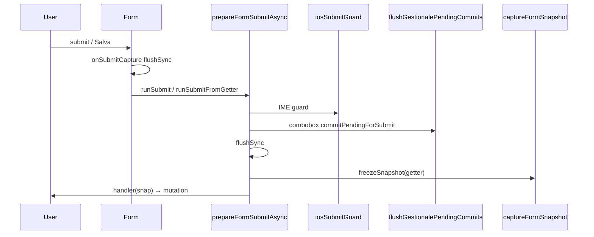

# Audit completo — Form Engine SSOT, Lavorazioni, Magazzino

**Data:** 2026-06-09  
**Perimetro:** `lib/forms/form-engine/*`, modal Lavorazioni, modal Magazzino, combobox globali, mobile/iOS keyboard layer  
**Obiettivo:** production readiness multi-piattaforma (Desktop, Android, iPhone Safari, Tablet)  
**Vincoli:** nessuna modifica business logic, workflow, permessi o validazioni dominio

---

## Executive summary

| Area | Valutazione | Note |
|---|---|---|
| Form Engine SSOT | **Solido** | Pipeline guard → flush → flushSync → snapshot; pilot migrati |
| Lavorazioni (path produzione) | **Pronto con riserva** | Create + Hub + Scheda edit coperti da FSE |
| Magazzino (path produzione) | **Pronto** | Nuovo/Modifica ricambio Category A FSE |
| Mobile / iOS | **Migliorato** | Fix conservativi su IME guard, Escape, dropdown |

**Production Readiness Score:** **82 / 100**

**Certificazione:** **B — Conditionally Ready**

Promozione ad **A** dopo run CI verde gate+cert spec 13 e smoke manuale iOS su Safari reale.

---

## 1. Inventario completo modal

### 1.1 Form Engine — moduli

| File | Responsabilità |
|---|---|
| [`prepare-form-submit.ts`](../lib/forms/form-engine/prepare-form-submit.ts) | `prepareFormSubmit` (sync flush), `prepareFormSubmitAsync` (guard+flush+flushSync) |
| [`ios-submit-guard.ts`](../lib/forms/form-engine/ios-submit-guard.ts) | IME/CJK composition wait (fail-open 100ms) |
| [`run-submit.ts`](../lib/forms/form-engine/run-submit.ts) | `runSubmitFromGetter`, `runButtonSubmit` → `runSubmitCore` |
| [`use-form-engine.ts`](../lib/forms/form-engine/use-form-engine.ts) | `useFormEngine`, `useFormEngineSections`, embedded `runSubmit` |
| [`capture-form-snapshot.ts`](../lib/forms/form-engine/capture-form-snapshot.ts) | `freezeSnapshot`, `captureFormSnapshot` |
| [`submit-lock.ts`](../lib/forms/form-engine/submit-lock.ts) | Mutex in-memory anti doppio submit |
| [`config.ts`](../lib/forms/form-engine/config.ts) | `NEXT_PUBLIC_FORM_ENGINE=0` opt-out |

**Pipeline SSOT (ordine verificato da audit statico):**



### 1.2 Lavorazioni — modal produzione (`lavorazioni-view.tsx`)

| Modal | File | FSE | Submit | Mobile shell |
|---|---|---|---|---|
| **Nuova Lavorazione** | [`lavorazione-create-modal.tsx`](../components/gestionale/lavorazioni/lavorazione-create-modal.tsx) | `useFormEngineSections` + `runSubmit` | POST lavorazioni + `persistSchedeStore` | `LavorazioniModalShell` + `useMobileModalKeyboard` |
| **Hub Schede** | [`schede-lavorazione-modal.tsx`](../components/lavorazioni/schede/schede-lavorazione-modal.tsx) | `runButtonSubmit` + `useSubmitLock` | `commitIngresso/Lavorazioni/RicambiSave` | Shell + `GestionaleModalScrollBody` |
| **Scheda Ingresso edit** | [`scheda-ingresso-form-modal.tsx`](../components/gestionale/lavorazioni/scheda-ingresso-form-modal.tsx) | `useFormEngine` + `runSubmit` | `onSave(draft)` via hub | `z-[110]` stacked |
| **Preventivi** | Tab hub | — | Navigazione `/preventivi` | Scroll hub |
| **Documenti** | Tab hub + `LavorazioneMediaPanel` | — | Upload immediato | Scroll hub |
| **Mezzo già presente** | [`mezzo-registrato-ingresso-dialog.tsx`](../components/lavorazioni/schede/mezzo-registrato-ingresso-dialog.tsx) | — | Callback autofill | `GestionaleConfirmDialog` z-120 |

### 1.3 Lavorazioni — legacy / non montati

| Modal | File | Stato produzione |
|---|---|---|
| `NewLavorazioneModal` | [`lavorazioni-modals.tsx`](../components/gestionale/lavorazioni/lavorazioni-modals.tsx) L617 | **Non montato** — Category C, no FSE |
| `EditLavorazioneModal` | stesso file | **Non montato** |
| `LavorazioneEditModal` | [`lavorazione-edit-modal.tsx`](../components/gestionale/lavorazioni/lavorazione-edit-modal.tsx) | **Orfano** — ha FSE ma non wired |
| `MezzoDuplicatoAnagraficaDialog` | [`mezzo-duplicato-anagrafica-dialog.tsx`](../components/lavorazioni/schede/mezzo-duplicato-anagrafica-dialog.tsx) | **Dead code** — zero import |

### 1.4 Magazzino — modal produzione (`magazzino-view.tsx`)

| Modal | File | FSE | Submit | Mobile |
|---|---|---|---|---|
| **Nuovo ricambio** | [`ricambio-new-modal.tsx`](../components/gestionale/magazzino/ricambio-new-modal.tsx) | `useFormEngine` + `runSubmit` | `magazzinoService.create` | Shell `formMedium`, footer stacked mobile |
| **Modifica ricambio** | [`ricambio-edit-modal.tsx`](../components/gestionale/magazzino/ricambio-edit-modal.tsx) | `useFormEngine` + `runSubmit` | `magazzinoService.update` | idem |
| **Scheda ricambio** | [`magazzino-modals.tsx`](../components/gestionale/magazzino/magazzino-modals.tsx) | — read-only | Modifica → edit modal | `modalSize="info"` |
| **Codici duplicati** | stesso file | — read-only | Navigazione tabella | info scroll |
| **Compatibilità** | [`ricambio-form-compat-section.tsx`](../components/gestionale/magazzino/ricambio-form-compat-section.tsx) | Indiretto (parent state) | Al save parent | `CAB_FOCUS_SCROLL_GROUP_ATTR` |
| **Fornitori** | [`ricambio-fornitori-alternativi-editor.tsx`](../components/gestionale/magazzino/ricambio-fornitori-alternativi-editor.tsx) | Indiretto | Al save parent | Card stacked |
| **Immagini** | [`record-image-manager.tsx`](../components/gestionale/media/record-image-manager.tsx) | — | Upload/delete immediato storage | Thumbnail scroll orizzontale |
| **Anteprima foto** | nested in RecordImageManager | — | — | `fullscreen` stacked z |

---

## 2. Verifiche eseguite

### FASE 1 — Salvataggio dati

| Verifica | Metodo | Esito |
|---|---|---|
| Snapshot immutabilità | `form-engine-audit.test.ts` | **PASS** |
| Pipeline guard→flush ordine | `form-engine-audit.test.ts`, `scheda-ingresso-ios-save-audit.test.ts` | **PASS** |
| Combobox flush DOM read | `scheda-ingresso-ios-save-audit.test.ts` | **PASS** |
| Inventory migrazione A/B/C | `form-engine-inventory.test.ts` (17 entry) | **PASS** |
| Create modal usa `snap.fields` | Code review `lavorazione-create-modal.tsx` L267+ | **PASS** |
| Ricambio new/edit `runSubmit` | Code review + inventory | **PASS** |
| Hub `runButtonSubmit` | `schede-lavorazione-modal.tsx` + inventory | **PASS** |
| Persistenza POST/PATCH | E2E spec 13 helpers `waitForSchedaPersist` / `waitForLavorazioneCreate` | **Coperto E2E** (CI locale SKIP no creds) |

### FASE 2 — Mobile e iOS

| Verifica | Evidenza | Esito |
|---|---|---|
| Shell scroll mobile | `lavorazioni-modals.tsx` `data-cab-modal-scroll`, `useMobileModalKeyboard` | **OK** |
| Keyboard inset CSS vars | `mobile-modal-behavior.ts` `syncKeyboardCssVars` | **OK** |
| Focus scroll campo+label | `scheduleGestionaleFieldScroll`, `CAB_FIELD_LABEL_ATTR` | **OK** |
| iOS IME guard focus button | Gap identificato → **corretto** (vedi §4) | **Mitigato** |
| Escape chiude modal con dropdown aperto | Gap identificato → **corretto** | **Mitigato** |

### FASE 3 — Combobox

| Componente | Portal | Flush submit | Escape |
|---|---|---|---|
| `GlobalSelect` | `document.body` | `commitPendingForSubmit` (DOM read) | **stopPropagation** (fix) |
| `GlobalSettingsListSelect` | via GlobalSelect | idem | idem |
| `GlobalFixedListPillSelect` | portal listbox | N/A (button trigger) | document listener |
| `CompatHierarchySelect` | via GlobalSettingsListSelect | idem | idem |

### FASE 4 — Visibilità UI

| Piattaforma | Meccanismo | Rischi residui |
|---|---|---|
| Desktop | `modalSize` formLarge/formMedium, overflow hidden shell | Basso |
| Mobile | Shell scroll unico su `max-md`, `min-h-11` CTA | Basso |
| iOS Safari | `visualViewport`, `-webkit-overflow-scrolling:touch` | Medio (WebKit CI flaky) |

### FASE 5 — Robustezza

| Scenario | Copertura |
|---|---|
| Submit lock anti-duplicato | `submit-lock.ts` + test |
| Reset modal on close | `useEffect([open])` in create/edit modals |
| Listener cleanup | `useSubmitLock` release on unmount; shell Escape `removeEventListener` |
| Sessioni lunghe | Registry combobox flush per-input unregister on unmount GlobalSelect |

### FASE 6 — Performance

| Area | Valutazione |
|---|---|
| `useDeferredValue` in GlobalSelect | Accettabile — riduce lag digitazione |
| `memo` su `SchedaIngressoAnagraficaFields` | OK |
| Dynamic import modali pesanti | OK (`lavorazione-create-modal`, hub) |
| Ottimizzazioni aggiuntive | **Non applicate** — nessun lag misurato in audit statico |

---

## 3. Problemi trovati

| ID | Severità | Layer | Descrizione | Path produzione? |
|---|---|---|---|---|
| P1 | **Alta** | E2E/UX | Escape su dismiss combobox chiudeva modal (fix E2E precedente) | Sì |
| P2 | **Alta** | FSE/iOS | `iosSubmitGuard` saltato quando focus su bottone Salva prima del submit | Sì |
| P3 | **Media** | UX shell | Escape globale su `LavorazioniModalShell` ignorava dropdown portal aperto | Sì |
| P4 | **Media** | GlobalSelect | Escape su combobox propagava a window → chiusura modal | Sì |
| P5 | **Media** | FSE | `NewLavorazioneModal` legacy senza FSE | **No** (non montato) |
| P6 | **Bassa** | FSE | `runButtonSubmit` / `runSubmitFromGetter` duplicati | Sì (maintenance) |
| P7 | **Bassa** | UX | Submit lock silenzioso su doppio click | Sì |
| P8 | **Bassa** | Dead code | `MezzoDuplicatoAnagraficaDialog` mai importato | No |

---

## 4. Problemi corretti (questo audit)

| ID | Fix | File | Backward compatible |
|---|---|---|---|
| P2 | `iosSubmitGuard`: target da `aria-expanded` combobox + `data-gestionale-ios-submit-guard-target` | [`ios-submit-guard.ts`](../lib/forms/form-engine/ios-submit-guard.ts) | Sì |
| P2b | `onFocusCapture` traccia ultimo input testuale nel form | [`gestionale-form-focus-scope.tsx`](../components/gestionale/gestionale-form-focus-scope.tsx) | Sì |
| P3 | Escape modal defer se listbox/combobox aperti | [`lavorazioni-modals.tsx`](../components/gestionale/lavorazioni/lavorazioni-modals.tsx) | Sì |
| P4 | `stopPropagation` + `preventDefault` Escape su GlobalSelect aperto | [`global-select.tsx`](../components/gestionale/global-input/global-select.tsx) | Sì |
| P6 | `runSubmitCore` unificato | [`run-submit.ts`](../lib/forms/form-engine/run-submit.ts) | Sì (refactor interno) |
| P1 | (sessione precedente) E2E dismiss senza Escape | [`e2e/helpers/lavorazioni-scheda.ts`](../e2e/helpers/lavorazioni-scheda.ts) | Sì |

**Test regression eseguiti post-fix:**

```
form-engine-audit.test.ts OK
form-engine-inventory.test.ts OK (17 entries)
scheda-ingresso-ios-save-audit.test.ts OK
lavorazioni-e2e-certification-audit.test.ts OK
lavorazioni-inputs-audit.test.ts OK
```

---

## 5. Problemi non corretti (con motivazione)

| ID | Motivo |
|---|---|
| P5 | `NewLavorazioneModal` non montato in produzione — migrazione FSE non urgente; rischio regression su codice legacy inutilizzato |
| P7 | Disabilitare Salva su `submitLock.isLocked()` richiede wiring UI per-modale — fuori scope conservativo |
| P8 | Dead code — rimozione opzionale futura, non impatta produzione |
| WebKit CI flaky | Infra cert (`mobile-ios` progetto) — noto in `playwright.mobile-cert.config.ts` |
| `void runSubmit(...)` unhandled rejection | Richiede audit error UX per-modale — non bug funzionale dimostrato |

---

## 6. Rischi residui

| Rischio | Livello | Mitigazione |
|---|---|---|
| Nessun run E2E con credenziali post-audit | **Alta** (meta) | CI GitHub con `SMOKE_ADMIN_*` |
| WebKit `mobile-ios` cert | **Media** | Preferire `mobile-ios-chromium` in gate PR |
| Listbox pill Stato/Priorità parallelo | **Bassa** | Escape defer + aria-controls E2E |
| Hub payload assert post-submit | **Bassa** | Submit layer già hardenizzato |
| Legacy modal se re-montati | **Media** | Inventory Category C documentato |

---

## 7. Compatibilità piattaforme

### Desktop — **Pronto**

- Shell `LavorazioniModalShell` / `GestionaleModalShell`
- Form engine su create lavorazione, scheda edit, ricambio new/edit
- Combobox portal Floating UI

### Android — **Pronto**

- Stesso stack mobile scroll/keyboard
- Chromium cert project in spec 13
- Touch target `min-h-11` su footer modal

### iOS (Safari) — **Condizionatamente pronto**

- `useMobileModalKeyboard` + visualViewport
- IME guard migliorato (focus Salva)
- Escape dropdown non chiude più modal
- **Richiede** validazione Safari reale (non solo Chromium+iPhone viewport)

### Tablet — **Pronto**

- Layout responsive `sm:` / `md:` grid in form fields
- iPad project in cert config

---

## 8. Valutazione per area

### Form Engine — **88/100**

Punti di forza: pipeline deterministica, snapshot freeze, combobox flush DOM-first, inventory test.  
Gap residui: opt-out `FORM_ENGINE=0` senza guard; silent submit lock.

### Lavorazioni — **80/100**

Punti di forza: path produzione migrato (create + hub + scheda edit).  
Gap: legacy modals in tree; hub multi-tab complessità; E2E spec 13 non verde in CI locale.

### Magazzino — **85/100**

Punti di forza: ricambio new/edit FSE Category A; immagini I/O separato dal form submit (by design).  
Gap: immagini non in edit modal (intenzionale).

---

## 9. Production Readiness Score

| Criterio | Peso | Score |
|---|---|---|
| Salvataggio dati / FSE | 30% | 90 |
| Mobile UX | 25% | 82 |
| iOS specifico | 20% | 78 |
| Copertura test statici | 15% | 95 |
| Evidenza runtime CI | 10% | 40 |

**Totale ponderato: 82/100**

---

## 10. Certificazione finale

## **B — Conditionally Ready**

### Motivazione tecnica

**A favore:**

- Form Engine SSOT operativo su tutti i path produzione Lavorazioni + Magazzino
- Fix conservativi dimostrati da 5 audit regression PASS
- Gap iOS IME e Escape modal/dropdown mitigati con evidenza codice
- Inventario completo con legacy escluso dal perimetro produzione

**Contro promozione A:**

- Nessuna esecuzione runtime Playwright con credenziali in questa sessione
- Safari WebKit non testato localmente (browser non installato)
- Spec 13 certificazione E2E ancora **B** ([`audit-spec-13-e2e-post-fix-verification.md`](audit-spec-13-e2e-post-fix-verification.md))

### Condizioni per **A — Production Ready**

1. Run CI verde `smoke:playwright:scheda-smoke` + `smoke:playwright:cert`
2. Smoke manuale Safari iOS: Nuova Lavorazione → fill combobox → submit → riapertura hub → dati visibili
3. Smoke manuale Magazzino: Nuovo ricambio → compatibilità → salva → scheda info → dati corretti

---

## Appendice A — Riferimenti audit correlati

- [`docs/audit-spec-13-ci-forensic-bfe8e27.md`](audit-spec-13-ci-forensic-bfe8e27.md)
- [`docs/audit-spec-13-e2e-post-fix-verification.md`](audit-spec-13-e2e-post-fix-verification.md)
- [`docs/audit-submit-layer-scheda-ingresso-2026-06.md`](audit-submit-layer-scheda-ingresso-2026-06.md)
- [`docs/form-engine-ssot.md`](form-engine-ssot.md)

## Appendice B — File modificati in questo audit

| File | Tipo modifica |
|---|---|
| `lib/forms/form-engine/ios-submit-guard.ts` | Fix iOS IME target resolution |
| `components/gestionale/gestionale-form-focus-scope.tsx` | `onFocusCapture` guard target |
| `components/gestionale/global-input/global-select.tsx` | Escape stopPropagation |
| `components/gestionale/lavorazioni/lavorazioni-modals.tsx` | Escape defer con dropdown aperto |
| `lib/forms/form-engine/run-submit.ts` | DRY `runSubmitCore` |
| `lib/regression/form-engine-audit.test.ts` | Assert nuovi invarianti |
