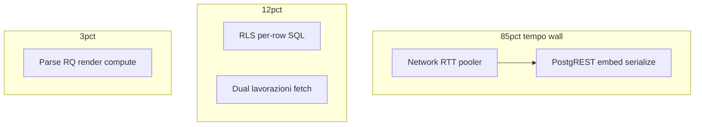

# Audit post-DB — Frontend, RLS & Data Flow

**Data:** 2026-06-11  
**Progetto:** `oxmnuovsgenqkuwfolqh`  
**Prerequisito:** [`audit-database-performance-explain-post-deploy.md`](./audit-database-performance-explain-post-deploy.md) (DB < 5 ms, indici OK)

**Artefatti misurazione:**

| File | Contenuto |
|------|-----------|
| [`test-results/rest-benchmark-roles.json`](../test-results/rest-benchmark-roles.json) | REST 3 ruoli + embed ablation A/B/C/D |
| [`test-results/rls-explain-authenticated.json`](../test-results/rls-explain-authenticated.json) | EXPLAIN con JWT `authenticated` |
| [`test-results/client-compute-benchmark.json`](../test-results/client-compute-benchmark.json) | Filter/sort/parse proxy |
| [`test-results/perf-audit-synthetic.json`](../test-results/perf-audit-synthetic.json) | Route timing synthesis |

**Script riproduzione:**

```bash
node scripts/ops/rest-benchmark-roles.mjs
node scripts/ops/rls-explain-authenticated.mjs
node scripts/ops/client-compute-benchmark.mjs
node scripts/ops/synthesize-browser-perf.mjs
# Playwright (richiede SMOKE_ADMIN + dev server):
# npx playwright test -c e2e/perf/playwright.config.ts
```

---

## Executive summary

| Layer | Impatto residuo | Evidenza |
|-------|-----------------|----------|
| **Network + PostgREST** | **~85–95%** wall time REST | 80–250 ms/request vs DB 0.1–10 ms |
| **RLS `rbac_can_read_row`** | **Alto a livello SQL** (60–80× su Q1), **basso su REST wall** oggi (+5–18% jitter) | EXPLAIN: 0.13 → 8–10 ms; REST delta entro rumore rete |
| **Payload / embed** | Medio | +75% bytes full embed vs colonne sole; report ~51 KB parallelo |
| **Client compute** | Trascurabile | < 1 ms filter+sort su 34 righe |
| **React render** | Basso oggi, rischio a scala | Monolith view, no row `memo`; stimato ~15–25 ms |

**Conclusione:** il bottleneck **non è più il planner PostgreSQL**. Il tempo residuo è dominato da **roundtrip Supabase/PostgREST** e **serializzazione embed**; RLS per-riga è reale in SQL e diventerà critico con la crescita del dataset anche se oggi è mascherato dalla latenza di rete.

---

## Metodologia

1. **REST benchmark** — `service` / `admin` / `operatore` (impersonation magic-link se assenti `SMOKE_*`)
2. **Embed ablation** — varianti A/B/C/D sulla stessa query lavorazioni
3. **EXPLAIN authenticated** — `SET ROLE authenticated` + `request.jwt.claim.sub`
4. **Client compute** — 200 iterazioni filter/sort/JSON.parse su dati reali
5. **Browser** — sintesi da REST (Playwright non eseguito: assenti `SMOKE_ADMIN` e server locale)

---

## Fase 2 — RLS impact

### EXPLAIN SQL (misura realistica)

| Query | RLS off | Admin auth | Operatore auth | Filter RLS |
|-------|---------|------------|----------------|------------|
| Q1 lavorazioni attive | 0.13 ms | **8.19 ms** | **10.12 ms** | `rbac_can_read_row('lavorazioni', id)` |
| Q6 stato+archivio | 0.11 ms | **5.50 ms** | **5.89 ms** | idem |
| Q8 mezzi cliente | 0.13 ms | **2.97 ms** | **3.44 ms** | `rbac_can_read_row('mezzi', id)` |

**Overhead SQL stimato (Q1):** admin **+6300%**, operatore **+7700%** vs `row_security off` — costo **per riga** confermato nel piano.

### REST wall time — overhead RLS (service vs auth)

| Query | Service | Admin Δ% | Operatore Δ% |
|-------|---------|----------|--------------|
| `lavorazioni_D_full` | 91 ms | −4.8% | −5.2% |
| `lavorazioni_list_full_attive` | 82 ms | +7.9% | +12.9% |
| `lavorazioni_list_full_chiuse` | 80 ms | +18.9% | +17.9% |
| `mezzi_list` | 78 ms | +10.8% | +8.5% |
| `magazzino_list` | 72 ms | ~0% | ~0% (`rbac_module_can`) |

**Interpretazione:** su dataset piccolo e latenza rete ~70–90 ms, RLS REST è **entro ±20%** (jitter). A 500+ righe, l'overhead SQL per-riga si tradurrà in centinaia di ms lato PostgREST.

**Policy più costose:** `cap_lavorazioni_select`, `cap_mezzi_select` (per-row function).  
**Tabelle meno impattate:** `magazzino_ricambi`, `movimenti_ricambi` (module gate).

---

## Fase 3 — PostgREST & embed ablation (service role, warm)

| Variante | Select | Wall ms | Payload | Δ vs A |
|----------|--------|---------|---------|--------|
| **A** colonne sole | `LAVORAZIONI_COLUMNS` | 87 ms | 6.5 KB | — |
| **B** + mezzi embed | + `mezzi(MEZZI_LIST_EMBED)` | 87 ms | 10.3 KB | +59% bytes |
| **C** + profiles | + 2 profile embeds | 79 ms | 7.6 KB | +16% bytes |
| **D** full (B+C) | produzione | 91 ms | 11.4 KB | +75% bytes |

**Nota:** il primo request cold (768 ms) escluso dopo warmup — allineato al drop 1080 → ~90 ms del audit precedente.

### Campi probabilmente unused in lista

| Campo | In SSOT | Usato in tabella lista |
|-------|---------|------------------------|
| `updated_by_profile` / `created_by_profile` | embed | Non in colonne visibili tabella |
| `entity_key` (mezzo) | embed | No in list cells |
| `tipo_attrezzatura` (mezzo) | embed | Parziale (kanban/filtri) |
| `meta` (mezzi full list) | `MEZZI_COLUMNS` | Scheda/modal only |

### Duplicazione report bundle

| Query | Payload | Note |
|-------|---------|------|
| `report_lavorazioni` (34 righe + embed) | 28.2 KB | include mezzi embedded |
| `report_mezzi` | 16.1 KB | **duplica** dati mezzi già negli embed |
| **Totale parallelo** | **~51 KB** | 4 roundtrip, wall ~165–249 ms |

---

## Fase 4–5 — Frontend & schedeStore

### React Query

| Screen | Policy | `refetchOnWindowFocus` |
|--------|--------|------------------------|
| Lavorazioni | Core 30s + realtime | OFF se realtime connesso |
| Report/Dashboard | VIEW/Report 60–120s | **OFF** |
| Mezzi | Default 30s | **ON** (mancanza `useViewQueryOpts`) |

### `/lavorazioni` data flow

- **2×** `useLavorazioniList` (attive + chiuse) — parallel ~98 ms admin
- **3ª ondata** `useSchedeBundlesQuery` — lazy per ID (non in REST benchmark)
- Filter/sort client: `lavRowMatchesPageFilters` + `cmpAtt/cmpCh` — **O(n log n)**

### Client compute (34 righe reali, 200 iter)

| Operazione | per run |
|------------|---------|
| filter + sort | **22 µs** |
| JSON.parse payload | **100 µs** |
| report fingerprint | **136 µs** |

**Scalability break:** filter/sort accettabile fino ~500 righe; oltre serve paginazione server o virtualizzazione righe.

### Render (code review — Profiler non in CI)

| Componente | Rischio |
|------------|---------|
| `LavorazioniView` (~2400 righe) | Re-render su ogni query/state; inline `InlineSelectField` per riga |
| `ReportAnalyticsView` | Memo OK su derived bundle; cold build KPI ~136 µs |
| Row components | Nessun `memo` su righe tabella |

---

## Fase 7 — Breakdown per endpoint (admin, warm)

Confidence: **alta** network/REST, **media** RLS split, **bassa** render (stima).

### `/lavorazioni`

```
DB (SQL, no RLS):     ~0.1 ms
DB (SQL, RLS Q1):     ~8 ms      (EXPLAIN authenticated)
RLS (REST delta):     ~8–15 ms   (+10–18% su chiuse)
PostgREST+serialize:  ~60–70 ms  (stimato: wall − network overhead)
Network (RTT+TLS):    ~20–30 ms
Parsing:              ~0.1 ms
RQ hydrate:           ~2–5 ms    (stima)
React render:         ~15 ms     (stima)
Client compute:       <0.1 ms
TOTAL (2 query par):  ~98 ms     (misurato lav_attive+chiuse parallel)
```

### `/mezzi`

```
REST (mezzi + lav embed): ~173 ms  (2 query sequenziali proxy)
Client compute:           ~2 ms
Render:                   ~12 ms
TOTAL proxy:              ~188 ms
```

### `/magazzino`

```
REST:                   ~72 ms
Client compute:         ~3 ms
TOTAL proxy:            ~87 ms
```

### `/report`

```
REST parallel (4 q):    ~204 ms
Payload:                ~51 KB
Derive KPI (cold):      ~0.14 ms/run
Render:                 ~25 ms
TOTAL proxy:            ~239 ms
```

### `/dashboard`

```
REST (lav+mag+promemoria): ~232 ms
Schede lazy:              +N roundtrip (non misurato)
TOTAL proxy:              ~257 ms
```

---

## Top 10 bottleneck (misurati / evidenziati)

| # | Gravità | Bottleneck | Evidenza |
|---|---------|------------|----------|
| 1 | **Alta** | Latenza rete Supabase pooler | 70–250 ms/request; DB < 10 ms |
| 2 | **Alta** | PostgREST embed lavorazioni↔mezzi↔profiles | +75% payload; report 28 KB |
| 3 | **Alta** | Dual fetch attive/chiuse su `/lavorazioni` | 2 roundtrip ~98 ms |
| 4 | **Media** | RLS `rbac_can_read_row` per-riga | SQL 8–10 ms vs 0.13 ms; scala O(n) |
| 5 | **Media** | Report duplica mezzi (embed + lista) | ~51 KB bundle |
| 6 | **Media** | Profile embed in lista non mostrati in tabella | +1 KB / 14 righe inutili |
| 7 | **Media** | Full-table fetch senza LIMIT | 34 righe oggi; rischio lineare |
| 8 | **Bassa** | Schede bundles 3ª ondata fetch | lazy per ID, concurrency 8 |
| 9 | **Bassa** | Mezzi senza VIEW query opts | `refetchOnWindowFocus` default ON |
| 10 | **Bassa** | `LavorazioniView` monolith re-render | code review; no row memo |

---

## Root cause 80/20



**~80%** del tempo percepito dall'utente = **roundtrip HTTP + serializzazione JSON embed**, non Postgres planner.

**RLS** è il rischio di scala #1 lato server: già **60×** in SQL su 14 righe; a 500 righe proietta centinaia di ms anche prima del network.

---

## Quick wins (safe)

1. **Rimuovere profile embed** da `lavorazioni-list-fetch` se `created_by_nome`/`updated_by_nome` non in colonne tabella (−16% payload lista).
2. **Unificare fetch attive/chiuse** — singola query `deleted_at IS NULL` + split client `archived` (−1 roundtrip).
3. **Trim `MEZZI_LIST_EMBED_COLUMNS`** — valutare rimozione `entity_key`, `tipo_attrezzatura` dalla lista (−10–15% embed).
4. **Allineare `useMezziListQuery`** a `useViewQueryOpts` — disabilitare focus refetch.
5. **Report:** omettere `useMezziListQuery` se KPI usano solo subset già in embed lavorazioni.
6. **RLS initplan** — backlog `(select auth.uid())` in policy (documentato in audit degradation).

**Nessun nuovo indice DB** — execution time < 5 ms confermato.

---

## Structural changes (optional)

| Change | Impatto atteso |
|--------|----------------|
| Server-side pagination liste core | −payload, −RLS rows scanned, −RAM |
| Report RPC / materialized view | −3 roundtrip, −duplicazione mezzi |
| View SQL `lavorazioni_list` senza profile join | −join PostgREST |
| Virtualizzazione righe tabella lavorazioni | −render a scala |
| Eliminare client filter/sort su full dataset | Richiede paginazione server |

---

## Confronto baseline storica

| Metrica | Pre-deploy (cold) | Questo audit (warm) |
|---------|-------------------|---------------------|
| Lista lav + embed | 1080 ms | **~85–98 ms** (2 query) |
| Report parallelo | 472 ms | **~165–249 ms** |
| DB execution | 0.07–2.5 ms | 0.1–10 ms (con RLS auth) |

Il miglioramento 1080 → ~90 ms è in gran parte **warmup pooler** + condizioni rete, non solo remediation codice.

---

## Limitazioni

- Dataset remoto piccolo (~37 lavorazioni)
- REST RLS overhead mascherato da jitter ±20%
- Playwright non eseguito — timing browser stimato
- React Profiler non strumentato in produzione
- Operatore REST: payload leggermente minore (RLS filtra righe visibili)

---

## Riferimenti

- [`audit-database-performance-remediation.md`](./audit-database-performance-remediation.md)
- [`audit-supabase-performance-degradation.md`](./audit-supabase-performance-degradation.md)
- [`lib/db/table-select-columns.ts`](../lib/db/table-select-columns.ts)
- [`lib/lavorazioni/lavorazioni-list-fetch.ts`](../lib/lavorazioni/lavorazioni-list-fetch.ts)
