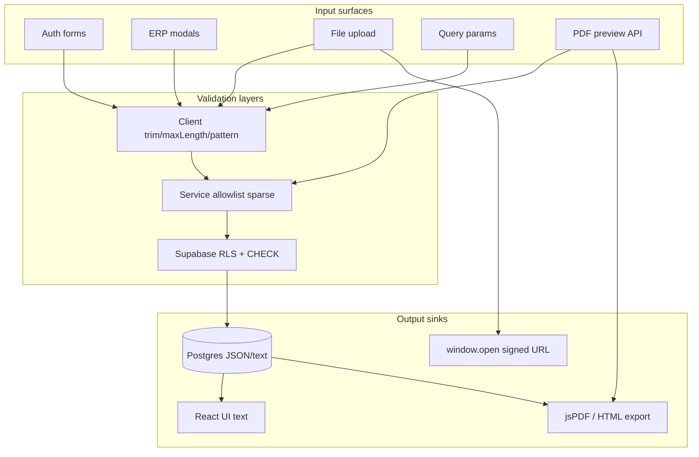

# Audit sicurezza input — Gestionale CAB

**Data:** 2026-06-02  
**Modalità:** analisi preventiva read-only — nessun test di sfruttamento  
**Scope:** autenticazione, form applicativi, upload, rendering, API input  
**Report master:** [`technical-audit-report.md`](./technical-audit-report.md)

### Mitigazioni implementate (post-audit)

| ID | Intervento | File |
|----|------------|------|
| INP-001 | Password min 8 unificata (rimosso check 6 char duplicato) | `admin-users.ts`, `security-create-user-modal.tsx` |
| INP-003 | Whitelist MIME legacy schede (`application/pdf`, immagini) | `schede-print-html.ts` |
| INP-004 | `fileMatchesAccept` su drag-drop documenti | `documento-file-dropzone.tsx` |
| INP-006 | Magic bytes `%PDF-` su upload PDF lavorazione | `lavorazione-documents.ts`, `lavorazione-documents-manager.tsx` |
| INP-009 | `sanitizePostLoginRequestedPath` su accesso negato | `acesso-negato/page.tsx` |
| INP-010 | `isValidLoginIdentifier` su resolve login server | `admin-user-validation.ts` |
| INP-012 | `normalizeDescription` slice 2000 in service promemoria | `dashboard-promemoria.service.ts` |
| INP-002 | Flow reset password `/login/reset-password` + middleware exception | `reset-password-form.tsx`, `proxy-handler.ts` |
| INP-007 | Allowlist update preventivi (`pickPreventivoWritePayload`) | `preventivi-payload.ts`, `preventivi.service.ts` |
| INP-008 | Allowlist update lavorazioni (`pickLavorazioneWritePayload`) | `lavorazioni-payload.ts`, `lavorazioni.service.ts` |
| INP-016 | Cap testo ERP (`text-field-limits`, UI maxLength, clamp schede/BUNDER/mezzi) | moduli ERP + `clamp-free-text.ts` |

Policy CI: `lib/regression/input-security-policy.test.ts`

---

## Executive summary

| Area | Superficie input | Validazione client | Validazione server | Rischio dominante |
|------|------------------|--------------------|--------------------|-------------------|
| Autenticazione | Login, reset email, creazione utente admin | Buona (username); password debole | Parziale (RPC, rate limit resolve) | Password policy inconsistente; reset incompleto |
| Form ERP | Mezzi, lavorazioni, preventivi, dipendenti, report, impostazioni, promemoria | Imperativa, sparsa | RLS Postgres + permessi; poco DTO validation | Mass assignment; campi unbounded |
| Upload | Documenti, PDF lavorazione, immagini | Parziale (accept/size) | RLS storage; no magic bytes server | Tipo file spoofabile; drag-drop bypass |
| Rendering | React text, PDF jsPDF, BUNDER HTML | React escape default | PDF magic `%PDF-` su preview API | Legacy schede `data:` MIME; open redirect `from` |
| API | Solo PDF preview | N/A | Auth + rate limit + magic bytes | Pass-through PDF autenticato |

**Conteggio finding per severità:**

| Critico | Alto | Medio | Basso |
|---------|------|-------|-------|
| 0 | 3 | 14 | 12 |

**Pattern trasversali:**

1. **Nessuno schema condiviso** (Zod/Yup) — validazione duplicata o assente tra client e server.
2. **RLS come unico gate server-side** per la maggior parte dei CRUD browser-side.
3. **React text rendering** — basso rischio XSS in UI; rischio spostato su **upload + apertura file** e **HTML/PDF export**.
4. **`maxLength` HTML** presente solo su pochi campi (promemoria, tasks, username); la maggior parte dei campi ERP **non ha cap espliciti**.

---

## Metodologia

Per ogni superficie sono stati verificati:

- Obbligatorietà, min/max length, charset, formati
- Sanitizzazione / normalizzazione (trim, lowercase, strip)
- Validazione client vs server vs DB CHECK
- Vettori: XSS, injection, mass assignment, upload, URL tampering
- Rendering successivo: tabelle, PDF, notifiche, export

Strumenti: grep statico, lettura servizi/modali/migration, agent explore read-only.

---

## 1. Autenticazione

### 1.1 Login

| Campo | File | Validazione client | Validazione server | Gap |
|-------|------|--------------------|--------------------|-----|
| Identificatore (email/username) | `app/login/login-form.tsx`, `src/lib/auth/username.ts` | Format + sanitize username; email regex base | `resolve-login-email.ts`: max 254 char; rate limit IP 30/5min | Server non ri-valida formato username/email |
| Password | `login-form.tsx` | Solo non-vuota | Supabase Auth | Nessun max length; nessun rate limit app-level su tentativi |
| Remember me | `login-form.tsx` | UI checkbox | Implementato (cookie SSOT) | `cab-auth-remember` controlla maxAge auth cookie; default session-only |

### 1.2 Recupero password

| Campo | File | Validazione | Gap |
|-------|------|-------------|-----|
| Email reset | `login-form.tsx` | `isValidEmailFormat` | **Nessuna UI cambio password** post-link; redirect solo `/login` |
| — | — | Anti-enumeration OK (messaggio generico) | Nessun rate limit app su richieste reset |

### 1.3 Registrazione

**Assente** — utenti creati solo da admin (`security-create-user-modal.tsx` + `admin-users.ts`).

### 1.4 Creazione utente admin / cambio password

| Campo | Client | Server (`admin-user-validation.ts`) | Gap |
|-------|--------|---------------------------------------|-----|
| Nome | HTML required | 2–120 char | Client senza maxLength |
| Username | pattern 3–32 | 3–32, regex | OK |
| Email | type=email | regex + max 254 | Regex debole |
| Password | minLength=6 | **8–128** | **Inconsistenza:** action accetta 6+ se validator bypassato |
| Ruolo | select | required enum | OK |

**Cambio password utente:** non implementato in-app.

---

## 2. Form applicativi — inventario campi

### 2.1 Dipendenti / timesheet

| Campo | UI | Validazione | Server |
|-------|-----|-------------|--------|
| Ore ordinarie/straordinarie/assenza | `timesheet-cell-editor-popover.tsx` | `validateCellValue`: ≥0, tot ≤24h | `dipendenti-timesheet.service.ts` `buildPayload` allowlist |
| Tipo assenza | select | ID must exist in config | stesso |
| Motivo custom («Altro») | text | required if tipo requires | trim; **no maxLength** |
| Nome dipendente (scheda) | `dipendente-detail-modal.tsx` | read-only display | RLS |

**Punti di forza:** allowlist colonne DB nel service timesheet.  
**Gap:** `motivoCustom` e note dipendente senza cap lunghezza.

### 2.2 Mezzi

| Campo | UI | Validazione | Server |
|-------|-----|-------------|--------|
| Cliente, marca, modello, matricola | `mezzi-view.tsx` modals | required; anno 1980–2035 | `mezzi.service.ts`: `ensurePermission(editVehicles)`; pass-through insert |
| entity_key | mapper | `attachMezzoEntityKey` | può essere client-supplied |
| Note / campi testo liberi | vari | trim parziale | **no maxLength** su molti campi |

**Similarity gate:** `findMezzoBySimilarIdent` — UX, non sicurezza.

### 2.3 Lavorazioni / schede

| Campo | UI | Validazione | Server |
|-------|-----|-------------|--------|
| Cliente, marca, modello, matricola | create/edit modals | required on create/edit | `lavorazioni.service.ts` full object to Supabase |
| Stato, priorità | select | in config lists | — |
| Schede ingresso/lavorazioni/ricambi | `scheda-ingresso-form-modal.tsx`, `schede-lavorazione-modal.tsx` | campi obbligatori per tipo | `schede.service.ts` |
| Note, descrizioni | textarea | **nessun maxLength** | stored in JSON/DB text |
| Legacy file esterno | modal | MIME da payload legacy | `openBlobInNewTab(mime, base64)` **senza whitelist** |

### 2.4 Preventivi

| Campo | UI | Validazione | Server |
|-------|-----|-------------|--------|
| Cliente, righe, importi | `preventivi-editor-modal.tsx` | calcolo totale client | `mergePreventivoPayload` |
| dettagli JSON | editor | struttura libera | **update merge `{...before, ...data}`** — mass assignment |
| Numero, date | UI | parziale | trigger DB assign numero |

### 2.5 Report

| Campo | UI | Validazione | Server |
|-------|-----|-------------|--------|
| completed_count (manual) | `report-lavorazioni-section.tsx` | Number ≥ 0 | CHECK DB + service period rules |
| note | text | **unbounded** | text column |
| Magazzino manual | localStorage + sync | client only | `ensureSectionWrite("report")` on sync |

### 2.6 Impostazioni

| Campo | UI | Validazione | Server |
|-------|-----|-------------|--------|
| Liste configurazione (clienti, stati, …) | `sistema-impostazioni-modal.tsx` | duplicate/similar gate | `settings.service.ts` `value: Record<string, unknown>` **untyped** |
| Tipo assenza sigla | `settings-dipendenti-assenze-section.tsx` | maxLength=6 | — |
| Valori lista libera | global-settings-list-select | trim via add flow | shape non validata |

### 2.7 Promemoria / calendario

| Campo | UI | Validazione | Server |
|-------|-----|-------------|--------|
| Titolo | form modal | maxLength=200 | slice(0,200) + DB CHECK |
| Descrizione | form modal | maxLength=2000 | **no CHECK DB** — solo UI cap |
| Data/ora | date picker | regex date server | `normalizePromemoriaEventTime` |
| entity_type / entity_id | — | non esposti UI | colonne DB unused |

### 2.8 BUNDER

| Campo | UI | Validazione | Server |
|-------|-----|-------------|--------|
| Cliente, righe prodotto, condizioni | `bunder-editor-modal.tsx` | required fields | `bunder.service.ts` JSON payload |
| Testo libero commerciale | textarea/input | **no maxLength** | JSONB payload |
| Export HTML stampa | — | `esc()` in `bunder-html-document.ts` | — |

### 2.9 Documenti archivio

| Campo | UI | Validazione | Server |
|-------|-----|-------------|--------|
| nome | modals | required trim | — |
| categoria, applicabilità | select | enum UI | — |
| marca/modello | select | `validateDocumentoMarcaModelloFields` | — |
| note | text | **unbounded** | — |
| file | dropzone | size; accept on picker only | **drag bypass accept** |

### 2.10 Security / utenti

| Campo | File | Validazione |
|-------|------|-------------|
| Batch permission patches | `security-actions-validation.ts` | allowlist fields, max 100 users |
| Nome/ruolo edit | security modals | server validators |

### 2.11 Global autocomplete / select

| Campo | File | Rischio |
|-------|------|---------|
| Valore custom aggiunto a lista | `global-select.tsx`, `global-multi-select.tsx` | Stringa libera → settings DB; no charset filter; duplicate gate only |

---

## 3. Upload — analisi

| Superficie | File | Tipo / size | Controlli | Gap |
|------------|------|-------------|-----------|-----|
| Documenti archivio | `documento-file-dropzone.tsx`, `documenti-db-mapper.ts` | .pdf,.doc,… 100MB | size; accept su file picker | **Drag-drop senza accept**; no magic bytes; `contentType` da browser |
| PDF lavorazione (DDT) | `lavorazione-documents-manager.tsx` | PDF | `isPdfFile` extension OR mime | Spoofable; service forza `application/pdf` |
| Immagini record | `record-image-manager.tsx`, `image-storage.ts` | image/* 10MB | re-encode JPEG via canvas | Buona mitigazione polyglot |
| PDF preview API | `pdf-preview-handler.ts` | 15MB | magic `%PDF-`, auth, rate limit | Pass-through autenticato |

---

## 4. Rendering dati utente

| Sink | File | Sanitizzazione | Rischio |
|------|------|----------------|---------|
| React JSX text | tabelle, card, modals | Auto-escape React | **Basso** |
| `dangerouslySetInnerHTML` | `app/layout.tsx` | Script tema statico | **Basso** |
| `document.write` | `bunder-html-document.ts` | `esc()` su tutti i campi | **Medio** se nuovo campo senza esc |
| jsPDF `text()` / autoTable | `lib/pdf/*` | Nessun HTML | PDF injection teorica, non DOM XSS |
| Signed URL open | `documenti-helpers.ts`, media managers | — | Contenuto file eseguibile in nuova tab |
| Legacy `data:` URL | `schede-print-html.ts` | **Nessuna whitelist MIME** | **Alto** se mime=text/html |
| Toast / notifiche | `toast-context.tsx`, admin notifications | React text | **Basso** |
| Email | Supabase reset | Non controllato app | Template Supabase |

**CSV export:** non presente — rischio formula injection **N/A**.

---

## 5. URL / parameter tampering

| Parametro | File | Controllo | Rischio |
|-----------|------|-----------|---------|
| `from` post-login | `resolve-post-login-redirect.ts` | Blocca `//`, `/login`, RBAC | **Basso** |
| `from` accesso negato | `acesso-negato/page.tsx` | Solo `startsWith("/")` | **Medio** — `//evil.com` passa |
| `?open=`, `?mezzo=`, `?lavorazione=` | preventivi, lavorazioni, documenti | trim + lookup ID | IDOR mitigato da RLS read |
| `?q=` search documenti | `documenti-view.tsx` | client filter only | Nessun injection; DoS client-side search |

---

## 6. Finding dettagliati

### INP-001 — Password policy inconsistente (6 vs 8 caratteri)

| Attributo | Valore |
|-----------|--------|
| **File** | `src/actions/admin-users.ts` L170, `lib/validation/admin-user-validation.ts` |
| **Campo** | `password` (creazione utente admin) |
| **Livello** | **Alto** |
| **Impatto** | Account con password deboli ammesse se check action eseguito senza validator completo |
| **Probabilità** | Media (path UI usa entrambi; ordine check può far passare 6–7 char) |
| **Esempio teorico** | Admin imposta password `abc123` (6 char) — accettata dall'action, rifiutata dal validator a 8 |
| **Mitigazione** | Rimuovere check duplicato `< 6`; usare solo `validateCreateUserInput`; allineare HTML `minLength={8}` |

### INP-002 — Reset password incompleto

| Attributo | Valore |
|-----------|--------|
| **File** | `app/login/login-form.tsx` |
| **Campo** | flusso recupero password |
| **Livello** | **Alto** |
| **Impatto** | Utente con link recovery non ha form dedicato cambio password in-app |
| **Probabilità** | Alta (funzionale) |
| **Esempio teorico** | Link Supabase apre sessione recovery ma app reindirizza a login senza `updateUser({ password })` |
| **Mitigazione** | Route `/login/reset-password` con detection session recovery + form nuova password + validazione 8+ |

### INP-003 — Legacy schede `data:` URL senza whitelist MIME

| Attributo | Valore |
|-----------|--------|
| **File** | `lib/schede/schede-print-html.ts`, `schede-lavorazione-modal.tsx` |
| **Campo** | `SchedaFileEsterno.mime`, `dataBase64` |
| **Livello** | **Alto** |
| **Impatto** | Stored XSS se payload legacy contiene `text/html` o SVG con script |
| **Probabilità** | Bassa (legacy/localStorage) ma impatto alto |
| **Esempio teorico** | `mime: "text/html"`, base64 di `` aperto su origin app |
| **Mitigazione** | Whitelist MIME (`application/pdf`, `image/jpeg`, `image/png`); migrare a Storage; bloccare HTML/SVG |

### INP-004 — Upload documenti: drag-drop bypass accept

| Attributo | Valore |
|-----------|--------|
| **File** | `components/gestionale/documenti/documento-file-dropzone.tsx` |
| **Campo** | file upload |
| **Livello** | **Medio** |
| **Impatto** | Upload HTML/SVG/executable mascherato; apertura via signed URL |
| **Probabilità** | Media (utente autenticato malintenzionato) |
| **Esempio teorico** | Drop `.html` → storage → `window.open(signedUrl)` → phishing/malware |
| **Mitigazione** | `fileMatchesAccept` su drag; magic bytes pre-upload; deny-list MIME pericolosi |

### INP-005 — Nessuna validazione tipo file server-side (documenti)

| Attributo | Valore |
|-----------|--------|
| **File** | `lib/documenti/documenti-db-mapper.ts`, `src/services/storage.service.ts` |
| **Campo** | `contentType`, bytes file |
| **Livello** | **Medio** |
| **Impatto** | Tipo dichiarato client-side only; RLS non verifica contenuto |
| **Probabilità** | Media |
| **Esempio teorico** | `file.type = "application/pdf"` con contenuto HTML |
| **Mitigazione** | Edge Function o RPC post-upload scan; allowlist estensioni lato DB metadata |

### INP-006 — PDF lavorazione: validazione debole

| Attributo | Valore |
|-----------|--------|
| **File** | `lib/lavorazioni/lavorazione-documents.ts`, `lavorazione-documents.service.ts` |
| **Campo** | file PDF slot DDT/preventivo |
| **Livello** | **Medio** |
| **Impatto** | Non-PDF memorizzato come PDF; viewer confusion / malware delivery |
| **Probabilità** | Media |
| **Esempio teorico** | `malware.exe` rinominato `.pdf` |
| **Mitigazione** | Verifica magic bytes `%PDF-` prima upload; rifiutare mismatch |

### INP-007 — Mass assignment preventivi update

| Attributo | Valore |
|-----------|--------|
| **File** | `src/services/preventivi.service.ts` L110–113 |
| **Campo** | qualsiasi colonna `PreventivoUpdate` |
| **Livello** | **Medio** |
| **Impatto** | Caller malevolo (o bug client) può inviare campi extra nel merge update |
| **Probabilità** | Bassa (browser trusted UI; RLS limita colonne sensibili) |
| **Esempio teorico** | PATCH con `lavorazione_id` o `created_by` alterati se RLS permissiva |
| **Mitigazione** | Allowlist campi updatable; strip unknown keys prima `.update()` |

### INP-008 — Mass assignment lavorazioni/mezzi

| Attributo | Valore |
|-----------|--------|
| **File** | `src/services/lavorazioni.service.ts`, `mezzi.service.ts` |
| **Campo** | insert/update payload |
| **Livello** | **Medio** |
| **Impatto** | Campi `archived`, `deleted_at`, metadata se presenti e scrivibili |
| **Probabilità** | Bassa |
| **Esempio teorico** | DevTools → chiamata service con `{ deleted_at: null }` su record altrui |
| **Mitigazione** | DTO allowlist per update; RLS column-level review |

### INP-009 — Open redirect protocol-relative su accesso negato

| Attributo | Valore |
|-----------|--------|
| **File** | `app/(gestionale)/acesso-negato/page.tsx` L9–19 |
| **Campo** | query `from` |
| **Livello** | **Medio** |
| **Impatto** | Link «Torna indietro» può puntare a dominio esterno |
| **Probabilità** | Bassa (social engineering) |
| **Esempio teorico** | `/acesso-negato?from=//attacker.example` → `<Link href="//attacker.example">` |
| **Mitigazione** | Riutilizzare `sanitizePostLoginRequestedPath`; bloccare `//` |

### INP-010 — Login identifier: validazione server debole

| Attributo | Valore |
|-----------|--------|
| **File** | `src/actions/resolve-login-email.ts` |
| **Campo** | identifier |
| **Livello** | **Medio** |
| **Impatto** | Garbage/log injection verso RPC; enumerazione timing |
| **Probabilità** | Bassa |
| **Esempio teorico** | Stringa 254 char special chars ripetuta → log noise |
| **Mitigazione** | `isValidLoginIdentifier` server-side prima RPC |

### INP-011 — Nessun rate limit login attempts

| Attributo | Valore |
|-----------|--------|
| **File** | `context/auth-context.tsx`, Supabase Auth |
| **Campo** | password login |
| **Livello** | **Medio** |
| **Impatto** | Brute force password (mitigato parzialmente da Supabase) |
| **Probabilità** | Media |
| **Esempio teorico** | Script automatizzato su `signInWithPassword` |
| **Mitigazione** | Rate limit IP/account; CAPTCHA dopo N fallimenti |

### INP-012 — Promemoria descrizione unbounded DB

| Attributo | Valore |
|-----------|--------|
| **File** | `dashboard-promemoria-form-modal.tsx`, migration promemoria |
| **Campo** | `description` |
| **Livello** | **Medio** |
| **Impatto** | DoS storage / payload oversized se bypass UI maxLength |
| **Probabilità** | Bassa |
| **Esempio teorico** | Chiamata diretta Supabase client con testo 1MB |
| **Mitigazione** | `slice(0, 2000)` in service + CHECK DB |

### INP-013 — Settings value untyped JSON

| Attributo | Valore |
|-----------|--------|
| **File** | `src/services/settings.service.ts` |
| **Campo** | `app_settings.value` |
| **Livello** | **Medio** |
| **Impatto** | Shape inattesa; potenziale confusione downstream se consumer assume tipo |
| **Probabilità** | Bassa |
| **Esempio teorico** | Lista clienti con oggetti nested profondi → performance |
| **Mitigazione** | Schema per module/key; max items per lista |

### INP-014 — BUNDER document.write (HTML injection)

| Attributo | Valore |
|-----------|--------|
| **File** | `lib/bunder/bunder-html-document.ts` |
| **Campo** | tutti i campi documento commerciale |
| **Livello** | **Medio** (mitigato) |
| **Impatto** | XSS se nuovo campo interpolato senza `esc()` |
| **Probabilità** | Bassa oggi; alta su regression futura |
| **Esempio teorico** | Aggiunta campo `noteInterne` in template senza escape |
| **Mitigazione** | Test automatico che verifica `esc()` su ogni interpolazione; preferire jsPDF |

### INP-015 — auth_logs login_failed anon insert

| Attributo | Valore |
|-----------|--------|
| **File** | `supabase/migrations/20260220120000_auth_logs.sql` |
| **Campo** | email in log fallimento |
| **Livello** | **Medio** |
| **Impatto** | Log flooding con email arbitrarie |
| **Probabilità** | Media |
| **Esempio teorico** | Bot inserisce migliaia righe `login_failed` |
| **Mitigazione** | Rate limit DB; solo service role insert |

### INP-016 — Campi testo ERP senza maxLength

| Attributo | Valore |
|-----------|--------|
| **File** | lavorazioni modals, preventivi editor, mezzi, BUNDER, documenti note |
| **Campo** | note, descrizioni, anomalie, righe libere |
| **Livello** | **Basso** |
| **Impatto** | DoS UI/render; PDF oversized; DB bloat |
| **Probabilità** | Bassa |
| **Esempio teorico** | Incolla 500KB testo in «Descrizione anomalia» |
| **Mitigazione** | Cap per campo (es. 2000–8000); truncate server-side |

### INP-017 — Global select «aggiungi valore» senza charset filter

| Attributo | Valore |
|-----------|--------|
| **File** | `global-select.tsx`, `global-settings-list-select.tsx` |
| **Campo** | nuovo valore lista |
| **Livello** | **Basso** |
| **Impatto** | Valori con control chars / zero-width in liste condivise |
| **Probabilità** | Bassa |
| **Esempio teorico** | Cliente `\u200B` duplicato visivamente |
| **Mitigazione** | `normalizeEntityString`; reject control characters |

### INP-018 — Signed URL 1h bearer token

| Attributo | Valore |
|-----------|--------|
| **File** | `storage.service.ts`, consumers documenti/media |
| **Campo** | N/A |
| **Livello** | **Basso** |
| **Impatto** | Leak URL → accesso temporaneo file |
| **Probabilità** | Bassa |
| **Esempio teorico** | URL copiato da DevTools condiviso |
| **Mitigazione** | TTL più breve; audit access; download forzato |

### INP-019 — PDF pass-through API autenticato

| Attributo | Valore |
|-----------|--------|
| **File** | `lib/pdf/pdf-preview-handler.ts` |
| **Campo** | blob PDF POST |
| **Livello** | **Basso** |
| **Impatto** | Utente autenticato può hostare PDF arbitrario ≤15MB con filename scelto |
| **Probabilità** | Bassa |
| **Esempio teorico** | PDF con contenuto phishing servito inline |
| **Mitigazione** | Header `Content-Disposition: attachment` opzionale; audit log |

### INP-020 — Login password senza max length

| Attributo | Valore |
|-----------|--------|
| **File** | `login-form.tsx` |
| **Campo** | password |
| **Livello** | **Basso** |
| **Impatto** | Payload oversized verso Auth API |
| **Probabilità** | Bassa |
| **Esempio teorico** | Password 1MB string |
| **Mitigazione** | maxLength 128 client + server |

### INP-021 — Remember me (Resta collegato)

| Attributo | Valore |
|-----------|--------|
| **File** | `login-form.tsx`, `auth-context.tsx`, `lib/auth/auth-remember-preference.ts` |
| **Campo** | remember checkbox ("Resta collegato") |
| **Livello** | **Risolto** |
| **Comportamento** | Cookie `cab-auth-remember` = SSOT (`1` persistente, `0` session-only); default opt-in `false` |
| **Mitigazione** | `applyRememberToCookiesToSet` su browser/middleware/server-user client; test `auth-remember-preference.test.ts` |

### INP-022 — Email regex debole

| Attributo | Valore |
|-----------|--------|
| **File** | `username.ts`, `admin-user-validation.ts` |
| **Campo** | email |
| **Livello** | **Basso** |
| **Impatto** | Email malformate accettate |
| **Probabilità** | Media |
| **Mitigazione** | Validatore RFC5322 semplificato o delega Supabase |

### INP-023 — Timesheet motivoCustom unbounded

| Attributo | Valore |
|-----------|--------|
| **File** | `timesheet-validation.ts`, timesheet UI |
| **Campo** | motivoCustom |
| **Livello** | **Basso** |
| **Impatto** | Testo lungo in cella/export PDF |
| **Mitigazione** | max 200–500 char |

### INP-024 — Report note unbounded

| Attributo | Valore |
|-----------|--------|
| **File** | `report-manual-entries.service.ts` |
| **Campo** | note |
| **Livello** | **Basso** |
| **Impatto** | DB bloat |
| **Mitigazione** | slice in service |

### INP-025 — Parameter tampering ID modali

| Attributo | Valore |
|-----------|--------|
| **File** | `preventivi-view.tsx`, `lavorazioni-view.tsx` |
| **Campo** | `?open=uuid` |
| **Livello** | **Basso** (mitigato RLS) |
| **Impatto** | Tentativo IDOR — bloccato se RLS corretta |
| **Mitigazione** | Verificare RLS read su ogni entità; toast se not found |

### INP-026 — Dipendenti timesheet: buona allowlist (positivo)

| Attributo | Valore |
|-----------|--------|
| **File** | `dipendenti-timesheet.service.ts` |
| **Riferimento** | Pattern da replicare |
| **Livello** | — |
| **Nota** | `buildPayload` esplicito — best practice per mass assignment |

### INP-027 — Security batch patches allowlist (positivo)

| Attributo | Valore |
|-----------|--------|
| **File** | `security-actions-validation.ts` |
| **Riferimento** | Pattern da replicare |
| **Livello** | — |
| **Nota** | Validazione esplicita per-field |

### INP-028 — Image re-encode JPEG (positivo)

| Attributo | Valore |
|-----------|--------|
| **File** | `lib/media/image-storage.ts` |
| **Riferimento** | Mitigazione upload |
| **Livello** | — |
| **Nota** | Riduce rischio polyglot image |

---

## 7. Matrice superfici di attacco

---

## 8. Priorità mitigazioni (roadmap)

### Sprint immediato (Alto)

1. **INP-001** — Allineare password min 8 ovunque  
2. **INP-002** — Completare flow reset password  
3. **INP-003** — Whitelist MIME legacy schede + piano migrazione Storage  

### Breve termine (Medio)

4. **INP-004/005/006** — Hardening upload (accept drag, magic bytes)  
5. **INP-007/008** — Allowlist update su preventivi/lavorazioni/mezzi  
6. **INP-009** — Sanitize `from` su accesso-negato  
7. **INP-010/011** — Validazione + rate limit login  
8. **INP-012** — CHECK DB promemoria description  

### Medio termine (Basso + hardening)

9. Schema condiviso Zod per moduli critici (preventivi, documenti upload metadata)  
10. Cap lunghezza su campi testo liberi ERP  
11. `normalizeEntityString` su global-select add  
12. Audit periodico BUNDER `esc()` con test  

---

## 9. Checklist per nuovi campi input

Quando si aggiunge un campo:

- [ ] Obbligatorietà definita client + service + DB NOT NULL se needed  
- [ ] `maxLength` UI + slice server + CHECK DB  
- [ ] Normalizzazione (trim, NFC, lowercase dove applicabile)  
- [ ] Charset allowlist per identificatori  
- [ ] Allowlist colonne su update (no spread `{...before, ...data}`)  
- [ ] Rendering: solo React text o `esc()` per HTML  
- [ ] Export PDF: troncare stringhe lunghe  
- [ ] Test regressione policy se modulo critico  

---

## 10. Conclusione

Il gestionale CAB ha **buone fondamenta RBLS** e **basso rischio XSS classico** nella UI React. I rischi input più rilevanti sono:

1. **Upload file** con validazione client incompleta e apertura inline  
2. **Legacy schede** con URL `data:` arbitrari  
3. **Mass assignment** su update preventivi/lavorazioni  
4. **Auth gaps** (password policy, reset incompleto, rate limit login)  
5. **Assenza schema validation condiviso** → drift client/server  

Nessuna modifica applicativa è stata eseguita in questo audit; le mitigazioni proposte preservano la logica esistente aggiungendo guard rail incrementali.
