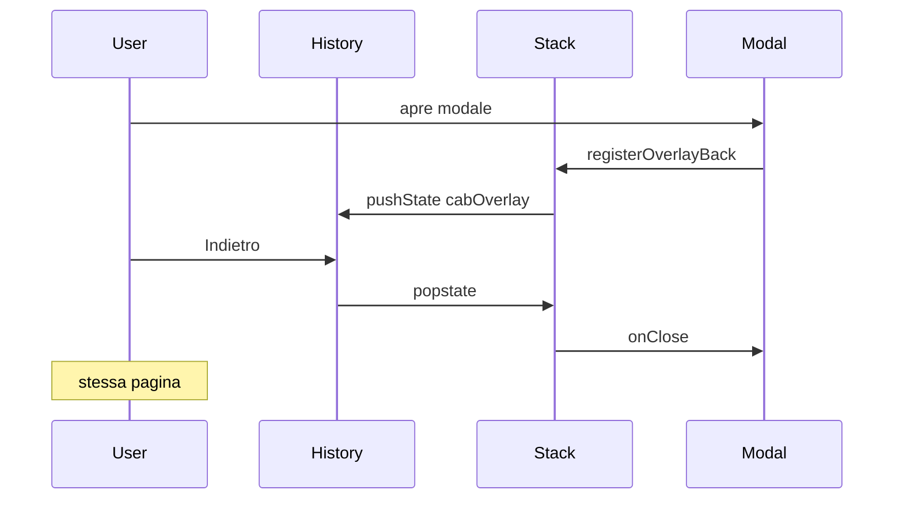

# Audit: pulsante Indietro con modal aperti

Data: 2026-06-05

## Analisi sistema attuale (prima)

### Routing
- **Next.js App Router** (`usePathname`, `Link`, `useRouter`).
- [`components/gestionale/app-shell.tsx`](../components/gestionale/app-shell.tsx): `popstate` usato solo per `routeLoading`, non per overlay.
- [`BodyScrollLockRouteGuard`](../lib/ui/use-body-scroll-lock.ts): reset scroll lock su cambio `pathname`.

### Modal / overlay
Pattern: stato locale nelle view + shell condivisi (`LavorazioniModalShell`, `Drawer`, `GestionaleConfirmDialog`, …).

**Problema:** aprendo un modal, il pulsante Indietro del browser/dispositivo consumava la cronologia di navigazione reale invece di chiudere l’overlay.

## Modal individuati (copertura via shell)

| Shell | File | Overlay coperti |
|-------|------|-----------------|
| `LavorazioniModalShell` | `lavorazioni-modals.tsx` | Ricambi, schede, lavorazioni, mezzi hub, impostazioni, preventivi, … |
| `GestionaleConfirmDialog` | `gestionale-confirm-dialog.tsx` | Conferme, `useGestionaleConfirm`, unsaved stacked |
| `Drawer` | `drawer.tsx` | Log laterali, security drawer |
| `Modal` (DS) | `modal.tsx` | Modali legacy design-system |
| `MobileFilterDrawer` | `mobile-filter-drawer.tsx` | Filtri mobile |
| `MobileNavDrawer` | `app-shell.tsx` | Menu hamburger |
| `GestionaleUnsavedChangesDialog` (nested) | `gestionale-unsaved-changes-dialog.tsx` | Dialog unsaved inline |

**Esclusi** (popover transitori): `global-calendar-panel`, `settings-color-picker-popover`, dropdown `GlobalSelect`.

## Strategia implementata

### History API + stack LIFO

1. All’apertura overlay: `history.pushState({ cabOverlay: id }, "", sameUrl)` + push nello stack interno.
2. Indietro (`popstate`): `stack.pop()?.onClose()` — resta sulla stessa pagina.
3. Chiusura programmatica (X, ESC, Salva): `history.back()` con flag `suppressNextPop` per non chiudere due volte.
4. Cambio route: `resetOverlayBackStack` + `healOverlayBackStack` (voci history orfane dopo refresh).

### Priorità overlay (LIFO)

Pagina → Modal A → Modal B:
- 1° Indietro → chiude B
- 2° Indietro → chiude A
- 3° Indietro → navigazione normale

## File modificati

| File | Modifica |
|------|----------|
| `lib/ui/overlay-back-stack.ts` | Stack + History API |
| `lib/ui/use-overlay-back-handler.ts` | Hook React |
| `lib/ui/overlay-back-stack-guard.tsx` | Listener `popstate` singleton |
| `lib/ui/use-body-scroll-lock.ts` | Reset/heal su route change |
| `components/app-providers.tsx` | Monta `OverlayBackStackGuard` |
| `components/gestionale/lavorazioni/lavorazioni-modals.tsx` | Hook su shell |
| `components/design-system/modal.tsx` | Hook |
| `components/design-system/drawer.tsx` | Hook |
| `components/gestionale/gestionale-confirm-dialog.tsx` | Hook |
| `components/gestionale/mobile-filter-drawer.tsx` | Hook |
| `components/gestionale/gestionale-unsaved-changes-dialog.tsx` | Hook nested |
| `components/gestionale/app-shell.tsx` | Hook `MobileNavDrawer` |
| `lib/ui/overlay-back-stack.test.ts` | Test automatici |
| `scripts/ux-mobile-regression-gate.ts` | Regola `modal-overlay-back` |

## Test eseguiti

- [x] `npx tsx lib/ui/overlay-back-stack.test.ts` — stack LIFO, suppress programmatico, heal, wiring shell
- [ ] Manuale Android Chrome: back chiude modal senza cambiare pagina
- [ ] Manuale iOS Safari: swipe-back chiude overlay
- [ ] Scenario annidato: Modal A → Confirm → 2× back
- [ ] ESC / X / click backdrop invariati
- [ ] Unsaved nested: back = «Resta» (`onStay`)

## Edge case

| Caso | Gestione |
|------|----------|
| Chiusura rapida | `useLayoutEffect` + `suppressNextPop` |
| Modal annidati z-110 | LIFO per ordine di mount |
| Refresh con overlay | `healOverlayBackStack` su mount/pageshow |
| Route change | `resetOverlayBackStack` in route guard |
| Confirm `pending` | back disabilitato (`open && !pending`) |
| ESC view-level (es. mezzi chiude tutto) | invariato — solo back è LIFO |

## Verifica finale mobile

Comportamento atteso: **finché esiste un overlay registrato, Indietro chiude l’overlay più recente e non cambia pagina.** Solo con stack vuoto riprende la navigazione standard.

Probe debug: nessuno aggiunto; nessun impatto su logica di business (submit, dirty-check, permessi).
