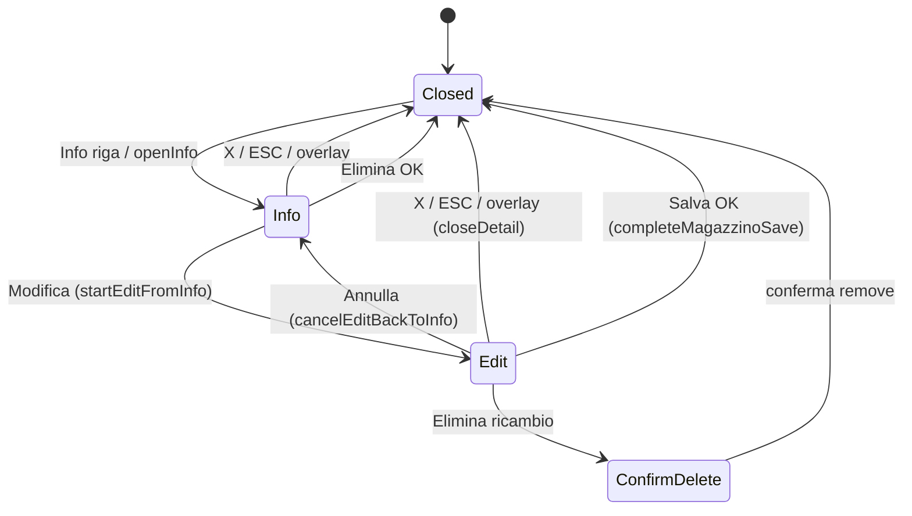

# Audit: modal «Modifica ricambio» (Magazzino)

Data: 2026-06-02  
Scope: `/magazzino` → scheda/info + modifica inline in [`magazzino-view.tsx`](../components/gestionale/magazzino/magazzino-view.tsx)  
Vincoli: nessuna nuova funzione, nessun cambio API/tipi/UX oltre ai bugfix.

## Analisi del modal

### Componenti

| Ruolo | File |
|--------|------|
| Vista / stato | [`magazzino-view.tsx`](../components/gestionale/magazzino/magazzino-view.tsx) |
| Shell | [`GestionaleModalShell`](../components/gestionale/gestionale-modal.tsx) → `LavorazioniModalShell` |
| Scroll | [`GestionaleModalScrollBody`](../components/gestionale/mobile-modal-scroll-body.tsx) |
| Form modifica | [`RicambioFormFields`](../components/gestionale/magazzino/ricambio-form-fields.tsx) |
| Scheda info | [`RicambioInfoPanel`](../components/gestionale/magazzino/ricambio-info-panel.tsx) + foto/log |
| KPI consumo | [`RicambioConsumoInfoRows`](../components/gestionale/magazzino/ricambio-info-panel.tsx) |
| Elimina | [`SettingsEliminaConfirmDialog`](../components/gestionale/gestionale-settings-ready-gate.tsx) |

### Hook e dipendenze

- `useState`: `detail` (`{ id, mode: "info" \| "edit" }`), `editDraft`, `editListFieldInvalid`, `saveBusy`, `eliminaRicambioTarget`
- `useCallback`: `setEditForm`, `focusRicambioInTable`, `flashRow`, …
- `useMemo`: `detailRicambio`, `infoTimeline`
- `useMagazzinoRicambiUIQuery`, `useQueryClient`, `useRbac` / permessi magazzino
- `useUIAutonomyFixEngine("/magazzino", [newOpen, detail, …])`

### API

- Update: `magazzinoService.update(id, ricambioUiToMagazzinoUpdate(...))`
- Delete: `magazzinoService.remove(id)` (dialog conferma)
- Post-save: `invalidateAfterMagazzinoOrMovimenti` + `patchProdotti`

### Permessi

| Azione | Flag |
|--------|------|
| Apri scheda Info | lettura lista (tutti con accesso magazzino) |
| Modifica / Salva | `magCanCreateRicambio` (write/admin) |
| Elimina | `magCanDeleteRicambio` (`globalPerm.canDeleteRecords`) |
| Foto in scheda | `magCanCreateRicambio` |

### Stati e transizioni

## Flusso completo

1. Tabella/card → **Info** → `openInfo(p)` → modal «Scheda ricambio», `editDraft = null`.
2. **Modifica** → `startEditFromInfo()` → `toFormDraft(detailRicambio)` → modal «Modifica ricambio».
3. Campi via `RicambioFormFields` + `setEditForm` (solo stato locale fino al submit).
4. **Salva** → `validateRicambioListFields` → `magazzinoService.update` → toast + `completeMagazzinoSave` (chiude modali, flash riga).
5. **Annulla** → torna a info senza salvare, `editDraft` azzerato.
6. **Elimina ricambio** → `SettingsEliminaConfirmDialog` → `remove` → chiude detail se stesso id.

Apertura modifica **solo** da scheda info (non esiste shortcut diretto in tabella).

## Test effettuati

| Fase | Esito | Note |
|------|-------|------|
| Mappatura codice | Pass | Flusso info ↔ edit ↔ save/delete |
| Apertura Info → Modifica | Pass (codice) | `startEditFromInfo` ricarica draft da `detailRicambio` |
| Chiusura X/ESC/overlay | Pass (codice) | `closeDetail` su `onRequestClose` shell |
| Salvataggio errore API | Pass (codice) | `toastError`, modal resta aperto |
| Permessi | Pass (codice) | Pulsanti disabilitati + tooltip readonly |
| A11y shell | Pass (codice) | `role="dialog"`, focus trap, `titleId` |
| Typecheck | Pass | `npx tsc --noEmit` |
| Browser E2E save/edit | Non eseguito | |
| Mobile viewport | Non eseguito | Stessa shell di «Nuovo ricambio» |

## Problemi trovati

### Critico

Nessuno.

### Alto

Nessuno bloccante su permessi o persistenza.

### Medio (corretto)

| ID | Problema | Causa | Fix |
|----|----------|-------|-----|
| M1 | Modal modifica/scheda resta aperto su «Vai al ricambio» / focus tabella / avvisi giacenza | `focusRicambioInTable` chiudeva solo `newOpen`, non `detail`/`editDraft` | `setDetail(null)`, `setEditDraft(null)`, `setEditListFieldInvalid(false)` in `focusRicambioInTable` |

### Basso (corretto)

| ID | Problema | Fix |
|----|----------|-----|
| B1 | `editListFieldInvalid` non resettato su chiusura / annulla | Reset in `closeDetail`, `cancelEditBackToInfo`, `completeMagazzinoSave` |

### Basso (non modificato)

- Nessun dialog «modifiche non salvate» (coerente con «Nuovo ricambio» e policy attuale).
- `saveEdit` se `before` assente ritorna in silenzio (ricambio rimosso da lista mentre si modifica — edge raro).
- Modifiche form non scritte nel log locale fino al save API (comportamento attuale).

## Correzioni applicate

File: [`magazzino-view.tsx`](../components/gestionale/magazzino/magazzino-view.tsx)

1. **M1** in `focusRicambioInTable`
2. **B1** in `closeDetail`, `cancelEditBackToInfo`, `completeMagazzinoSave.closeOverlays`

## Verifica finale / regression

- Typecheck: OK.
- Non modificati: `RicambioFormFields`, API update/delete, layout footer (Elimina / Annulla / Salva), modal «Nuovo ricambio», scheda info.

## Raccomandazioni manuali residue

1. Info → Modifica → cambia campo → Salva → verifica lista e scheda info aggiornate.
2. Modifica → Annulla → verifica ritorno a info senza persistere modifiche.
3. Modifica aperta → avviso giacenza «Vai al ricambio» → verifica chiusura modal e scroll riga.
4. Utente sola lettura: Modifica/Elimina disabilitati.
5. Elimina con conferma e chiusura modal.
