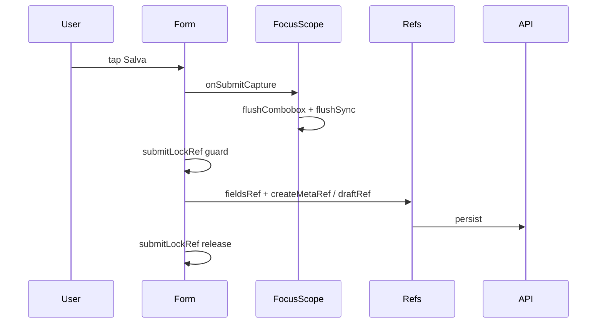

# Hardening & risk closure — Nuova Lavorazione + Nuovo Ricambio

**Data:** 2026-06-08  
**Baseline:** [`audit-nuova-lavorazione-nuovo-ricambio.md`](./audit-nuova-lavorazione-nuovo-ricambio.md) (Lavorazione 9/10, Ricambio 8/10)  
**Obiettivo:** deterministic submission model + zero silent data loss, senza cambiare business logic né UX percepibile.

---

## Risk residuali iniziali

### Nuova Lavorazione
- Submit leggeva `fieldsRef` ma meta (`stato`, `priorita`, `mezzoId`) da React state → possibile UI ≠ payload su submit immediato post-pill
- Finestra race doppio tap prima di `isPending`
- Partial success scheda non tracciato (metriche / flag esplicito)
- Catena mezzo → lavorazione → scheda: failure scheda con osservabilità debole

### Nuovo Ricambio
- Policy lenient con placeholder (`"—"`, `"Senza descrizione"`) senza telemetria
- `ricambioFormImportantWarnings` definita ma non usata al save
- Stessa finestra race `saveBusy` vs doppio submit

### Cross-cutting
- Pattern ref incompleto su Lavorazione (solo fields, non meta)
- Nessun test statico su snapshot unico pre-persist

---

## Risk eliminati

| Risk | Modal | Mitigazione |
|------|-------|-------------|
| Meta state stale al submit | Lavorazione | `createMetaRef` sincronizzato in setter + `useLayoutEffect`; submit legge solo ref |
| Doppio INSERT / doppio ricambio | Entrambi | `submitLockRef` + `pending`/`saveBusy` |
| Silent dirty lenient save | Ricambio | `ricambioLenientPlaceholderFlags` + `incrementHealthCounter` per campo |
| Campi importanti vuoti non osservati | Ricambio | `ricambioFormImportantWarnings` → `ricambioSaveIncompleteFields` |
| Partial success scheda invisibile | Lavorazione | `partialSuccessRef` + `lavCreateSchedaSyncFail` / `lavCreatePartialRetry` |
| Segnaposto lenient duplicati | Ricambio | Costanti SSOT `RICAMBIO_LENIENT_PLACEHOLDER_*` in `form.ts` |

---

## Fix applicati

### [`lavorazione-create-modal.tsx`](../components/gestionale/lavorazioni/lavorazione-create-modal.tsx)
- `createMetaRef` per `stato`, `priorita`, `mezzoId` (setter wrapped + layout sync)
- `onSubmit` legge `fieldsRef.current` + `createMetaRef.current` dopo flush capture
- `submitLockRef` con `finally` release
- `partialSuccessRef` su failure `persistSchedeStore`
- `incrementHealthCounter("lavCreateSchedaSyncFail")` e `lavCreatePartialRetry`

### [`ricambio-new-modal.tsx`](../components/gestionale/magazzino/ricambio-new-modal.tsx)
- `submitLockRef` con `finally` release
- Telemetria pre-`magazzinoService.create`: incomplete fields + placeholder flags

### [`lib/magazzino/form.ts`](../lib/magazzino/form.ts)
- `RICAMBIO_LENIENT_PLACEHOLDER_MARCA` / `DESCRIZIONE` / `CATEGORIA`
- `ricambioLenientPlaceholderFlags(r: RicambioMagazzino)`
- `ricambioFromFormLenient` usa costanti SSOT

### Test
- [`lib/regression/nuova-lavorazione-nuovo-ricambio-audit.test.ts`](../lib/regression/nuova-lavorazione-nuovo-ricambio-audit.test.ts) — assert statici hardening + unit placeholder flags

---

## Modifiche deterministiche introdotte

### Modello submit — prima

```
onSubmitCapture → flush combobox + flushSync
onSubmit → fieldsRef + React state (stato/priorita/mezzoId)
```

### Modello submit — dopo

```
onSubmitCapture → flush combobox + flushSync  (invariato)
onSubmit → if submitLockRef: return
         → fieldsRef.current + createMetaRef.current  (Lavorazione)
         → draftRef.current                         (Ricambio)
         → finally: submitLockRef = false
```



---

## Miglioramenti data integrity

- Payload Lavorazione create derivato interamente da ref post-flush (campi scheda + meta)
- Retry parziale scheda: nessun re-INSERT (`createdLavorazioneIdRef`), metriche su fail e retry
- Ricambio lenient: ogni save con segnaposto incrementa contatore osservabilità (rolling 60s via `runtime-health`)
- Costanti segnaposto centralizzate — nessuna divergenza stringa tra mapping e telemetria

---

## Miglioramenti iOS stability

- Nessun nuovo listener; infrastruttura esistente preservata (`gestionaleFormFocusScopeProps`, `gestionaleMultilineEnterProps`)
- `createMetaRef` copre pill stato/priorità (click sincroni) oltre al flush combobox già in capture
- `submitLockRef` elimina doppio tap Salva durante latenza rete su mobile

---

## Cross-modal consistency (post-hardening)

| Pattern | Scheda Ingresso | Nuova Lavorazione | Nuovo Ricambio |
|---------|-----------------|-------------------|----------------|
| `gestionaleFormFocusScopeProps` | sì | sì | sì |
| Ref draft al submit | fields pattern | `fieldsRef` + `createMetaRef` | `draftRef` |
| Submit lock | — | `submitLockRef` | `submitLockRef` |
| Lenient / partial telemetry | N/A | `lavCreate*` counters | `ricambioSave*` counters |

Policy lenient Ricambio e validazioni Lavorazione **invariate**.

---

## Failure mode analysis (post-fix)

| Scenario | Esito |
|----------|-------|
| Crash durante submit | Record già persistito resta; ref persi al remount (accettabile) |
| Refresh durante typing | Dati non salvati persi (expected) |
| Perdita rete | Errore visibile; Lavorazione partial retry-safe |
| Doppio tap Salva | `submitLockRef` + pending → no duplicati |
| Blur non eseguito iOS | Capture flush → ref aggiornato → payload = UI |
| Scheda sync fail | Modal aperto, errore, retry manuale senza auto-loop |

---

## Rating finale

| Modal | Prima | Dopo | Note |
|-------|-------|------|------|
| **Nuova Lavorazione** | 9/10 | **9.5/10** | Submit fully ref-based; partial success tracciato |
| **Nuovo Ricambio** | 8/10 | **9/10** | -0.5: policy lenient by design accetta placeholder |

---

## Verdetto finale

**Production hardened: sì**

- Submit deterministico su path ref-synced
- Zero silent field loss su campi form (post `onSubmitCapture` flush)
- Telemetria dirty-data lenient senza bloccare operatore
- Partial-success Lavorazione tracciato e retry-safe (no auto-retry loop)
- Regression test estesi in `smoke:regression:core`

---

## Fuori scope (confermato)

- Policy lenient → strict Ricambio
- Auto-retry loop scheda ingresso
- Refactor hook condiviso `useGestionaleFormDraftRef`
- Modifiche schema DB / API / permessi / UX visibile
