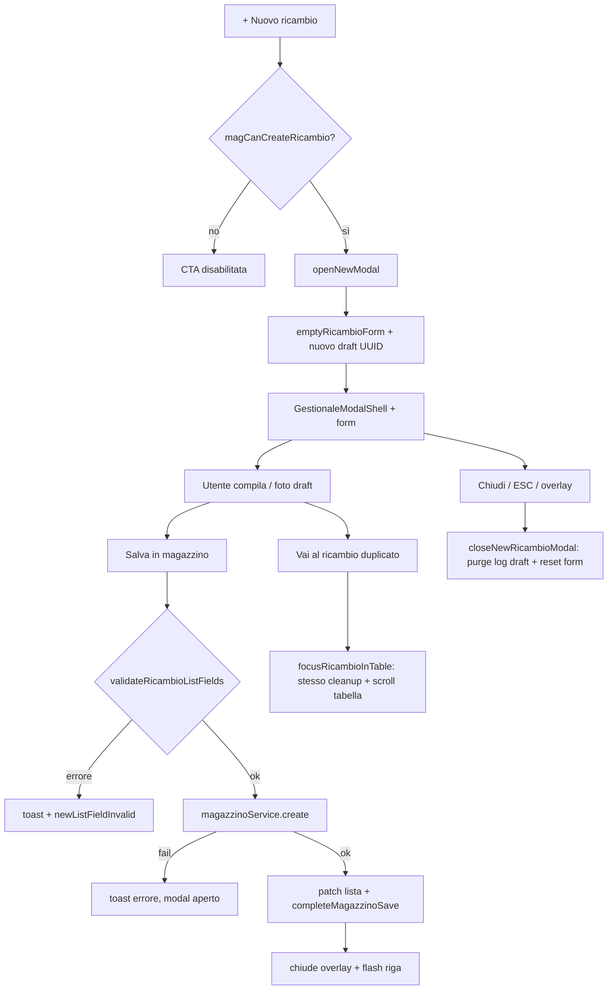

# Audit: modal «Nuovo ricambio» (Magazzino)

Data: 2026-06-02  
Scope: `/magazzino` → modal inline in [`magazzino-view.tsx`](../components/gestionale/magazzino/magazzino-view.tsx)  
Vincoli: nessuna nuova funzione, nessun cambio API/tipi/UX oltre ai bugfix.

## Analisi del modal

### Componenti

| Ruolo | File |
|--------|------|
| Vista / stato | [`magazzino-view.tsx`](../components/gestionale/magazzino/magazzino-view.tsx) |
| Shell (overlay, ESC, scroll lock, a11y) | [`GestionaleModalShell`](../components/gestionale/gestionale-modal.tsx) → `LavorazioniModalShell` |
| Corpo scroll | [`GestionaleModalScrollBody`](../components/gestionale/mobile-modal-scroll-body.tsx) |
| Campi form | [`RicambioFormFields`](../components/gestionale/magazzino/ricambio-form-fields.tsx) |
| Foto draft | [`RecordImageManager`](../components/gestionale/media/record-image-manager.tsx) |
| Submit | [`LoadingButton`](../components/design-system/loading/loading-button.tsx) |

### Hook e dipendenze React

- `useState`: `newOpen`, `newForm`, `newRicambioDraftId`, `saveBusy`, `newListFieldInvalid`
- `useCallback`: `focusRicambioInTable`, `flashRow`, …
- `useMemo`: `nuovoCodiceDupEsistente` (duplicati codice OE)
- `useEffect`: deep-link `?focus=`, sync liste, cleanup flash timeout
- `useUIAutonomyFixEngine("/magazzino", [newOpen, …])`
- `useMagazzinoRicambiUIQuery`, `useQueryClient`, `useGlobalOptions` (via form)
- `usePathname` / `useRouter` / `useSearchParams`

### Store / persistenza locale

- Log modifiche magazzino: `loadMagazzinoChangeLog`, `purgeMagazzinoLogEntriesForRicambioId` (draft UUID)
- Preferenze mezzi: `mezziListePrefs` (compatibilità)
- Filtri avanzati persistiti (non nel modal, ma resettati da `focusRicambioInTable`)
- Immagini draft: storage scope `magazzino` + `recordId={newRicambioDraftId}`

### API

- Creazione: `magazzinoService.create(ricambioUiToMagazzinoInsert(...))`
- Dopo save: `invalidateAfterMagazzinoOrMovimenti` + patch lista locale `patchProdotti`

### Stati locali del modal

| Stato | Uso |
|--------|-----|
| `newOpen` | Visibilità |
| `newForm` | `RicambioFormState` controllato |
| `newRicambioDraftId` | UUID per log/foto prima del save |
| `saveBusy` | Disabilita doppio submit |
| `newListFieldInvalid` | Ring errore su pill marca/categoria |

### Props / eventi

- Apertura: `openNewModal()` — guard `magCanCreateRicambio`
- Chiusura: `closeNewRicambioModal` → `onRequestClose` shell
- Submit: `submitNew` → `finalizeNewRicambio`
- Duplicato codice: `codiceOriginaleAvvisoDuplicato.onVaiAlRicambio` → `focusRicambioInTable`

### Permessi

- `magCanCreateRicambio = magPerm.canWrite || magPerm.canAdmin`
- Toolbar CTA disabilitata + tooltip «Sola lettura»
- `openNewModal` / `finalizeNewRicambio` / `RecordImageManager` rispettano lo stesso flag

## Flusso completo

## Test effettuati

| Fase | Esito | Note |
|------|-------|------|
| Apertura toolbar | Pass | Browser `/magazzino`, dialog «Nuovo ricambio», sezioni Identificazione → Foto |
| Chiusura ESC | Pass | Modal rimosso dal DOM |
| Reset dopo ESC + riapertura | Pass | Codice OE vuoto (prima `TEST-AUDIT-123`) |
| Input codice | Pass | Scrittura nel textbox codice fornitore |
| Chiusura X / overlay | Pass (codice) | `LavorazioniModalShell` + `closeNewRicambioModal` |
| Permessi | Pass (codice) | Guard su open/save; CTA disabilitata se readonly |
| A11y shell | Pass (codice) | `role="dialog"`, focus trap, `aria-labelledby` |
| Typecheck | Pass | `npx tsc --noEmit` |
| Salvataggio E2E | Non eseguito | Evitata creazione record di test |
| Mobile / tablet viewport | Non eseguito | Layout shell condiviso con altri modali |
| Utente readonly live | Non eseguito | |

## Problemi trovati

### Critico

Nessuno.

### Alto

Nessuno bloccante su apertura, permessi o salvataggio (errori API mostrati via toast, modal resta aperto).

### Medio (corretto)

| ID | Problema | Causa | Fix |
|----|----------|-------|-----|
| M1 | «Vai al ricambio» (codice duplicato) chiudeva il modal senza purge log draft né reset form | `focusRicambioInTable` usava solo `setNewOpen(false)` | Stesso cleanup di `closeNewRicambioModal`: purge draft, `emptyRicambioForm`, `newListFieldInvalid` |

### Basso (corretto)

| ID | Problema | Fix |
|----|----------|-----|
| B1 | Chiusura X/ESC/overlay non azzerava subito `newForm` / `newListFieldInvalid` | `closeNewRicambioModal` ora resetta form e flag invalid |

### Basso (non modificato)

- Nessun dialog «modifiche non salvate» in create (coerente con policy attuale).
- Hydration warning in dev su `app-shell.tsx` (pre-esistente, fuori scope modal).
- `openNewModal` già resettava il form alla riapertura; il bug M1 era sul percorso «Vai al ricambio».

## Correzioni applicate

File: [`magazzino-view.tsx`](../components/gestionale/magazzino/magazzino-view.tsx)

1. **`closeNewRicambioModal`**: aggiunti `setNewForm(emptyRicambioForm())` e `setNewListFieldInvalid(false)` oltre a purge log draft.
2. **`focusRicambioInTable`**: allineato cleanup draft/form prima di `setNewOpen(false)`.

## Verifica finale / regression

- Typecheck progetto: OK.
- Smoke browser: apertura, digitazione, ESC, riapertura form pulito: OK.
- Non modificati: API, `RicambioFormFields`, layout sezioni, modal dettaglio/modifica, validazione business.

## Raccomandazioni manuali residue

1. Salvataggio happy path con marca/categoria reali.
2. Inserire codice OE esistente e usare «Vai al ricambio» — verificare assenza voci log orfane sul draft UUID.
3. Utente sola lettura: CTA disabilitata e nessuna apertura programmatica.
4. Viewport mobile: scroll corpo + tastiera (`--cab-keyboard-inset`).
