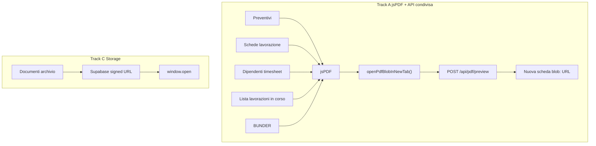

# Audit completo — Sistema PDF Gestionale CAB

**Data:** 2026-06-02  
**Modalità:** audit read-only + piano refactor implementato (fasi 1–3).  
**Report master:** [`technical-audit-report.md`](./technical-audit-report.md)

---

## 1. Executive summary

Il gestionale CAB gestisce **due famiglie distinte** di PDF:

1. **PDF generati client-side** con **jsPDF** (preventivi, schede lavorazione, dipendenti/timesheet, lista lavorazioni in corso, BUNDER).
2. **PDF archiviati** su Supabase Storage, aperti via **signed URL** (modulo Documenti + allegati hub).

L’unica route API dedicata alla preview era storicamente [`POST /api/preventivi/pdf-anteprima`](../app/api/preventivi/pdf-anteprima/route.ts) — semanticamente fuorviante perché usata da **tutti** i moduli jsPDF, non solo preventivi. L’utente finale vede una **nuova scheda con URL `blob:`**, non `/preventivi` nella barra indirizzi.

**Intervento post-audit (implementato):**

| Fase | Contenuto | Stato |
|------|-----------|-------|
| Documentazione | Questo audit + cross-ref in technical-audit-report | ✅ |
| Refactor 1 | Nuovo endpoint neutro [`POST /api/pdf/preview`](../app/api/pdf/preview/route.ts); legacy path proxy con header `Deprecation` | ✅ |
| Refactor 2 | Rimossi `pdf-preview-cache.ts`, `openSchedaPrintWindow`; BUNDER allineato a `openPdfBlobInNewTab` | ✅ |
| Refactor 3 | Toast loading/errore in preview; validazione magic bytes `%PDF-` server-side | ✅ |

**Raccomandazione architetturale:** mantenere generazione **client-side jsPDF** + template condiviso; endpoint neutro `/api/pdf/preview` come pass-through multi-istanza safe. **Non** introdurre pagina frontend `/pdf`.



---

## 2. Inventario PDF generati (jsPDF)

| Nome | Pagina origine | Entry point | Generator | Layout / template | Libreria |
|------|----------------|-------------|-----------|-------------------|----------|
| **Preventivo commerciale** | `/preventivi`; anche `/lavorazioni`, `/mezzi` | `openPreventivoPdfInNewTab` | [`lib/preventivi/preventivi-pdf.ts`](../lib/preventivi/preventivi-pdf.ts) | [`preventivo-pdf-body.ts`](../lib/pdf/preventivo-pdf-body.ts), [`preventivo-pdf-layout.ts`](../lib/pdf/preventivo-pdf-layout.ts), [`pdf-base-template.ts`](../lib/pdf/core/pdf-base-template.ts) | jsPDF + jspdf-autotable |
| **Scheda ingresso** | Hub schede in `/lavorazioni` | `openSchedaPdfInNewTab` | [`lib/schede/schede-pdf.ts`](../lib/schede/schede-pdf.ts) | [`ingresso-pdf-layout.ts`](../lib/pdf/ingresso-pdf-layout.ts) | jsPDF + template condiviso |
| **Scheda lavorazioni** | idem | idem | idem | [`schede-pdf-layout.ts`](../lib/pdf/schede-pdf-layout.ts) | jsPDF |
| **Scheda ricambi** | idem | idem | idem | idem | jsPDF |
| **Timesheet aziendale** | `/dipendenti` | `openDipendentiPdfComplessivoInNewTab` | [`lib/dipendenti/pdf/dipendenti-pdf-export.ts`](../lib/dipendenti/pdf/dipendenti-pdf-export.ts) | [`dipendenti-pdf-sections.ts`](../lib/dipendenti/pdf/dipendenti-pdf-sections.ts) | jsPDF landscape + autotable |
| **Timesheet singolo dipendente** | `/dipendenti` | `openDipendentiPdfDipendenteInNewTab` | idem | idem | jsPDF portrait |
| **Lista lavorazioni in corso** | `/lavorazioni` (menu “Stampa”) | `openLavorazioniInCorsoPdfInNewTab` | [`lib/lavorazioni/lavorazioni-list-pdf.ts`](../lib/lavorazioni/lavorazioni-list-pdf.ts) | header condiviso + [`gestionale-section-table.ts`](../lib/pdf/gestionale-section-table.ts) | jsPDF landscape |
| **Documento commerciale BUNDER** | `/bunder` | `openBunderPdfInNewTab` | [`lib/bunder/bunder-pdf.ts`](../lib/bunder/bunder-pdf.ts) | Layout proprio (non template gestionale) | jsPDF + jspdf-autotable |

**Dipendenze npm:** solo `jspdf` e `jspdf-autotable`. Nessun pdf-lib, react-pdf, html2pdf.

### Export correlati (non PDF binario jsPDF)

| Nome | Origine | Funzione | Meccanismo |
|------|---------|----------|------------|
| BUNDER Word | `/bunder` editor | `openBunderWordInNewTab` | HTML → Blob `application/msword` |
| BUNDER Stampa | `/bunder` editor | `openBunderPrintPreview` | `document.write` + `window.print()` |

### PDF archiviati (non generati)

| Nome | Origine | Funzione | Meccanismo |
|------|---------|----------|------------|
| Documento archivio | `/documenti`, hub lavorazioni/mezzi/schede | `openDocumentoFile` | [`documenti-helpers.ts`](../components/gestionale/documenti/documenti-helpers.ts) → signed URL Supabase |
| Allegati scheda (PDF/foto) | Hub schede | `openBlobInNewTab` | Data URL base64 da `fileEsterno` |

### Assenti

- **Report:** nessun export PDF.
- **Magazzino / Mezzi standalone:** nessun generatore PDF proprio (solo preventivi collegati al mezzo).

---

## 3. Mappa architettura

### Flusso dominante (Preventivi, Schede, Dipendenti, Lavorazioni list, BUNDER)

```
Pagina UI (click "PDF" / "Anteprima PDF" / "Stampa")
  → funzione open*PdfInNewTab (modulo-specifica)
  → jsPDF client-side (template condiviso o modulo-specifico)
  → doc.output("blob")
  → openPdfBlobInNewTab()  [lib/pdf/open-pdf-blob-preview.ts]
       → POST multipart /api/pdf/preview { fileName, pdf }
       → Response application/pdf + Content-Disposition: inline
       → URL.createObjectURL → openUrlInNewTab(blob:...)
  → Nuova scheda browser (viewer PDF nativo)
  → fallback locale se POST fallisce (con toast warning)
```

### Flusso documenti archivio

```
/documenti → openDocumentoFile
  → resolveDocumentoFileUrlSigned (storage.service)
  → window.open(signedUrl)
```

---

## 4. Analisi route PDF

| Route | Tipo | Stato | Uso reale |
|-------|------|-------|-----------|
| `POST /api/pdf/preview` | API condivisa | **Attiva (canonico)** | Pass-through blob + `Content-Disposition` per tutti i jsPDF |
| `POST /api/preventivi/pdf-anteprima` | API legacy | **Proxy deprecato** | Delega a handler condiviso; header `Deprecation` + `Link` successor |
| `GET /api/preventivi/pdf-anteprima` | API legacy | **410 Gone** | Token cache rimosso |
| `/preventivi?...` | Pagina app | Navigazione | Link a editor preventivi da mezzi/lavorazioni — **non** preview PDF |

**Perché `/preventivi` nell’API (storico)?**

- L’anteprima PDF nacque per i **preventivi** (nome file, cartella `app/api/preventivi/`).
- Fix audit CRITICO: sostituito pattern token in-memory (multi-istanza unsafe) con **POST blob inline**.
- Gli altri moduli riusarono lo stesso helper senza rinominare l’endpoint.

Config centralizzata: [`lib/pdf/pdf-preview-config.ts`](../lib/pdf/pdf-preview-config.ts).  
Handler condiviso: [`lib/pdf/pdf-preview-handler.ts`](../lib/pdf/pdf-preview-handler.ts).

---

## 5. Problema `/preventivi/...` in DevTools

| Contesto | Cosa appare | Spiegazione |
|----------|-------------|-------------|
| Export PDF da `/dipendenti` | Network: `POST .../api/pdf/preview` (prima `/api/preventivi/pdf-anteprima`) | Helper condiviso [`open-pdf-blob-preview.ts`](../lib/pdf/open-pdf-blob-preview.ts) |
| Export PDF da schede/lavorazioni | Stesso POST | Stesso helper |
| Export BUNDER | Stesso POST (post-refactor) | Allineato a pipeline condivisa |
| Click “Vai a preventivo” da mezzi | Navigazione `/preventivi?mezzo=...` | Navigazione editor, non PDF |

### File responsabili

| Ruolo | File |
|-------|------|
| Central hub | [`lib/pdf/open-pdf-blob-preview.ts`](../lib/pdf/open-pdf-blob-preview.ts) |
| API canonica | [`app/api/pdf/preview/route.ts`](../app/api/pdf/preview/route.ts) |
| API legacy | [`app/api/preventivi/pdf-anteprima/route.ts`](../app/api/preventivi/pdf-anteprima/route.ts) |
| Consumer | `preventivi-pdf.ts`, `schede-pdf.ts`, `dipendenti-pdf-export.ts`, `lavorazioni-list-pdf.ts`, `bunder-pdf.ts` |

### Impatto

| Dimensione | Valutazione |
|------------|-------------|
| UX utente finale | Basso — barra indirizzi mostra `blob:` |
| UX sviluppatore / supporto | **Risolto** — endpoint neutro `/api/pdf/preview` |
| Architettura | Medio — permessi OR su moduli + `can_read_operational` per BUNDER |
| Sicurezza | Medio — pass-through con validazione `%PDF-` |
| Performance | Medio — round-trip server (backlog: eliminare se browser supporta filename su blob) |

---

## 6. Confronto architetture

### Soluzione A — PDF dalla pagina di origine

Ogni modulo con route API dedicata (`/api/dipendenti/pdf-preview`, ecc.).

| Pro | Contro |
|-----|--------|
| Permessi granulari | Duplicazione route/handler |
| Naming chiaro | 4–5 endpoint quasi identici |

### Soluzione B — Centro PDF unico

`/api/pdf/preview` + registry template (o pass-through neutro).

| Pro | Contro |
|-----|--------|
| Un solo contratto API | Rischio “god endpoint” se si sposta rendering server-side |
| Naming corretto | Permessi devono mappare `documentKind` (futuro) |
| Rate limit centralizzato | — |

### Soluzione C — Architettura pre-refactor

Client jsPDF + endpoint sotto `/preventivi` + BUNDER fuori pipeline.

| Pro | Contro |
|-----|--------|
| Fix multi-istanza già fatto | Nome fuorviante |
| Template condiviso maturo | Round-trip ridondante |
| | Dead code token cache |

**Scelta implementata:** **ibrido B→A** — generazione client-side per modulo, endpoint neutro `/api/pdf/preview`, generatori per modulo invariati.

---

## 7. Audit tecnico (duplicazioni / dead code)

| Item | Stato post-refactor |
|------|---------------------|
| Template header/footer | Centralizzato in `preventivo-pdf-layout.ts` — **buono** |
| Tabelle | `gestionale-section-table.ts` — condiviso dipendenti/lavorazioni list |
| BUNDER layout | Proprio by design — usa pipeline preview condivisa |
| `pdf-preview-cache.ts` | **Rimosso** |
| `openSchedaPrintWindow` | **Rimosso** |
| GET pdf-anteprima | **410 Gone** (invariato) |
| `open-pdf-blob-preview` vs BUNDER | **Unificato** |
| `open-url-new-tab.ts` | Condiviso — fix popup Chromium |

---

## 8. Bug analysis

| ID | Severità | Descrizione | Stato |
|----|----------|-------------|-------|
| PDF-001 | P2 | Round-trip POST ridondante | Aperto (backlog performance) |
| PDF-002 | P2 | BUNDER filename generico | **Risolto** — pipeline condivisa + nome file esplicito |
| PDF-003 | P3 | POST fallito → fallback silenzioso | **Risolto** — toast warning |
| PDF-004 | P3 | Nessun loading durante generazione + POST | **Risolto** — toast info “Apertura PDF in corso…” |
| PDF-005 | P2 | API accetta PDF arbitrario | **Mitigato** — validazione `%PDF-` |
| PDF-006 | P3 | Permessi OR non verifica modulo chiamante | Aperto — accettabile per pass-through |
| PDF-007 | P3 | `openDocumentoFile` popup blocker senza toast | Aperto |
| PDF-008 | P3 | Mobile: viewer OS, nessun fallback in-app | Aperto |
| PDF-009 | P2 | `pdf-preview-cache.ts` orphan | **Risolto** — file rimosso |

### Edge case

- Popup blocker → toast warning (track jsPDF con `openUrlInNewTab`).
- Liste vuote dipendenti → early return; lavorazioni → toast warning.
- PDF > 15MB → 413 dall’API, fallback blob locale + toast.
- Rate limit 30 POST/min/IP ([`pdf-preview-rate-limit.ts`](../lib/preventivi/pdf-preview-rate-limit.ts)).
- Body non-PDF → 400 “Il file non è un PDF valido”.

---

## 9. UX analysis

| Aspetto | Stato |
|---------|-------|
| Label pulsanti | Inconsistente: “PDF”, “Anteprima PDF”, “Stampa”, “PDF complessivo” |
| Posizione | Toolbar pagina; icona riga; editor footer |
| Feedback attesa | Toast info durante POST (default on) |
| Errori | Toast su POST fallito; popup blocker già gestito |
| Coerenza visiva | Template gestionale condiviso; BUNDER layout commerciale dedicato |

**Backlog UX:** unificare label (“Apri PDF” / “Scarica PDF”); loading overlay globale opzionale via `onBusyChange`.

---

## 10. Sicurezza

Handler [`lib/pdf/pdf-preview-handler.ts`](../lib/pdf/pdf-preview-handler.ts):

- Auth: session cookie + permesso modulo OR `can_read_operational` (BUNDER).
- Rate limit IP: 30/min.
- Max body: 15MB.
- Validazione header file: `%PDF-` (primi 5 byte).
- Headers risposta: `no-store`, `nosniff`, `Content-Disposition: inline`.

**Gap residui:**

- Nessun controllo che il PDF sia generato dal gestionale (pass-through intenzionale).
- Documenti archivio: sicurezza = RLS storage + signed URL expiry (path separato).

---

## 11. Proposta refactor ideale (stato)

```
lib/pdf/
  core/                    # template, table, filename utils (esistente)
  generators/             # backlog: consolidare preventivo, scheda, dipendenti, lavorazioni, bunder
  preview/
    open-pdf-blob-preview.ts
    open-url-new-tab.ts
    pdf-preview-config.ts
    pdf-preview-handler.ts

app/api/pdf/preview/route.ts   # canonico
app/api/preventivi/pdf-anteprima/route.ts  # proxy deprecato (rimuovere dopo 1 release)
```

### Piano migrazione (completato)

1. **Document + alias** — `/api/pdf/preview` + legacy proxy con `Deprecation`. ✅
2. **Cleanup dead code** — `pdf-preview-cache.ts`, `openSchedaPrintWindow`. ✅
3. **Unificare BUNDER** — `openPdfBlobInNewTab` con filename coerente. ✅
4. **UX hardening** — loading toast + error toast + validazione `%PDF-`. ✅

### Backlog futuro

- Parametro `documentKind` + permessi granulari per tipo.
- Worker jsPDF (audit fase 12).
- Eliminare round-trip se `download` attribute su blob con filename è sufficiente.
- Rimuovere route legacy `/api/preventivi/pdf-anteprima` dopo periodo di deprecazione.

---

## 12. Branding header/footer PDF (2026-06-07)

### Inventario generatori gestionale (Track A)

| Modulo | Generator | Header SSOT | Logo branding |
|--------|-----------|-------------|---------------|
| Preventivi | `lib/preventivi/preventivi-pdf.ts` | `drawGestionalePdfHeader` | `loadBrandingLogoDataUrl()` |
| Schede (×3) | `lib/schede/schede-pdf.ts` | idem | idem |
| Timesheet dipendenti | `lib/dipendenti/pdf/dipendenti-pdf-sections.ts` | idem | idem |
| Lista lavorazioni | `lib/lavorazioni/lavorazioni-list-pdf.ts` | idem | idem |

**Fuori scope:** BUNDER (`lib/bunder/bunder-pdf.ts` — brand proprio), PDF archiviati/allegati (file già salvati).

### Strategia implementata

**SSOT layout:** [`lib/pdf/preventivo-pdf-layout.ts`](../lib/pdf/preventivo-pdf-layout.ts)

| Elemento | Comportamento |
|----------|---------------|
| `drawPdfBrandBlock` | Logo centrato **oppure** testo `PDF_COMPANY_NAME` (fallback) — mutuamente esclusivi |
| Slot verticale fisso | `PDF_HEADER_BRAND_BLOCK_MM` (6.5 mm) — titolo documento parte dallo stesso Y con logo o testo |
| Logo max | `PDF_HEADER_BRAND_MAX_MM` / `CAB_LOGO_PDF_MAX_HEIGHT_MM` = 8 mm (scalato entro slot 6.5 mm) |
| Sorgente logo | `GET /api/branding/logo` via [`loadBrandingLogoDataUrl()`](../lib/branding/branding-logo-for-pdf.ts) (custom o default `/cab-logo.png`) |
| Footer | Solo paginazione a sinistra (`N. xxx · Pag. i/n`) — **rimosso** testo aziendale a destra |
| Fallback | Logo assente/corrotto/`addImage` fallito → header testuale originale |

### Paginazione

- Prima (bug): logo 12 mm **+** testo aziendale → header più alto → rischio pagine extra.
- Dopo: logo **sostituisce** testo nello slot fisso → page count invariato (verificato in [`lib/pdf/pdf-header-branding.test.ts`](../lib/pdf/pdf-header-branding.test.ts)).

### Verifica

```bash
node --import tsx lib/pdf/pdf-header-branding.test.ts
npx tsc --noEmit
```

Smoke manuale consigliato: anteprima PDF da Preventivi, Schede, Dipendenti, Lavorazioni (documento piccolo/medio/grande) — download, stampa A4, nitidezza logo.

---

## Mappa file coinvolti

| Layer | File chiave |
|-------|-------------|
| API | `app/api/pdf/preview/route.ts`, `app/api/preventivi/pdf-anteprima/route.ts` |
| Preview hub | `lib/pdf/open-pdf-blob-preview.ts`, `lib/pdf/open-url-new-tab.ts`, `lib/pdf/pdf-preview-config.ts`, `lib/pdf/pdf-preview-handler.ts` |
| Template | `lib/pdf/core/pdf-base-template.ts`, `preventivo-pdf-layout.ts`, `gestionale-section-table.ts` |
| Generatori | `preventivi-pdf.ts`, `schede-pdf.ts`, `dipendenti-pdf-export.ts`, `lavorazioni-list-pdf.ts`, `bunder-pdf.ts` |
| UI | `preventivi-view.tsx`, `preventivi-editor-modal.tsx`, `schede-lavorazione-modal.tsx`, `dipendenti-view.tsx`, `lavorazioni-view.tsx`, `bunder-view.tsx` |
| Storage PDF | `documenti-helpers.ts`, `storage.service.ts` |
| Sicurezza | `pdf-preview-rate-limit.ts`, `server-permission-guards.ts` |
| Policy CI | `lib/regression/pdf-preview-policy.test.ts` |
