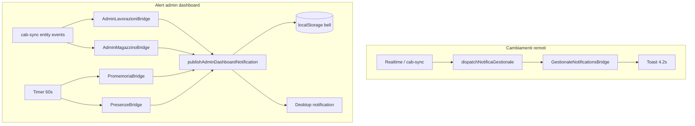

# FASE 10 — Audit notifiche (Gestionale CAB)

Inventario toast operativi, campanella admin, notifiche desktop e bridge schedulati. Stato verificato **2026-06-02** post-fix fasi 1–9.

**Documenti correlati:** [`audit-phase9-data-sync-audit.md`](./audit-phase9-data-sync-audit.md) · [`audit-phase4-edge-cases.md`](./audit-phase4-edge-cases.md)

**Legenda:** ✅ gestito · ⚠️ parziale · ❌ gap · 📋 backlog/documentato · 🔧 fix audit applicato

---

## Sintesi esecutiva

| Track | Storage | Audience | Persistenza | Cross-device |
|-------|---------|----------|-------------|--------------|
| Toast operativi (sync remoto) | In-memory | Admin + security | ~4.2s | N/A |
| Campanella admin | localStorage per `userId` | Dashboard readers* | Persiste | ❌ solo device |
| Desktop OS | Browser `Notification` API | Opt-in | Session | ❌ |
| Promemoria schedulati | DB + bell | Dashboard readers | `notified_at` DB | ✅ eventi DB |

\* Bridge operativi (lavorazioni, magazzino, presenze) pubblicano solo se **`isAdmin`**; promemoria calendario per **`canRead("dashboard")`**.

---

## Architettura dual-track



| Componente | File | Ruolo |
|------------|------|-------|
| Toast sync | `lib/sync/gestionale-notification-dispatch.ts` | Label + dedup 5s bucket 3s |
| Toast UI | `src/components/gestionale-notifications-bridge.tsx` | Admin/security only; view dedup 2.5s |
| Bell store | `lib/lavorazioni/admin-notification-store.ts` | Upsert dedup per `notificationStoreKey` |
| Bell hook | `src/hooks/gestionale/use-admin-notification-store.ts` | Hydration-safe; `storage` cross-tab |
| Bell UI | `components/dashboard/admin-notifications-bell.tsx` | Panel, mark read, dismiss |
| Desktop | `lib/lavorazioni/desktop-notifications.ts` | Permission once; tag dedup OS |
| Publish | `lib/notifications/admin-dashboard-desktop.ts` | Store + desktop unico entry |

Montaggio: `DeferredGestionaleBridges` (post-auth, rAF defer).

---

## Tipi notifica campanella

| `kind` | Trigger | Audience bridge | Deep link |
|--------|---------|-----------------|-----------|
| `lavorazione_created` | cab-sync INSERT lavorazioni (remote) | Admin | `/lavorazioni?focusLav=` |
| `magazzino_sotto_scorta` | crossing scorta/minimo | Admin | `/magazzino?focusRicambio=` |
| `dipendenti_presenze_reminder` | 17:00 feriali, zero presenze oggi | Admin | `/dipendenti` |
| `dashboard_promemoria_reminder` | 09:00 o 30 min prima evento | Dashboard readers | `/dashboard` |
| `admin_dashboard_test` | Pulsante test UI | Admin | `/dashboard` |

---

## Toast operativi (sync remoto)

| Entità cab-sync | Messaggio toast | Note |
|-----------------|-----------------|------|
| lavorazioni update/delete | ✅ | CREATE escluso (→ bell) |
| magazzino_ricambi | ✅ | |
| movimenti_ricambi | ✅ | |
| preventivi, mezzi, documenti | ✅ | |
| scheda_lavorazione | ✅ | |
| bunder_documents | 🔧 fase 10 | |
| dashboard_promemoria | 🔧 fase 10 | |
| app_settings, log_modifiche | — | settings ha toast dedicato bridge |
| dipendenti_timesheet_* | — | 📋 no toast (volume alto) |
| user_permissions | — | truth layer invalidation |

**Dedup:** fingerprint `${entity}:${type}:${id}:${bucket}` + secondo layer viewport 2.5s.

---

## Findings e fix

### P10-001 — Store campanella senza cap

| | |
|---|---|
| **Severità** | P2 |
| **Problema** | `upsertAdminNotification` cresceva senza limite → rischio quota localStorage. |
| **Fix** | 🔧 `ADMIN_NOTIFICATION_STORE_MAX_ITEMS = 150`; prune oldest read, poi oldest. |

### P10-002 — Campanella vs bridge audience mismatch

| | |
|---|---|
| **Severità** | P3 (by-design) |
| **Problema** | Hook abilita bell per `canRead("dashboard")`; bridge lavorazioni/magazzino/presenze solo `isAdmin`. |
| **Stato** | 📋 Operatore vede campanella (promemoria calendario); alert operativi solo admin. |

### P10-003 — Notifiche solo localStorage

| | |
|---|---|
| **Severità** | P3 |
| **Problema** | Nessuna tabella server notifiche; cambio device perde storico bell. |
| **Stato** | 📋 accettato — promemoria DB-side con `notified_at`; bell è cache UX locale. |

### P10-004 — Multi-tab toast duplicati

| | |
|---|---|
| **Severità** | P2 |
| **Stato** | ⚠️ parziale — dedup dispatch 5s + view 2.5s; tab diverse possono mostrare toast identici entro bucket. |
| **Azione** | 📋 backlog BroadcastChannel dedup toast (non implementato). |

### P10-005 — Promemoria richiede app aperta

| | |
|---|---|
| **Severità** | P2 |
| **Stato** | ⚠️ by-design — polling 60s su bridge; no push server / service worker. |
| **Azione** | 📋 backlog push/email se requisito business. |

### P10-006 — Desktop permission una tantum

| | |
|---|---|
| **Severità** | P3 |
| **Stato** | ✅ `requestDesktopNotificationPermissionOnce` + flag `cab-desktop-notifications-asked`; retry interattivo da UI test. |

### P10-007 — Logout non cancella store

| | |
|---|---|
| **Severità** | P3 |
| **Stato** | ✅ by-design — chiave `cab:admin-dashboard-notifications:{userId}` isolata per utente; stesso browser multi-account ok. |

### P10-008 — Legacy migration lav-notifications

| | |
|---|---|
| **Severità** | P3 |
| **Stato** | ✅ auto-migrate `cab:admin-lav-notifications:` → store unificato. |

---

## Regole soppressione toast/bell

| Condizione | Effetto |
|------------|---------|
| `isLocalCreate` lavorazione | No bell (mutazione stessa tab) |
| Path `/lavorazioni` | No bell lavorazione |
| Path `/dashboard` | No toast leggero lavorazione/magazzino |
| Path `/magazzino` | No toast sotto-scorta |
| Path `/dipendenti` | Re-check presenze reminder |
| `isAdmin === false` | No bridge lavorazioni/magazzino/presenze |
| Promemoria già in store (`notification.id`) | Skip |
| Promemoria DB `notified_at` set | Skip re-notify |

---

## Fix applicati (fase 10)

| ID | Artefatto |
|----|-----------|
| P10-001 | `lib/lavorazioni/admin-notification-store.ts` — cap 150 + prune |
| P10-001 | Test cap in `lib/lavorazioni/admin-notifications.test.ts` |
| Toast labels | `lib/sync/gestionale-notification-dispatch.ts` — BUNDER + promemoria |
| CI | `lib/regression/notifications-policy.test.ts` |

---

## Checklist verifica manuale

| # | Scenario | Pass atteso |
|---|----------|-------------|
| 1 | Admin tab A crea lavorazione, admin tab B su `/magazzino` | Bell + toast "Nuova lavorazione" tab B |
| 2 | Stesso admin crea lavorazione su tab A | Nessuna notifica (local create suppress) |
| 3 | Ricambio scende sotto scorta minima (remote) | Bell + toast magazzino |
| 4 | 17:00 feriale senza presenze | Bell presenze dipendenti (solo admin) |
| 5 | Promemoria oggi alle 09:00 | Bell promemoria (dashboard readers) |
| 6 | Segna tutte lette + Elimina lette | Store coerente, badge azzerato |
| 7 | Permesso desktop negato | Bell ok, no popup OS |

---

## Verifica automatica

```bash
npm run ci:tsc
npx tsx lib/lavorazioni/admin-notifications.test.ts
npx tsx lib/dipendenti/dipendenti-presenze-reminder.test.ts
npx tsx lib/dashboard/dashboard-promemoria-reminder.test.ts
npx tsx lib/regression/notifications-policy.test.ts
npm run smoke:regression
```

---

## Riferimenti codice

| Area | Path |
|------|------|
| Store | `lib/lavorazioni/admin-notification-store.ts` |
| Tipi | `lib/notifications/admin-dashboard-notifications.ts` |
| Desktop publish | `lib/notifications/admin-dashboard-desktop.ts` |
| Toast dispatch | `lib/sync/gestionale-notification-dispatch.ts` |
| Bridges | `src/components/admin-*-notification-bridge.tsx` |
| Montaggio | `src/components/deferred-gestionale-bridges.tsx` |
| Bell UI | `components/dashboard/admin-notifications-bell.tsx` |

---

## Documenti audit per fase

| Fase | Documento |
|------|-----------|
| 2 | [`audit-phase2-page-inventory.md`](./audit-phase2-page-inventory.md) |
| 3 | [`audit-phase3-bug-hunt-plan.md`](./audit-phase3-bug-hunt-plan.md) |
| 4 | [`audit-phase4-edge-cases.md`](./audit-phase4-edge-cases.md) |
| 5 | [`audit-phase5-storage-audit.md`](./audit-phase5-storage-audit.md) |
| 6 | [`audit-phase6-technical-debt.md`](./audit-phase6-technical-debt.md) |
| 7 | [`audit-phase7-security-audit.md`](./audit-phase7-security-audit.md) |
| 8 | [`audit-phase8-permissions-audit.md`](./audit-phase8-permissions-audit.md) |
| 9 | [`audit-phase9-data-sync-audit.md`](./audit-phase9-data-sync-audit.md) |
| 10 | questo documento |
