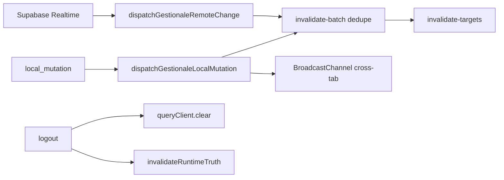

# FASE 5 — Storage Audit (Gestionale CAB)

Inventario completo di **localStorage**, **sessionStorage**, **cache React Query**, cookie auth e pipeline di invalidazione. Stato verificato sul codebase **post-fix audit** (BUNDER DB, report manual DB sync, RBAC fail-closed).

**Riferimenti:** [`audit-phase2-page-inventory.md`](./audit-phase2-page-inventory.md) · [`audit-phase4-edge-cases.md`](./audit-phase4-edge-cases.md)

**Legenda tipo dato:** 🟢 UX/prefs · 🟡 undo/audit locale · 🔵 bridge sessione · 🟠 business legacy · 🔴 business attivo (solo device) · ⚪ flag migrazione

**Legenda rischio:** CRITICO · ALTO · MEDIO · BASSO

---

## Sintesi esecutiva

| Layer | Chiavi attive | Business-critical | Obsolete / flag migrazione |
|-------|---------------|-------------------|----------------------------|
| localStorage | **27** | 3 legacy + 6 change-log | 4 flag migrazione + 1 legacy prefix |
| sessionStorage | **13** (+4 legacy portal filters) | 2 bridge preventivi | auth hint, settings cache |
| React Query | **~25** query key roots | tutti moduli ERP | alias deprecated `SCHEDE_STORE_QUERY_KEY` |
| Cookie | Supabase session | auth token | — |

**Post-fix critici:**
- BUNDER entity → **`bunder_documents`** (Supabase); LS `gestionale-bunder-commercial-docs-v1` migrato e rimosso
- Report override magazzino → **`app_settings`** (`report.magazzino_manual_month_map_v1`); LS legacy rimosso post-migrazione
- Preventivi → **DB-primary** (default); LS entity solo migrazione one-shot

---

## 1. localStorage — inventario completo

### 1.1 Business data e legacy

| Chiave | Tipo | Contenuto | Rischio | Stato | Pulizia logout |
|--------|------|-----------|---------|-------|----------------|
| `gestionale-bunder-commercial-docs-v1` | 🟠 legacy | Documenti BUNDER JSON | ~~CRITICO~~ → migrato | **Obsoleta** post-migrazione | No |
| `gestionale-bunder-local-migrated-v1` | ⚪ flag | `"1"` se LS→DB completato | BASSO | Attiva | No |
| `gestionale-preventivi-v1` | 🟠 legacy | Entity preventivi (max 500) | ALTO se `PREVENTIVI_DB_PRIMARY=false` | Deprecated read-only migrazione | No |
| `gestionale-preventivi-learning-v1` | 🟡 | Learning rules PDF | MEDIO | Attiva (sync DB parallelo) | No |
| `gestionale-preventivi-learning-v1-migrated` | ⚪ flag | Migrazione learning | BASSO | Attiva | No |
| `gestionale-lavorazioni-schede-v1` | 🟠 | Store schede per lavorazione | ALTO se `isSchedeDbPrimary()` false | Fallback + merge DB | No |
| `gestionale-report-magazzino-manual-v1` | 🟠 legacy | Override KPI mensili | MEDIO | **Obsoleta** post `mag-manual-db-v1` | No |
| `gestionale-report-mag-manual-db-v1` | ⚪ flag | LS→`app_settings` completato | BASSO | Attiva | No |
| `gestionale-sistema-preventivi-defaults-v1` | 🟡 | Default costo orario (legacy) | BASSO | Superseded da `app_settings` runtime | No |

**File:** `lib/bunder/bunder-sync-adapter.ts`, `lib/preventivi/preventivi-storage.ts`, `lib/schede/lavorazioni-schede-storage.ts`, `lib/report/magazzino-manual-db-sync.ts`

---

### 1.2 Change log undo (device-local)

| Chiave | Modulo | Max entries | Merge server | Rischio |
|--------|--------|-------------|--------------|---------|
| `gestionale-lavorazioni-change-log-v1` | lavorazioni | cap in file | sì (undo log) | MEDIO |
| `gestionale-preventivi-change-log-v1` | preventivi | cap | sì | MEDIO |
| `gestionale-magazzino-change-log-v1` | magazzino | cap | sì | MEDIO |
| `gestionale-documenti-change-log-v1` | documenti | cap | sì | MEDIO |
| `gestionale-bunder-change-log-v1` | bunder | cap | **no** (solo LS) | MEDIO |
| `gestionale-mezzi-change-log-v1` | mezzi | cap | sì | MEDIO — **file definito, view non usa** |
| `gestionale-dashboard-sistema-log-v1` | dashboard drawer | cap | no (≠ feed DB) | MEDIO |

**Nota:** undo session isolata per tab via sessionStorage (`gestionale-undo-session-id`); reset a logout.

---

### 1.3 Notifiche admin (per userId)

| Chiave | Pattern | Cross-device | Legacy |
|--------|---------|--------------|--------|
| `cab:admin-dashboard-notifications:{userId}` | items + lastSeenAt | ❌ | — |
| `cab:admin-lav-notifications:{userId}` | — | ❌ | **Sì** — auto-migrate on read |

**File:** `lib/lavorazioni/admin-notification-store.ts`

**Rischio:** MEDIO — notifiche perse cambiando browser; intenzionale per privacy device.

---

### 1.4 UX / preferenze UI

| Chiave | Scopo | Rischio |
|--------|-------|---------|
| `cab-theme` | dark/light | BASSO |
| `cab-theme-default-dark-v1` | migration one-shot default dark | BASSO |
| `cab-sidebar-collapsed` | `"1"` sidebar desktop | BASSO |
| `cab-desktop-notifications-asked` | permesso Notification API chiesto | BASSO |
| `cab-documenti-tree-pref` | preferenza albero documenti | BASSO |
| `gestionale-lavorazioni-prefs-v1` | prefs lista/kanban legacy | BASSO |
| `gestionale-magazzino-master-prefs-v1` | prefs master lists (legacy parziale) | MEDIO drift vs DB |
| `gestionale-mezzi-liste-prefs-v1` | catalogo liste mezzi locale | MEDIO drift vs DB |
| `gestionale-dashboard-tasks-v1` | task panel note locali | MEDIO — solo device |

---

### 1.5 Matrice rischio localStorage (priorità remediation)

| ID | Chiave / area | Sev | Azione |
|----|---------------|-----|--------|
| LS-001 | BUNDER change log solo LS | MEDIO | Migrare a `log_modifiche` o accettare |
| LS-002 | Schede LS fallback | ALTO | Verificare `isSchedeDbPrimary()` sempre true in prod |
| LS-003 | Preventivi LS se flag off | ALTO | Garantire `PREVENTIVI_DB_PRIMARY` in prod |
| LS-004 | Mezzi change log unused | BASSO | Rimuovere o wire |
| LS-005 | Dashboard tasks/sistema-log | MEDIO | Documentare o sync DB |
| LS-006 | Mezzi/magazzino master prefs drift | MEDIO | Consolidare in `app_settings` |

---

## 2. sessionStorage — inventario completo

| Chiave | Tipo | Scopo | Pulizia logout | Rischio |
|--------|------|-------|----------------|---------|
| `gestionale-undo-session-id` | 🔵 | ID sessione undo per tab | **✅ reset** (`resetUndoSession`) | BASSO |
| `cab-gestionale-tab-id` | 🔵 | Dedup BroadcastChannel | Persiste fino a chiudi tab | BASSO |
| `cab.runtime.settings.resolved.v1` | cache | Settings risolti in-memory mirror | Parziale (`clearRuntimeCabAppSettings` on login switch) | MEDIO stale |
| `cab.runtime.settings.payload.v1` | cache | Payload rows + resolved | idem | MEDIO |
| `cab.authRoleHint` | hint | `{userId, ruolo}` per guard async | Rimosso in cache clear permessi | MEDIO — client-writable |
| `cab-pending-preventivo-lav-v1` | 🔵 | Bridge lavorazioni→preventivi (consume-on-read) | No esplicita | MEDIO orphan draft |
| `cab-preventivo-ephemeral-draft-v1` | 🔵 | ID bozza rollback | Cleanup in preventivi-view | MEDIO |
| `gestionale-lavorazioni-advanced-filters-v1` | 🟢 | Filtri avanzati | No | BASSO |
| `gestionale-preventivi-advanced-filters-v1` | 🟢 | Filtri avanzati | No | BASSO |
| `gestionale-magazzino-advanced-filters-v1` | 🟢 | Filtri avanzati | No | BASSO |
| `gestionale-documenti-advanced-filters-v1` | 🟢 | Filtri avanzati | No | BASSO |
| `gestionale-client-lavorazioni-filters-v5` | 🟢 | Filtri portale (+ migrazione v1–v4) | No | BASSO |
| `lavorazioni-kanban-mobile-open-section` | 🟢 | Sezione kanban mobile aperta | No | BASSO |

**Logout cleanup esplicito:**
- `queryClient.clear()` — tutta cache RQ
- `resetUndoSession()` — undo session id
- `clearClientEffectivePermissionsSnapshotCache()` — hint permessi
- **Non** pulisce filtri sessionStorage (by design UX)
- **Non** pulisce `cab.runtime.settings.*` sempre — cleared on user switch in auth apply path

---

## 3. Cookie e auth storage

| Storage | Contenuto | Gestione |
|---------|-----------|----------|
| **Cookie Supabase** | JWT session, refresh token | `getBrowserSupabase().auth`; **non** in localStorage ✅ |
| **Memoria client** | `AuthProvider` user snapshot | Cleared logout |
| **Profilo** | React Query `QK.profiles` | Invalidato login/logout |

**Edge:** stato `degraded` mantiene `lastStableUserRef` — sessione cookie può essere valida mentre UI mostra banner.

---

## 4. React Query — cache layer

### 4.1 Default globali

```typescript
// src/providers/query-provider.tsx
queries: { staleTime: 30_000, retry: 1 }
mutations: { retry: 0 }
```

### 4.2 Policy layer (override)

| Policy | staleTime | gcTime | refetchOnFocus | refetchOnMount | Uso |
|--------|-----------|--------|----------------|----------------|-----|
| **CORE** | 30s | default | inherit | true | liste operative, services |
| **VIEW** | 60s | 600s | false | true | dashboard, report, bunder |
| **REPORT** | 120s | 600s | false | true | aggregati report |
| **Permissions** | **∞** | 86400s | false | false | `useUserPermissionsQuery` |
| **Dashboard feed** | 90s override | — | — | — | `dashboard-recent-feeds` |
| **Client portal access** | 60s | — | — | — | `useClientLavorazioniAccess` |

**File:** `lib/react-query/query-layer-policies.ts`, `lib/view/view-query-opts.ts`

---

### 4.3 Query keys (roots)

| Key | Dominio | Invalidazione principale |
|-----|---------|--------------------------|
| `QK.lavorazioniQueries` | Liste/filter lavorazioni | `lavorazioni`, `mezzi`, mutations |
| `QK.mezzi` / `mezzoQueries` | Mezzi | `mezzi`, cross-link lav |
| `QK.schede` + `bundles` | Schede hub | `scheda_lavorazione` |
| `QK.magazzino` / `movimenti` | Magazzino | `magazzino_ricambi`, `movimenti_ricambi` |
| `QK.preventivi` | Preventivi | `preventivi` |
| `QK.documenti` | Documenti | `documenti` |
| `QK.bunder` | BUNDER | `bunder_documents` |
| `QK.log` | Log modifiche | `log_modifiche` |
| `QK.settings` | app_settings | `app_settings`, rename cascade |
| `QK.userPermissions` | Permessi granulari | `invalidateRuntimeTruth` |
| `QK.dipendentiTimesheet*` | Timesheet (3 keys) | mutations dipendenti |
| `["dashboard-promemoria"]` | Promemoria | mutate + realtime |
| `QK.clientLavorazioni*` | Portale (4 keys) | portal sync tables |

**Mappa tabella → keys:** `src/lib/react-query/invalidate-targets.ts` (`GESTIONALE_TABLE_QUERY_KEYS`)

---

### 4.4 Pipeline invalidazione



| Sorgente | Comportamento | Dedup |
|----------|---------------|-------|
| `local_mutation` | invalidate + broadcast | ✅ burst  debounce |
| `realtime` | invalidate mirata | ✅ entity-aware lavorazioni |
| `broadcast` | cross-tab | ✅ tab id + entity suppress |
| `reconnect` | refetch policy | polling fallback |
| `logout` | **full clear** + truth invalidate | — |
| `roleOrPermissionsChanged` | permessi + operational refresh | coalesce |

**Polling fallback Realtime down:** `GESTIONALE_REALTIME_POLL_MS = 20_000` (`lib/realtime/gestionale-realtime-config.ts`)

---

### 4.5 Rischi cache

| ID | Rischio | Sev | Mitigazione attuale |
|----|---------|-----|---------------------|
| RQ-001 | Permessi staleTime ∞ | MEDIO | `invalidateRuntimeTruth` post admin change |
| RQ-002 | Realtime down → max 20s lag | MEDIO | polling 20s |
| RQ-003 | Realtime up → no refetchOnFocus | BASSO | event-driven invalidate |
| RQ-004 | Report bundle derived in-memory | MEDIO | broadcast refresh + integrity layer |
| RQ-005 | Settings runtime SS mirror stale | MEDIO | query refetch + failsafe 5s |
| RQ-006 | Spike invalidate >3/2s | BASSO | telemetry `cacheInvalidateTruthSpike` |
| RQ-007 | PDF preview blob TTL 120s | BASSO | revoke after open (`open-pdf-blob-preview`) |

---

## 5. Flussi migrazione storage → DB

| Flusso | Flag LS | Trigger | Target DB | Idempotente |
|--------|---------|---------|-----------|-------------|
| BUNDER docs | `gestionale-bunder-local-migrated-v1` | first `fetchBunderDocuments` | `bunder_documents` | ✅ count check |
| Report mag manual | `gestionale-report-mag-manual-db-v1` | report section load | `app_settings` report key | ✅ merge |
| Preventivi entity | admin one-shot | impostazioni migrate | `preventivi` | ✅ manual |
| Preventivi learning | `-migrated` suffix | sync hook | DB learning table | ✅ |
| Schede | env `isSchedeDbPrimary` | continuous dual-write | `scheda_lavorazione` | conflict message |

---

## 6. Logout / login — cosa viene pulito

| Asset | Login | Logout | Cambio utente |
|-------|-------|--------|---------------|
| React Query cache | invalidate truth | **`clear()`** | truth + profile |
| Undo session SS | — | **reset** | — |
| Auth role hint SS | set on apply | clear permissions cache | clear |
| Runtime settings SS | refetch | partial clear on apply | clear on user change |
| localStorage business | — | **persiste** | persiste |
| sessionStorage filtri | — | **persiste** | persiste |
| Supabase cookie | set session | **signOut** | signOut + login |
| Admin notifications LS | — | persiste (per userId) | per userId key |

**Implicazione edge:** logout → login altro utente **non** pulisce filtri sessionStorage del browser (potenziale leak UX filtri, non dati business).

---

## 7. Confronto piano originale vs stato attuale

| Voce piano Fase 5 | Stato post-fix |
|-------------------|----------------|
| BUNDER LS unica copia CRITICO | ✅ Risolto — DB primary |
| preventivi LS ALTO | ✅ DB primary default; LS migration only |
| schede LS ALTO | ⚠️ Dual-write se non DB primary |
| report manual LS MEDIO | ✅ DB sync implementato |
| authRoleHint MEDIO | ⚠️ Ancora in SS; bypass rimosso da guards |
| change-log-v1 (6 moduli) | ⚪ Invariato — device-local undo |
| permissions staleTime ∞ | ⚪ By design + invalidazione esplicita |

---

## 8. Raccomandazioni (priorità)

### P1 — Entro release
1. Verificare env prod: `PREVENTIVI_DB_PRIMARY` ≠ false, `isSchedeDbPrimary()` true
2. Applicare migration Supabase `bunder_documents` + deprecate supporto
3. Test migrazione BUNDER/report manual su staging con LS pre-popolato

### P2 — Backlog
4. Consolidare `mezzi-liste-prefs` e `magazzino-master-prefs` in `app_settings`
5. BUNDER change log → server log o drop
6. Pulizia filtri sessionStorage a logout (opzionale, breaking UX)
7. Rimuovere `gestionale-mezzi-change-log-v1` dead path

### P3 — Hardening
8. Firmare o eliminare `cab.authRoleHint`
9. Dashboard tasks → DB o export
10. Script audit periodico chiavi LS (`Object.keys(localStorage).filter(k=>k.startsWith('gestionale'))`)

---

## 9. Verifica manuale storage

Checklist rapida DevTools → Application:

1. [ ] Login admin — verificare assenza `gestionale-bunder-commercial-docs-v1` post-migrazione (flag `gestionale-bunder-local-migrated-v1` = 1)
2. [ ] Report override — salvare manual entry → verificare flag `gestionale-report-mag-manual-db-v1` e assenza vecchia chiave manual
3. [ ] Logout — verificare `gestionale-undo-session-id` rigenerato al prossimo undo
4. [ ] Tab A modifica lavorazione — Tab B riceve invalidate (BroadcastChannel attivo)
5. [ ] Offline 30s — polling refetch entro ~20s (`GESTIONALE_REALTIME_POLL_MS`)
6. [ ] Cambio permessi admin — nav aggiornata dopo refresh o `invalidateRuntimeTruth`

---

## 10. Script ispezione (console browser)

```javascript
// Chiavi gestionale in localStorage
Object.keys(localStorage).filter(k => /^(gestionale-|cab)/.test(k)).sort()

// sessionStorage operativo
Object.keys(sessionStorage).filter(k => /^(gestionale-|cab\.)/.test(k)).sort()

// React Query devtools: verificare staleTime permessi = Infinity
```

---

## Documenti correlati

| Fase | Documento |
|------|-----------|
| 2 | [`audit-phase2-page-inventory.md`](./audit-phase2-page-inventory.md) |
| 3 | [`audit-phase3-bug-hunt-plan.md`](./audit-phase3-bug-hunt-plan.md) |
| 4 | [`audit-phase4-edge-cases.md`](./audit-phase4-edge-cases.md) |
| 5 | questo documento |
| Fix log | [`technical-audit-report.md`](./technical-audit-report.md) |
