# FASE 7 — Audit sicurezza (Gestionale CAB)

Audit difensivo post-fix fasi 1–6. Stato verificato **2026-06-02** con `npm run ci:tsc` **PASS**, `compat-ssot-scan` **PASS**, `npm run audit:rls` **PASS**.

**Documenti correlati:** [`audit-phase5-storage-audit.md`](./audit-phase5-storage-audit.md) · [`audit-phase6-technical-debt.md`](./audit-phase6-technical-debt.md)

---

## Architettura difensiva

```mermaid
flowchart LR
  Browser --> Proxy["proxy.ts edge RBAC"]
  Proxy --> RSC["SSR session snapshot"]
  RSC --> AuthGate["GestionaleAuthGate"]
  AuthGate --> SettingsGate["SettingsReadyGate"]
  SettingsGate --> RbacGuard["RbacPageGuard fail-closed"]
  RbacGuard --> SectionGate["GestionaleSectionGate"]
  SectionGate --> Services["Client services ensurePermission"]
  Services --> Supabase["Supabase RLS authoritative"]
```



**Principio:** ogni layer client è bypassabile; **RLS Postgres + server actions admin** sono il controllo autoritativo.

---

## Matrice rischi (aggiornata post-fix)

| ID | Rischio | Sev originale | Stato | Evidenza / mitigazione |
|----|---------|---------------|-------|------------------------|
| S1 | Client services bypassabili | CRITICO se RLS gap | ✅ mitigato | `npm run audit:rls` — 18 tabelle service |
| S2 | `cab.authRoleHint` client-writable | ALTO | ✅ risolto | Hint solo in memoria (no sessionStorage); bypass guards già rimosso |
| S3 | RbacPageGuard failsafe 8s espone UI | ALTO | ✅ risolto | Fail-closed + reload (`rbac-page-guard.tsx` L97–115) |
| S4 | PDF preview cache multi-istanza | ALTO | ✅ risolto | POST blob inline; GET legacy deprecato |
| S5 | Rate limit login in-process | MEDIO | ✅ migliorato | `lib/security/ip-rate-limit.ts` — memoria + Upstash REST opzionale |
| S6 | Edge proxy vs `user_permissions` granulari | MEDIO | 📋 accettato | Section gate client compensa |
| S7 | `dipendenti` assente da SECTION_TO_MODULE | MEDIO | ✅ risolto | route guards + nav href mapping + hook fix |
| S8 | BUNDER solo localStorage | MEDIO | ✅ risolto | `bunder_documents` + RLS + migration |
| S9 | Operatore `can_manage_settings` | MEDIO | ✅ documentato | Matrice CI `security-rbac-policy.test.ts`; manager ha settings, no security |
| S10 | Debug logs `.cursor/` PII | MEDIO | ✅ | `.gitignore` `.cursor/debug*.log` |
| S11 | No CSRF su API route | BASSO | 📋 | Cookie SameSite; unica route PDF — monitorare nuove API |
| S12 | Validazione ad-hoc (no Zod) | MEDIO | ✅ migliorato | `security-actions-validation.ts` su batch security + portal access + role update |
| S13 | Client portal ID enumeration | ALTO | ⚠️ parziale | RLS + layout server; E2E base in `11-client-portal.spec.ts`; cross-cliente con env opzionale |
| S14 | `bunder_documents` cab-sync entity | MEDIO | ✅ risolto | Aggiunto a `CabSyncEntity` |
| S15 | Supporto DB write | MEDIO | ✅ | Migration deprecazione write policies |

---

## Token e sessioni

| Aspetto | Implementazione | Valutazione |
|---------|-----------------|-------------|
| Auth token | Cookie Supabase (httpOnly path SSR) | ✅ non in localStorage |
| Logout | `signOut` + `queryClient.clear()` + undo reset | ✅ |
| Session degraded | Banner + auto-refresh; mantiene lastStableUser | ⚠️ write dipende da cookie effettivo |
| Service role | Solo server actions con `assertAdminCaller` | ✅ pattern corretto |
| PDF API | `verifyServerModuleCan` + rate limit + size cap 15MB | ✅ |

---

## RBAC — layer per layer

### Edge (`proxy.ts` / `proxy-handler.ts`)
- Blocco route per ruolo capability
- Staging public slice redirect
- **Non** carica `user_permissions` granulari → gap documentato (S6)

### Client gates
| Gate | Fail mode | Post-fix |
|------|-----------|----------|
| `GestionaleAuthGate` | redirect login | ✅ |
| `GestionaleSettingsReadyGate` | degrada defaults 5s | ⚠️ |
| `RbacPageGuard` | **fail-closed 8s** | ✅ |
| `GestionaleSectionGate` | AccessLimited UI | ✅ |

### Service layer
- `ensureSectionRead/Write` + `ensurePermission` prima mutazioni
- RLS come backstop — audit script verifica tabelle in `src/services/*.service.ts`

---

## Supabase RLS

```bash
npm run audit:rls   # 18 tabelle coperte
```

**Migration da applicare in prod:**
- `20260704120000_bunder_documents.sql`
- `20260704130000_deprecate_supporto_tables.sql`

---

## Storage e dati sensibili

| Asset | Rischio | Mitigazione |
|-------|---------|-------------|
| BUNDER payload JSONB | accesso via RLS | tabella + policies |
| Admin notifications LS | PII locale device | per-userId key |
| Signed URL documenti | leak temporaneo 3600s | RLS su bucket + row |
| Report manual override | drift cross-user | sync `app_settings` |
| Timesheet entries | integrità concorrente | flush + RLS dipendenti |

---

## API surface

| Route | Auth | Note |
|-------|------|------|
| `POST /api/preventivi/pdf-anteprima` | session + module check | preferire POST blob |
| `GET /api/preventivi/pdf-anteprima?token=` | legacy cache | **410 Gone** — usare POST blob |

**Raccomandazione:** nuove API REST devono seguire pattern POST + session verify + rate limit.

---

## Checklist hardening P1

1. [x] E2E cliente: URL alien ID → deny (S13) — base + opt-in cross-cliente
2. [x] Rimuovere o firmare `cab.authRoleHint` (S2) — hint in-memory only
3. [x] Rate limit login/PDF condiviso + Upstash opzionale (S5) — `UPSTASH_REDIS_REST_*`
4. [ ] Applicare migration Supabase in staging/prod
5. [x] Validazione strutturata server actions security/settings (S12)
6. [x] Policy `can_manage_settings` manager/operatore documentata in CI (S9)

---

## Verifica runtime consigliata

| Test | Pass atteso |
|------|-------------|
| Operatore deny `/impostazioni` | redirect / deny panel |
| RBAC throttle 8s | blocco fail-closed |
| Cliente URL lavorazione aliena | no data leak |
| BUNDER secondo browser | stessi documenti (RLS) |
| Logout | cookie cleared, RQ cleared |

---

## Riferimenti

| Area | File |
|------|------|
| RBAC fail-closed | `components/gestionale/rbac-page-guard.tsx` |
| Route access | `src/lib/auth/can-access-route.ts` |
| RLS audit | `scripts/rls-service-audit.ts` |
| PDF API | `app/api/preventivi/pdf-anteprima/route.ts` |
| BUNDER service | `src/services/bunder.service.ts` |
| Cab sync entity | `lib/sync/cab-sync-bus.ts` |
| Validation | `lib/validation/admin-user-validation.ts` |
