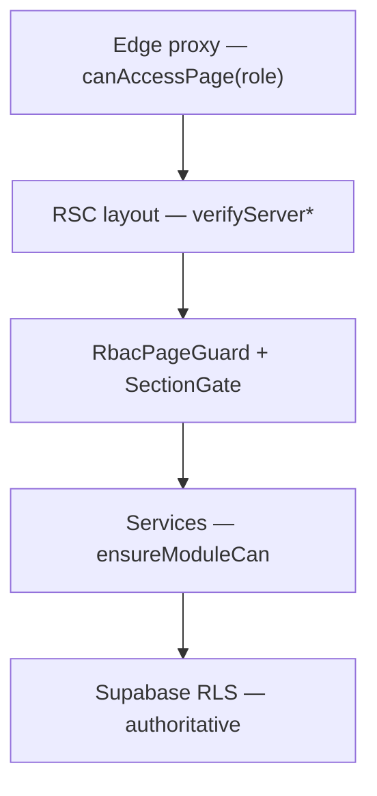

# FASE 8 — Audit permessi (Gestionale CAB)

Audit RBAC per ruolo: cosa ogni utente può **vedere**, **modificare**, **eliminare**, **esportare** e **creare**. Stato verificato **2026-06-02** post-fix fasi 1–7.

**Documenti correlati:** [`audit-phase7-security-audit.md`](./audit-phase7-security-audit.md) · [`audit-phase2-page-inventory.md`](./audit-phase2-page-inventory.md)

**Legenda:** ✅ coerente · ⚠️ parziale / layer divergente · ❌ gap · 📋 accettato/documentato

---

## Architettura permessi (5 layer)



| Layer | Granularità `user_permissions` | Fail mode |
|-------|-------------------------------|-----------|
| Edge (`proxy-handler.ts`) | ✅ `user_permissions` via auth snapshot | redirect `/acesso-negato` |
| RSC layout (impostazioni, security, dipendenti, portale clienti) | ✅ dove implementato | redirect |
| `canAccessRoute` + snapshot | ✅ moduli ERP | deny UI |
| `GestionaleSectionGate` | ✅ per modulo | `AccessLimited` |
| Service `ensure*` | ✅ read/write moduli | `ServiceResult` err |
| Postgres RLS | ✅ row-level | query vuota / errore |

**Principio:** il layer client/edge è bypassabile; **RLS + server actions admin** sono autoritativi.

---

## Ruoli canonici

| Ruolo | Label UI | Capability operative | Settings | Security | Portale clienti |
|-------|----------|---------------------|----------|----------|-----------------|
| **admin** | Admin | read + write | ✅ | ✅ | ✅ (ruolo) |
| **manager** | Manager | read + write | ✅ | ❌ | ✅ (ruolo) |
| **operatore** | Operatore | read + write | ✅ | ❌ | ✅ (ruolo o allowlist) |
| **cliente** | Cliente | ❌ read/write op | ❌ | ❌ | ✅ (solo portale) |
| **guest** | Guest | read only | ❌ | ❌ | ❌ |

Fonte capability: [`lib/rbac.ts`](../lib/rbac.ts) `ROLE_CAPABILITIES` — allineato a `rbac_has_capability()` DB.

---

## Matrice sezione × ruolo (capability)

| Sezione | Route | admin | manager | operatore | cliente | guest |
|---------|-------|-------|---------|-----------|---------|-------|
| Dashboard | `/dashboard` | R/W | R/W | R/W | ❌ | R |
| Magazzino | `/magazzino` | R/W/D | R/W/D | R/W/D | ❌ | R |
| Lavorazioni | `/lavorazioni` | R/W/D | R/W/D | R/W/D | ❌ | R |
| Preventivi | `/preventivi` | R/W/D | R/W/D | R/W/D | ❌ | R |
| Documenti | `/documenti` | R/W/D | R/W/D | R/W/D | ❌ | R |
| Mezzi | `/mezzi` | R/W/D | R/W/D | R/W/D | ❌ | R |
| Report | `/report` | R/W | R/W | R/W* | ❌ | R |
| Dipendenti | `/dipendenti` | R/W/D* | R/W/D* | R/W/D* | ❌ | R* |
| BUNDER | `/bunder` | R/W/D | R/W/D | R/W/D | ❌ | R |
| Impostazioni | `/impostazioni` | R/W | R/W | R/W | ❌ | ❌ |
| Sicurezza | `/dashboard/security` | R/W | ❌ | ❌ | ❌ | ❌ |
| Portale clienti | `/lavorazioni-clienti` | R | R | R† | R | ❌ |

\* Con `user_permissions` granulari: read/write per modulo possono essere negati singolarmente (truth layer).  
† Operatore/staff: accesso portale se in allowlist `client_portal_access.enabledUserIds`.  
R = read · W = write · D = delete (operational write) · ❌ = negato a livello capability.

---

## Permessi derivati (`PermissionKey`)

| Chiave | Deriva da | Usata in |
|--------|-----------|----------|
| `manageUsers` / `manageSecurity` | `can_manage_security` | Admin users, security panel |
| `manageSettings` | `can_manage_settings` | Impostazioni, bulk settings |
| `editInventory` | `can_write_operational` | Magazzino, movimenti |
| `editWorkOrders` | `can_write_operational` | Lavorazioni, schede, preventivi mutazioni |
| `editVehicles` | `can_write_operational` | Mezzi |
| `uploadDocuments` | `can_write_operational` | Documenti upload |
| `deleteRecords` | `can_write_operational` | Soft delete cross-modulo |
| `viewReports` | read op OR client area | Report KPI |
| `viewAuditLogs` | `can_manage_security` | Log sicurezza |
| `viewClientLavorazioni` | `can_access_client_area` | Portale clienti |

---

## Moduli granulari (`user_permissions`)

Moduli in [`GESTIONALE_PERMISSION_MODULES`](../src/lib/permissions/gestionale-modules.ts):

`magazzino` · `preventivi` · `lavorazioni` · `mezzi` · `report` · `documenti` · `dipendenti`

| Aspetto | Comportamento |
|---------|---------------|
| Fallback | Se riga assente → `modulePermissionForRole(ruolo, modulo)` |
| Override | Riga DB sostituisce fallback per `can_read` / `can_write` / `can_admin` |
| Route client | `canAccessRoute` + snapshot → deny se `can_read=false` |
| Edge proxy | ✅ `evaluateGestionaleRouteAccess` + `auth.permissions` | deny se `can_read=false` |
| Nav | `useNavHrefPermission` rispetta righe DB |
| Section gate | `GestionaleSectionGate` → `usePermissions(module)` |

**Non modulare (capability-only):** `bunder`, `dashboard`, `impostazioni`, `security`, `lavorazioni_clienti`.

---

## Per ruolo — operazioni tipiche

### Admin
| Operazione | Stato |
|------------|-------|
| Vede tutte le sezioni ERP + security | ✅ |
| CRUD operativo | ✅ |
| Export PDF (preventivi, dipendenti, bunder) | ✅ |
| Upload documenti | ✅ |
| Gestione utenti / permessi batch | ✅ |
| Impostazioni globali | ✅ |

### Manager
| Operazione | Stato |
|------------|-------|
| Come operatore + impostazioni | ✅ |
| Security / utenti admin | ❌ capability |
| Export / upload | ✅ se write modulo |

### Operatore
| Operazione | Stato |
|------------|-------|
| CRUD moduli con write | ✅ default; ⚠️ revocabile per modulo in Sicurezza |
| Impostazioni globali | ✅ (policy business — vedi S9 fase 7) |
| Report negato via DB | ✅ deny edge + UI + RLS | — |
| Portale clienti | ✅ se allowlist o ruolo client |

### Cliente
| Operazione | Stato |
|------------|-------|
| Solo `/lavorazioni-clienti` | ✅ edge + layout server |
| Dettaglio lavorazione altrui | ❌ RLS + empty state |
| Export / write officina | ❌ |

### Guest (sola lettura)
| Operazione | Stato |
|------------|-------|
| Browse moduli operativi | ✅ read |
| Write / delete / upload | ❌ UI + service deny |
| Impostazioni / security | ❌ |

---

## Gap e incoerenze (matrice remediation)

| ID | Problema | Sev | Stato post-fix | Mitigazione |
|----|----------|-----|--------------|-------------|
| P8-001 | Edge proxy ignora `user_permissions` granulari | MEDIO | ✅ risolto | `evaluateGestionaleRouteAccess` in proxy + snapshot da auth |
| P8-002 | `dipendenti` assente da `server-permission-guards` | MEDIO | ✅ risolto | Aggiunto a `SECTION_TO_MODULE` + layout RSC |
| P8-003 | BUNDER non in `user_permissions` | BASSO | 📋 by design | Capability operational; RLS `bunder_documents` |
| P8-004 | Export PDF non ha PermissionKey dedicata | BASSO | 📋 | Richiede read modulo + write per mutazioni source |
| P8-005 | Guest vede nav moduli read-only | BASSO | 📋 | UX intenzionale; write disabilitato |
| P8-006 | `can_admin` modulo poco esposto in UI | BASSO | 📋 | Usato in truth layer; admin seed full |
| P8-007 | Portale: staff vs cliente stesso path | MEDIO | ✅ | Allowlist + `viewClientLavorazioni` + layout server |

---

## Bypass analizzati

| Vettore | Esito |
|---------|-------|
| Manipolazione `sessionStorage` auth hint | ✅ rimosso (fase 7) |
| Deep-link modulo negato | ✅ edge + SectionGate + service deny |
| API diretta Supabase anon | ✅ RLS |
| Server action admin senza sessione | ✅ `assertAdminCaller` |
| Client portal ID enumeration | ✅ RLS + E2E base (fase 7) |
| Operatore → `/dashboard/security` | ✅ redirect edge + layout RSC |

---

## Fix applicati (Fase 8)

1. **`dipendenti` in server guards** — [`server-permission-guards.ts`](../src/lib/auth/server-permission-guards.ts)
2. **Layout RSC dipendenti** — [`app/(gestionale)/dipendenti/layout.tsx`](../app/(gestionale)/dipendenti/layout.tsx) con `verifyServerModuleCan("dipendenti", "read")`
3. **Test CI matrice ruoli** — [`permissions-role-matrix.test.ts`](../lib/regression/permissions-role-matrix.test.ts)
4. **Policy manager/operatore** — già in [`security-rbac-policy.test.ts`](../lib/regression/security-rbac-policy.test.ts) (fase 7)
5. **P8-001 edge + moduli granulari** — [`evaluate-gestionale-route-access.ts`](../src/lib/auth/evaluate-gestionale-route-access.ts) + proxy handler

---

## Checklist verifica manuale

| # | Scenario | Pass atteso |
|---|----------|-------------|
| 1 | Operatore con report `can_read=false` in Sicurezza | Nav nascosta / AccessLimited; no KPI |
| 2 | Manager su `/dashboard/security` | redirect deny |
| 3 | Cliente su `/magazzino` | redirect deny |
| 4 | Guest: bottoni Salva disabilitati | no persist |
| 5 | Admin revoca write magazzino | lista visibile, mutazioni err |
| 6 | Staff in allowlist portale | `/lavorazioni-clienti` OK |
| 7 | Dipendenti negato in permessi | layout RSC redirect |

---

## Verifica automatica

```bash
npm run ci:tsc
npx tsx lib/regression/rbac-route-matrix.test.ts
npx tsx lib/regression/permissions-role-matrix.test.ts
npx tsx lib/regression/security-rbac-policy.test.ts
npm run smoke:regression
npm run smoke:playwright   # spec 02-rbac-routes, 11-client-portal
```

---

## Riferimenti codice

| Area | Path |
|------|------|
| Capability SSOT | `lib/rbac.ts` |
| Routing / sezioni | `lib/auth/rbac.ts` |
| Route + moduli | `src/lib/auth/can-access-route.ts` |
| Client guards | `src/lib/auth/permission-guards.ts` |
| Server guards | `src/lib/auth/server-permission-guards.ts` |
| Edge RBAC | `src/middleware/proxy-handler.ts` |
| Effective permissions | `src/lib/permissions/effective-permissions.ts` |
| Section gate UI | `components/gestionale/gestionale-section-gate.tsx` |
| Portale allowlist | `lib/lavorazioni/client-portal-access.ts` |

---

## Documenti audit per fase

| Fase | Documento |
|------|-----------|
| 2 | [`audit-phase2-page-inventory.md`](./audit-phase2-page-inventory.md) |
| 3 | [`audit-phase3-bug-hunt-plan.md`](./audit-phase3-bug-hunt-plan.md) |
| 4 | [`audit-phase4-edge-cases.md`](./audit-phase4-edge-cases.md) |
| 5 | [`audit-phase5-storage-audit.md`](./audit-phase5-storage-audit.md) |
| 6 | [`audit-phase6-technical-debt.md`](./audit-phase6-technical-debt.md) |
| 7 | [`audit-phase7-security-audit.md`](./audit-phase7-security-audit.md) |
| 8 | questo documento |
