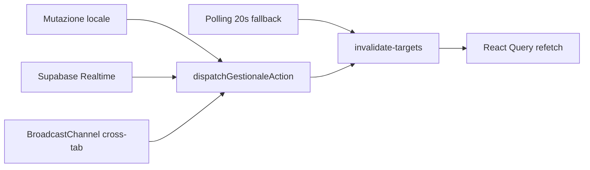

# FASE 9 — Audit dati e sincronizzazione (Gestionale CAB)

Inventario refetch, polling, Realtime, invalidazione cache e coerenza cross-tab. Stato verificato **2026-06-02** post-fix fasi 1–8.

**Documenti correlati:** [`audit-phase4-edge-cases.md`](./audit-phase4-edge-cases.md) · [`runtime-truth-layer.md`](./runtime-truth-layer.md) · [`performance-query-policies.md`](./performance-query-policies.md)

**Legenda:** ✅ gestito · ⚠️ parziale · ❌ gap · 📋 backlog/documentato · 🔧 fix audit applicato

---

## Sintesi esecutiva

| Area | Stato pre-audit | Fix fase 9 |
|------|-----------------|------------|
| Pipeline sync unificata (`dispatchGestionaleAction`) | ✅ moduli ERP principali | 🔧 timesheet dipendenti integrato |
| Realtime Supabase (tabelle operative) | ⚠️ gap timesheet + permessi | 🔧 migration publication |
| Invalidazione React Query (`invalidate-targets`) | ⚠️ `user_permissions` assente | 🔧 mappa estesa |
| Cross-tab (`BroadcastChannel`) | ✅ dedup 5s | 🔧 timesheet broadcast post-mutazione |
| Polling fallback (20s) | ✅ XOR con Realtime | — |
| EC-002 timesheet concurrent tab | ⚠️ last-write-wins | 📋 optimistic lock backlog |
| Notifiche admin (LS) | ⚠️ solo device locale | 📋 by-design P3 |
| Report manual entries | ✅ DB `app_settings` | — |

---

## Architettura sync (4 canali)



| Canale | Trigger | Debounce | File chiave |
|--------|---------|----------|-------------|
| **Local mutation** | save UI, service OK | immediate invalidate | `lib/sync/gestionale-sync-dispatch.ts` |
| **Realtime** | `postgres_changes` | 100ms batch | `src/components/gestionale-realtime-bridge.tsx` |
| **Broadcast** | altra tab stesso browser | dedup 5s | `lib/sync/cab-realtime-broadcast.ts` |
| **Polling** | Realtime down | ogni 20s full operational | `SyncTransportController` |

**Principio:** un solo entry point (`dispatchGestionaleAction`) → mappa tabella→query key (`invalidate-targets`) → optional reconcile/notifiche/cab-sync bus.

---

## Matrice modulo × meccanismo sync

| Modulo / tabella | Query keys | Realtime pub | cab-sync entity | dispatch locale | Cross-tab |
|------------------|------------|--------------|-----------------|-----------------|-----------|
| lavorazioni | ✅ entity-aware | ✅ | ✅ | ✅ | ✅ |
| mezzi | ✅ | ✅ | ✅ | ✅ | ✅ |
| magazzino_ricambi | ✅ | ✅ | ✅ | ✅ | ✅ |
| movimenti_ricambi | ✅ | ✅ | ✅ | ✅ | ✅ |
| preventivi | ✅ | ✅ | ✅ | ✅ | ✅ |
| documenti | ✅ | ✅ | ✅ | ✅ | ✅ |
| scheda_lavorazione | ✅ | ✅ | ✅ | ✅ | ✅ |
| log_modifiche | ✅ | ✅ | ✅ | ✅ | ✅ |
| app_settings | ✅ | ✅ | ✅ settings | ✅ | ✅ |
| dashboard_promemoria | ✅ | ✅ | ✅ | ✅ | ✅ |
| bunder_documents | ✅ | ✅ | ✅ | ✅ | ✅ |
| **dipendenti_timesheet_employees** | 🔧 | 🔧 | 🔧 | 🔧 | 🔧 |
| **dipendenti_timesheet_entries** | 🔧 | 🔧 | 🔧 | 🔧 | 🔧 |
| **user_permissions** | 🔧 | 🔧 | 🔧 | — (admin) | ✅ via bridge |
| profiles | ✅ | 🔧 | — | — | ✅ via bridge |
| auth_logs | — | ✅ (security view) | — | — | — |
| Portale clienti | ✅ portal keys | ereditato lavorazioni/schede | ✅ | ✅ | ✅ |

---

## Findings e fix

### P9-001 — `user_permissions` fuori da Realtime bridge principale

| | |
|---|---|
| **Severità** | P1 |
| **Problema** | Handler in `GestionaleRealtimeBridge` per `user_permissions`, ma tabella **non** in `GESTIONALE_REALTIME_TABLES` né in `GESTIONALE_TABLE_QUERY_KEYS` → eventi Realtime mai ricevuti (solo subscription ad-hoc in security dashboard admin). |
| **Impatto** | Utente con permessi revocati da admin: UI stale fino a reload o polling 20s. |
| **Fix** | 🔧 `user_permissions` in `invalidate-targets` + publication Realtime + invalidazione truth layer in bridge (già presente). |

### P9-002 — Timesheet dipendenti isolato dalla pipeline sync

| | |
|---|---|
| **Severità** | P1 (EC-002) |
| **Problema** | Mutazioni timesheet: solo `setQueryData` locale; nessun `dispatchGestionaleLocalMutation`; tabelle **non** in publication Realtime né cab-sync. |
| **Impatto** | Due tab su `/dipendenti`: last-write-wins silenzioso; nessun refresh automatico. |
| **Fix** | 🔧 `dipendenti-timesheet-sync-dispatch.ts` + hook `useDipendentiTimesheet` + migration Realtime + cab-sync entities. |
| **Residuo** | 📋 Conflict detection `updated_at` (EC-002) — backlog P2. |

### P9-003 — `profiles` in invalidate map ma non in publication

| | |
|---|---|
| **Severità** | P2 |
| **Problema** | `profiles` mappato in `GESTIONALE_TABLE_QUERY_KEYS` ma assente da `supabase_realtime` publication. |
| **Impatto** | Cambio ruolo/nome profilo: sync solo polling 20s o refresh manuale. |
| **Fix** | 🔧 incluso in migration `20260705120000_gestionale_sync_realtime_gaps.sql`. |

### P9-004 — BUNDER multi-tab last-write-wins

| | |
|---|---|
| **Severità** | P1 (EC da fase 4) |
| **Stato** | ⚠️ parziale — sync Realtime + broadcast OK; **no** merge/versioning JSONB. |
| **Azione** | 📋 backlog — optional row version / ETag client. |

### P9-005 — Notifiche dashboard admin (localStorage)

| | |
|---|---|
| **Severità** | P3 |
| **Stato** | ⚠️ by-design — `admin-notification-store` per-device; promemoria/lavorazioni/magazzino non cross-device. |
| **Azione** | 📋 accettato fino a tabella notifiche server-side. |

### P9-006 — Report KPI vs dati operativi

| | |
|---|---|
| **Severità** | P2 |
| **Stato** | ✅ `invalidateOperationalTruth` + coalesce report; manual entries su DB post fase 6. |
| **Edge** | ⚠️ burst Realtime (>5 tabelle) traccia evento ma refetch report non sempre immediato se tab inattiva. |

### P9-007 — Portale clienti sync

| | |
|---|---|
| **Severità** | — |
| **Stato** | ✅ `CLIENT_PORTAL_QUERY_KEYS` incluse quando tabella portale toccata; E2E fase 7. |

---

## Transport Realtime — comportamento

| Stato | Comportamento |
|-------|---------------|
| Connected | Realtime attivo, polling **spento** (`SyncTransportController`) |
| Degraded | Polling 20s → `invalidateAllGestionaleOperationalQueries` |
| Reconnect | max 5 tentativi; snapshot recovery opzionale |
| Burst | debounce 100ms; dedup fingerprint 5s |

**Settings remote toast:** soppresso se modal impostazioni aperto o pagina `/impostazioni` o write locale recente.

---

## Truth layer invalidation

| Reason | Trigger | Effetto |
|--------|---------|---------|
| `roleOrPermissionsChanged` | `user_permissions`, `profiles` | refresh effective permissions |
| `pilotChanged` | `app_settings` | settings + operational optional |
| `domain: report` | reset log admin, manual refresh | KPI report |

File: `src/lib/runtime/truth-layer/invalidate-runtime-truth.ts`

---

## Fix applicati (fase 9)

| ID | File / artefatto |
|----|------------------|
| P9-001 | `src/lib/react-query/invalidate-targets.ts` — `user_permissions` |
| P9-002 | `lib/dipendenti/dipendenti-timesheet-sync-dispatch.ts` |
| P9-002 | `src/hooks/use-dipendenti-timesheet.ts` — dispatch post save/sync |
| P9-002 | `lib/sync/cab-sync-bus.ts` — entities timesheet |
| P9-001/002/003 | `supabase/migrations/20260705120000_gestionale_sync_realtime_gaps.sql` |
| CI | `lib/regression/sync-invalidation-policy.test.ts` |

---

## Checklist verifica manuale

| # | Scenario | Pass atteso |
|---|----------|-------------|
| 1 | Tab A + B su `/dipendenti`, edit stessa cella | Tab B aggiorna entro ~1s (broadcast) o Realtime |
| 2 | Admin revoca write magazzino con sessione aperta | Entro 20s max (Realtime) UI read-only / deny mutazioni |
| 3 | Realtime disconnesso (offline simulato) | Polling 20s refresh liste |
| 4 | Salva lavorazione tab A, tab B su lista lavorazioni | Lista B aggiornata |
| 5 | Modifica BUNDER tab A, tab B su `/bunder` | Lista B aggiornata |
| 6 | Promemoria creato tab A, dashboard tab B | Calendario B aggiornato |

---

## Verifica automatica

```bash
npm run ci:tsc
npx tsx lib/regression/sync-invalidation-policy.test.ts
npx tsx src/lib/react-query/invalidate-targets.test.ts
npm run smoke:regression
```

---

## Migration Supabase da applicare

- `20260705120000_gestionale_sync_realtime_gaps.sql` (timesheet Realtime + user_permissions + profiles)

---

## Riferimenti codice

| Area | Path |
|------|------|
| Bridge Realtime | `src/components/gestionale-realtime-bridge.tsx` |
| Dispatch unificato | `lib/sync/gestionale-sync-dispatch.ts` |
| Mappa invalidazione | `src/lib/react-query/invalidate-targets.ts` |
| Config Realtime | `lib/realtime/gestionale-realtime-config.ts` |
| Transport XOR poll | `src/lib/runtime/sync/sync-transport-controller.ts` |
| Broadcast cross-tab | `lib/sync/cab-realtime-broadcast.ts` |
| cab-sync bus | `lib/sync/cab-sync-bus.ts` |
| Timesheet dispatch | `lib/dipendenti/dipendenti-timesheet-sync-dispatch.ts` |
| Hook timesheet | `src/hooks/use-dipendenti-timesheet.ts` |

---

## Documenti audit per fase

| Fase | Documento |
|------|-----------|
| 2 | [`audit-phase2-page-inventory.md`](./audit-phase2-page-inventory.md) |
| 3 | [`audit-phase3-bug-hunt-plan.md`](./audit-phase3-bug-hunt-plan.md) |
| 4 | [`audit-phase4-edge-cases.md`](./audit-phase4-edge-cases.md) |
| 5 | [`audit-phase5-storage-audit.md`](./audit-phase5-storage-audit.md) |
| 6 | [`audit-phase6-technical-debt.md`](./audit-phase6-technical-debt.md) |
| 7 | [`audit-phase7-security-audit.md`](./audit-phase7-security-audit.md) |
| 8 | [`audit-phase8-permissions-audit.md`](./audit-phase8-permissions-audit.md) |
| 9 | questo documento |
