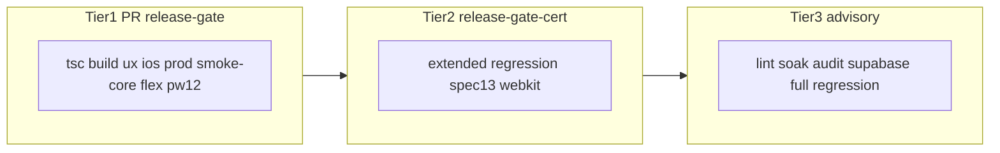

# Audit Release Gate

**Data:** 2026-06-08  
**Scope:** workflow GitHub Actions, script gate locali, smoke/regression/E2E, allineamento architettura 2026-06  
**Vincolo:** nessuna modifica al codice applicativo; solo gate/test/docs.

---

## Riepilogo esecutivo

| Metrica | Valore |
|---------|--------|
| **Score complessivo** | **7.5/10** (post-allineamento: da 7.0) |
| Step CI `release-gate` | 16 (dopo audit) |
| Regression tier core | 57 file |
| Regression tier extended | 46 file |
| Playwright in gate | 12 spec chromium (spec 13 esclusa) |
| Playwright cert (tier 2) | spec 13 + WebKit/iOS — workflow `release-gate-cert` |

**Correzioni applicate in questo audit**

1. `ios:check` aggiunto al workflow CI.
2. `smoke:regression` splittato in **core** (PR gate) e **extended** (cert/nightly).
3. Nuovo workflow [`.github/workflows/release-gate-cert.yml`](../.github/workflows/release-gate-cert.yml) (extended + `smoke:playwright:cert` + `audit:supabase` advisory).
4. [`scripts/release-gate.ts`](../scripts/release-gate.ts) allineato a CI: `ios:check`, `smoke:regression:core`, verify Supabase opzionale, Playwright SKIP esplicito (non più PASS silenzioso).
5. [`forms-save-policy.test.ts`](../lib/regression/forms-save-policy.test.ts) esteso con assert SSOT create modal (`fieldsRef`, `draftRef`, focus scope).
6. [`docs/release-gate.md`](./release-gate.md) aggiornato.

---

## 1. Inventario Release Gate

### 1.1 GitHub Actions — `release-gate` (blocking PR/main)

| # | Step | Comando | Tipo | Secrets | Blocking |
|---|------|---------|------|---------|----------|
| 1 | TypeScript | `ci:tsc` | Compile | — | Sì |
| 2 | Build | `ci:build` | Build Next.js | — | Sì |
| 3 | UX enforcement | `ux:enforce` | Static policy | — | Sì |
| 4 | UX mobile | `ux:mobile-gate` | Static modal/scroll | — | Sì |
| 5 | iOS static | `ios:check` | Heuristics Safari | — | Sì (0 blocker) |
| 6 | Supabase secrets | shell `test -n` | Env | Supabase * | Sì |
| 7 | Supabase connect | `verify-supabase-ci-env.ts` | Connectivity | Supabase * | Sì |
| 8 | Production readiness | `production:check` | RBAC/RLS/storage live DB | Supabase * | Sì |
| 9 | Structural smoke | `smoke:structural` | Shell modali, tabelle | — | Sì |
| 10 | Regression core | `smoke:regression:core` | 57 test/policy | — | Sì |
| 11 | Flex ESLint | `flex:eslint:gate` | Baseline flex | — | Sì |
| 12 | Flex freeze | `flex:freeze:gate` | Freeze integrity | — | Sì |
| 13 | Playwright install | chromium | Browser | — | — |
| 14 | Playwright smoke | `smoke:playwright` | 12 E2E runtime | SMOKE_* | Sì |

\* `NEXT_PUBLIC_SUPABASE_*`, `SUPABASE_SERVICE_ROLE_KEY`

### 1.2 GitHub Actions — `release-gate-cert` (tier 2, scheduled + manual)

| Step | Comando | Blocking |
|------|---------|----------|
| Extended regression | `smoke:regression:extended` (46 file) | Sì nel job cert |
| Supabase inventory | `audit:supabase` | No (`continue-on-error`) |
| Playwright cert | `smoke:playwright:cert` (spec 13, WebKit) | Sì nel job cert |

Schedule: lunedì 03:00 UTC. **Non** sostituisce il check PR `release-gate`.

### 1.3 Orchestratore locale — `npm run release:gate`

Replica i step critici; Supabase e Playwright possono essere **SKIP** senza secrets (esplicito nel summary).

### 1.4 Suite fuori gate PR (inventario)

| Comando | Scopo | Frequenza consigliata |
|---------|-------|----------------------|
| `smoke:regression` | Core + extended (103 file) | Pre-release / locale |
| `smoke:regression:extended` | Tier extended | Cert workflow |
| `smoke:playwright:cert` | Scheda Ingresso iOS E2E | Cert workflow |
| `npm run lint` | ESLint full | Manuale / pre-commit |
| `test:permissions` | Unit permessi | Manuale |
| `ops:long-session-soak` | Metriche long-session | Broken in Node — browser only |
| `ops:diagnostics` | Post-deploy advisory | Manuale |

---

## 2. Classificazione `smoke:regression`

SSOT liste: [`lib/regression/smoke-regression-lists.ts`](../lib/regression/smoke-regression-lists.ts)

| Categoria | Core | Extended | Rilevanza |
|-----------|------|----------|-----------|
| Security/RBAC | 12 | 0 | Alta — blocking |
| Data/sync/schede | 8 | 0 | Alta |
| Forms/modal/iOS static | 7 | 0 | Alta (post-audit 2026-06) |
| Realtime/performance | 3 | 0 | Media-alta |
| Magazzino | 7 | 0 | Alta |
| Production/ops scripts | 5 | 0 | Alta |
| Validation/auth | 7 | 0 | Alta |
| Flex governance | 0 | 9 | Ridondante con `flex:*:gate` |
| UI-OS / layout | 0 | 11 | Media — advisory extended |
| Dipendenti units | 1 | 8 | Bassa per PR |
| Policy advisory | 0 | 4 | Media |
| Tier meta | 0 | 1 | `smoke-regression-lists-audit` |

---

## 3. Playwright smoke (runtime)

### In gate (`playwright.config.ts`)

| Spec | Test | Area |
|------|------|------|
| 01-auth | 2 | Login/logout |
| 02-rbac-routes | 3 | RBAC route |
| 03-dashboard-report | 2 | Spinner + realtime passive |
| 04-modal-scroll | 4 | Scroll lock drawer/modal |
| 05-document-lifecycle | 1 | Upload/delete documenti |
| 06-mobile-shell | 1 | Overflow mobile |
| 07-hydration-runtime | 1 | Hydration errori |
| 08-bunder | 1 | Route bunder |
| 09-dipendenti | 1 | Route dipendenti |
| 10-preventivi | 1 | Route preventivi |
| 11-client-portal | 5 | Portal RBAC |
| 12-mobile-routes | 4 | Overflow route mobile |

**Esclusa:** `13-lavorazioni-scheda-ingresso.spec.ts` (`testIgnore` — richiede WebKit per iOS).

### Cert only (`playwright.mobile-cert.config.ts`)

- iOS combobox save senza blur
- Create → hub → edit ingresso → scheda lavorazioni
- Progetti: chromium, Pixel 7, iPhone 14, iPad Pro

---

## 4. Copertura stimata per area (%)

| Area | Copertura gate | Note |
|------|----------------|------|
| Type safety / build | **95%** | tsc + next build |
| RBAC / security static | **90%** | Matrice route + production:check |
| RBAC runtime | **75%** | Playwright 02, 11 |
| Form state / iOS save | **70%** | Static forte; E2E spec 13 solo cert |
| Modal UX | **80%** | ux:mobile-gate + modal-cross-audit + spec 04 |
| Supabase RLS | **80%** | production:check + rls-service-audit |
| Realtime / publication | **85%** | `ci:supabase:publication` + static SSOT migrations |
| Long-session / memory | **70%** | Threshold cert + nightly soak; heap solo browser |
| Magazzino create flow | **80%** | E2E spec 14 smoke PR + cert mobile |
| Performance refetch | **65%** | performance-policy + spec 03 |
| Flex/layout regression | **90%** | flex gates + extended tier |

**Media ponderata (aree critiche): ~72%**

---

## 5. Gap critici (alta priorità)

| Gap | Stato post-audit |
|-----|------------------|
| Spec 13 fuori PR gate | **Risolto** — `smoke:playwright:ios-smoke` in PR + full cert |
| `ios:check` fuori CI | **Risolto** — step in `release-gate.yml` |
| `forms-save-policy` incompleto | **Risolto** — assert create modal |
| Docs gate obsolete | **Risolto** — `release-gate.md` |
| Locale `release:gate` ≠ CI | **Risolto** — SKIP esplicito, step allineati |
| Nessun E2E Nuovo Ricambio | **Risolto** — spec 14 + `smoke:playwright:ricambio:smoke` |
| Publication drift live | **Risolto** — `ci:supabase:publication` / `:full` (+ `SUPABASE_DB_URL`) |
| `ops:long-session-soak` broken | **Risolto** — `long-session-metrics-node` + threshold cert + nightly |

---

## 6. Test obsoleti / ridondanti / inefficaci

### Ridondanti (mitigati)

- **9 test flex** in extended — duplicano `flex:eslint:gate` + `flex:freeze:gate`; rimossi da tier core.
- **6+ ui-os-*** — spostati in extended; alto costo, basso segnale su PR.

### Obsoleti / a rischio

- `smoke-structural-gate` ancora riferisce `lavorazioni-modals.tsx` (legacy) — non SSOT `lavorazione-create-modal`.
- `lavorazioni-e2e-certification-audit.test.ts` — verifica wiring file, non comportamento runtime.

### Inefficaci / non deterministici

- Playwright con DB production smoke — dipende da dati remoti.
- `compat-readiness-report.test.ts` — score soglia può fallire per drift catalogo.
- `11-client-portal.spec.ts` — fail recenti in `test-results/` (flakiness selettori).

---

## 7. Coerenza bug storici

| Bug storico | Coperto? | Dove |
|-------------|----------|------|
| iOS combobox senza blur | Parziale → cert | Static + spec 13 (cert workflow) |
| Perdita dati form submit | Sì (static) | `scheda-ingresso-ios-save-audit`, `modal-cross-audit`, `forms-save-policy` |
| Textarea multiriga Enter | Sì | `modal-cross-audit` |
| Modal scroll/lock | Sì | `ux:mobile-gate`, spec 04 |
| Realtime refetch storm | Parziale | `performance-policy`, spec 03 |
| Publication mismatch | Debole | `sync-invalidation-policy` (migration refs) |
| Long-session degradation | Debole | `long-session-stability-policy` |
| Flex overflow | Forte | flex gates |

---

## 8. Regression safety

### Falsi positivi (bloccano senza bug reale)

- Flex baseline count drift dopo refactor layout.
- `compat-readiness-report` score < soglia.
- `production:check` sensibile a stato DB production (pilot flags, URL legacy).
- Client portal E2E — selettori fragili.

### Falsi negativi (bug reale non bloccato)

- Spec 13 non in PR gate (solo cert settimanale).
- Nessun E2E create ricambio / nuova lavorazione end-to-end in chromium gate.
- `ios:check` warnings (font <16px) non blocking — zoom iOS possibile.
- Live publication vs `GESTIONALE_TABLE_QUERY_KEYS` non verificato in CI.

---

## 9. Strategia test a 3 tier (implementata)

---

## 10. Verifica esecuzione (2026-06-08 locale)

| Comando | Esito |
|---------|-------|
| `npm run ci:tsc` | PASS |
| `npm run smoke:structural` | PASS |
| `npm run ux:mobile-gate` | PASS (0 blocker, warnings) |
| `npm run ios:check` | PASS (0 blocker, risk score 51) |
| `npm run flex:eslint:gate` | PASS |
| `npm run flex:freeze:gate` | PASS |
| `npm run smoke:regression:core` | PASS (57 file) |
| `npm run smoke:regression:extended` | PASS (46 file) |
| `npm run production:check` | Non eseguito — richiede secrets Supabase locali |
| `npm run smoke:playwright` | Non eseguito — richiede SMOKE_* + server |
| `npm run smoke:playwright:cert` | Non eseguito — idem + WebKit |

---

## 11. Valutazione qualità Release Gate — **7.5/10**

| Criterio | Voto | Note |
|----------|------|------|
| Allineamento architettura | 8 | Tier split, ios in CI, cert workflow |
| Copertura aree critiche | 7 | Form iOS E2E solo tier 2 |
| Affidabilità (falsi pos/neg) | 7 | Playwright DB-dependent; flex baseline |
| Manutenibilità | 8 | Liste SSOT `smoke-regression-lists.ts` |
| Performance CI | 7 | Core ~90s regression vs ~150s full |
| Documentazione | 8 | Post-aggiornamento `release-gate.md` |

---

## 12. Raccomandazioni

### Priorità alta (residue)

- Rendere `release-gate-cert` **required** su `main` (branch protection second check).
- Aggiungere secret `SUPABASE_DB_URL` e impostare `PUBLICATION_CHECK_STRICT=1` in PR quando drift F5 risolto.
- Monitorare flakiness `11-client-portal.spec.ts` — aggiornare selettori se fail ricorrenti.

### Priorità media

- Artifact soak nightly con JSON strutturato (heap browser manuale resta pre-release).

### Priorità bassa

- `npm run lint` in workflow advisory (non blocking).
- Deprecare riferimenti structural a `lavorazioni-modals.tsx` legacy.
- Consolidare warning `ux:mobile-gate` vs `ios:check` overlap documentato.

---

## 13. Rischi regressione non coperti

1. Heap browser 4h — solo nightly/manuale DevTools.
2. Record magazzino lenient edge case (duplicati/foto) — non in smoke E2E.
3. Publication full equality se `SUPABASE_DB_URL` assente in cert (fail fino a secret).
5. Refactor modal senza `gestionaleFormFocusScope` — coperto da static audit se in lista file modal.

---

## Riferimenti

- [`docs/release-gate.md`](./release-gate.md) — guida operativa aggiornata
- [`docs/gate-matrix.md`](./gate-matrix.md) — matrice tier PR / cert / nightly
- [`lib/regression/smoke-regression-lists.ts`](../lib/regression/smoke-regression-lists.ts) — tier core/extended
- [`docs/audit-modals-cross-cutting.md`](./audit-modals-cross-cutting.md)
- [`docs/audit-nuova-lavorazione-nuovo-ricambio.md`](./audit-nuova-lavorazione-nuovo-ricambio.md)
