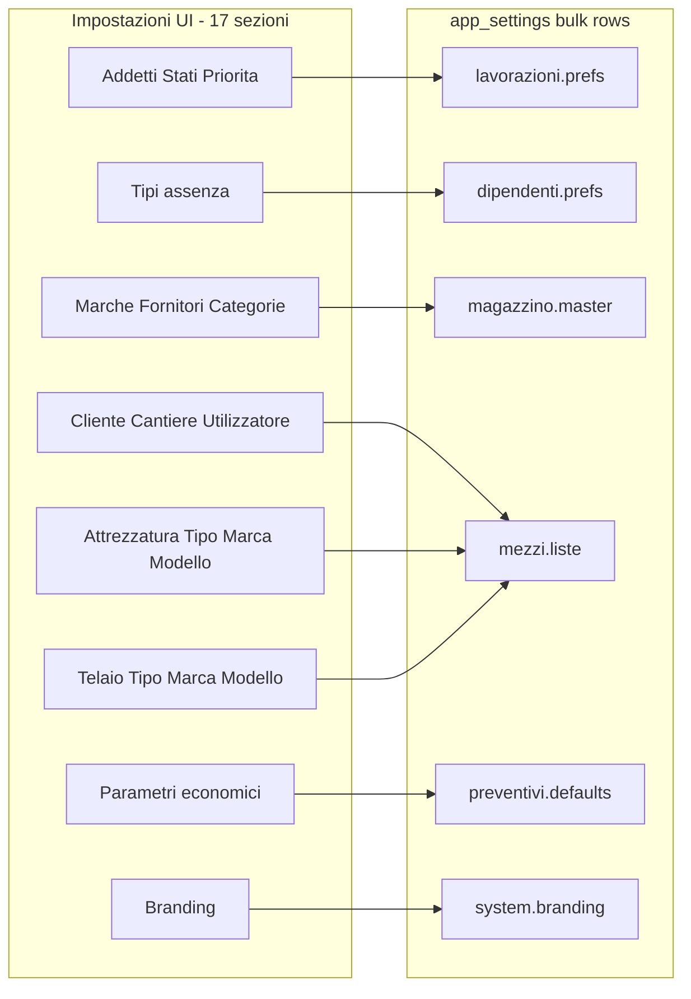

# Audit production-grade — Impostazioni e configurazione globale

**Data:** 2026-06-07  
**Scope:** ecosistema Impostazioni (17 sezioni UI, 6 righe `app_settings`, propagazione rename, branding, log, RBAC).  
**Strategia cleanup:** conservativa — `@deprecated` + rimozione solo codice provatamente morto; nessuna eliminazione moduli localStorage o surface modal.

---

## 1. Executive summary

L'ecosistema Impostazioni è **funzionalmente solido**: SSOT DB su `app_settings`, bulk save con OCC, propagazione rename, RBAC a più livelli, branding integrato app-wide. I problemi principali sono **debito strutturale** (monolite ~2050 righe), **codice morto/legacy** (modal export, localStorage prefs orfani), **incoerenze UI residue** (parzialmente risolte con `SettingsSectionHeader`), e **un bug incompleto** (guard delete addetti mai popolato).

---

## 2. Score qualità (0–10)

| Criterio | Score | Note |
|----------|-------|------|
| Architettura | 7.5 | SSOT DB + resolver chiaro; monolite UI e doppi cache path |
| Manutenibilità | 5.5 | File unico enorme; sezioni non lazy-split |
| Coerenza dati | 8.0 | 6 bulk rows allineate; rename propagation robusta |
| UX | 7.5 | Save/unsaved dialog OK; IA post-redesign buona; 3 pattern nav mobile |
| UI / Design System | 7.0 | Token SSOT recenti; migrazione sezioni in corso |
| Sicurezza | 8.5 | proxy + layout + service guards; read RLS-dependent |
| Performance | 6.5 | JSON.stringify dirty check; re-render monolite |
| Pulizia codice | 5.0 | Dead exports, localStorage orfani, helper unused |
| Branding | 8.0 | DB + Provider + PDF + boot cache; doppio path accettabile |
| Production readiness | 7.5 | Pronto in produzione con debito noto e piano cleanup |

**Score medio: 7.1 / 10**

---

## 3. Mappa UI → DB (17 sezioni → 6 righe)

SSOT resolver: [`src/lib/app-settings/resolve-from-rows.ts`](../src/lib/app-settings/resolve-from-rows.ts)



### Inventario impostazioni

| Impostazione UI | Tipo | Default | Salvata | Letta | Utilizzata in |
|-----------------|------|---------|---------|-------|---------------|
| **Branding** (colore, logo) | object | `#ff6633`, logo default | `system.branding` | `BrandingProvider`, `/api/branding` | Shell, login, PDF, favicon |
| **Addetti** | records + color map | 4 addetti seed | `lavorazioni.prefs` | `useGlobalOptions` | Lavorazioni, schede, dashboard, rename |
| **Stati lavorazioni** | config[] + colors | workflow 5 stati | `lavorazioni.prefs` | `useGlobalOptions`, runtime cache | Kanban, filtri, client portal sanitize |
| **Priorità** | string[] + colors | bassa→urgente | `lavorazioni.prefs` | `useGlobalOptions` | Pills, scheda ingresso |
| **Tipi assenza** | config[] | 7 tipi built-in | `dipendenti.prefs` | `useTipiAssenza()` | Timesheet, PDF dipendenti |
| **Marche ricambi** + sconto % | string[] + map | vuoto | `magazzino.master` | `useGlobalListOptions`, magazzino-view | Ricambi, sconto listino |
| **Fornitori** + produttori | string[] + map | vuoto | `magazzino.master` | ricambio forms | Modal ricambio |
| **Categorie** | string[] | vuoto | `magazzino.master` | GlobalSelect | Filtri magazzino |
| **Clienti** + sconto % | string[] + map | seed defaults | `mezzi.liste` | preventivi, mezzi | Sconto automatico preventivi |
| **Cantieri / Utilizzatori** | string[] | vuoto | `mezzi.liste` | GlobalSelect | Mezzi, schede, documenti |
| **Tipi attrezzatura/telaio** | string[] | seed | `mezzi.liste` | GlobalSelect | Mezzi form |
| **Gerarchie marca/modello** | tree | vuoto | `mezzi.liste` | GlobalSelect + rename | Mezzi, documenti |
| **Costo orario default** | number | 48 €/h | `preventivi.defaults` | `use-lavorazione-costo`, runtime cache | KPI, preventivi infer |
| **Migrazione preventivi** | one-shot admin | — | DB (non settings row) | localStorage count | Import manuale → Supabase |

### Satellite keys (fuori bulk modal)

| Key | Classificazione | Uso |
|-----|-----------------|-----|
| `system.enable_operator_global_settings` | Attiva | Pilot RBAC badge/diagnostics |
| `preventivi.phrase_learning_v1` | Attiva | AI phrase learning (separata) |
| `report.magazzino_manual_month_map_v1` | Attiva | Report manuale |
| `user_prefs.{id}` | Attiva | Tema utente |

---

## 4. Classificazione per dominio

| Dominio | Stato | Evidenza |
|---------|-------|----------|
| Lavorazioni prefs | **Attivamente utilizzata** | ~25 consumer via `useGlobalOptions` |
| Mezzi liste | **Attivamente utilizzata** | Mezzi, preventivi, documenti, rename |
| Magazzino master | **Attivamente utilizzata** | Magazzino-view + ricambi; `mezziCompatibili` raramente (no UI listKey) |
| Dipendenti tipi assenza | **Attivamente utilizzata** | Timesheet hook chain |
| Preventivi defaults | **Attivamente utilizzata** | Costo lavorazione + KPI |
| Branding | **Attivamente utilizzata** | Provider + PDF + boot |
| localStorage prefs (4 moduli) | **Legacy / inutilizzata** | load/save zero caller runtime |
| `SistemaImpostazioniModal` | **Legacy / dead export** | Zero importers; `@deprecated` |
| `GestionaleSettingsSelect` | **Inutilizzata** | Zero importers; `@deprecated` |
| `lavorazioni:stati/priorita` list keys | **Duplicata** | Definite ma UI usa `useGlobalOptions` pills |
| Addetti in-use guard | **Incompleta** | `attiviAddetti`/`storicoAddetti` = `new Set()` sempre vuoti |

---

## 5. Flusso save/load

```
UI snapshot → buildBulkRowsFromResolved → bulk_upsert_app_settings (OCC)
  → invalidate app_settings → sessionStorage cache
  → dispatch settings_updated → useGlobalOptions refresh
  → optional rename propagation → settings-rename-propagation.service
  → configurazione log (client localStorage, max 100)
```

**Comportamenti corretti:** dirty detection, unsaved dialog, beforeunload, link intercept, cancel restore snapshot, branding logo upload separato, logout/login (DB + sessionStorage cache).

---

## 6. Duplicazioni e storage

| Dato | SSOT | Copia legacy | Azione |
|------|------|--------------|--------|
| Tutte le prefs | `app_settings` + RQ | sessionStorage runtime cache | Mantenere (performance boot) |
| Mezzi/magazzino/lavorazioni prefs | DB | localStorage `gestionale-*-prefs-v1` | `@deprecated` su load/save |
| Branding | DB + Provider | `cab-branding.v1` localStorage | Mantenere (anti-FOUC boot) |
| costoOrarioDefault | Query live | `getRuntimePreventiviDefaults()` sync | Documentare doppio path |
| Stati client portal | Runtime cache at fetch | Non live-subscribed | Backlog |

### Chiavi localStorage obsolete (dati morti potenziali)

- `gestionale-lavorazioni-prefs-v1`
- `gestionale-mezzi-liste-prefs-v1`
- `gestionale-magazzino-master-prefs-v1`
- `gestionale-sistema-preventivi-defaults-v1`

**Azione applicata:** `@deprecated` JSDoc su moduli load/save — **non** auto-purge utente.

### Eventi legacy

| Evento | Stato |
|--------|-------|
| `CAB_LAVORAZIONI_PREFS_REFRESH` | Mai dispatchato — `@deprecated` |
| `CAB_MAGAZZINO_MASTER_REFRESH` | Legacy refresh localStorage |
| `CAB_MEZZI_LISTE_REFRESH` | Legacy refresh localStorage |

---

## 7. Bug noti (fuori scope fase 1)

**Addetti in-use guard:** in `sistema-impostazioni-modal.tsx`, `attiviAddetti` e `storicoAddetti` restano Set vuoti. La delete di un addetto non avvisa mai "in uso" (solo messaggio generico opzionale). Fix richiede `getAddettiInUso()` in `lavorazioni.service.ts` + hook analogo a `use-lavorazioni-stati-in-uso.ts`.

---

## 8. Interventi applicati (2026-06-07)

| Intervento | File |
|------------|------|
| Documento audit | `docs/audit-settings-ecosystem.md` |
| Rimozione dead code (mergeMaster, initialMasterFromProducts, import inutili) | `sistema-impostazioni-modal.tsx` |
| `@deprecated` export modal + surface | `sistema-impostazioni-modal.tsx` |
| `@deprecated` GestionaleSettingsSelect | `gestionale-settings-select.tsx` |
| `@deprecated` load/save localStorage | 4 moduli prefs + `cab-events.ts` |
| UI header alignment | `SettingsSectionHeader level="card"` su liste inline + branding |
| Performance micro | `currentSnapshot` via `useMemo` al posto di side-effect in render |

---

## 9. Backlog fase 2

1. ~~Split `sistema-impostazioni-modal.tsx` → sotto-componenti lazy~~ ✅ (fase 2 — shell + moduli estratti)
2. ~~Sostituire dirty detection `JSON.stringify`~~ ✅ (`areConfigurazioneSnapshotsEqual`)
3. ~~Fix addetti in-use guard con nuova API~~ ✅ (`getAddettiInUso` + hook)
4. ~~Analisi produzione su `magazzino:mezziCompatibili`~~ ✅ (decisione documentata sotto)

### Decisione `magazzino:mezziCompatibili` (fase 2)

La chiave `magazzino:mezziCompatibili` resta in `app_settings.magazzino.master` ed è mutabile da [`magazzino-view.tsx`](../components/gestionale/magazzino/magazzino-view.tsx) (merge inline con ricambi). **Non** si aggiunge sezione dedicata in Impostazioni: duplicherebbe la UX magazzino e il dato è già coerente col flusso ricambi. **Non** rimuovere la row DB senza analisi dati produzione.

---

## 10. Interventi fase 2 (2026-06-07)

| Intervento | File |
|------------|------|
| `getAddettiInUso` + parsing schede | `lib/lavorazioni/addetti-in-uso.ts`, `lavorazioni.service.ts`, hook |
| Dirty compare strutturale | `lib/configurazione/settings-snapshot-compare.ts` |
| Split monolite | `components/dashboard/settings/*`, thin `sistema-impostazioni-modal.tsx` |
| Hierarchy hint | `hierarchy-tree-settings-section.tsx` |
| UX delete addetti in uso | `lavorazioni-settings-ui.tsx` (title + dialog detail) |

---

## 11. Regression checklist

| Area | Verifica |
|------|----------|
| Bulk save 6 rows | Modifica + Salva + reload pagina |
| Branding | Colore + logo + reset + PDF header |
| Rename propagation | Cliente/marca/addetto rename con dialog |
| RBAC | cliente/guest → redirect; operatore/admin → accesso |
| Unsaved flow | Navigazione bloccata, Annulla, Salva ed esci |
| Magazzino inline append | `useAppendGlobalListValue` non regressione |
| Log configurazione | Drawer log dopo save |
| Typecheck | `npx tsc --noEmit` |
