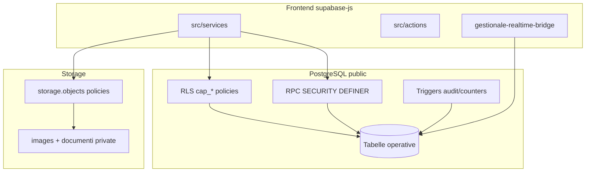

# Audit production-grade — Supabase / Database

**Data:** 2026-06-07  
**Scope:** migration SQL, schema, RLS, trigger, function, view, RPC, storage, realtime, seed, config Supabase.  
**Progetto live:** CAB Gestionale (`oxmnuovsgenqkuwfolqh`, Postgres 17, eu-west-1)  
**Strategia:** audit read-only + fix conservativi verificati; nessun DROP, nessuna modifica RLS/RPC comportamentale.

**Riferimenti:** [supabase-schema-refactor-report.md](./supabase-schema-refactor-report.md) (storico) · [audit-phase7-security-audit.md](./audit-phase7-security-audit.md) (app-layer) · [audit-settings-ecosystem.md](./audit-settings-ecosystem.md)

**Rigenerare inventario:** `npm run audit:supabase` · JSON: `npm run audit:supabase:json` → `docs/.supabase-audit-inventory.json`

---

## Executive summary

L'infrastruttura database è **production-ready** per un gestionale ERP multi-ruolo: schema normalizzato, RLS `cap_*` centralizzato su `rbac_has_capability`, soft delete lavorazioni/promemoria, storage privato, realtime allineato al client. I debiti principali sono **migration history verbose** (80 file, catene repair), **drift documentazione** (`rbac_core.sql` vs ultima migration), **tabelle legacy** (supporto, counter senza RLS), **publication realtime** che include ancora tabelle deprecated, e **tipi TS manuali** non generati da Supabase CLI.

**Production Readiness Score: 7.8 / 10**

| Dimensione | Score | Note |
|----------|-------|------|
| Schema & relazioni | 8.5 | FK coerenti, snake_case, entity_key su mezzi/magazzino |
| Migration hygiene | 6.5 | 80 migration, core duplicato, repair chains — accettato per history |
| RLS & sicurezza | 8.0 | cap_* + user_permissions; counter tables senza RLS (by design) |
| RPC / trigger | 8.0 | SECURITY DEFINER su delete/soft-delete; retention log |
| Storage | 9.0 | Bucket `documenti`/`images` privati, path RLS |
| Realtime | 7.5 | Allineato client; deprecated tables ancora in publication |
| Performance | 7.0 | Indici abbondanti; advisor segnala initplan RLS e FK non indicizzate |
| Manutenibilità / docs | 7.5 | Script audit + verify SQL; tipi manuali |
| CI / gates | 8.5 | `audit:rls`, `production:check`, verify SQL |

---

## 1. Mappa completa Supabase

### 1.1 Cartelle e config

| Path | Contenuto |
|------|-----------|
| [`supabase/migrations/`](../supabase/migrations/) | **80** migration SQL (2026-02-11 → 2026-07-08) |
| [`supabase/rbac_core.sql`](../supabase/rbac_core.sql) | SSOT RBAC nel repo (rischio drift vs DB) |
| [`supabase/config.toml`](../supabase/config.toml) | Postgres **17**, seed enabled, realtime enabled |
| [`supabase/seeds/`](../supabase/seeds/) | `pilot_enable_operator_global_settings.sql` |
| [`supabase/functions/`](../supabase/functions/) | **Assente** — nessuna Edge Function |
| [`src/types/supabase-tables.ts`](../src/types/supabase-tables.ts) | Tipi manuali (no `database.types.ts` generato) |
| [`scripts/rls-service-audit.ts`](../scripts/rls-service-audit.ts) | Gate services ↔ RLS migration |
| [`scripts/supabase-audit-inventory.ts`](../scripts/supabase-audit-inventory.ts) | Inventario statico (nuovo) |
| [`scripts/verify-*.sql`](../scripts/) | Verify post-deploy RBAC/schema/RLS |

**Config fix applicato:** `sql_paths` allineato a `./seeds/*.sql` (prima `./seed.sql` inesistente → `supabase db reset` non caricava seed).

### 1.2 Oggetti SQL (aggregato da migration)

| Tipo | Count | Dettaglio |
|------|-------|-----------|
| Tabelle `public` | 24+3 counter | Vedi §3 |
| Policy RLS | ~210 | Prefisso `cap_*` dominante post-20260519 |
| Funzioni | 63 | RBAC spine + RPC operative + trigger helpers |
| Trigger | 23 | updated_at, audit, counters, auth, retention |
| View | 1 | `lavorazioni_clienti` |
| Indici | ~70 | Inclusi GIN/trgm, soft-delete partial |
| Publication | 1 | `supabase_realtime` |
| Storage buckets | 2 | `images` (10MB), `documenti` (100MB), entrambi **private** |

### 1.3 Snapshot DB live (2026-06-07)

**Tabelle `public` con RLS:** 25 tabelle applicative + 2 legacy deprecated + 2 orphan (`organizations`, `memberships` — **non presenti nel repo**, 0 righe memberships).

**Counter tables (RLS off):** `lavorazioni_codice_counters`, `preventivi_*_counters` — accesso solo via trigger SECURITY DEFINER; **nessun `.from()` client**. Advisor Supabase segnala esposizione teorica via anon key: mitigato da assenza grant client e uso trigger-only.

**Publication `supabase_realtime` (19 tabelle):**
`app_settings`, `auth_logs`, `bunder_documents`, `dashboard_promemoria`, `dipendenti_timesheet_*`, `documenti`, `lavorazione_documents`, `lavorazioni`, `log_modifiche`, `magazzino_ricambi`, `mezzi`, `movimenti_ricambi`, `preventivi`, `profiles`, `scheda_lavorazione`, `segnalazioni`, `support_notes`, `user_permissions`

**Storage buckets live:** `documenti` private 100MB, `images` private 10MB.



---

## 2. Mappa migration e timeline repair

**Periodo:** 20260211120000 → 20260708120000 (80 file).

### 2.1 Catene repair / workaround documentate

| Catena | Migration | Scopo |
|--------|-----------|-------|
| Schema core duplicato | `11120000`, `11140000` | Due bootstrap idempotenti stesse tabelle |
| RBAC enterprise | `17194000` → `19150100` → `31120000` → `60602120000` → `60605120000` | Evoluzione ruoli, capabilities, operator settings |
| Soft delete lavorazioni | `20180000`, `20190000`, `20230000`, `21140000` | Colonna + RLS + RPC |
| Mezzo delete | `23160000`–`23200000` | RPC dipendenze + purge storico |
| View clienti | `20120000`, `18180000` | enum→text + portale archive |
| Supporto deprecated | `18170000`, `20210000`, `60704130000`, `60707140000` | segnalazioni → support_notes → read-only admin |
| Realtime | `21180000`, `60705120000` | Publication base + gap timesheet/permissions/profiles |
| Consolidation | `22120000` | Wrapper `current_profile_role`, deprecate segnalazioni write |

### 2.2 Classificazione migration

| Classe | Count approx | Esempi |
|--------|--------------|--------|
| Attive / schema | ~25 | Nuove tabelle dominio |
| RBAC / RLS | ~20 | Policy cap_*, hardening |
| Repair / ensure | ~12 | `_fix`, `_ensure`, soft delete chain |
| Storage | ~6 | Buckets, path RLS, private |
| Deprecation | ~3 | supporto, input limits |
| Config / prefs | ~8 | app_settings, theme, branding |

**Regola mantenuta:** nessuno squash migration — debito storico documentato, non rimosso.

---

## 3. Schema audit

### 3.1 Tabelle operative (attive)

| Tabella | Service | Realtime pub | Note |
|---------|---------|--------------|------|
| `profiles` | auth.service | ✅ | username login, ruolo enum |
| `mezzi` | mezzi.service | ✅ | entity_key, meta JSON |
| `lavorazioni` | lavorazioni.service | ✅ | soft delete, codice umano, archived |
| `scheda_lavorazione` | schede.service | ✅ | contenuto JSONB GIN |
| `magazzino_ricambi` | magazzino.service | ✅ | meta, entity_key |
| `movimenti_ricambi` | movimenti.service | ✅ | |
| `preventivi` | preventivi.service | ✅ | counter numero |
| `documenti` | documenti.service | ✅ | catalogo PDF |
| `log_modifiche` | log.service | ✅ | append-only, retention 100 |
| `app_settings` | settings.service | ✅ | bulk 6 row + user_prefs |
| `app_settings_audit` | app-settings-audit.service | — | trigger-only write |
| `user_permissions` | permissions.service | ✅ | override granulari |
| `auth_logs` | auth-logs.service | ✅ | non in invalidate-targets |
| `lavorazione_documents` | lavorazione-documents.service | ✅ | PDF lavorazione |
| `report_manual_entries` | report-manual-entries.service | — | KPI report manuali |
| `bunder_documents` | bunder.service | ✅ | migrato da localStorage |
| `dashboard_promemoria` | dashboard-promemoria.service | ✅ | soft delete RPC |
| `dipendenti_timesheet_employees` | dipendenti-timesheet.service | ✅ | |
| `dipendenti_timesheet_entries` | dipendenti-timesheet.service | ✅ | snapshot employee |

### 3.2 Tabelle interne (server/trigger only)

| Tabella | RLS | Uso |
|---------|-----|-----|
| `lavorazioni_codice_counters` | ❌ | Trigger assign codice |
| `preventivi_lavorazione_numero_counters` | ❌ | Trigger numero preventivo |
| `preventivi_manuali_numero_counters` | ❌ | Trigger preventivi manuali |

### 3.3 Legacy / deprecated

| Oggetto | Stato | Frontend |
|---------|-------|----------|
| `segnalazioni` | DEPRECATED, SELECT admin | Nessun service TS |
| `support_notes` | DEPRECATED, SELECT admin | Nessun service TS |
| `organizations`, `memberships` | Orphan DB (non in repo) | Nessun ref — **candidata verifica/drop futuro** |

### 3.4 View

| View | Uso client TS | Note |
|------|---------------|------|
| `lavorazioni_clienti` | Indiretto (RLS su `lavorazioni`) | security_barrier; ricreata post enum→text |

### 3.5 Coerenza tipi TS

[`supabase-tables.ts`](../src/types/supabase-tables.ts) documenta solo **5** tabelle via commento `Tabella \`...\``; le altre hanno tipi Row ma commenti incompleti. Gap vs DB: colonne recurrence su `dashboard_promemoria` (migration `60708120000`) — verificare allineamento tipi in backlog.

---

## 4. Function / RPC audit

### 4.1 RPC chiamate dal frontend

| RPC | Chiamante | Scopo |
|-----|-----------|-------|
| `bulk_upsert_app_settings` | settings.service | Save impostazioni bulk + audit |
| `soft_delete_lavorazione` | lavorazioni.service | Eliminazione logica |
| `soft_delete_dashboard_promemoria` | dashboard-promemoria.service | Eliminazione logica promemoria |
| `count_mezzo_dependencies` | mezzi.service | Pre-delete check |
| `delete_mezzo` | mezzi.service | Purge cascata controllata |
| `check_username_available` | admin-users, security-users-permissions | Validazione username |
| `resolve_auth_email_for_login` | resolve-login-email (admin) | Login by username |

### 4.2 RPC/trigger interni (no client direct)

`assign_lavorazione_codice`, `assign_preventivo_numero_*`, `archive_lavorazione_client_portal`, `prune_log_modifiche_retention`, `handle_new_user`, `user_effective_can`, intera famiglia `rbac_*`.

### 4.3 Drift `rbac_core.sql`

Funzioni ridefinite in migration successive a maggio 2026 (`rbac_has_capability`, `user_effective_can`, `delete_mezzo`). **Regola operativa:** ogni fix RBAC → aggiornare `rbac_core.sql` poi migration incrementale. Backlog: diff automatico rbac_core vs pg_proc.

### 4.4 Advisor sicurezza (live)

- `function_search_path_mutable` su funzioni `organizations`/`memberships` (`can_write_org`, `is_member_org`) — tabelle orphan, non gestionale CAB.
- Spine RBAC gestionale: verificare `SET search_path = public` su RPC SECURITY DEFINER in migration recenti (pattern già presente su soft_delete_*).

---

## 5. Trigger audit

| Trigger | Tabella | Impatto |
|---------|---------|---------|
| `*_set_updated_at` / `trg_*_updated_at` | Core entities | Basso — BEFORE UPDATE |
| `trg_app_settings_audit_update` | app_settings | Medio — ogni save settings |
| `trg_lavorazioni_assign_codice` | lavorazioni | Basso — INSERT |
| `trg_preventivi_assign_numero` | preventivi | Basso — INSERT |
| `trg_log_modifiche_retention` | log_modifiche | Medio — prune a 100/riga entità |
| `on_auth_user_created` | auth.users → profiles | Critico onboarding |
| `trg_dashboard_promemoria_updated_at` | dashboard_promemoria | Basso |

**Fix storico:** `20260523150000_scheda_lavorazione_updated_at_fix.sql` — rimozione trigger duplicati su scheda.

---

## 6. Policy audit (RLS)

### 6.1 Architettura

```
Client → cap_* policies → rbac_has_capability / rbac_can_read_row → profiles.ruolo + user_permissions
```

- **210 policy** parseate da migration; naming `cap_*` standard post-refactor.
- `npm run audit:rls`: **PASS** — 18 tabelle service coperte.

### 6.2 Duplicazioni attese (documentate)

| Tabella | Motivo |
|---------|--------|
| `app_settings` | `cap_app_settings_*` + `cap_user_prefs_*_own` (modulo user_prefs) |
| `auth_logs` | 3 policy INSERT per action (login/logout/failed) |
| `segnalazioni`, `support_notes` | `cap_*` legacy + `*_select_admin` post-deprecation |
| `user_permissions` | select + write split |

### 6.3 Aree critiche — non modificare senza piano

- `cap_lavorazioni_*` + `soft_delete_lavorazione`
- Storage cliente su bucket `documenti`
- `handle_new_user` + trigger profilo
- `log_modifiche` append-only (no UPDATE policy)

### 6.4 Verify SQL

Eseguire su staging/prod:
```bash
supabase db execute --linked --file scripts/verify-schema-consolidation.sql
supabase db execute --linked --file scripts/verify-rls-hardening.sql
supabase db execute --linked --file scripts/verify-rbac-enterprise.sql
```

**Esteso:** sezioni 6b–6d in `verify-schema-consolidation.sql` (counter RLS, publication, deprecated in realtime).

---

## 7. Index audit

### 7.1 Indici strategici presenti

- Partial indexes soft delete: `idx_lavorazioni_active_*`
- FK/join: `mezzo_id`, `lavorazione_id`, `ricambio_id`
- Ricerca: trgm su `mezzi.cliente`, `magazzino_ricambi.nome`
- Report: `idx_report_manual_entries_active_month`
- Timesheet: `(dipendente_id, work_date)`

### 7.2 Advisor performance (live) — raccomandazioni

| Priorità | Finding | Azione suggerita |
|----------|---------|------------------|
| P2 | FK senza indice (`*_created_by_fkey`, `*_updated_by_fkey`) | Migration index su colonne audit se query admin frequenti |
| P3 | `auth_rls_initplan` su `cap_user_prefs_*`, `cap_user_permissions_select` | `(select auth.uid())` pattern — migration dedicata |
| P3 | `unused_index` (molti indici mai usati in stats) | Non rimuovere senza EXPLAIN su staging con carico reale |
| P3 | `multiple_permissive_policies` su app_settings | Accettato — design user_prefs + global |

---

## 8. View audit

- **Unica view:** `lavorazioni_clienti` — ricreata in `20120000` dopo drop cascade enum→text.
- **Materialized views:** nessuna.
- **Uso:** portale clienti via query su `lavorazioni` + RLS; view disponibile per SQL/reporting.

---

## 9. Storage audit

| Bucket | Public | Limit | RLS |
|--------|--------|-------|-----|
| `documenti` | false | 100MB | Path-based + cliente su lavorazioni |
| `images` | false | 10MB | Path-based + branding logo |

**App:** upload via `documenti.service`, `lavorazione-documents.service`, branding in `app_settings`.

**Gate:** `production:check` verifica bucket public e legacy URLs (`lib/ops/storage-consistency-diagnostics.ts`).

**Nota:** [audit-phase5-storage-audit.md](./audit-phase5-storage-audit.md) copre **browser localStorage**, non Supabase Storage.

---

## 10. Realtime audit

### 10.1 Allineamento client ↔ publication

| In `invalidate-targets` | In publication DB | Gap |
|-------------------------|-------------------|-----|
| 16 tabelle operative | 19 tabelle | DB include `auth_logs`, `segnalazioni`, `support_notes` |
| — | — | `report_manual_entries` in nessuno (OK — basso churn) |

### 10.2 Problemi

| ID | Sev | Descrizione |
|----|-----|-------------|
| RT-01 | P2 | ~~`segnalazioni`, `support_notes` in publication~~ — **fix** migration `20260709120000` | Vedi [audit-supabase-performance-degradation.md](./audit-supabase-performance-degradation.md) |
| RT-02 | P3 | `auth_logs` in publication ma non in `GESTIONALE_TABLE_QUERY_KEYS` |

**Backlog (migration futura, approvazione esplicita):**
```sql
-- Dopo verifica zero subscriber UI supporto
ALTER PUBLICATION supabase_realtime DROP TABLE public.segnalazioni;
ALTER PUBLICATION supabase_realtime DROP TABLE public.support_notes;
```

---

## 11. Frontend mapping

### 11.1 Matrice service → tabella

| Service | Tabelle |
|---------|---------|
| auth.service | profiles |
| mezzi.service | mezzi |
| lavorazioni.service | lavorazioni, mezzi, scheda_lavorazione |
| schede.service | scheda_lavorazione |
| magazzino.service | magazzino_ricambi |
| movimenti.service | magazzino_ricambi, movimenti_ricambi |
| preventivi.service | preventivi |
| documenti.service | documenti |
| log.service | log_modifiche |
| settings.service | app_settings |
| app-settings-audit.service | app_settings_audit |
| permissions.service | user_permissions |
| auth-logs.service | auth_logs |
| lavorazione-documents.service | lavorazione_documents |
| report-manual-entries.service | report_manual_entries |
| bunder.service | bunder_documents |
| dashboard-promemoria.service | dashboard_promemoria |
| dipendenti-timesheet.service | dipendenti_timesheet_* |
| client-lavorazioni.service | lavorazioni (+ join mezzi) |

### 11.2 Oggetti DB senza ref TS diretto

| Oggetto | Classificazione |
|---------|-----------------|
| Counter tables | Attivo — trigger only |
| `segnalazioni`, `support_notes` | Legacy — mantenere read admin |
| `lavorazioni_clienti` | Attivo — view SQL |
| `organizations`, `memberships` | Orphan — verificare origine |

---

## 12. Legacy audit

| Oggetto | Classificazione | Azione |
|---------|-----------------|--------|
| `segnalazioni` | Mantenere compatibilità | Drop post-backup |
| `support_notes` | Mantenere compatibilità | Drop post-backup |
| Enum `ruolo_utente` legacy values | Attivo | `rbac_normalize_role()` |
| `current_profile_role()` | Wrapper deprecated | Mantenere |
| Migration core duplicate | Documentazione | Non squash |
| `rbac_resource_allows_*` | Obsolete | Verificare assenza (verify SQL §1) |

---

## 13. Security audit

### 13.1 Checklist

| Controllo | Stato |
|-----------|-------|
| RLS su tabelle service | ✅ `audit:rls` PASS |
| Service role solo server | ✅ actions admin pattern |
| Bucket documenti private | ✅ live DB |
| Deprecated write revocato | ✅ `60704130000` |
| Counter tables | ⚠️ RLS off — mitigato no client access |
| Orphan org tables | ⚠️ Presenti in DB, assenti repo |

### 13.2 Integrazione app-layer

Vedi [audit-phase7-security-audit.md](./audit-phase7-security-audit.md): proxy edge + RLS authoritative, fail-closed guards, PDF API hardened.

---

## 14. Performance audit

- **Query liste:** services usano `.order('created_at')` + filtri deleted_at — indici partial presenti.
- **log_modifiche:** 409 righe live, retention trigger — OK.
- **app_settings_audit:** 14783 righe — monitorare crescita; indici audit presenti.
- **auth_logs:** 1386 righe — indice `(user_id, created_at)`.

Raccomandazione: `EXPLAIN ANALYZE` su dashboard metrics e report con dataset produzione prima di drop indici "unused".

---

## 15. Production hardening — fix applicati

| Fix | File | Stato |
|-----|------|-------|
| Seed path config | `supabase/config.toml` | ✅ `./seeds/*.sql` |
| Script inventario | `scripts/supabase-audit-inventory.ts` | ✅ + npm scripts |
| Verify SQL esteso | `scripts/verify-schema-consolidation.sql` | ✅ sezioni 6b–6d |
| Banner doc storico | `docs/supabase-schema-refactor-report.md` | ✅ link SSOT |

**Non applicato (backlog approvazione):** DROP publication deprecated, RLS counter tables, squash migration, policy initplan refactor.

---

## 16. Verifica regressioni

### 16.1 Automated (2026-06-07)

| Gate | Risultato |
|------|-----------|
| `npm run audit:rls` | ✅ PASS |
| `npm run audit:supabase` | ✅ PASS (post seed fix) |
| `npm run production:check` | ✅ PASS (DB snapshot skipped senza env locale; live verificato via MCP) |
| `npx tsc --noEmit` | Eseguire in CI |

### 16.2 Checklist manuale

| Area | Verifica |
|------|----------|
| Login | username/email resolve, auth_logs insert |
| Utenti | profiles, user_permissions, check_username_available |
| Clienti | mezzi.cliente, portale lavorazioni |
| Mezzi | CRUD, delete_mezzo RPC |
| Dipendenti | timesheet employees/entries, snapshot |
| Report | report_manual_entries |
| PDF | lavorazione_documents, documenti storage |
| Notifiche | dashboard_promemoria reminder bridge |
| Magazzino | ricambi, movimenti |
| Sicurezza | RBAC admin, app_settings_audit read |

---

## Problemi individuati (priorità)

| ID | P | Problema |
|----|---|----------|
| P0 | — | Nessun blocker produzione |
| P1 | — | Nessuno |
| P2 | RT-01 | ~~Publication deprecated~~ — **risolto** `20260709120000` |
| P2 | SEC-01 | Counter tables RLS disabled (by design; documentato) |
| P2 | DB-01 | Tabelle `organizations`/`memberships` orphan in DB |
| P3 | DOC-01 | `rbac_core.sql` drift vs ultima migration |
| P3 | DOC-02 | Tipi TS manuali incompleti vs schema |
| P3 | PERF-01 | auth_rls_initplan su user_prefs policies |
| P3 | PERF-02 | FK audit columns senza indice |

---

## Backlog remediation (approvazione esplicita)

1. Migration: DROP `segnalazioni`/`support_notes` da publication realtime.
2. Migration: REVOKE ALL counter tables FROM anon, authenticated; optional ENABLE RLS + deny all.
3. Investigare/drop `organizations`, `memberships` se confermato unused.
4. Sync `rbac_core.sql` con pg_get_functiondef live.
5. `supabase gen types typescript` → integrazione graduale tipi.
6. Policy refactor initplan `(select auth.uid())` su user_prefs.

---

## Elementi mantenuti per compatibilità

- 80 migration storiche (no squash)
- `segnalazioni`, `support_notes` read-only admin
- `current_profile_role()` wrapper
- Policy duplicate intenzionali (app_settings user_prefs, auth_logs)
- Indici "unused" fino a analisi carico reale

---

## Rischi residui

- Drift rbac_core vs DB senza diff CI automatico
- Performance RLS a scale su app_settings bulk read
- Orphan org tables — superficie sicurezza non documentata nel repo
- Tipi manuali — regressioni schema silenti

---

## Comandi operativi

```bash
npm run audit:supabase
npm run audit:supabase:json
npm run audit:rls
PRODUCTION_CHECK_REQUIRE_DB=1 npm run production:check
supabase db execute --linked --file scripts/verify-schema-consolidation.sql
```
