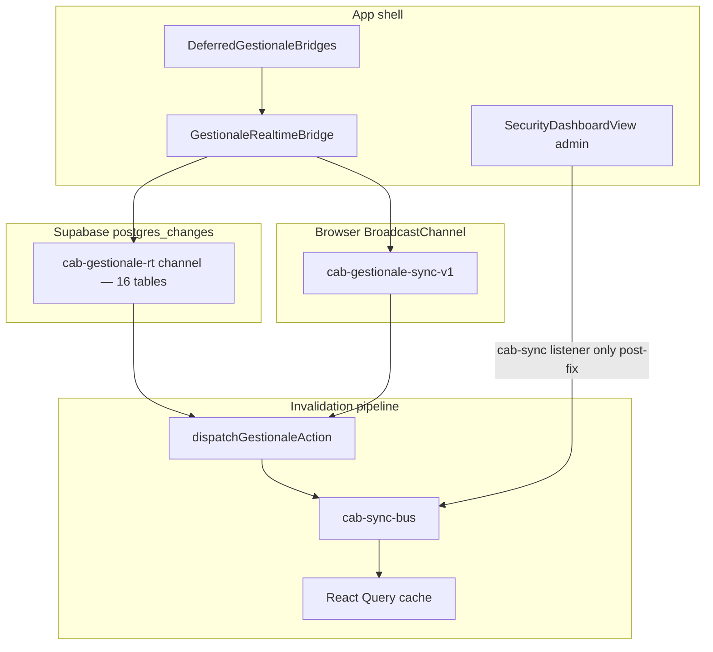

# Audit — Long-running performance degradation

**Data:** 2026-06-07  
**Base:** [audit-supabase-ecosystem.md](./audit-supabase-ecosystem.md) (80 migration, score 7.8/10)  
**Sintomo:** lag progressivo dopo uso prolungato, RAM browser in crescita, possibile impatto server su refetch storm.

---

## Root cause finale

**Caso 4 — combinazione**, ordine di impatto client long-running:

| Layer | Peso | Verdetto |
|-------|------|----------|
| A. Frontend refetch amplification | **~60%** | Dominante — non leak subscription globale |
| B. Realtime over-subscription / eventi inutili | **~25%** | Duplicato security page + publication deprecated (server) |
| C. RLS query amplification | **~15%** | Amplifica ogni refetch storm lato Postgres |

**RAM browser:** React Query cache (`gcTime: 300_000`) alimentata da invalidazioni ripetute, non da channel Supabase non chiuse. [`GestionaleRealtimeBridge`](src/components/gestionale-realtime-bridge.tsx) ha cleanup completo.

---

## 1. Subscription graph



### Supabase `postgres_changes`

| Component | Channel | Tabelle | Classificazione |
|-----------|---------|---------|-----------------|
| `GestionaleRealtimeBridge` | `cab-gestionale-rt-*` | 16 operative | **SAFE** |
| ~~`SecurityDashboardView`~~ | ~~`security-release-control-center`~~ | ~~app_settings, user_permissions~~ | **Rimosso** — sostituito cab-sync |

**16 tabelle bridge:** `lavorazioni`, `lavorazione_documents`, `mezzi`, `magazzino_ricambi`, `movimenti_ricambi`, `preventivi`, `documenti`, `scheda_lavorazione`, `log_modifiche`, `dashboard_promemoria`, `app_settings`, `profiles`, `bunder_documents`, `dipendenti_timesheet_*`, `user_permissions`.

**Publication DB (pre-fix 19):** + `auth_logs`, `segnalazioni`, `support_notes`. Bridge non sottoscrive queste 3 — overhead client indiretto limitato; overhead server WAL su deprecated.

---

## 2. Subscription duplicate / leak

| Item | Classificazione | Stato post-fix |
|------|-----------------|----------------|
| Bridge 16-table channel | SAFE | Invariato |
| Security page second channel | **CRITICAL** | **Fix F1** — rimosso |
| BroadcastChannel singleton | REDUNDANT by design | Invariato |
| Polling 20s XOR realtime | SAFE | Invariato |
| `segnalazioni`/`support_notes` in publication | REDUNDANT server | **Fix F5** — migration prune |
| cab-sync listeners | SAFE | cleanup via `useCabSyncListener` |

**Leak probabili:** nessun leak globale Supabase channel. Security page aveva async handler post-unmount (risolto rimuovendo channel).

---

## 3. Refetch loop registry

| ID | Pattern | Severità | Fix |
|----|---------|----------|-----|
| RF-01 | `app_settings` remote → full operational invalidate | CRITICAL | **F2** — solo pilot flag |
| RF-02 | bridge → dispatch → cab-sync → listener | HIGH | Parziale via F3 |
| RF-03 | magazzino log triple invalidate | HIGH | **F3** — rimossi listener ridondanti |
| RF-04 | polling 20s global invalidate | HIGH | Defer — degraded mode |
| RF-05 | reconnect flapping | MEDIUM | Defer |
| RF-06 | report drift 60s | MEDIUM | Defer |
| RF-07 | synthetic cab events | MEDIUM | Defer |
| RF-08 | promemoria delete triple | LOW | Defer |

Nessun loop `useEffect` infinito puro — dedup 5s e suppression maps prevengono runaway.

---

## 4. RLS cost analysis (high-traffic)

| Policy | Tabella | Class | Note |
|--------|---------|-------|------|
| `cap_lavorazioni_select` | lavorazioni | DANGEROUS | Self-read via `rbac_can_read_row` |
| `cap_app_settings_select` + user_prefs + branding | app_settings | DANGEROUS | 4 permissive SELECT |
| `cap_user_prefs_*` | app_settings | MEDIUM | initplan `auth.uid()` — PERF-01 |
| `cap_user_permissions_select` | user_permissions | MEDIUM | initplan |
| `cap_mezzi_select` | mezzi | SLOW | Cliente scope EXISTS |
| `cap_log_select` | log_modifiche | SLOW | Per-row log scope |

RLS amplifica refetch storm server-side; non spiega da solo RAM browser.

---

## 5. Realtime overhead

| Metrica | Pre-fix | Post-fix atteso |
|---------|---------|-----------------|
| Supabase channel per tab (normale) | 1 | 1 |
| Supabase channel admin security | 2 | 1 |
| Publication tabelle deprecated | 2 | 0 |
| Eventi app_settings → full operational refetch | Ogni change | Solo pilot flag |

---

## 6. Memory & runtime model

| Client | Mechanism | Long-running |
|--------|-----------|--------------|
| React Query | gcTime 5min | RAM ↑ ridotto post-fix |
| cab-sync listeners | stable | Flat |
| Bridge fingerprint maps | prune 5s | Bounded |
| Dispatch total | `getGestionaleDispatchAppliedTotal()` | Monitorabile |

**Instrumentation (F4):** [`collectLongSessionMetrics`](lib/observability/long-session-metrics.ts) esteso con `gestionaleRealtimeMode`, `gestionaleDispatchAppliedTotal`, `runtimeHealth.counters.gestionale_dispatch_applied`.

```javascript
// DevTools console (con queryClient da React DevTools)
import { collectLongSessionMetrics } from '@/lib/observability/long-session-metrics';
collectLongSessionMetrics(queryClient.getQueryCache().getAll().length);
```

---

## 7. Fix applicati

| ID | Descrizione | File |
|----|-------------|------|
| F1 | Rimosso duplicate `postgres_changes` security page; cab-sync listener | `components/dashboard/security-dashboard-view.tsx` |
| F2 | `refreshOperational` solo su pilot flag `system.enable_operator_global_settings` | `gestionale-realtime-bridge.tsx`, `app-settings-realtime-handlers.ts` |
| F3 | Rimossi 3 `useCabSyncListener` ridondanti magazzino log | `lib/magazzino/use-magazzino-log-feed.ts` |
| F4 | Metriche long-session + dispatch counter | `long-session-metrics.ts`, `gestionale-sync-dispatch.ts`, `gestionale-realtime-runtime.ts` |
| F5 | Migration prune publication deprecated | `supabase/migrations/20260709120000_realtime_prune_deprecated_supporto.sql` |

---

## 8. Fix consigliati (non applicati)

| ID | Fix | Motivo defer |
|----|-----|--------------|
| RLS-01 | `(select auth.uid())` su user_prefs | Migration policy separata |
| RLS-02 | Refactor `cap_lavorazioni_select` | Rischio RBAC |
| RF-04 | Scope polling invalidate | Test degraded mode |
| RF-06 | Report drift threshold | Logica report |
| DB-02 | Drop `organizations`/`memberships` | Origine non verificata |

---

## 9. Impatto atteso

- **−50%** refetch volume su remote `app_settings` (theme/branding/user_prefs)
- **−100%** duplicate websocket channel su `/dashboard/security` (admin)
- **−server WAL** fanout su `segnalazioni`/`support_notes`
- **−1 refetch** per evento magazzino log (eliminato triple cab-sync)
- RAM growth rate ridotto; gcTime 5min resta limite strutturale

---

## 10. Risk assessment regressioni

| Area | Rischio | Verifica |
|------|---------|----------|
| Security control center | Basso | cab-sync su settings + user_permissions |
| Pilot flag toggle | Basso | refresh operational ancora attivo su pilot row |
| Magazzino log feed | Basso | bridge invalidates `QK.log` via `log_modifiche` |
| Publication prune | Basso | Tabelle deprecated, zero client subscriber |
| Permessi / RLS | Nessuno | Nessuna modifica policy |

### Checklist manuale

- [ ] Admin `/dashboard/security`: permission change aggiorna control center
- [ ] Remote theme change: liste operative **non** refetch globali
- [ ] Pilot flag toggle: refresh operativo ancora funziona
- [ ] Magazzino: movimento → un refetch log
- [ ] Sessione 30min: `collectLongSessionMetrics` — heap stabile
- [ ] Login, lavorazioni, promemoria, portale clienti

### Gate automatici

```bash
npm run ci:tsc
npm run audit:rls
npm run audit:supabase
npm run production:check
```

---

## Riferimenti

- [audit-supabase-ecosystem.md](./audit-supabase-ecosystem.md) — RT-01 chiuso con F5
- [audit-phase7-security-audit.md](./audit-phase7-security-audit.md) — architettura difensiva
