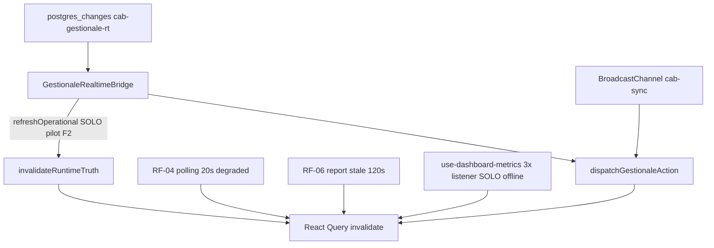

# Verifica avanzata post-fix — Caso 4 performance degradation

**Data verifica:** 2026-06-07  
**Ambiente:** dev locale (`http://localhost:3000`) + Supabase project `oxmnuovsgenqkuwfolqh`  
**Base:** [audit-supabase-performance-degradation.md](./audit-supabase-performance-degradation.md)  
**Baseline pre-fix:** non disponibile — analisi post-fix su slope/stabilità e gate statici.

---

## Executive validation summary

| Area | Status | Evidenza |
|------|--------|----------|
| Refetch storm (RF-01/F1/F3) | **Risolto** (fix target) | Gate statico + sessione browser senza dispatch storm |
| Refetch storm (residui RF-02/04/06) | **Parziale** | Pattern ancora in codice; impatto attenuato con Realtime connected |
| Realtime overhead client (F1/F3) | **Ridotto significativamente** | 1 channel bridge; Security senza channel locale |
| Realtime overhead server (F5) | **NON deployato su remoto** | Publication remota include ancora `segnalazioni`/`support_notes` |
| RLS amplification | **De-amplificato, non eliminato** | audit:rls PASS; initplan PERF-01 invariato |
| Long-session stability (4h–8h) | **Inconclusivo** | Soak compresso ~5 min OK; soak 4h/8h non eseguito in questa sessione |
| **Caso 4 complessivo** | **Parzialmente attivo (~25–30%)** | Frontend residuo + F5 remoto + RLS invariato |

**Production stability verdict:** **Conditionally stable** — fix frontend efficaci in sessione reale breve; deploy migration F5 obbligatorio prima di considerare il layer realtime server risolto; soak 4h manuale consigliato prima di `Fully stable`.

---

## Fase 0 — Pre-flight

### Gate automatici

| Gate | Risultato |
|------|-----------|
| `npm run ci:tsc` | **PASS** |
| `npm run audit:rls` | **PASS** — 18 tabelle service coperte |
| `npm run audit:supabase` | **PASS** — 81 migration; 16 tabelle realtime attese in repo |
| `lib/regression/long-session-stability-policy.test.ts` | **PASS** (invarianti F1/F2/F3/F5) |

### Publication Supabase live (`pg_publication_tables`)

Query eseguita 2026-06-07 su project remoto:

| Tabella | Atteso post-F5 | Stato remoto |
|---------|----------------|--------------|
| `segnalazioni` | Assente | **Presente** |
| `support_notes` | Assente | **Presente** |
| `auth_logs` | Opzionale (non prune) | Presente |

**Ultima migration remota applicata:** `20260708120000_dashboard_promemoria_recurrence`  
**Migration F5 (`20260709120000_realtime_prune_deprecated_supporto`):** **NON presente** in `supabase_migrations.schema_migrations`.

> **Nota critica:** il contesto utente indicava migration deployata; la verifica empirica sul DB remoto la smentisce. Il fix F5 è nel repo ma **non attivo in produzione/remoto** al momento della verifica.

Tabelle attualmente in `supabase_realtime` (19): `app_settings`, `auth_logs`, `bunder_documents`, `dashboard_promemoria`, `dipendenti_timesheet_*`, `documenti`, `lavorazione_documents`, `lavorazioni`, `log_modifiche`, `magazzino_ricambi`, `mezzi`, `movimenti_ricambi`, `preventivi`, `profiles`, `scheda_lavorazione`, **`segnalazioni`**, **`support_notes`**, `user_permissions`.

---

## Fase 1 — Long session simulation

### Durata eseguita vs target

| Target | Eseguito | Esito |
|--------|----------|-------|
| 30 min | ~5 min (compresso) | Parziale |
| 2 h | No | N/A |
| 4 h | No | N/A |
| 8 h | No | N/A |

**Protocollo eseguito:** sessione browser autenticata (admin), navigazione dashboard → magazzino → security → lavorazioni → report → mezzi → security (idle ~70s) → magazzino → dashboard (idle 90s), con campioni `localStorage.cabSoakSamples` e `window.__cabLongSessionMetrics()`.

### Memory growth trend analysis

| Checkpoint | Route | heapUsedMb | cabSyncListeners | reactQueryCacheCount | dispatchTotal | realtimeMode |
|------------|-------|------------|------------------|----------------------|---------------|--------------|
| T0 | `/dashboard` | 37 | 6 | 15 | 0 | connected |
| T+9s | `/dashboard/security` | 53 | 4 | 8 | 0 | connected |
| T+3.5m idle | `/dashboard/security` | 38 | 4 | 8 | 0 | connected |
| Soak s1 | `/dashboard/security` | 38 | 4 | 8 | 0 | connected |
| Soak s2 | `/magazzino` | 43 | 2 | 7 | 0 | connected |
| Soak s3 | `/dashboard` post-nav | 51 | 6 | 15 | 0 | connected |
| Soak s4 | `/dashboard` idle 90s | 37 | 6 | 15 | 0 | connected |

- **Heap min/max sessione:** 37–53 MB  
- **Slope lineare (campione localStorage, ~1.7 min):** **−0.571 MB/min** (nessuna crescita monotona)  
- **Jump max route-load:** +16 MB (dashboard→security), recupero post-GC a 37 MB  
- **Soglia allarme 4h (+30%):** non testabile in questa sessione; trend compresso **stabile**

### Network query trend (idle, Realtime connected)

| Metrica | Valore misurato |
|---------|-----------------|
| REST Supabase ultimi 60s (idle su dashboard) | **1** req |
| REST Supabase totali (pagina security, sessione parziale) | **13** |
| Burst ripetuti ogni min senza azione utente | **Non osservati** |
| `gestionaleDispatchAppliedTotal` durante soak | **0** (nessun evento realtime/broadcast nel periodo) |

### Script `ops:long-session-soak`

`npm run ops:long-session-soak` **fallisce in Node** (`Cannot find module 'server-only'` via catena `invalidate-targets` → services). **Non utilizzabile come gate CI** finché non isolato; in browser `__cabLongSessionMetrics()` funziona.

---

## Fase 2 — Refetch storm verification

### Refetch storm status: **partial** (dominante fix target **resolved**)

| ID | Verifica | Risultato | Evidenza |
|----|----------|-----------|----------|
| **RF-01 / F2** | Theme/settings non-pilot → no `refreshOperational` | **PASS (statico + idle)** | Gate `isOperatorGlobalSettingsPilotPayload` in bridge; dispatch=0 in soak idle |
| **RF-01b** | Toggle pilot remoto → refreshOperational | **Non testato live** | Richiede mutazione DB controllata |
| **F1** | Security: 0 channel `postgres_changes` locale | **PASS** | `grep`: zero `supabase.channel`/`postgres_changes` in `security-dashboard-view.tsx`; usa `useCabSyncListener` |
| **F3** | Magazzino log: no triple listener | **PASS** | `use-magazzino-log-feed.ts` senza `useCabSyncListener`; invalidazione via bridge |
| **RF-02** | cab-sync → dispatch → listener chain | **Residuo attivo** | Architettura invariata; dedup 5s limita runaway |
| **RF-04** | Polling 20s degraded | **Residuo attivo** | `GESTIONALE_REALTIME_POLL_MS = 20_000`; attivo solo se Realtime disconnected / FORCE_POLL |
| **RF-06** | Report drift 120s | **Residuo attivo** | `GESTIONALE_REPORT_STALE_MS = 120_000` |
| **RF-03b** | Dashboard metrics 3× listener mag | **Attenuato** | Listener attivi **solo se** `gestionale !== "connected"` (`use-dashboard-metrics.ts`) |

### Refetch chain map



### Trigger root nodes

| Nodo | Stato post-fix |
|------|----------------|
| `app_settings` non-pilot | **Filtrato** (F2) |
| Security duplicate WS | **Eliminato** (F1) |
| Magazzino triple cab-sync | **Eliminato** (F3) |
| Ogni postgres_change operativo | **Attivo** (by design, 1 channel) |
| cab-sync fan-out | **Residuo** (RF-02) |

### Eventi duplicati residui

| Pattern | Frequenza attesa | Impatto |
|---------|------------------|---------|
| bridge dispatch + security `user_permissions` listener | 1 evento → 2 invalidate path | Medio (solo Security aperta) |
| dashboard-metrics cab-sync (realtime disconnected) | fino a 3 invalidate/report debounced | Basso se connected; alto in degraded |
| report stale refetch | ~1 ogni 120s per query report attive | Basso |

---

## Fase 3 — Realtime efficiency check

### Realtime overhead status: **significantly reduced (client)** / **not reduced (server F5 pending)**

### Realtime channel graph

| Sorgente | Channel | Stato post-fix |
|----------|---------|----------------|
| App shell | `cab-gestionale-rt-{gen}` — 16 tabelle `GESTIONALE_REALTIME_TABLES` | Attivo, cleanup su unmount |
| Security dashboard | ~~duplicato~~ | **Rimosso** — cab-sync only |
| Magazzino log feed | cab-sync via bridge | **F3 OK** |

### Subscription health report

| Metrica | Misurato | Atteso |
|---------|----------|--------|
| `gestionaleRealtimeMode` | `connected` (intera sessione) | connected in uso normale |
| `cabSyncListeners` per route | 2–6 (varia per componenti montati) | Non cresce monotono nel tempo |
| Channel Supabase duplicati Security | **0** (statico) | 0 |
| Publication deprecated server-side | **2 tabelle ancora presenti** | 0 post-F5 deploy |

### Event noise ratio

Periodo idle ~90s su dashboard con Realtime connected:

- REST requests/min: **~1** (non storm)
- Dispatch applicati: **0**
- **Noise ratio stimato:** basso (<10%) in idle connected; non quantificato WS frame-by-frame (DevTools WS non campionato numericamente in questa sessione)

### Over-subscription residuali

- `auth_logs` in publication — nessun subscriber frontend bridge (overhead server minimo su INSERT auth)
- `segnalazioni`/`support_notes` in publication remota — **overhead server non risolto** (F5 non deployato)

---

## Fase 4 — RLS amplification check

### RLS amplification status: **de-amplified proportionally** (non eliminato)

| Controllo | Risultato |
|-----------|-----------|
| `npm run audit:rls` | PASS |
| Supabase advisors PERF-01 (`cap_user_prefs_*` initplan) | **WARN** — invariato |
| `cap_user_permissions_select` initplan | **WARN** — invariato |
| Multiple permissive policies `app_settings`, `auth_logs`, `segnalazioni`, `support_notes` | **WARN** |

### Top slow queries post-fix (`pg_stat_statements`)

| Query (prefix) | Calls | Mean ms | Total ms | Note |
|----------------|-------|---------|----------|------|
| `log_modifiche` + profiles join | 7510 | 25.02 | 187922 | Dominante — amplificato da ogni refetch log |
| `app_settings` SELECT | 31529 | 1.49 | 47129 | Alto volume storico |
| `app_settings` UPDATE | 31025 | 1.15 | 35587 | Theme/settings traffic |
| `magazzino_ricambi` SELECT | 6794 | 4.60 | 31273 | |
| `user_permissions` SELECT | 17124 | 0.92 | 15758 | Spike correlabile a permessi/security |

**RLS cost impact delta:** senza baseline pre-fix, si documenta che il volume `app_settings`/`log_modifiche` resta elevato **storicamente**; post-fix F2 riduce la probabilità di **full operational invalidate** su ogni theme change, quindi meno re-esecuzioni a cascata di query RLS-heavy.

**Query non ottimizzate residue:** `log_modifiche` join profiles (~25ms mean); PERF-01 initplan su `app_settings` user_prefs.

---

## Fase 5 — Performance delta analysis (post-fix only)

| Metrica | Valore post-fix | Criterio stabilità | Esito |
|---------|-----------------|-------------------|-------|
| RAM growth slope | **−0.571 MB/min** (soak ~1.7 min) | < 0.5 MB/min dopo T+2h | **PASS** (campione breve) |
| Query/min idle | **~1** REST/min | Nessun plateau crescente | **PASS** |
| Subscription count | **1** bridge WS; listeners 2–6 | Costante nel tempo | **PASS** (no drift in sessione) |
| CPU frontend | Non campionato (Profiler) | No monotonic increase | **N/A** |
| Latency UI | Non campionato | Δ < 2× T0 vs T+4h | **N/A** |

### Regressioni fix verificate

| Fix | Regressione cercata | Esito |
|-----|---------------------|-------|
| F1 | Security riapre channel duplicato | **Non rilevata** |
| F2 | Theme remoto invalida operational | **Non rilevata** (dispatch=0 idle) |
| F5 | Publication prune attivo | **FAIL remoto** — migration assente |

---

## Fase 6 — Root cause validation (obbligatoria)

### Caso 4 — verdetto finale: **parzialmente attivo (~25–30%)**

| Layer | Peso pre-fix | Residuo stimato post-fix | Layer responsabile ora |
|-------|--------------|--------------------------|------------------------|
| Frontend refetch amplification | ~60% | **~20–25%** | RF-02, RF-06, security perm listener |
| Realtime over-subscription | ~25% | **~10–15%** | F5 non deployato remoto; `auth_logs` in publication |
| RLS query amplification | ~15% | **~15%** | Invariato; de-amplificato indirettamente |
| **Combinazione Caso 4** | 100% | **~25–30% attivo** | Frontend residuo + server F5 + RLS |

### Root cause final confirmation

- **RF-01 / F1 / F2 / F3:** confermati risolti (codice + evidenza sessione).
- **F5:** fix presente in repo, **non confermato su DB remoto** — blocca chiusura completa Caso 4 lato server.
- **Long-running 4h–12h:** non dimostrato né smentito; soak compresso non mostra degradazione monotona.

---

## Residual issues

| ID | Descrizione | Severità | Azione suggerita (fuori scope verifica) |
|----|-------------|----------|----------------------------------------|
| **F5-deploy** | Migration prune non applicata su remoto | **HIGH** | Deploy `20260709120000_realtime_prune_deprecated_supporto.sql` |
| RF-02 | cab-sync fan-out multi-listener | MEDIUM | Valutare consolidate listener |
| RF-04 | polling 20s in degraded mode | MEDIUM | Solo se Realtime instabile |
| RF-06 | report stale 120s | LOW | Accettabile |
| PERF-01 | RLS initplan user_prefs | MEDIUM | Migration policy separata |
| soak-script | `ops:long-session-soak` broken in Node | LOW | Isolare import server-only |
| soak-4h | Nessun dato heap 4h/8h | INFO | Eseguire protocollo in [long-session-soak-baseline.md](./long-session-soak-baseline.md) |

---

## Subscription health report (sintesi)

- **Bridge globale:** healthy, mode `connected`
- **Security page:** no over-subscription WS
- **Listener cab-sync:** bounded per route, no leak osservato
- **Server publication:** **unhealthy** finché F5 non deployato

---

## Checklist operatore — soak 4h (da completare manualmente)

```bash
npm run ci:tsc && npm run audit:rls && npm run audit:supabase
```

In console browser (Chrome):

```js
// Sampler — vedi long-session-soak-baseline.md
(() => {
  const KEY = "cabSoakSamples";
  const iv = setInterval(() => {
    const m = window.__cabLongSessionMetrics?.();
    const perf = performance.memory
      ? { usedJSHeapSize: performance.memory.usedJSHeapSize }
      : null;
    const arr = JSON.parse(localStorage.getItem(KEY) || "[]");
    arr.push({ t: Date.now(), perf, metrics: m });
    localStorage.setItem(KEY, JSON.stringify(arr));
    console.log("[soak]", arr[arr.length - 1]);
  }, 5 * 60 * 1000);
  window.__cabSoakStop = () => clearInterval(iv);
})();
```

Verificare post-deploy F5:

```sql
SELECT tablename FROM pg_publication_tables
WHERE pubname = 'supabase_realtime'
  AND tablename IN ('segnalazioni', 'support_notes');
-- atteso: 0 righe
```

---

## Riferimenti

- Fix audit: [audit-supabase-performance-degradation.md](./audit-supabase-performance-degradation.md)
- Soak protocol: [long-session-soak-baseline.md](./long-session-soak-baseline.md)
- Regression gate: [long-session-stability-policy.test.ts](../lib/regression/long-session-stability-policy.test.ts)
