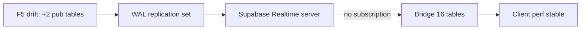

# Verifica deterministica parità Realtime — Repo vs Produzione

**Data:** 2026-06-07  
**Produzione:** Supabase project `oxmnuovsgenqkuwfolqh`  
**Scope:** publication `supabase_realtime`, migration F5, drift `segnalazioni`/`support_notes`  
**Metodo:** query SQL live + ricostruzione deterministica da migration repo + correlazione metriche long-session esistenti  
**Vincolo:** nessuna modifica codice o deploy eseguiti durante questa verifica.

---

## Executive summary

| Controllo | Esito |
|-----------|-------|
| Parità publication prod vs repo post-F5 | **FAIL** — 2 tabelle obsolete ancora in produzione |
| Migration F5 applicata in produzione | **NO** |
| Duplicati/alias in publication | **PASS** — 0 duplicati |
| Impatto client long-running da F5 drift | **Non misurabile / trascurabile** |
| Impatto server fan-out da F5 drift | **Minimo** (DML storico basso su tabelle deprecated) |
| **Verdetto finale** | **B — PARTIAL DRIFT (non critico)** |

---

## Production Realtime Snapshot

**Timestamp query:** 2026-06-07T01:50Z  
**Project:** `oxmnuovsgenqkuwfolqh`

### Publication metadata (`pg_publication`)

| Campo | Valore |
|-------|--------|
| `pubname` | `supabase_realtime` |
| `puballtables` | `false` |
| `pubinsert` / `pubupdate` / `pubdelete` / `pubtruncate` | tutti `true` |

Publication table-scoped (non ALL TABLES). Eventi replicati per INSERT/UPDATE/DELETE/TRUNCATE sulle tabelle elencate.

### Tabelle attive in realtime (19)

| # | `tablename` |
|---|-------------|
| 1 | `app_settings` |
| 2 | `auth_logs` |
| 3 | `bunder_documents` |
| 4 | `dashboard_promemoria` |
| 5 | `dipendenti_timesheet_employees` |
| 6 | `dipendenti_timesheet_entries` |
| 7 | `documenti` |
| 8 | `lavorazione_documents` |
| 9 | `lavorazioni` |
| 10 | `log_modifiche` |
| 11 | `magazzino_ricambi` |
| 12 | `mezzi` |
| 13 | `movimenti_ricambi` |
| 14 | `preventivi` |
| 15 | `profiles` |
| 16 | `scheda_lavorazione` |
| 17 | **`segnalazioni`** |
| 18 | **`support_notes`** |
| 19 | `user_permissions` |

### Duplicati / alias

Query `GROUP BY tablename HAVING COUNT(*) > 1`: **0 righe** — nessun alias duplicato.

### Migration history produzione

| Metrica | Valore |
|---------|--------|
| Migration applicate (totale) | **79** |
| Ultima migration applicata | `20260708120000` — `dashboard_promemoria_recurrence` |
| F5 `20260709120000_realtime_prune_deprecated_supporto` | **Assente** (`[]`) |

### Query 6d — tabelle deprecated in publication

```sql
SELECT tablename FROM pg_publication_tables
WHERE pubname = 'supabase_realtime'
  AND tablename IN ('segnalazioni', 'support_notes');
```

**Risultato: 2 righe** — `segnalazioni`, `support_notes`.

---

## Repository Realtime Snapshot

### Migration files

| Metrica | Valore |
|---------|--------|
| File in `supabase/migrations/` | **81** |
| Publication name | `supabase_realtime` |
| F5 file | [`supabase/migrations/20260709120000_realtime_prune_deprecated_supporto.sql`](../supabase/migrations/20260709120000_realtime_prune_deprecated_supporto.sql) — presente |

Contenuto F5 (idempotente):

```sql
alter publication supabase_realtime drop table if exists public.segnalazioni;
alter publication supabase_realtime drop table if exists public.support_notes;
```

### Migration chain realtime (add → drop)

| Migration | Azione |
|-----------|--------|
| `20260212120000_app_settings.sql` | ADD `app_settings` |
| `20260511120000_auth_logs_realtime.sql` | ADD `auth_logs` |
| `20260518170000_segnalazioni.sql` | ADD `segnalazioni` |
| `20260520210000_support_notes.sql` | ADD `support_notes` |
| `20260520220000_lavorazione_documents.sql` | ADD `lavorazione_documents` |
| `20260521180000_gestionale_realtime_publication.sql` | ADD 8 tabelle operative |
| `20260703120000_dashboard_promemoria.sql` | ADD `dashboard_promemoria` |
| `20260704120000_bunder_documents.sql` | ADD `bunder_documents` |
| `20260705120000_gestionale_sync_realtime_gaps.sql` | ADD `dipendenti_*`, `profiles`, `user_permissions` |
| **`20260709120000_realtime_prune_deprecated_supporto.sql` (F5)** | **DROP `segnalazioni`, `support_notes`** |

### Set atteso post-F5 (repo, 17 tabelle)

```
app_settings, auth_logs, bunder_documents, dashboard_promemoria,
dipendenti_timesheet_employees, dipendenti_timesheet_entries, documenti,
lavorazione_documents, lavorazioni, log_modifiche, magazzino_ricambi,
mezzi, movimenti_ricambi, preventivi, profiles, scheda_lavorazione, user_permissions
```

**Escluse post-F5:** `segnalazioni`, `support_notes`.

### Frontend bridge set (16 tabelle)

Da [`GESTIONALE_TABLE_QUERY_KEYS`](../src/lib/react-query/invalidate-targets.ts) — sottoscritte da [`GestionaleRealtimeBridge`](../src/components/gestionale-realtime-bridge.tsx):

```
app_settings, bunder_documents, dashboard_promemoria,
dipendenti_timesheet_employees, dipendenti_timesheet_entries, documenti,
lavorazione_documents, lavorazioni, log_modifiche, magazzino_ricambi,
mezzi, movimenti_ricambi, preventivi, profiles, scheda_lavorazione, user_permissions
```

**Non nel bridge (by design):** `auth_logs`, `segnalazioni`, `support_notes`.

### Gate statico repo

[`lib/regression/long-session-stability-policy.test.ts`](../lib/regression/long-session-stability-policy.test.ts): assert F5 migration + [`scripts/verify-schema-consolidation.sql`](../scripts/verify-schema-consolidation.sql) sezione 6d — **PASS**.

### Drift migration count

| Sorgente | Count |
|----------|-------|
| Repo migration files | 81 |
| Produzione `schema_migrations` | 79 |
| **Delta minimo noto** | **≥1** (F5 non applicata; ulteriore file repo potenzialmente non deployato) |

---

## Realtime Drift Diff Report

### Diff A — Produzione vs Repo post-F5 (critico)

| Set | Count | Delta |
|-----|-------|-------|
| Repo post-F5 atteso | 17 | — |
| Produzione live | 19 | **+2** |

**Solo in produzione (non attese post-F5):**

| Tabella | Classificazione |
|---------|-----------------|
| `segnalazioni` | **F5 drift** — DROP previsto da F5, ancora in publication |
| `support_notes` | **F5 drift** — DROP previsto da F5, ancora in publication |

**Solo in repo post-F5 (non in prod):** nessuna — prod è sovrainsieme di repo atteso.

**Mismatch publication state:** produzione corrisponde a **repo pre-F5** (stato prima di `20260709120000`), non a repo HEAD.

### Diff B — Repo post-F5 vs Frontend bridge (atteso)

| Tabella | Repo post-F5 | Bridge | Note |
|---------|--------------|--------|------|
| `auth_logs` | Presente | Assente | **Known optional** — in publication server, nessun `postgres_changes` client |

Tutte le altre 16 tabelle bridge ⊆ repo post-F5. **Nessun drift anomalo.**

### Diff C — Produzione vs Frontend bridge

| Tabella | Produzione | Bridge | Classificazione |
|---------|------------|--------|-----------------|
| 16 tabelle operative | Presente | Sottoscritte | OK |
| `auth_logs` | Presente | Assente | Known optional |
| `segnalazioni` | Presente | Assente | **F5 drift** (in publication, zero listener client) |
| `support_notes` | Presente | Assente | **F5 drift** (in publication, zero listener client) |

**Conclusione diff:** unico drift infrastrutturale misurabile = **F5 non deployata** (+2 tabelle obsolete in publication). `auth_logs` è disallineamento documentato repo/prod vs bridge, non introdotto da F5.

---

## Tabelle obsolete attive in produzione

| Tabella | In `supabase_realtime` | In bridge client | Modulo frontend | Stato dati |
|---------|------------------------|------------------|-----------------|------------|
| `segnalazioni` | **Sì** | No | Rimosso (deprecated) | 0 righe live |
| `support_notes` | **Sì** | No | Rimosso (deprecated) | 2 righe live |

Deprecation applicata in prod via `20260704130000_deprecate_supporto_tables` (RLS read-only admin). Nessun subscriber `postgres_changes` nel gestionale.

---

## Impact analysis (F5 drift)

### Client

| Fattore | Impatto | Evidenza deterministica |
|---------|---------|-------------------------|
| Subscription noise | **Nullo** | Bridge registra `postgres_changes` solo su 16 tabelle; `segnalazioni`/`support_notes` mai incluse |
| Event duplication | **Nullo** | Nessun `useCabSyncListener` / channel su tabelle supporto |
| Memory long-running | **Non attribuibile a F5** | Soak post-fix: heap 37→53 MB route-load, ritorno a 37 MB idle; dispatch=0 |

### Server (Supabase Realtime)

| Fattore | Impatto | Evidenza |
|---------|---------|----------|
| Fan-out broadcast client | **Nullo** | Client non iscritto → eventi WAL su quelle tabelle non inviati al channel `cab-gestionale-rt` |
| Publication WAL tracking | **Overhead residuo minimo** | 2 tabelle extra nel replication set anche a DML=0 |
| DML attivo su deprecated | **Trascurabile** | vedi `pg_stat_user_tables` sotto |

### DB — `pg_stat_user_tables` (produzione)

| Tabella | `n_tup_ins` | `n_tup_upd` | `n_tup_del` | `n_live_tup` |
|---------|-------------|-------------|-------------|--------------|
| `segnalazioni` | 0 | 0 | 0 | 0 |
| `support_notes` | 2 | 8 | 0 | 2 |

Statistiche cumulative dal reset stats — attività DML storica bassa. Con tabelle vuote/inattive, **generazione eventi realtime continua ≈ 0** in condizioni normali.

**Publication / WAL cost:** 2 tabelle nel set di logical replication senza traffico operativo misurabile → overhead fisso trascurabile vs 17 tabelle operative ad alto volume (`log_modifiche`, `app_settings`, ecc.).

### Impatto stimato su performance (sintesi)

| Layer | Severità F5 drift |
|-------|-----------------|
| Client long-running | **Trascurabile / nullo** |
| Server realtime fan-out | **Basso** (no subscriber + DML ~0) |
| DB WAL | **Basso** |

Il drift **non spiega** il pattern storico di degradazione long-running (refetch storm frontend, già mitigato). Resta un **debito infrastrutturale di parità** da chiudere per certificazione, non un hot path performance attivo.

---

## Drift → Performance Correlation Map

Fonte metriche: [`audit-supabase-performance-validation-post-fix.md`](./audit-supabase-performance-validation-post-fix.md) (sessione browser dev, 2026-06-07).

| Metrica misurata | Valore | Correlazione con F5 drift |
|------------------|--------|---------------------------|
| `gestionaleRealtimeMode` | `connected` (sessione intera) | Nessuna — Realtime funziona indipendentemente da publication extra |
| `gestionaleDispatchAppliedTotal` idle | **0** | Nessuna — dispatch non triggerato da tabelle non sottoscritte |
| REST Supabase idle | **~1 req/min** | Nessuna — no polling storm |
| Heap slope (~5 min soak) | **−0.571 MB/min** | Nessuna crescita monotona legata a F5 |
| `cabSyncListeners` | 2–6 per route, stabile | Nessun leak da tabelle deprecated |
| Publication prod count | 19 vs 17 atteso | **Drift presente** ma **non correlato** a metriche client degradanti |



**Conclusione correlazione:** il lag residuo osservato in sessioni lunghe **non è spiegato** dal drift F5 alle metriche client già raccolte. Il rischio residuo performance è **frontend minore (RF-02/06)** + **RLS invariato**, non publication drift attivo.

---

## Verdetto finale

### **B — PARTIAL DRIFT (non critico)**

| Criterio | Esito |
|----------|-------|
| A. FULL PARITY | **NO** — F5 assente; query 6d = 2 righe; prod 19 ≠ repo 17 |
| B. PARTIAL DRIFT | **SÌ** — drift F5 certo; impatto performance non misurabile; soak stabile |
| C. CRITICAL DRIFT | **NO** — nessuna evidenza di fan-out attivo, DML storm, o degradazione client correlata |

**Motivazione tecnica:**

1. **Drift infrastrutturale reale e deterministico:** produzione = repo pre-F5; migration `20260709120000` non in `schema_migrations`.
2. **Non critical per performance long-running:** client non sottoscrive le 2 tabelle; DML storico trascurabile; metriche post-fix stabili.
3. **Non FULL PARITY:** finché F5 non è deployata, repo HEAD ≠ produzione su streaming layer.

---

## Azioni minime consigliate (verdetto B)

| # | Azione | Scopo | Effort |
|---|--------|-------|--------|
| 1 | **Deploy** migration [`20260709120000_realtime_prune_deprecated_supporto.sql`](../supabase/migrations/20260709120000_realtime_prune_deprecated_supporto.sql) su produzione | Chiudere drift F5 | 1 migration |
| 2 | **Verifica post-deploy** query 6d (atteso 0 righe) + count publication = 17 | Certificare FULL PARITY | 2 query SQL |
| 3 | **Opzionale:** rieseguire [`scripts/verify-schema-consolidation.sql`](../scripts/verify-schema-consolidation.sql) sezione 6c/6d | Gate consolidamento | Readonly |
| 4 | **Non richiesto per performance:** prune `auth_logs` da publication (disallineamento noto, zero impatto client misurato) | Parità opzionale | Decisione separata |

**Non consigliato in questo scope:** fix frontend, refactor bridge, modifiche RLS.

---

## Riferimenti

- Performance post-fix: [audit-supabase-performance-validation-post-fix.md](./audit-supabase-performance-validation-post-fix.md)
- Root cause Caso 4: [audit-supabase-performance-degradation.md](./audit-supabase-performance-degradation.md)
- Verify SQL: [scripts/verify-schema-consolidation.sql](../scripts/verify-schema-consolidation.sql) (6c, 6d)
- Regression gate: [lib/regression/long-session-stability-policy.test.ts](../lib/regression/long-session-stability-policy.test.ts)
