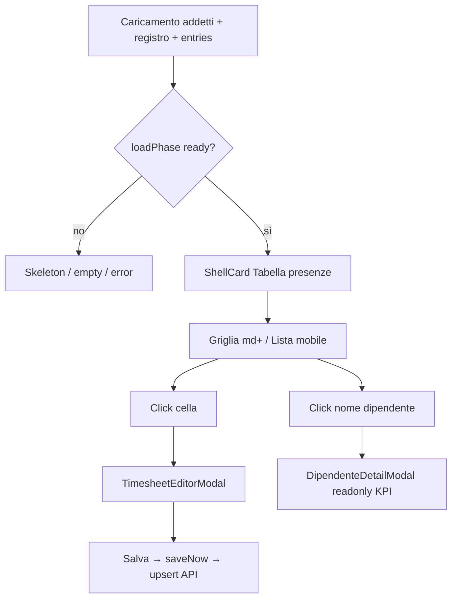

# Audit: «Tabella presenze» + modali collegati (Dipendenti)

Data: 2026-06-02  
Scope: `/dipendenti` → `ShellCard` «Tabella presenze» e modali associati  
Vincoli: nessuna nuova funzione, nessun cambio API/tipi/UX oltre ai bugfix.

## Nota sul nodo selezionato

L’elemento evidenziato nel browser (`ShellCard` → `div.p-4.sm:p-5`) **non è un modal**: è la **card inline** con la griglia presenze.  
I veri modali della pagina sono:

| Modal | Titolo | Apertura |
|--------|--------|----------|
| `TimesheetEditorModal` | Modifica cella | Click cella (desktop) o giorno (mobile con filtro dipendente) |
| `DipendenteDetailModal` | Nome dipendente | Click nome in colonna «Dipendente» |

---

## Analisi — Tabella presenze

### Componenti

| Ruolo | File |
|--------|------|
| Vista | [`dipendenti-view.tsx`](../components/gestionale/dipendenti/dipendenti-view.tsx) |
| Card | [`shell-card.tsx`](../components/gestionale/shell-card.tsx) |
| Vista tabella | [`timesheet-table-view.tsx`](../components/gestionale/dipendenti/timesheet-table-view.tsx) |
| Griglia desktop | [`dipendenti-timesheet-grid.tsx`](../components/gestionale/dipendenti/dipendenti-timesheet-grid.tsx) |
| Celle | [`dipendenti-timesheet-compact-cell.tsx`](../components/gestionale/dipendenti/dipendenti-timesheet-compact-cell.tsx) |
| Lista mobile | [`dipendenti-mobile-day-list.tsx`](../components/gestionale/dipendenti/dipendenti-mobile-day-list.tsx) |
| Header periodo | [`timesheet-header.tsx`](../components/gestionale/dipendenti/timesheet-header.tsx) |

### Hook / dati

- `useDipendentiTimesheet` — [`use-dipendenti-timesheet.ts`](../src/hooks/use-dipendenti-timesheet.ts)
- `usePermissions("dipendenti")` → `readOnly = !canWrite`
- React Query: `dipendentiTimesheetService.listEmployees`, `listEntriesForRange`, `upsertEntry`, `syncFromAddettiRecords`

### Stati in `DipendentiView`

- `monthKey`, `filterEmployeeId`, `editorTarget`, `detailEmployee`, `accentDateYmd`, `bootstrapPending`, `pdfExporting`
- Da hook: `displayEmployees`, `periodDays`, `getCellValue`, `saveStatus`, `entriesDegraded`, …

### API

- GET dipendenti / entries (range mese)
- POST/UPSERT entry (`upsertEntry`)
- Sync registro da addetti Impostazioni

---

## Flusso completo

**Chiusura modali:** X / ESC / overlay → `onRequestClose` su `GestionaleModalShell`.

**Read-only:** `readOnly` disabilita celle (`disabled` su button); `entriesDegraded` forza read-only + banner «Riprova».

---

## Modale «Modifica cella»

- File: [`timesheet-cell-editor-popover.tsx`](../components/gestionale/dipendenti/timesheet-cell-editor-popover.tsx) (export `TimesheetEditorModal`)
- `key={dipendenteId|workDate}` → remount form a ogni cella
- Validazione: `validateCellValue`; errori in `saveError` + modal resta aperto se save fallisce
- `onScheduleSave` passato dalla view ma **non usato** nel popover (salvataggio solo su «Salva») — comportamento attuale, non regressione

## Modale «Dettaglio dipendente»

- [`dipendente-detail-modal.tsx`](../components/gestionale/dipendenti/dipendente-detail-modal.tsx) — sola lettura KPI + tabella giorni

---

## Test effettuati

| Fase | Esito | Note |
|------|-------|------|
| Mappatura architettura | Pass | Card vs modali distinti |
| Permessi readOnly | Pass (codice) | Celle `disabled`, save guarded |
| Save / error API | Pass (codice) | `toast` via mutation status; modal catch su save |
| Scroll griglia / accent «oggi» | Pass (codice) | `scrollIntoView` su colonna accent |
| Typecheck | Pass | `npx tsc --noEmit` |
| Browser E2E | Non eseguito | |

---

## Problemi trovati

### Critico

Nessuno.

### Alto

Nessuno su persistenza o permessi.

### Medio (corretti)

| ID | Problema | Causa | Fix |
|----|----------|-------|-----|
| M1 | Modifica cella / dettaglio restano aperti cambiando mese | `handleMonthKey` non resettava overlay | `setEditorTarget(null)` + `setDetailEmployee(null)` |
| M2 | Due modali sovrapposti (cella + dettaglio) | Aperture indipendenti | Chiudi dettaglio aprendo cella; chiudi editor aprendo dettaglio |

### Basso (non modificato)

- `onScheduleSave` nel popover modale non collegato (debounce usato altrove, es. inserimento).
- Cambio filtro dipendente con editor aperto: modal si chiude se `editorEmployee` assente (già ok).
- Nessun dialog «modifiche non salvate» alla chiusura editor.

---

## Correzioni applicate

File: [`dipendenti-view.tsx`](../components/gestionale/dipendenti/dipendenti-view.tsx) — M1, M2.

---

## Verifica finale

- Typecheck OK.
- Non modificati: griglia, API, validazione celle, PDF export, bootstrap registro.

## Raccomandazioni manuali

1. Click cella vuota → Salva ore → verifica totale riga/footer.
2. Cambio mese con editor aperto → verifica chiusura automatica.
3. Apri dettaglio dipendente → click cella → un solo overlay.
4. Utente read-only: celle non cliccabili.
5. Mobile: seleziona dipendente nel filtro → lista giorni → modifica.
