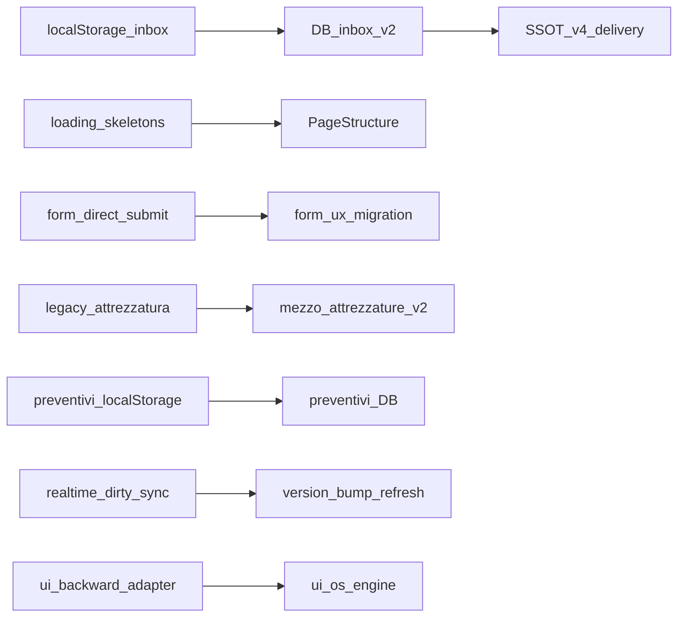

# Deprecated Code & Dead Code Audit

> Audit end-to-end v3 — generato 2026-07-19.  
> Policy permanente: [`docs/maintenance/dead-code-policy.md`](../maintenance/dead-code-policy.md)

---

## Executive Summary

| Metrica | Valore |
|---------|--------|
| File `.ts/.tsx` analizzati | **4046** (baseline) → **4029** (post Phase 5) |
| Route applicative (`page.tsx`) | 25 |
| API routes (`route.ts`) | 99 |
| Migration SQL attive | 223 |
| `@deprecated` export (grep) | 332 → 310 |
| knip unused files (advisory) | 676 → 672 |
| Import graph nodes | 4046 → 4029 |
| Orphan graph nodes | 1238 → 1222 |
| **Technical Debt Score** | **6003** → **5926** (**-1.3%**) |

**Candidati inventariati:**

| Bucket | Count stimato | Azione |
|--------|---------------|--------|
| 1 — Dead Code | 18 file rimossi (Phase 5) | Delete |
| 2 — Deprecated Surface | ~310 `@deprecated` | Migrate consumer |
| 3 — Legacy Architecture | 8 sistemi | Sunset con owner |

**Stima LOC rimossa Phase 5:** ~20 file, ~2.1k LOC (skeleton route-specific + shim).

---

## Dead Code Inventory (Bucket 1)

| Elemento | Tipo | Percorso | Ultimo utilizzo | Rischio | Azione |
|----------|------|----------|-----------------|---------|--------|
| Route skeletons (×15) | component | `components/design-system/loading/loading-*-skeleton.tsx` | Solo barrel export; sostituiti da `*PageStructure` | BASSO | ✅ Rimosso batch-002 |
| Client portal skeleton | component | `components/lavorazioni-clienti/client-lavorazioni-loading-skeleton.tsx` | 0 import; `ClientiPageStructure` attivo | BASSO | ✅ Rimosso batch-002 |
| TD-001 `gestionale-list-select` | re-export | — | Già assente nel tree | — | ✅ Pre-audit |
| TD-002 `data-table` DS | component | — | Già assente nel tree | — | ✅ Pre-audit |
| TD-003 `mezzi-change-log-storage` | util | — | Già assente nel tree | — | ✅ Pre-audit |
| `hooks/` root (2 file) | hook | `hooks/use-file-*.ts` | **Consumer attivi** (`record-image-manager`, `documento-file-dropzone`) | — | ❌ Mantenere (Cat C) |
| knip unused (storico) | mixed | 672 file advisory | Molti falsi positivi (dynamic import, e2e, registry) | ALTO se delete bulk | 📋 Review incrementale |

**Deletion manifests:** [`artifacts/audit/removal-manifests/`](../artifacts/audit/removal-manifests/)

---

## Deprecated Surface Inventory (Bucket 2)

| Elemento | Consumer | Replacement | Cat | Azione |
|----------|----------|-------------|-----|--------|
| `desktop-notification-permission-prompt` | 0 | `NotificationOptInBanner` | A | ✅ Rimosso batch-001 |
| `pwa-push-opt-in-banner` | 0 | `NotificationOptInBanner` | A | ✅ Rimosso batch-001 |
| `SistemaImpostazioniModal` | TBD mount check | `/impostazioni` page | C | Phase 6 — verificare mount |
| `useSchedeStoreQuery` | `use-lavorazione-schede-store-sync` | `useSchedeBundlesQuery` | C | Phase 6 migrate |
| Token DS (`lib/ui/design-system.ts`) | Multipli | `GlobalTable*`, modal tokens | C | Phase 6 graduale |
| `GestionaleSortTh` shim | via `global-table-header` | `GlobalTableSortTh` | C | Mantenere fino migrazione |
| `page-layout.tsx` (DS root) | Multipli | `components/design-system/layout` | C | Migrate |

---

## Legacy Architecture Inventory (Bucket 3)

Registry SSOT: [`lib/observability/legacy-system-registry.ts`](../lib/observability/legacy-system-registry.ts)

| Sistema | Owner | Replacement | Sunset | Rollback |
|---------|-------|-------------|--------|----------|
| notifications-dual-write | notifications | SSOT v4 | TBD | `NOTIFICATIONS_SSOT_V2=off` |
| notifications-localstorage | notifications | DB inbox v2 | TBD | `NOTIFICATIONS_V2=off` |
| form-ux-legacy | forms | form-ux-migration | TBD burndown=0 | `FORM_UX_MIGRATION=0` |
| magazzino-compat | inventory | compat SSOT off | TBD | compat-write-gate |
| mezzi-legacy-attrezzatura | mezzi | mezzo_attrezzature_v2 | post manual migration | `MEZZO_ATTREZZATURE_V2=0` |
| preventivi-localstorage | preventivi | DB primary | TBD | `PREVENTIVI_DB_PRIMARY=false` |
| gestionale-dirty-sync | sync | version-bump refresh | TBD | `GESTIONALE_DIRTY_SYNC=off` |
| ui-os-backward-adapter | ui | ui-os-engine | TBD | `CAB_UI_OS≠1` |

**Phase 6:** rimozione solo dopo telemetry 0-hit (7gg staging / 1 release prod) + flag OFF in produzione.

---

## Legacy Systems (origine → sostituto)



| Sistema | Origine | Sostituto | Motivazione rimozione |
|---------|---------|-----------|----------------------|
| Notifications 3-tier | Admin LS inbox | SSOT v4 pipeline | Dual-write complexity, delivery worker |
| Loading skeletons v1 | Per-route `loading-*-skeleton` | `StructuralRouteSkeleton` + `*PageStructure` | Layout shift, policy loading |
| Form UX legacy | Direct DOM submit | form-ux-migration rollout | Validation/save SSOT |
| Mezzi attrezzature | `legacy_attrezzatura` column | `mezzo_attrezzature_v2` | Data model SSOT |
| Preventivi LS | localStorage | Supabase DB | Entity SSOT |
| Magazzino compat | Local compat writes | compat-write-gate + SSOT | Data integrity |
| Dirty sync | Realtime broadcast | Version bump refresh | Perf/stability |
| UI OS adapter | Legacy children render | ui-os-engine | Layout convergence |

---

## Duplicate Logic Report

| Vecchio | Nuovo | Differenza | Mantenere |
|---------|-------|------------|-----------|
| `loading-*-skeleton.tsx` (route) | `*PageStructure mode="skeleton"` | Structural contract, no header pulse | **Nuovo** — vecchio rimosso |
| `NotificationOptInBanner` shims | `NotificationOptInBanner` | Re-export alias | **Nuovo** — shim rimossi |
| `admin-notification-store` | `useNotificationCenter` + DB RPC | Persistence layer | **Entrambi** fino sunset v2 |
| `publish-notification` dual path | `notification-service` SSOT | Flag-gated | **Entrambi** fino telemetry 0-hit |
| `LoadingKanbanSkeleton` | — | Ancora usato da kanban lazy | **Vecchio** — non route skeleton |

---

## Fallback Review

Registry: [`lib/observability/deprecated-fallback-registry.ts`](../lib/observability/deprecated-fallback-registry.ts)

| Fallback | Scenario | Telemetry | Decisione |
|----------|----------|-----------|-----------|
| `selector-safe-fallback` | Invalid selector context | ✅ `trackDeprecatedUsage` | Mantenere — attendere 30gg 0-hit |
| `notification-localstorage-fallback` | v2 dual-write LS path | ✅ instrumentato | Mantenere — flag prod |
| `pdf-preview-get` | — | N/A — file già rimosso | ✅ Chiuso |
| `magazzino-compat-write` | Legacy compat write blocked | ✅ instrumentato | Mantenere — compat gate |
| `publish-notification-dual-write` | SSOT migration | Via localStorage path telemetry | Mantenere |

**Soglie decisione:**

| Uso | Azione |
|-----|--------|
| 0 eventi / periodo | Promuovi Cat A → delete |
| < 5 eventi/mese | Valuta con owner |
| Frequente | Mantieni + aggiorna `removalCondition` |
| Critico (RBAC/safety) | Mantieni documentato |

---

## Import Graph Analysis

Baseline: `artifacts/audit/dependency-graph/before.summary.json`

| Metrica | Before | After |
|---------|--------|-------|
| totalNodes | 4046 | 4029 |
| orphanNodes | 1238 | 1222 |
| maxDepth | 71 | — |
| entryPoints | 152 | — |
| runtimeEdges | 14541 | — |

**Runtime edges by type (before):**

| Tipo | Count |
|------|-------|
| STATIC_IMPORT | 14182 |
| DYNAMIC_IMPORT | 251 |
| REGISTRY_REFERENCE | 12 |
| DB_REFERENCE | 90 |
| FLAG_REFERENCE | 1 |
| CRON_REFERENCE | 5 |

---

## Database Read Frequency

**Inventario statico:** `npm run audit:supabase:json` → `docs/.supabase-audit-inventory.json`

**pg_stat policy:** valido solo se `uptime > 90 giorni`. Query:

```sql
SELECT now() - pg_postmaster_start_time() AS uptime;
SELECT schemaname, relname, seq_scan, idx_scan FROM pg_stat_user_tables;
```

**Tabelle legacy note:** `segnalazioni`, `support_notes` (deprecate migration `20260704130000_*`) — DROP solo Phase 6 con backup.

**Nessun DROP eseguito in questo audit.**

---

## Technical Debt Score

| Componente | Before | After | Δ |
|------------|--------|-------|---|
| files | 4046 | 4029 | -17 |
| deprecatedExports | 332 | 310 | -22 |
| legacyFlags | 8 | 8 | 0 |
| fallbackPaths | 5 | 5 | 0 |
| orphanNodes | 1238 | 1222 | -16 |
| **score** | **6003** | **5926** | **-1.3%** |

Formula: `files×1 + deprecated×2 + flags×5 + fallback×3 + orphans×1`

---

## Removal Plan

### Phase 5 — Safe deletion ✅ (eseguito)

- batch-001: notification opt-in shims (2 file)
- batch-002: deprecated route skeletons + client portal skeleton (16 file)

### Phase 6 — Legacy sunset (pending)

1. Telemetry 7gg staging + 1 release prod
2. Per ogni `LegacySystem`: owner sign-off, flag OFF, migration
3. Bucket 2 consumer migration (`useSchedeStoreQuery`, `SistemaImpostazioniModal`, token DS)

### Phase 7 — Repository health normalization

- `npm run audit:dead-code` advisory
- `npm run audit:import-graph -- --out after --diff`
- Rollout `noUnusedLocals` per directory (`tsconfig.audit-unused.json`)

### Phase 8 — Permanent governance ✅

- [`docs/maintenance/dead-code-policy.md`](../maintenance/dead-code-policy.md)
- `npm run audit:dead-code:delta` in release-gate / control catalog

---

## Validation Report

| Check | Before | After | Esito |
|-------|--------|-------|-------|
| `ci:tsc` | — | PASS | ✅ |
| `audit:skeleton` | PASS | PASS | ✅ |
| `loading-transition-fallback-policy` | — | PASS | ✅ |
| `dead-code-audit-policy.test` | — | PASS | ✅ |
| `smoke:regression:core` | — | FAIL `rbac-route-matrix` | ⚠️ Pre-esistente |
| knip unused files | 676 | 672 | ✅ -4 net |
| Debt Score | 6003 | 5926 | ✅ -1.3% |

**Rischi residui:**

- knip storico: 672 unused advisory — non blocking; solo delta PR
- Bucket 3 legacy: richiede telemetry window prima di sunset
- `smoke:regression:core` rbac-route-matrix: failure non correlata a cleanup skeleton

---

## Phase 9 — Classification & governance (2026-07-19)

| Area | Target | Esito |
|------|--------|-------|
| RBAC RCA | smoke core verde | ✅ `operatore /dashboard` test aligned |
| Orphan taxonomy | 1233 classificati | ✅ `orphan-hotspots.json` |
| Barrel entropy | public exports protetti | ✅ `barrel-entropy.json` |
| Legacy sunset | 8 sistemi documentati | ✅ `docs/migrations/sunset/` |
| DB legacy | classificazione | ✅ `_legacy-migrations.md` |
| Bucket 3 removal | none | ✅ zero rimosso |

**RBAC RCA:** [`artifacts/audit/rbac-rca/`](../artifacts/audit/rbac-rca/) — pre-existing stale test expectation.

**Hotspots:** [`docs/audit/DEAD_CODE_HOTSPOTS.md`](./DEAD_CODE_HOTSPOTS.md)

| Check | Esito |
|-------|-------|
| `rbac-route-matrix.test.ts` | PASS |
| `audit:orphan-hotspots` | artifact |
| `audit:barrel-entropy` | artifact |
| `audit:removal-manifest:verify` | PASS (legacy manifests) |
| Debt Score phase9 | 5960 |

---

## Tooling introdotto

| Script | Descrizione |
|--------|-------------|
| `npm run audit:dead-code` | knip advisory full scan |
| `npm run audit:dead-code:delta` | PR gate — nuovi unused files |
| `npm run audit:import-graph` | Import graph + runtime edges |
| `npm run audit:debt-score` | Technical Debt Score |
| `npm run audit:unused-ts` | Report-only unused locals |
| `npm run audit:removal-manifest` | Genera deletion manifest |
| `npm run audit:orphan-hotspots` | Orphan taxonomy + confidence |
| `npm run audit:barrel-entropy` | Barrel public API audit |
| `npm run audit:removal-manifest:verify` | Manifest integrity |
| `npm run audit:dead-code:baseline` | Orchestratore baseline |

**File SSOT:**

- `knip.json`
- `tsconfig.audit-unused.json`
- `lib/observability/deprecated-usage.ts`
- `lib/observability/deprecated-fallback-registry.ts`
- `lib/observability/legacy-system-registry.ts`

---

## Riferimenti

- [`docs/audit-phase6-technical-debt.md`](../audit-phase6-technical-debt.md)
- [`docs/performance/loading-policy.md`](../performance/loading-policy.md)
- [`docs/adr/ADR-002-notification-ssot-architecture.md`](../adr/ADR-002-notification-ssot-architecture.md)
