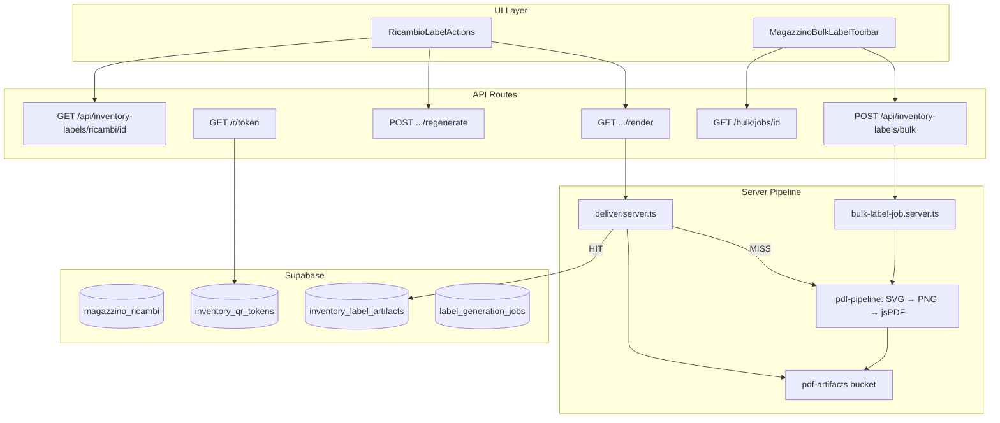

# Inventory Labels PDF System Audit

> Audit tecnico read-only — 2026-07-17  
> Scope: generazione etichette magazzino (QR, Code128, PNG/SVG/PDF, stampa singola/multipla)  
> SSOT codice: [`lib/inventory-labels/`](../lib/inventory-labels/)  
> Riferimenti: [`docs/inventory-labels.md`](../inventory-labels.md), [ADR-006](../adr/ADR-006-inventory-label-pdf-raster-pipeline.md)

---

# Executive summary

Il sistema etichette è **architetturalmente solido**: modulo SSOT ben separato, pipeline raster V2 (opentype → sharp → jsPDF) adeguata a Vercel, sync/async bulk con job DB, artifact cache per singola etichetta, RBAC su tutte le API.

**Rischi principali identificati (post-verifica):**

| Priorità | ID | Sintesi |
|----------|-----|---------|
| Critical | IL-001 | Memoria: tutti i PNG in RAM prima del PDF; chunk+merge **non riduce** peak heap (benchmark: 0% @ 500 label) |
| High | IL-016 | **Confermato:** rigenerazione QR non invalida artifact cache — stesso fingerprint → HIT con QR revocato |
| High | IL-002 | Bulk rigenera sempre da zero, ignora artifact cache |
| High | IL-004 | Sync bulk blocca HTTP fino a 300s; client abort 240s |
| High | IL-005 | Job async senza recovery se Lambda muore |
| High | IL-021 | PDF A4 non certificato su stampanti termiche officina — QA manuale assente |
| Medium | IL-017 | Pipeline raster costosa; alternative SVG→PDF **non benchmarkate** (svg2pdf assente in deps) |

**Performance misurata (locale, concurrency=4, 2026-07-17):** 500 etichette in ~32s, peak heap **178 MiB**, PDF **22.4 MB** — entro budget 700 MiB ma chunk-merge inutile per OOM.

**Raccomandazione immediata (Fase 1):** invalidazione cache su `QR_REGENERATED`, job recovery, riduzione sync max, loading guard UI. **Non** investire in SVG→PDF diretto finché IL-017 non dimostra vantaggio misurato.

---

# Architettura attuale

## Diagramma flusso

## Route / API / server

| Route | File | maxDuration | Ruolo |
|-------|------|-------------|-------|
| `GET /api/inventory-labels/ricambi/[id]` | `app/api/inventory-labels/ricambi/[id]/route.ts` | default | Metadata token + QR URL |
| `GET .../render?format=&preset=` | `app/api/inventory-labels/ricambi/[id]/render/route.ts` | **60s** | PNG/SVG/PDF singolo via `deliverInventoryLabel` |
| `POST .../regenerate` | `app/api/inventory-labels/ricambi/[id]/regenerate/route.ts` | default | Revoca + nuovo token |
| `POST /api/inventory-labels/bulk` | `app/api/inventory-labels/bulk/route.ts` | **300s** | Sync ≤20 label, else 202 + jobId |
| `GET /api/inventory-labels/bulk/jobs/[id]` | `app/api/inventory-labels/bulk/jobs/[id]/route.ts` | default | Poll progress / download PDF |
| `GET /r/[token]` | `app/r/[token]/route.ts` | default | Redirect QR → `/magazzino?openRicambio=` |

Nessuna Server Action dedicata — tutto via API route + moduli `*.server.ts`.

## Componenti UI

| Componente | File | Azioni |
|------------|------|--------|
| Singola etichetta | `components/gestionale/magazzino/ricambio-label-actions.tsx` | Preview PNG, download PNG/SVG, PDF (URL), stampa (PNG→iframe), rigenera QR |
| Bulk | `components/gestionale/magazzino/magazzino-bulk-label-toolbar.tsx` | POST bulk, poll job, `openPdfBlobInNewTab` |
| Host | `magazzino-modals.tsx`, `magazzino-view.tsx` | Modal + checkbox label mode |

**Generazione:** 100% server-side. Client solo fetch blob / open tab.

## Librerie

| Libreria | Uso |
|----------|-----|
| `qrcode` | QR PNG/SVG (EC level Q) |
| `bwip-js` | Code128 SVG/PNG |
| `sharp` | SVG → PNG @ 300 DPI (150 fallback) |
| `jspdf` | Assemblaggio A4 multi-etichetta |
| `opentype.js` | TTF → path SVG (no fontconfig Vercel) |
| `fflate` | ZIP emergenza |
| `pdf-lib` | Presente in deps; usato solo in script audit chunk-merge, **non** in pipeline produzione |
| `svg2pdf.js` | **Non installato** |

## Database / storage

| Tabella / bucket | Scopo |
|------------------|-------|
| `magazzino_ricambi` | Sorgente payload |
| `inventory_qr_tokens` | Token QR lifecycle |
| `inventory_label_artifacts` | Cache metadata hash → storage_path |
| `inventory_label_events` | Audit generazione/download/bulk |
| `label_generation_jobs` | Job async bulk + progress |
| `pdf-artifacts` bucket | `inventory-labels/{entity}/{id}/{hash}.{format}` |

---

# Problemi trovati

Gravità finale dove indicato **(verificato)** = evidenza da codice o benchmark in questa sessione.

---

## IL-001 — Batch grandi: rischio memoria e assenza di mitigazione efficace via chunk-merge

| Campo | Valore |
|-------|--------|
| **Gravità** | Critical |
| **Stato** | Verificato (benchmark) |

**Descrizione:** La pipeline accumula tutti i buffer PNG in un array prima di `assembleMultiLabelPdf` ([`pdf-pipeline.ts`](../lib/inventory-labels/render/pdf-pipeline.ts)). `BULK_ABSOLUTE_MAX=1000`.

**Causa tecnica:** `mapWithConcurrency` → `pngs[]` → `jsPDF.addImage` per ogni etichetta. Nessuno streaming, nessun rilascio intermedio.

**Impatto:** Su Lambda 1 GiB, batch molto grandi o concorrenza multipla possono avvicinarsi al limite. Timeout `LABEL_PDF_GENERATION_TIMEOUT_MS` (240s default).

**Benchmark locale (2026-07-17, preset 60×40, concurrency=4):**

| Count | Duration | Peak heap | PDF bytes |
|-------|----------|-----------|-----------|
| 1 | 420 ms | 51 MiB | 44 KB |
| 10 | 954 ms | 82 MiB | 427 KB |
| 50 | 3539 ms | 87 MiB | 2.1 MB |
| 100 | 6954 ms | 97 MiB | 4.3 MB |
| 200 | 14208 ms | 144 MiB | 9.1 MB |
| 500 | 31954 ms | 158 MiB | 22.4 MB |

**Chunk-merge @ 500 (10×50 + pdf-lib merge):**

| Scenario | Duration | Peak heap | Output |
|----------|----------|-----------|--------|
| Single PDF | 30346 ms | **178 MiB** | 23.5 MB |
| Chunk 50 + merge | 31833 ms | **178 MiB** | 23.4 MB |
| **Riduzione heap** | — | **0%** | — |

**Conclusione:** Il merge non sposta il picco memoria — il problema resta nel raster parallelo per chunk e/o nel merge che carica tutti i PDF.

**Soluzioni candidate (ordine):**

- **A) Chunked generation + consegna ZIP di chunk** (non merge singolo) — consigliata se serve >500 label
- **B) PDF per chunk + merge** — validato inefficace per heap @ 500
- **C) Migrazione libreria streaming** — solo se A insufficiente; **no streaming jsPDF**
- **D) Riduzione `BULK_ABSOLUTE_MAX`** — mitigazione temporanea

**Priorità:** Fase 2 (dopo stabilizzazione), con strategia A non merge.

---

## IL-002 — Bulk ignora artifact cache

| Campo | Valore |
|-------|--------|
| **Gravità** | High |
| **Stato** | Verificato (codice) |

**Descrizione:** Solo `deliverInventoryLabel` consulta `inventory_label_artifacts`. `renderBulkLabelPdfSync` e `processBulkLabelJob` chiamano direttamente `renderMultiLabelPdfWithPipeline`.

**Causa:** Nessun `getLabelArtifactByHash` nel percorso bulk.

**Impatto:** Ogni bulk rigenera QR+barcode+PNG anche per etichette già in cache.

**Soluzione:** Lookup cache per-label prima del raster; assemblare da bytes cached.

**Priorità:** Fase 2.

---

## IL-003 — N+1 query token in bulk

| Campo | Valore |
|-------|--------|
| **Gravità** | High |
| **Stato** | Verificato (codice) |

**Descrizione:** `buildBulkLabelItems` esegue `ensureActiveInventoryToken` per ogni `entityId` in `Promise.all`.

**Impatto:** ~1–2 query DB per etichetta oltre al `SELECT` iniziale su `magazzino_ricambi`.

**Soluzione:** Batch `SELECT` token attivi per `entity_ids`; batch insert per mancanti.

**Priorità:** Fase 2.

---

## IL-004 — Sync bulk blocca request HTTP

| Campo | Valore |
|-------|--------|
| **Gravità** | High |
| **Stato** | Verificato (codice) |

**Descrizione:** Fino a `BULK_SYNC_MAX` (20) label, il PDF intero è nella response HTTP (`maxDuration=300`). Client abort a 240s (`magazzino-bulk-label-toolbar.tsx`).

**Impatto:** Tab bloccata durante generazione; mismatch timeout client/server; memoria doppia server+client.

**Soluzione:** Abbassare sync max (es. 5–10) o sempre-async; allineare timeout.

**Priorità:** Fase 1.

---

## IL-005 — Job async senza recovery

| Campo | Valore |
|-------|--------|
| **Gravità** | High |
| **Stato** | Verificato (ADR-006 + codice) |

**Descrizione:** `waitUntil(processBulkLabelJob)` senza heartbeat, cron, o retry admin. Job può restare `running`/`pending` se Lambda termina.

**Impatto:** Poll fino a 120 tentativi (~3 min) poi errore generico.

**Soluzione:** Heartbeat + `EXECUTION_STUCK` (pattern import-core), endpoint retry, TTL job.

**Priorità:** Fase 1.

---

## IL-016 — Fingerprint cache invalidation incompleta

| Campo | Valore |
|-------|--------|
| **Gravità** | High |
| **Stato** | **Confermato** (analisi statica) |

**Descrizione:** Il fingerprint ([`fingerprints.ts`](../lib/inventory-labels/domain/fingerprints.ts)) include `LabelPayload` + template + `GENERATOR_VERSION` + preset. **Non include** `token`, `entityId`, `qrUrl`.

**Verifica purge event-driven:**

- `regenerateInventoryToken` scrive evento `QR_REGENERATED` ([`tokens.server.ts`](../lib/inventory-labels/domain/tokens.server.ts))
- `writeInventoryLabelEvent` fa solo `INSERT` in `inventory_label_events` — **nessun purge** di `inventory_label_artifacts` o storage
- `POST /regenerate` route non tocca artifact ([`regenerate/route.ts`](../app/api/inventory-labels/ricambi/[id]/regenerate/route.ts))

**Test logico:**

| Step | Expected (A o B) | Esito audit |
|------|------------------|-------------|
| Modifica codice ricambio | Nuovo fingerprint → MISS | **OK** (payload in hash) |
| Modifica descrizione | MISS | **OK** |
| `POST /regenerate`, payload invariato | A) nuovo fingerprint **oppure** B) purge artifact | **FAIL** — stesso fingerprint, nessun purge → **cache HIT con QR vecchio** |
| Bump `GENERATOR_VERSION` | MISS | **OK** by design |
| Cambio preset | MISS | **OK** (preset in hash) |

**Impatto:** Operatore rigenera QR, ristampa etichetta, scanner legge token **revocato** → 410 / errore magazzino.

**Soluzione (una sufficiente):** A) includere `token` nel fingerprint; **oppure** B) delete artifact + storage su `QR_REGENERATED` e su modifica `magazzino_ricambi` rilevante.

**Priorità:** Fase 1.

---

## IL-017 — Pipeline raster SVG→PNG: costo e alternative

| Campo | Valore |
|-------|--------|
| **Gravità** | High (costo) / da rivalutare post-benchmark |
| **Stato** | Parzialmente verificato |

**Descrizione:** Pipeline V2: SVG (opentype paths) → sharp 300dpi → jsPDF `addImage(..., "FAST")`.

**Alternative non benchmarkate in questo audit:**

| Opzione | Stato deps | Note |
|---------|------------|------|
| B1 `svg2pdf.js` | Non installato | Compatibilità con path opentype + nested SVG QR/barcode da validare |
| B2 `pdf-lib` SVG | Limitato | Non adatto a SVG complessi |
| C Ibrida (QR+barcode vector, testo raster) | Non implementato | Potenziale sweet spot |

**Decisione:** Mantenere pipeline attuale finché benchmark B1/C non dimostrano ≥30% guadagno tempo/heap **e** qualità QR/barcode post-stampa equivalente.

**Non assumere** che SVG→PDF diretto sia superiore — scelta ADR-006 motivata da fontconfig/librsvg su Vercel.

**Priorità:** Fase 3.

---

## IL-021 — Compatibilità stampanti officina

| Campo | Valore |
|-------|--------|
| **Gravità** | High |
| **Stato** | Non verificato (QA manuale assente) |

**Descrizione:** Output = PDF A4 con griglia etichette (mm via jsPDF). Workflow officina può usare:

- Stampa A4 inkjet/laser (driver “fit to page”)
- Stampanti termiche Zebra / Brother / Dymo via driver Windows
- DPI 203 / 300

**Rischi:**

- “Fit to page” scala QR sotto soglia scansione
- Driver termico rasterizza PDF con interpolazione
- Margini non stampabili non compensati (`marginMm=5` layout, non hardware)
- Stampa singola via PNG+iframe vs bulk PDF — flussi diversi

**Test richiesti (manuale, non eseguiti in audit automatizzato):**

- [ ] Acrobat Reader, Chrome PDF, Preview macOS
- [ ] Stampa A4 **100% scale** (non fit-to-page)
- [ ] Scan QR telefono post-stampa
- [ ] Scan Code128 con lettore barcode
- [ ] Righello: dimensione fisica 60×40 mm
- [ ] Stampante termica officina (Zebra/Brother/Dymo) se in uso

**Soluzione:** Preset stampa certificati (A4 foglio, termica 40×30, termica 60×40) + guida operatore.

**Priorità:** Fase 1 (documentazione); certificazione hardware Fase 2.

---

## IL-006 — Nessun rate limiting

| Gravità | Medium | Verificato: nessun throttle su route inventory-labels |

**Soluzione:** Rate limit per `userId` su bulk (es. 3 job/min). Fase 2.

---

## IL-007 — ID mancanti filtrati silenziosamente

| Gravità | Medium | `buildBulkLabelItems` `.filter(null)` senza warning |

**Soluzione:** Response `{ requested, rendered, skippedIds }`. Fase 1.

---

## IL-008 — Single print/PDF senza loading guard

| Gravità | Medium | `handlePrint`/`handleOpenPdf` non impostano `loading` |

**Soluzione:** Stato `printing`/`openingPdf`. Fase 1.

---

## IL-009 — Doppio trasferimento PDF bulk

| Gravità | Medium | `openPdfBlobInNewTab` POSTa blob a preview API dopo download |

**Soluzione:** Skip preview POST per bulk; blob URL diretto. Fase 2.

---

## IL-010 — Testo troncato senza indicazione

| Gravità | Medium | `text-layout.ts` limita `maxLines` senza ellipsis |

**Soluzione:** Ellipsis o warning UI. Fase 3.

---

## IL-011 — Emergency ZIP con SVG come PNG

| Gravità | Medium | `renderEmergencyZip` può mettere buffer SVG con estensione `.png` |

**Soluzione:** Estensione `.svg` corretta. Fase 3.

---

## IL-012 — waitUntil + cookie auth fragile

| Gravità | Medium | `processBulkLabelJob` usa `createSupabaseServerUserClient()` → `cookies()` in background |

**Soluzione:** Service role client scoped per worker. Fase 3.

---

## IL-018 — PDF correctness non validata sistematicamente

| Gravità | Medium | jsPDF mm + compressione FAST; nessun test dimensioni fisiche |

Vedi sezione [PDF rendering correctness](#pdf-rendering-correctness). Fase 3 automazione; Fase 1 checklist manuale.

---

## IL-019 — Race condition su artifact insert

| Gravità | Medium | Cache MISS paralleli: doppio render stesso hash |

**Mitigazione esistente:** `uploadLabelArtifact` `upsert: true`; unique index `idx_inventory_label_artifact_hash`.

**Gap:** CPU doppia su race; nessun lock applicativo.

**Priorità:** Fase 3.

---

## IL-020 — Storage senza lifecycle

| Gravità | Medium | Nessun cleanup orphan; `cacheControl` 1y single / 1h bulk job |

Vedi [Storage lifecycle](#storage-lifecycle). Fase 3.

---

## IL-013 — QR URL esposto in UI

| Gravità | Low | `meta.qrUrl` in plain text nel pannello etichetta |

---

## IL-014 — Barcode con codice vuoto

| Gravità | Low | `barcode-core.ts`: `text.trim() || " "` genera barcode vuoto |

---

## IL-015 — Apertura PDF single vs bulk inconsistente

| Gravità | Low | Single: `openUrlInNewTab(url)`; Bulk: `openPdfBlobInNewTab` |

---

# Performance analysis

## Benchmark pipeline A (attuale) — eseguito 2026-07-17

Vedi tabella IL-001. Crescita heap **sublineare** (500 label ≈ 158–178 MiB, non lineare da 100→500).

## Stima 1000 label (extrapolazione)

| Metrica | Stima | Limite Vercel Pro |
|---------|-------|-------------------|
| Duration | ~60–70s | maxDuration 300s ✓ |
| Peak heap | ~200–250 MiB | 1024 MiB default ✓ |
| PDF size | ~45 MB | Response async via storage ✓ |

Rischio principale a 1000: **tempo** e **assenza cache bulk**, non OOM singolo worker con heap attuale.

## Pipeline B/C (IL-017)

**Non eseguito** — `svg2pdf.js` assente da `package.json`. Raccomandazione: spike read-only prima di Fase 3.

## Performance budget target vs misurato

| Target | Soglia | Misurato | Esito |
|--------|--------|----------|-------|
| Single MISS | <1s p95 | 420 ms @ 1 label | ✓ |
| Bulk 10 sync | <3s p95 | 954 ms | ✓ |
| Bulk 100 async | <30s | 6954 ms (~7s) | ✓ |
| Bulk 500 heap | <700 MiB | 158–178 MiB | ✓ |
| UI feedback | <200ms | LoadingButton su bulk | ✓ bulk; ✗ single print/PDF |

---

# PDF rendering correctness

## Checklist tecnica

| Controllo | Implementazione | Rischio |
|-----------|-----------------|---------|
| Dimensione etichetta in PDF | `addImage(..., template.widthMm, template.heightMm)` unit mm | Da validare con righello |
| Unità jsPDF | `unit: "mm"`, format A4 | OK dichiarato |
| Griglia A4 | `computeA4Grid` — 60×40 → ≥4 label/pagina | Test unit presente |
| Ordine bulk | `entityIds` ordine UI | OK |
| Multipagina | `assembleMultiLabelPdf` addPage su row overflow | Da test 7/8/50 label |
| Compressione | jsPDF `"FAST"` | Possibili artefatti QR |
| Metadata PDF | Default jsPDF | Probabilmente assente |
| Rotazione | Portrait fisso | OK |
| Margini stampante | Non compensati | IL-021 |
| Fit-to-page browser | UX non guidata | **Alto** per scan QR |

## Test manuali richiesti

Documento operatore dovrebbe specificare: **stampa 100%**, non “adatta alla pagina”.

---

# Artifact invalidation

Vedi **IL-016 (confermato)**. Nessun meccanismo purge trovato nel codebase inventory-labels.

Fingerprint include modifiche payload (codice, descrizione, marche) — **OK** per aggiornamenti dati ricambio.

---

# Concurrency audit

## Scenari

| Scenario | Mitigazione esistente | Gap |
|----------|----------------------|-----|
| **A** 5 utenti stesso PDF | Unique artifact index; storage upsert | Doppio render CPU |
| **B** 10 utenti bulk 50 | Nessun rate limit | Lambda concurrency × heap |
| **C** Doppio poll stesso jobId | Download idempotente | Nessuno |
| **D** Doppio regenerate | `idx_inventory_qr_active_entity` unique; collision retry | OK |

## Punti codice

- `ensureActiveInventoryToken`: retry su `23505`
- `uploadLabelArtifact`: `upsert: true`
- Nessun lock distribuito su render

**Test load non eseguito** — raccomandato in Fase 3.

---

# Storage lifecycle

| Aspetto | Stato |
|---------|--------|
| Retention | Nessuna policy applicativa |
| Cleanup orphan | Assente (no FK artifact → ricambio delete) |
| MIME bucket | `application/pdf`, `image/png`, `image/svg+xml` (migration 20260917120200) |
| File size limit | 15 MB per oggetto bucket |
| ACL | RBAC `rbac_can_read/write_operational` su bucket |
| Path pattern | `inventory-labels/{entityType}/{entityId}/{hash}.{format}` |

## Stima crescita (esempio)

| Volume/giorno | PDF ~50KB | Storage/mese (solo PDF) |
|---------------|-----------|-------------------------|
| 100 | 5 MB | ~150 MB |
| 1000 | 50 MB | ~1.5 GB |
| 10000 | 500 MB | ~15 GB |

Con cache PNG+SVG per entity: moltiplicatore fino a ×3.

---

# Runtime production constraints (Vercel/Lambda)

| Parametro | Valore attuale | Limite provider | Rischio |
|-----------|----------------|-----------------|---------|
| `maxDuration` bulk | 300s | Pro 300s; Hobby 10s | **Hobby non viable** |
| `maxDuration` render singolo | 60s | Pro fino 300s | OK per 1 label |
| Memory | Default 1024 MiB | 128–3008 MiB | IL-001 se concorrenza alta |
| Runtime | `nodejs` | richiesto per sharp | OK |
| Cold start | sharp+opentype+bwip | +0.5–2s | Primo PDF lento |
| Body limit | IDs JSON only | 4.5 MB | OK |
| Response sync | fino ~20 label PDF | ~1–2 MB tipico | OK sotto 4.5 MB |
| `waitUntil` | bulk job background | IL-012 cookie risk |
| Client abort | 240s | < server 300s | Abort prematuro possibile |
| `INVENTORY_LABEL_PDF_PIPELINE_V2` | default `1` | `0` = legacy | Rollback emergenza |

---

# Edge cases

| Caso | Gestione | Gap |
|------|----------|-----|
| 0 etichette | Zod `min(1)` | OK |
| Codice/descrizione lunghi | wrap + truncate | IL-010 |
| Unicode | `toLocaleUpperCase("it-IT")`, opentype | Parziale test |
| Campi null | stringhe vuote | OK |
| Codice vuoto | barcode `" "` | IL-014 |
| UUID invalidi bulk | Zod uuid | OK |
| ID inesistenti bulk | filtrati silenziosi | IL-007 |
| Token revocato scan | 410 su `/r/[token]` | OK |
| Token revocato su etichetta stampata | cache vecchia | IL-016 |
| 1000 label | extrapolazione ~60s, ~200 MiB | Da monitorare in prod |

---

# Security findings

**Positivo:**

- RBAC `magazzino` read/write su tutte le API (`api-auth.server.ts`)
- RLS su tabelle inventory; job select limitato a `created_by` o admin
- QR redirect richiede auth + RBAC
- UUID validation bulk
- Bucket non pubblico; policies operational RBAC

**Gap:**

- IL-006: nessun rate limiting
- Token QR = identificatore pubblico (sicurezza via auth gate su redirect)
- App single-tenant (nessun `company_id` — coerente con gestionale)

---

# UX findings

**Positivo:**

- Bulk: fasi preparing → generating (%) → opening
- `LoadingButton`, `AbortController` 240s
- Toast dedup (`successOnce`)
- Messaggio popup blocker

**Gap:**

- IL-008: single print/PDF senza loading
- Nessun cancel job async
- Nessun retry esplicito
- Progress assente su sync bulk (≤20)
- Nessuna guida “stampa 100%” (IL-021)
- Emergency ZIP messaggio tecnico

---

# Piano test

## Copertura attuale (`npm run test:inventory-labels` — **PASS** 2026-07-17)

| File | Area |
|------|------|
| `domain/tokens.test.ts` | Formato token, URL |
| `domain/fingerprints.test.ts` | Determinismo, sensibilità payload |
| `domain/templates.test.ts` | Layout 60×40, A4 count |
| `render/layout.test.ts` | Word wrap |
| `render/text-layout.test.ts` | Stack verticale, overflow |
| `render/barcode.test.ts` | Code128 |
| `render/svg.test.ts` | Struttura SVG |
| `render/png-text.render.test.ts` | Pixel testo rasterizzato |
| `render/bulk-pdf.integration.test.ts` | PDF header 1/10/50 |
| `validation.test.ts` | BULK_SYNC_MAX, absolute max |
| `dashboard-log-links.inventory.test.ts` | QR redirect href |

**In smoke regression (`REGRESSION_CORE`):** solo tokens, fingerprints, validation — **9 test file assenti dal gate CI**.

## Test mancanti (priorità)

### Unit / integration
- `tokens.server.ts` lifecycle + regenerate
- `deliver.server.ts` HIT/MISS
- **IL-016:** regenerate → `X-Label-Cache` header
- `ricambio-payload.server.ts` meta edge cases
- API route 403 senza permesso

### E2E Playwright
- Singola: preview + PDF
- Bulk 5 sync + 25 async
- Read-only utente
- Errore 500 → toast

### Performance CI
- Gate: `peakHeap < 700 MiB @ count=100`
- Gate: `duration < 15s @ count=100`

### Manuale
- IL-021 stampa termica
- PDF viewers multipli

---

# Piano miglioramenti ordinato per ROI

## Fase 1 — Stabilizzazione produzione

| ID | Intervento |
|----|------------|
| IL-016 | Purge artifact su `QR_REGENERATED` **oppure** token nel fingerprint |
| IL-004 | Ridurre sync max / allineare timeout |
| IL-005 | Job recovery + heartbeat |
| IL-008 | Loading guard print/PDF singolo |
| IL-007 | Warning `skippedIds` bulk |
| IL-021 | Guida operatore stampa 100% |

## Fase 2 — Performance

| ID | Intervento |
|----|------------|
| IL-002 | Artifact reuse in bulk |
| IL-003 | Batch token fetch |
| IL-001 | Chunk + **ZIP multi-file** (non merge) se necessario >500 |
| IL-009 | Skip doppio POST preview |
| IL-006 | Rate limiting |

## Fase 3 — Ottimizzazione avanzata

| ID | Intervento |
|----|------------|
| IL-017 | Benchmark svg2pdf / pipeline ibrida |
| IL-020 | Storage lifecycle |
| IL-019 | Concurrency tuning |
| IL-012 | Worker service role |
| IL-018 | Automazione PDF correctness |

### Quick wins audit-only (completati in questo doc)

- Tabella vincoli Vercel ✓
- Performance budget vs misure ✓
- Benchmark riesecuzione ✓
- Script audit: [`docs/audit/_benchmark-chunk-merge-audit.ts`](_benchmark-chunk-merge-audit.ts)

---

# Recommended Target Architecture

## Single label

- Artifact cache con **invalidation garantita** (fingerprint con token **oppure** purge event-driven)
- Render on demand; HIT → download storage
- Header `X-Label-Cache` per diagnostica

## Bulk

- Async sopra soglia X (5–10 da policy)
- Chunk generation con progress per chunk
- Per-label artifact reuse in assembly
- Job recovery: heartbeat, stuck detection, retry admin
- Consegna chunk come ZIP se merge non riduce heap

## Raster pipeline

- **Mantieni V2 attuale** finché IL-017 non dimostra vantaggio
- Se cambio: preferire ibrida (QR+barcode vector, testo raster)

## Stampa officina

- Preset certificati: A4, termica 40×30, termica 60×40
- Documentazione: stampa 100%, verifica scan post-stampa

## Storage

- Immutable artifacts keyed by hash
- TTL 90d artifact non referenziati; cleanup orphan cron
- Bulk job results TTL 24h

## Runtime

- Nessuna request lunga con PDF inline > N label (N basso)
- Worker senza dipendenza cookie
- Performance budget come gate CI (`test:inventory-labels` + benchmark)

## Concurrency

- Idempotent artifact upsert (già presente)
- Rate limit bulk per utente

---

# Scenari di riproduzione produzione

| Sintomo | Procedura | Esito atteso audit |
|---------|-----------|-------------------|
| **Freeze pagina bulk** | Selezionare 20 ricambi, Genera etichette, Network tab | Request POST `/bulk` pending fino a complete; UI `LoadingButton` |
| **PDF non si apre** | Bloccare popup; provare single PDF (URL) e bulk (blob) | Toast popup blocker; bulk usa `openPdfBlobInNewTab` |
| **Timeout silenzioso** | Env `LABEL_PDF_GENERATION_TIMEOUT_MS=5000`, bulk 50 | 504 o toast abort client |
| **Locale OK / prod fail** | Verificare `INVENTORY_LABEL_PDF_PIPELINE_V2=1`, MIME bucket PNG/SVG, memoria Lambda | Migration 20260917120200 applicata |
| **QR non scansionabile post-stampa** | Stampa con “fit to page” vs 100% | Fit-to-page fallisce scan |
| **QR revocato su etichetta nuova** | Genera PDF → Rigenera QR → ristampa senza clear cache | **IL-016:** `X-Label-Cache: HIT` con QR vecchio |
| **Stampa termica** | Driver Zebra/Brother/Dymo, PDF A4 | IL-021: da certificare manualmente |
| **Job bloccato** | Kill Lambda durante job async | Status `running` indefinito — IL-005 |
| **Bulk incompleto** | Includere UUID inesistente nella selezione | PDF senza warning — IL-007 |

---

# Allegati audit

- Benchmark script: `npm run benchmark:label-pdf-memory`
- Chunk-merge audit: `npx tsx docs/audit/_benchmark-chunk-merge-audit.ts`
- ADR pipeline: [ADR-006](../adr/ADR-006-inventory-label-pdf-raster-pipeline.md)

---

*Audit read-only — nessuna modifica al codice applicativo. Finding IL-016 confermato da analisi statica; IL-021 e IL-017 (alternative pipeline) richiedono validazione manuale/spike separato.*
