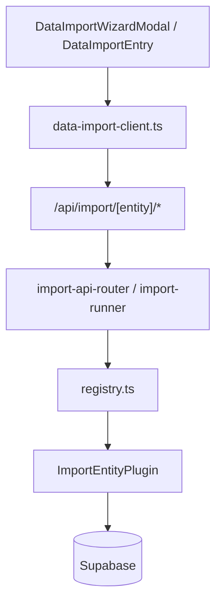

# Import ERP — audit globale e architettura plug-in

Documento di riferimento per la **Fase E**: infrastruttura import generica, copertura entità, roadmap.

Per l'uso operativo del wizard vedi anche [data-import.md](./data-import.md).

**Production Certified v1:** [import-export-operational-guide.md](./import-export-operational-guide.md) · [import-export-production-gate.md](./import-export-production-gate.md)

---

## Architettura plug-in



| Modulo | Ruolo |
|--------|--------|
| `lib/data-import/core/import-plugin.ts` | Contratto `ImportEntityPlugin`, strategie, permessi |
| `lib/data-import/registry.ts` | Registry server-side (code, versionato col deploy) |
| `lib/data-import/core/import-api-router.server.ts` | Handler parse / preview / execute / template |
| `lib/data-import/core/import-runner.server.ts` | Re-export orchestrazione (alias del router) |
| `lib/data-import/core/template-generator.server.ts` | Template XLSX/CSV da `ImportFieldDef[]` |
| `lib/data-import/core/relation-resolver.server.ts` | Lookup clienti, mezzi, liste settings |
| `lib/data-import/core/export-plugin.ts` | Interfaccia export simmetrica (foundation v1) |
| `lib/data-import/core/preset-store.server.ts` | CRUD preset mapping (`import_mapping_presets`) |
| `components/data-import/data-import-wizard-modal.tsx` | Wizard entity-agnostic |

**Route API unificata**

```
POST /api/import/[entity]/parse
POST /api/import/[entity]/preview
POST /api/import/[entity]/execute
GET  /api/import/[entity]/template
GET  /api/import/presets?entity=
POST /api/import/presets
GET  /api/export/[entity]?format=csv
```

Le route legacy `/api/import/magazzino/*` e `/api/import/clienti/*` restano **thin alias** verso il router generico.

`[entity]` è lo **slug di route** (es. `magazzino`, `listino`, `settings-fornitori`), non sempre l'id entità DB.

---

## Inventario entità e copertura

Legenda: **Implementato** · **Predisposto** (registry + template, executor stub) · **Escluso**

### Flotta e cataloghi tecnici

| Entità | ID plug-in | Storage | Stato | Motivazione |
|--------|------------|---------|-------|-------------|
| Mezzi | `mezzi` | `mezzi` | Implementato | Onboarding flotte 50–500 righe; FK cliente risolvibile |
| Attrezzature (marca→modello) | `settings_hierarchy_attrezzature` | `app_settings` | Implementato | Popolamento catalogo; prerequisito ricambi/documenti |
| Telai (tipo→marca→modello) | `settings_hierarchy_telai` | `app_settings` | Implementato | Idem attrezzature |
| Modelli | — | nested | Incluso | Importati con gerarchie attrezzature/telai |
| Cantieri | `settings_cantieri` | `app_settings` | Implementato | Liste piatte merge |
| Utilizzatori | `settings_utilizzatori` | `app_settings` | Implementato | Idem cantieri |

### Magazzino

| Entità | ID plug-in | Storage | Stato | Motivazione |
|--------|------------|---------|-------|-------------|
| Ricambi | `magazzino_ricambi` | `magazzino_ricambi` | Implementato | In produzione da Fase D |
| Categorie | `settings_categorie` | `app_settings` | Implementato | Plugin settings_list |
| Fornitori | `settings_fornitori` | `app_settings` | Implementato | Liste master |
| Produttori | `settings_produttori` | `app_settings` | Implementato | Idem |
| Marche ricambi | `settings_marche` | `app_settings` | Implementato | Idem |
| Listino | `listino_ricambi` | → ricambi | Implementato | Sync prezzi su codice OE; legacy PDF resta in Documenti |
| Movimenti ricambi | — | `movimenti_ricambi` | Escluso | Dati derivati; rischio stock inconsistente |

### CRM

| Entità | ID plug-in | Storage | Stato | Motivazione |
|--------|------------|---------|-------|-------------|
| Clienti anagrafica | `clienti_anagrafica` | `clienti_anagrafiche` | Implementato | Con sedi, contatti, dual-write settings |
| Sedi / Contatti / picker | — | incluse | Incluso | Nel plug-in clienti |

### Officina

| Entità | ID plug-in | Storage | Stato | Motivazione |
|--------|------------|---------|-------|-------------|
| Lavorazioni | `lavorazioni` | `lavorazioni` | Predisposto | Workflow complesso; v2 import bozze |
| Interventi / Schede | — | nested | Escluso | Si creano da UI lavorazioni |
| Preventivi | `preventivi` | `preventivi` + jsonb | Implementato | Testata + righe sheet / colonna JSON |
| Allegati | — | storage | Escluso | Binari; pipeline upload diversa |

### Fatturazione

| Entità | ID plug-in | Storage | Stato | Motivazione |
|--------|------------|---------|-------|-------------|
| Fatture | `fatture_draft` | `invoices` | Predisposto | Multi-tabella, SDI; v2 bozze |
| Billing customers | `billing_customers` | `billing_customers` | Predisposto | Dopo fatture draft |
| Contratti | — | — | Escluso | Non esiste come entità |

### Documenti e personale

| Entità | ID plug-in | Storage | Stato | Motivazione |
|--------|------------|---------|-------|-------------|
| Documenti catalogo | `documenti_metadata` | `documenti` | Predisposto | Solo metadata; PDF via upload |
| BUNDER | — | generazione | Escluso | Non tabellare |
| Operatori / Addetti | `settings_addetti` | `app_settings` | Implementato | settings_list |
| Dipendenti timesheet | `dipendenti_timesheet` | RPC bootstrap | Predisposto | Rischio ore; initial only in v2 |
| Utenti / Ruoli | — | auth | Escluso | Invite flow > bulk import |

### Configurazione esclusa

Log modifiche, report manual entries, ordini fornitore, checklist — **Escluso** (append-only, volume basso, modulo assente).

---

## Riepilogo copertura Fase E

| Stato | Conteggio |
|-------|-----------|
| Implementato (attivo) | 14+ plug-in |
| Predisposto (stub) | 5 |
| Escluso documentato | 15+ logiche |

---

## Strategie incrementali

| Entità | Strategie | Default |
|--------|-----------|---------|
| Ricambi | initial, incremental, replace | incremental |
| Clienti | initial, incremental | incremental |
| Settings liste | merge, replace, initial | merge |
| Gerarchie | merge, initial | merge |
| Mezzi | initial, incremental | incremental |
| Preventivi | initial, incremental | initial |
| Listino | sync, incremental, initial | sync |

Il campo `strategy` è accettato in preview/execute. In preview, se >30% duplicati il wizard può suggerire `incremental` (warning).

---

## Relazioni risolte

| Plug-in | Lookup | Missing ref |
|---------|--------|-------------|
| Clienti | sedi, contatti, settings | warning + skip |
| Mezzi | cliente (nome/P.IVA) | warning |
| Preventivi | mezzo, cliente | error se mezzo mancante |
| Ricambi / Listino | categoria, fornitore, produttore | auto-create settings (merge) |
| Gerarchie | parent nodes | merge crea nodi mancanti |

Modulo: `lib/data-import/core/relation-resolver.server.ts`

---

## Export simmetrico (foundation)

- Interfaccia: `lib/data-import/core/export-plugin.ts`
- Runner: `lib/data-import/core/export-runner.server.ts`
- Route: `GET /api/export/magazzino?format=csv` (attivo se `exportEnabled: true` sul plug-in)
- **Nessuna UI export in Fase E** — solo API e schema condiviso con import

---

## Benefici onboarding (stima)

| Import | Righe tipiche | Tempo manuale | Con wizard |
|--------|---------------|---------------|------------|
| Mezzi flotta | 200–500 | 4–8 h | 15–30 min |
| Clienti + sedi | 100–300 | 3–6 h | 20–40 min |
| Ricambi magazzino | 500–2000 | 8–16 h | 30–60 min |
| Listino prezzi | 1000+ | 6–12 h | 20–45 min |
| Settings liste | 20–100 ciascuna | 30–60 min | 5 min |
| Preventivi storici | 50–200 | 2–4 h | 20–40 min |

---

## Impatto manutenzione

Approccio pre-Fase E: ~10 touch point hardcoded per entità (union type, route ×4, auth, wizard branch, migration CHECK).

Con registry: **1 modulo plug-in + registrazione in `registry.ts`** — il core (wizard, API, batch, template) non cambia.

Stima: **~70% LOC in meno** per ogni nuova entità rispetto al pattern ad-hoc.

---

## Aggiungere un'entità (checklist)

1. Definire `ImportFieldDef[]` e pattern colonne
2. Implementare `ImportEntityPlugin` in `lib/data-import/entities/<nome>/`
3. `register()` in `lib/data-import/registry.ts`
4. Mirror client: `import-entity-config-client.ts`, `import-registry-client.ts`, `import-permissions.ts`
5. Migration CHECK se nuovo id in `import_batches.entity` (solo se id non già in expand migration)
6. UI entry: `DataImportEntry` / `ModuleImportEntry` / `SettingsImportEntry`
7. Test: `lib/regression/import-registry.test.ts` + e2e smoke se entry visibile

File tipici per entità nuova: **schema**, **mapper**, **validator**, **preview**, **execute**, **plugin.server.ts** (6 file — stesso pattern magazzino/clienti).

---

## UI entry points

| Entità | Posizione |
|--------|-----------|
| Magazzino ricambi | Toolbar overflow Magazzino |
| Listino ricambi | Toolbar overflow Magazzino (`Importa listino`) |
| Clienti | Impostazioni → Clienti |
| Mezzi | Toolbar Mezzi |
| Preventivi | Toolbar Preventivi |
| Fornitori, produttori, categorie, marche | Impostazioni → Magazzino |
| Attrezzature, telai | Impostazioni → Attrezzature / Telai |
| Cantieri, utilizzatori | Impostazioni → Clienti |
| Addetti | Impostazioni → Lavorazioni → Addetti |

Stub (`status: "stub"`) non compaiono in UI.

---

## Roadmap v2

- Import lavorazioni in modalità bozze
- Fatture draft + billing customers
- Export UI (XLSX/CSV) simmetrico
- Parser XML/JSON plug-in
- Permesso RBAC dedicato `can_import`
- Paginazione preview server-side (>2000 righe)
- Caricamento preset mapping dal wizard (save già presente)

---

## Migrazioni DB

- `20260718120000_data_import_infrastructure.sql` — tabelle batch + preset
- `20260719120000_import_entity_registry_expand.sql` — CHECK entity allargato, `file_sha256` su batch

---

## Listino legacy (Documenti)

Il flusso PDF da Documenti (`lib/magazzino/listino-import/`) resta per import da allegati catalogo.

L'import tabellare listino usa il plug-in `listino_ricambi` (`/api/import/listino/*`).

---

## Test

| Test | Path |
|------|------|
| Registry plug-in | `lib/regression/import-registry.test.ts` |
| Isolation / wiring | `lib/regression/data-import-isolation.test.ts` |
| E2E smoke | `e2e/smoke/18-data-import.spec.ts` |

Eseguire: `npx tsx lib/regression/import-registry.test.ts`
