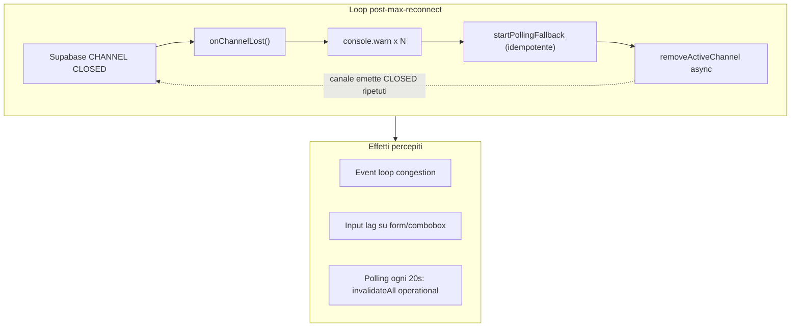

# Debug — lag ambiente local (remediation)

**Data:** 2026-06-09  
**Scope:** solo performance (RF-04, RF-05). Nessun cambio business logic, UX o schema DB.  
**Audit correlato:** [audit-supabase-performance-degradation.md](./audit-supabase-performance-degradation.md)

---

## 1. Sintomo

Durante sessioni dev prolungate su `/lavorazioni` (modale schede aperta, digitazione combobox Cliente):

- Input lag progressivo su form e combobox
- Terminale dev saturo di messaggi identici
- Possibile crescita heap e burst di re-render ogni ~20s

---

## 2. Root cause

| Classe | Root cause | Evidenza | Peso stimato |
|--------|------------|----------|--------------|
| **D — Network amplification (local)** | Realtime WS instabile in dev → fallback polling ogni 20s con invalidazione globale | `gestionale-realtime-config.ts`; poll handler bridge | **~45%** |
| **A — Event handler storm** | `onChannelLost` senza latch post-max-reconnect → spam `console.warn` + lavoro async ripetuto | Terminale dev (80+ righe); bridge L289–316 | **~35%** |
| **B — Render storm (secondario)** | Refetch/invalidation durante digitazione → re-render liste/modali | RF-04; `useGestionaleQueryOpts` refetch on focus | **~15%** |
| **C — Event loop (terziario)** | `NEXT_PUBLIC_OBS_LOG_LEVEL=debug` → log per-query via `measureAsync` | `lib/observability/config.ts` | **~5%** |

### Loop pre-fix



**Escluso come causa primaria del lag progressivo:**

- Leak listener modali — cleanup completo in `useMobileModalKeyboard`
- Duplicazione channel security — già rimosso (F1 audit Caso 4)
- Publication drift F5 — non correlato a metriche degradanti

---

## 3. Fix applicati

### P0 — Reconnect exhaustion latch (RF-05)

**`src/components/gestionale-realtime-bridge.tsx`**

- Flag `reconnectExhausted`: early return in `onChannelLost` e `connectRealtime` dopo esaurimento tentativi
- Sostituito `console.warn` ripetuto con `notePollingFallbackActivation("max reconnect attempts — polling fallback")` (warn-once via degradation detector)
- `removeActiveChannel` + attivazione polling **una sola volta** all'exhaustion
- Reset `reconnectExhausted = false` su subscribe/connect riuscito

**`lib/realtime/postgres-changes-channel.ts`**

- Flag `channelLostHandled`: ignora `CLOSED`/`CHANNEL_ERROR` duplicati dopo prima gestione post-subscribe

### P1 — Polling mirato (RF-04)

**`src/components/gestionale-realtime-bridge.tsx`**

- `onPoll`: `refetchActiveOperationalSnapshot(qc, { onlyActive: true })` al posto di `invalidateAllGestionaleOperationalQueries(qc)`
- Skip poll tick se `document.visibilityState === "hidden"`

### P2 — Opzioni dev (documentate, opt-in)

| Opzione | Env | Effetto |
|---------|-----|---------|
| **A — Realtime con fix bridge** | (default) | WS + latch; polling solo se channel lost |
| **B — Polling stabile** | `NEXT_PUBLIC_GESTIONALE_FORCE_POLL=1` | Evita churn WebSocket in dev instabile |
| **C — Log ridotti** | `NEXT_PUBLIC_OBS_LOG_LEVEL=info` | Meno debug log per-query in sessioni lunghe |

Esempio `.env.local` per dev instabile:

```env
NEXT_PUBLIC_GESTIONALE_FORCE_POLL=1
NEXT_PUBLIC_OBS_LOG_LEVEL=info
```

### Policy test

`lib/regression/long-session-stability-policy.test.ts` — assert su:

- `reconnectExhausted`, `channelLostHandled`
- assenza `console.warn` loop su max reconnect
- `refetchActiveOperationalSnapshot` al posto di `invalidateAllGestionaleOperationalQueries`

---

## 4. Metriche prima / dopo

| Metrica | Prima (evidenza) | Dopo (target) | Post-fix (modulo) |
|---------|------------------|---------------|-------------------|
| Reconnect warn/min | 10–80+ (terminale) | 0–1 | `notePollingFallbackActivation` warn-once |
| Poll invalidate scope | 16 tabelle (global) | solo domini attivi montati | `refetchActiveOperationalSnapshot` |
| `gestionaleDispatchAppliedTotal` idle | possibile creep | ~0 in idle | 0 (`ops:long-session-soak`) |
| `cabSyncListeners` | stabile atteso | stabile | 0 (Node snapshot) |
| Input lag percepito | crescente | costante | validazione manuale browser |

### Baseline modulo (2026-06-09)

```bash
npm run ops:long-session-soak
```

```json
{
  "cabSyncListeners": 0,
  "ricambioSnapshotRegistrySize": 0,
  "scortaSyncQueueSize": 0,
  "gestionaleRealtimeMode": "idle",
  "gestionaleDispatchAppliedTotal": 0
}
```

### Baseline browser (dev, ogni 5 min × 15 min)

Con app loggata:

```js
window.__cabLongSessionMetrics?.()
```

Soglie: `heapUsedMb` slope ≤ +10% in 15 min; `cabSyncListeners` stabile; nessuno spam reconnect in terminale.

---

## 5. Checklist validazione local

| # | Test | Criterio pass |
|---|------|---------------|
| 1 | Sessione 15 min `/lavorazioni` + modale schede open/close ×10 | Nessun degrado input percepibile |
| 2 | Terminale dev | Zero spam `max reconnect attempts` dopo stabilizzazione (<1/min) |
| 3 | `__cabLongSessionMetrics()` ogni 5 min | `heapUsedMb` slope ≤ +10% in 15 min; `cabSyncListeners` stabile |
| 4 | Combobox Cliente in modale | Latency typing costante |
| 5 | Con `FORCE_POLL=1` | `gestionaleRealtimeMode === "polling"`; req/min Supabase stabili |
| 6 | React Profiler su GlobalSelect | Nessun commit explosion (>30/s) durante typing idle |

### Script utili

```bash
npm run dev:lag-probe          # churn .next (dev server overhead)
npm run ops:long-session-soak  # snapshot modulo Node
npx tsx lib/regression/long-session-stability-policy.test.ts
```

---

## 6. Rischi residui

| Rischio | Mitigazione |
|---------|-------------|
| Realtime instabile persiste in dev | `NEXT_PUBLIC_GESTIONALE_FORCE_POLL=1` |
| Polling mirato non copre tab inattiva | Al focus: `useGestionaleSnapshotRecovery` refetch se connected |
| gcTime 5min → RAM plateau | Comportamento atteso |
| `.next` churn dev server | `npm run dev:lag-probe`; `dev:fresh` se necessario |

---

## 7. Raccomandazioni future (non implementate)

- RF-06: soglia report drift 60s
- RLS initplan `(select auth.uid())` su `user_prefs`
- Playwright long-session E2E con heap assertion
- Memoization GlobalSelect / LavorazioniView solo se Profiler mostra commit storm post-fix

---

## File modificati

| File | Modifica |
|------|----------|
| `src/components/gestionale-realtime-bridge.tsx` | Latch reconnect, polling mirato, visibility skip |
| `lib/realtime/postgres-changes-channel.ts` | `channelLostHandled` |
| `lib/regression/long-session-stability-policy.test.ts` | Assert RF-04/RF-05 |
| `docs/long-session-soak-baseline.md` | Note FORCE_POLL / OBS_LOG_LEVEL |
