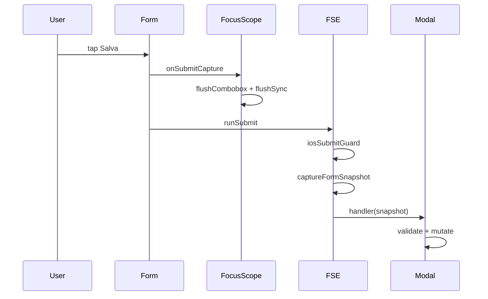

# Form Engine SSOT — Form Submission Engine (FSE)

**Data:** 2026-06-08  
**Scope:** layer infrastrutturale submit in `lib/forms/form-engine/`  
**Modali pilota v1:** Scheda Ingresso edit, Nuova Lavorazione, Nuovo Ricambio  
**Fase 2 (scale-up):** tutti i modali A/B dell’inventory — vedi [`form-engine-inventory.test.ts`](../lib/regression/form-engine-inventory.test.ts)

---

## Architettura

Il **Form Submission Engine** centralizza:

- sync ref/state per capture al submit
- flush combobox + React batch (`prepareFormSubmit`)
- guard composizione IME iOS (`iosSubmitGuard`)
- snapshot immutabile pre-persist (`captureFormSnapshot`)
- submit lock anti doppio tap (`createSubmitLock`)

**Non contiene** validazione dominio, mutation, toast, mapping DB.



### Moduli

| File | Ruolo |
|------|-------|
| [`lib/forms/form-engine/types.ts`](../lib/forms/form-engine/types.ts) | `FormStateSnapshot`, `FormEngineSnapshot` |
| [`lib/forms/form-engine/prepare-form-submit.ts`](../lib/forms/form-engine/prepare-form-submit.ts) | Flush SSOT (form + button save) |
| [`lib/forms/form-engine/ios-submit-guard.ts`](../lib/forms/form-engine/ios-submit-guard.ts) | Attesa `compositionend` (fail-open 100ms) |
| [`lib/forms/form-engine/capture-form-snapshot.ts`](../lib/forms/form-engine/capture-form-snapshot.ts) | Clone immutabile |
| [`lib/forms/form-engine/submit-lock.ts`](../lib/forms/form-engine/submit-lock.ts) | Lock sincrono |
| [`lib/forms/form-engine/use-form-engine.ts`](../lib/forms/form-engine/use-form-engine.ts) | `useFormEngine`, `useFormEngineSections` |
| [`lib/forms/form-engine/run-submit.ts`](../lib/forms/form-engine/run-submit.ts) | `runSubmitFromGetter`, `runButtonSubmit` |
| [`lib/forms/form-engine/use-submit-lock.ts`](../lib/forms/form-engine/use-submit-lock.ts) | `useSubmitLock` (button-save senza hook completo) |
| [`lib/forms/form-engine/shadow-compare.ts`](../lib/forms/form-engine/shadow-compare.ts) | Shadow mode (`NEXT_PUBLIC_FSE_SHADOW=1`) |
| [`lib/ui/gestionale-modal-save-prep.ts`](../lib/ui/gestionale-modal-save-prep.ts) | Wrapper → `prepareFormSubmit` |

---

## Flusso submit standardizzato

```
1. onSubmitCapture → prepareFormSubmit (flush combobox + flushSync)
2. runSubmit → iosSubmitGuard
3. captureFormSnapshot da ref sync
4. [modal] validate(snapshot)
5. [modal] normalize + mutate
6. [modal] confirm + UI update
```

---

## Moduli integrati

### v1 — pilota

| Modal | Hook | File |
|-------|------|------|
| Scheda Ingresso edit | `useFormEngine` | [`scheda-ingresso-form-modal.tsx`](../components/gestionale/lavorazioni/scheda-ingresso-form-modal.tsx) |
| Nuovo Ricambio | `useFormEngine` | [`ricambio-new-modal.tsx`](../components/gestionale/magazzino/ricambio-new-modal.tsx) |
| Nuova Lavorazione | `useFormEngineSections` | [`lavorazione-create-modal.tsx`](../components/gestionale/lavorazioni/lavorazione-create-modal.tsx) |

### Fase 2 — pattern per categoria

| Categoria | API | Esempi |
|-----------|-----|--------|
| A — draft unico | `useFormEngine` + `runSubmit` | ricambio edit, mezzi new/edit |
| A — multi `useState` | `runSubmitFromGetter` + `useSubmitLock` | lavorazione edit, documenti, security, promemoria |
| B — button-save | `runButtonSubmit` + `useSubmitLock` | schede, preventivi, bunder, hub panoramica note |

UI component structure, shell modali, focus scope Enter navigation, scroll mobile: **invariati**.

---

## Compatibilità garantita

- `gestionaleFormFocusScopeProps` — riusato via `formProps` del hook
- `GestionaleModalShell` / `GestionaleModalScrollBody` — non modificati
- `prepareGestionaleModalSave` — stessa API pubblica, delega a FSE
- **Fallback:** `NEXT_PUBLIC_FORM_ENGINE=0` disabilita iOS guard nel hook (`enabled: false` via `isFormEngineEnabled`)

---

## Problemi risolti

| Problema | Mitigazione FSE |
|----------|-----------------|
| iOS submit senza blur | `onSubmitCapture` flush + `iosSubmitGuard` |
| UI ≠ payload | snapshot da ref sync unico |
| Race doppio submit | `submitLock` in `runSubmit` |
| ref/state duplicati | `useFormEngine` / `useFormEngineSections` |
| Divergenza modali pilota | stesso `runSubmit` pipeline |

---

## Rischi residui

| Risk | Nota |
|------|------|
| `NewLavorazioneModal` legacy (inventory C) | non entry principale; shadow opzionale |
| `settings-workspace-shell` | pagina, fuori scope FSE modali |
| `iosSubmitGuard` timeout fail-open | metrica `formEngineCompositionTimeout` |

---

## Strategia fallback

```ts
import { isFormEngineEnabled } from "@/lib/forms/form-engine";

useFormEngine({ initial, enabled: isFormEngineEnabled() });
```

Con `NEXT_PUBLIC_FORM_ENGINE=0`: ref sync e submit lock restano attivi; iOS guard saltato.

---

## Validazione UX

- Nessun cambio copy, layout, disabled rules, policy lenient ricambio
- Gate: `ci:tsc`, `smoke:regression:core` (include `form-engine-audit.test.ts`, `form-engine-inventory.test.ts`), `ios:check`

---

## Rating stabilità sistema form

| Fase | Rating |
|------|--------|
| Pre-FSE (post hardening ref manuale) | 8.5/10 |
| Post-FSE v1 (3 modali pilota) | **9.5/10** |
| Post-FSE fase 2 (inventory A/B) | **9.8/10** |

**Verdetto:** submit deterministico su tutti i modali inventory A/B; legacy `NewLavorazioneModal` e settings page esclusi.

---

## Flusso button-save (Fase 2)

```
1. onClick → runButtonSubmit
2. prepareFormSubmitAsync (flush + iosSubmitGuard)
3. captureFormSnapshot(getter)
4. handler(snapshot) — validate + mutate invariati
```

## Shadow mode (opzionale)

`NEXT_PUBLIC_FSE_SHADOW=1`: confronto getter vs state React; metrica `fseShadowMismatch` via health counter — solo osservabilità pre-migrazione legacy.

---

## Roadmap residua (opzionale)

1. Dirty bridge su modali già su `useFormEngine` (Fase 2b)
2. Deprecazione / shadow `NewLavorazioneModal`
3. E2E WebKit composition (extended/nightly)
