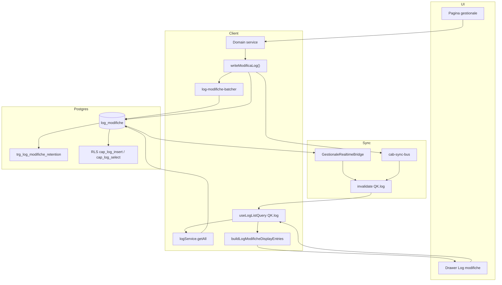

# Audit Log — Architettura completa (Log Modifiche)

Data: 2026-07-19

## Principio SSOT

Un solo audit trail operativo: **`public.log_modifiche`**, scritto esclusivamente via **`writeModificaLog()`** in [`src/services/internal/audit-log.ts`](../../src/services/internal/audit-log.ts).

Nessun trigger DB su tabelle business. Nessun secondo logger operativo. Tabelle parallele (`auth_logs`, `app_settings_audit`, `import_audit_events`, …) sono domini separati.

---

## Diagramma pipeline

---

## Layer write

| Componente | Path | Ruolo |
|------------|------|-------|
| **SSOT writer** | `src/services/internal/audit-log.ts` | `writeModificaLog`, `writeModificaLogImmediate`, `commitCriticalMutation`, `flushPendingModificaLogs`, `AuditLogWriteError` |
| **Batching** | `src/services/internal/log-modifiche-batcher.ts` | Debounce 3.5s per UPDATE `magazzino_ricambi` / `movimenti_ricambi` |
| **Summary/diff** | `lib/gestionale-log/log-summary.ts` | `buildLogModificaSummary`, `auditContext`, `auditDiff`, `auditSnapshot` |
| **Security (parallelo)** | `lib/security/security-audit-log.ts` | `writeSecurityAuditLog` → `entita: security` |
| **Admin direct** | `src/actions/admin-users.ts` | INSERT security (documentato) |

### Domain services con `writeModificaLog`

`lavorazioni`, `mezzi`, `magazzino`, `movimenti`, `preventivi`, `documenti`, `schede`, `invoices`, `ddt`, `ordini_fornitori`, `attrezzature`, `dipendenti-timesheet`, `asset-compliance`, `asset-mileage`, `maintenance-plans`, `settings-rename-propagation`, capture/import server paths.

---

## Layer read

| Componente | Path | Ruolo |
|------------|------|-------|
| **Read service** | `src/services/log.service.ts` | `getAll`, `getByEntita`, `create`, `markReverted` |
| **Domain wrapper** | `lib/domain/log-entry.ts` | Permission guard su `markReverted` |
| **React Query** | `src/hooks/gestionale/use-entity-list-queries.ts` | `useLogListQuery` → `QK.log` |
| **Undo hook** | `src/hooks/gestionale/use-undoable-log.ts` | Log + undo session |
| **Server prefetch** | `lib/gestionale-log/log-modifiche-fetch-server.ts` | BFF dashboard |
| **Display VM** | `lib/gestionale-log/log-modifiche-view-model.ts` | `buildLogModificheDisplayEntries` |
| **Reconcile** | `lib/gestionale-log/log-event-pipeline.ts` | Dedupe, burst merge, suppress reverted |
| **Select columns** | `lib/db/table-select-columns.ts` | `LOG_MODIFICHE_WITH_PROFILE_SELECT` |

---

## Drawer per pagina

| Pagina | Drawer | Fonte dati | Hook |
|--------|--------|------------|------|
| Lavorazioni | inline in `lavorazioni-view.tsx` | `log_modifiche` | `useUndoableLog("lavorazioni")` |
| Mezzi | `mezzi-log-drawer.tsx` | `log_modifiche` | `useUndoableLog("mezzi")` |
| Magazzino | `magazzino-log-drawer.tsx` | `log_modifiche` + cache locale merge | `useMagazzinoLogFeed` |
| Fatturazione | `fatturazione-log-drawer.tsx` | `log_modifiche` | `useLogListQuery({ entita: "invoices" })` |
| Preventivi | `preventivi-log-drawer.tsx` | `log_modifiche` (SSOT) | `useLogListQuery({ entita: "preventivi" })` |
| Documenti | `documenti-log-drawer.tsx` | `log_modifiche` (SSOT) | `useLogListQuery({ entita: "documenti" })` |
| Ordini fornitori | `ordine-fornitore-storico-section.tsx` | `log_modifiche` | `useLogListQuery` |

---

## Realtime e invalidazione

| Componente | Path | Ruolo |
|------------|------|-------|
| Realtime bridge | `src/components/gestionale-realtime-bridge.tsx` | Postgres changes su tabelle operative |
| Config | `lib/realtime/gestionale-realtime-config.ts` | `GESTIONALE_REALTIME_TABLES` |
| Event bus | `lib/sync/cab-sync-bus.ts` | `emitCabSyncEvent`, `CabSyncEntity: log_modifiche` |
| Dispatch | `lib/sync/gestionale-sync-dispatch.ts` | Invalida cache + broadcast cross-tab |
| Query keys | `src/lib/react-query/invalidate-targets.ts` | `log_modifiche → [QK.log]` |
| Same-tab sync | `audit-log.ts` post-INSERT | `emitCabSyncEvent` immediato |

Toast su `log_modifiche` soppresso by design (`gestionale-notification-dispatch.ts`).

---

## Database

### Retention (ENTITY_HISTORY + ACTIVITY_FEED)

Due concetti distinti:

| Scope | Meccanismo | Limite |
|-------|------------|--------|
| **ENTITY_HISTORY** | Trigger `trg_log_modifiche_retention` → `prune_log_modifiche_per_entity()` | Max **100** righe per `(entita, entita_id)`; `entita_id` NULL → bucket `__GLOBAL__` |
| **ACTIVITY_FEED** | RPC `get_activity_feed(days, limit)` | Query globale dashboard (90gg, max 100 righe); purge opzionale `prune_log_modifiche_dashboard_window()` |

Config SSOT: `app_settings` module `audit`, key `retention` → `audit_history_retention.default: 100`.

Tabelle parallele: `mezzo_anagrafica_history` (100/mezzo_id), `maintenance_audit_events` (100/entity_id), `app_settings_audit` (100/module).

### Tabella `log_modifiche`

| Colonna | Tipo | Note |
|---------|------|------|
| `id` | uuid PK | |
| `entita` | text | es. `lavorazioni`, `mezzi`, `magazzino_ricambi` |
| `entita_id` | uuid | ID record |
| `azione` | text | CREATE, UPDATE, DELETE, RESTORE, reverted |
| `autore_id` | uuid FK profiles | |
| `autore_nome_snapshot` | text | Nome al momento INSERT (ISO audit) |
| `payload` | jsonb | diff/snapshot/context/summary |
| `created_at` | timestamptz | |

### Trigger

- `trg_log_modifiche_retention` → `prune_log_modifiche_per_entity()` — ENTITY_HISTORY, CTE ranked + `hashtextextended` advisory lock

### RLS

| Policy | Op | Condizione |
|--------|-----|------------|
| `cap_log_select` | SELECT | `rbac_can_read_log(entita, entita_id)` |
| `cap_log_insert` | INSERT | `can_write_operational` AND (module NULL OR `user_effective_can(module, write)`) |
| `cap_log_delete` | DELETE | `can_manage_security` |

### RBAC mapping

`rbac_log_entita_module(text)` — SSOT migration `20260919120100_rbac_log_entita_inventory_receiving.sql`.

---

## Tabelle parallele (non Log Modifiche)

| Tabella | Scopo |
|---------|-------|
| `auth_logs` | Login/logout |
| `app_settings_audit` | Trigger su `app_settings` |
| `import_audit_events` | Pipeline import |
| `document_capture_events` | Capture documenti |
| `ai_provider_key_audit` | Chiavi AI (service role only) |
| `workshop_schedule_history` | Storico agenda officina |
| `asset_assignment_history` | Assegnazioni attrezzature |

---

## Test e governance

| Test/script | Path |
|-------------|------|
| No silent failure | `lib/regression/audit-log-no-silent-failure.test.ts` |
| Write coverage | `lib/regression/activity-write-coverage-audit.test.ts` |
| RBAC SSOT | `lib/regression/rbac-log-entita-module-ssot.test.ts` |
| Retention | `lib/regression/log-modifiche-retention.test.ts` |
| Pipeline | `lib/regression/audit-log-pipeline.test.ts` |
| CI scan | `scripts/audit-write-coverage-scan.ts` |
| Verify script | `scripts/verify-audit-log-pipeline.ts` |

---

## Riferimenti

- RCA: [`AUDIT_LOG_ROOT_CAUSE.md`](AUDIT_LOG_ROOT_CAUSE.md)
- Write coverage: [`../activity-feed-write-coverage-audit.md`](../activity-feed-write-coverage-audit.md)
- RCA storico: [`../audit-trail-root-cause-report.md`](../audit-trail-root-cause-report.md)
