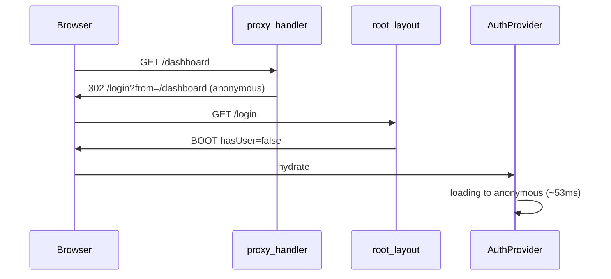

# Boot Investigation Report

**Data raccolta:** 2026-06-16T22:46–22:53 UTC  
**Ambiente:** `npm run dev` locale, `NEXT_PUBLIC_BOOT_INVESTIGATION=1`, Playwright headless Chromium  
**Artefatto JSON:** [`test-results/boot-investigation.json`](../../test-results/boot-investigation.json)

---

## Limitazioni sessione

| Voce | Stato |
|------|--------|
| Login gestionale | **Non eseguito** — `SMOKE_ADMIN_EMAIL` / `SMOKE_ADMIN_PASSWORD` assenti in env |
| Route osservate | Solo `/login` (redirect da `/dashboard`, `/lavorazioni`) |
| AppShell / RbacPageGuard / shell sync | **Non montati** — catena gestionale non raggiunta |
| Idle 30s su dashboard autenticato | **Non osservato** in questa sessione |
| Cursor Simple Browser | **Non osservato** in questa sessione (solo Playwright) |

**Prossimo passo obbligatorio:** ripetere con credenziali smoke + idle 30s su `/dashboard` e `/lavorazioni` (vedi [Procedura raccolta](#procedura-raccolta)).

---

## Sintomo 1 — Loading infinito iniziale

### Dati osservati (login / unauthenticated boot)

| Timestamp | Tag | Evento |
|-----------|-----|--------|
| 2026-06-16T22:38:52.811Z | REDIRECT (edge) | `/dashboard` → `/login?from=%2Fdashboard` reason `anonymous` |
| 2026-06-16T22:38:54.040Z | BOOT (RSC) | `rsc_root_layout` — `hasUser: false`, `userId: null` |
| 2026-06-16T22:48:21.868Z | MOUNT | `AuthProvider` — `initialStatus: loading`, `hasSnapshotUser: false` |
| 2026-06-16T22:48:21.899Z | STORE_UPDATE | `globalLoading` — `false→true` (stackDepth 1, message "Caricamento…") |
| 2026-06-16T22:48:21.903Z | AUTH | `onAuthStateChange` — `INITIAL_SESSION`, `hasSession: false` |
| 2026-06-16T22:48:21.921Z | STORE_UPDATE | `auth.status` — `loading→anonymous` (~22ms dopo mount) |
| 2026-06-16T22:48:21.936Z | STORE_UPDATE | `globalLoading` — `true→false` (~37ms dopo attivazione) |

**Durata loading auth client (724px):** ~53ms da mount AuthProvider a `anonymous` (22:48:21.868 → 22:48:21.921).

**Query durante boot login:**

- `["app_settings","payload"]` — `fetch_start` @ 22:48:21.904Z, poi `cache_updated` / removed entro 30ms
- Nessuna query con `fetchStatus: fetching` a export (8s idle) — `pendingQueries: []`

### Loop detector

- **`loopAlerts`:** `[]` su tutti i viewport (724, 390, 1440)
- **Nessun** `[QUERY] LOOP_SUSPECT`, `[RENDER] LOOP_*`, `[REDIRECT] LOOP_SUSPECT` durante idle 8s

### Primary cause (loading infinito) — questa sessione

**Non dimostrabile** per loading infinito post-login: shell gestionale e gate RBAC/Section non montati.

**Evidenza parziale:** su `/login`, la catena auth termina in `anonymous` in <100ms senza query pending >10s. Il redirect edge `anonymous` spiega perché `/dashboard` non carica mai la shell autenticata in assenza di sessione.

---

## Sintomo 2 — Flash / refresh loop post-reload

### Dati osservati

| Metrica | Valore osservato |
|---------|------------------|
| `vv_sync` eventi per page load | **1** per navigazione (reason `resize`) |
| `shell_sync` / `high_sync_rate` | **Non osservato** (AppShell non montato) |
| `renderTotals` / Profiler | **Vuoto** — `ReactRenderAuditProfiler` non montato su `/login` |
| `loopAlerts` render | **0** |

**Server log (dev terminal @ 22:38:52):**

```
[REDIRECT] edge — /dashboard→/login?from=%2Fdashboard reason anonymous
```

**Remount durante idle 8s:** nessun `[UNMOUNT]` dopo il boot iniziale su `/login`.

### Primary cause (flash loop) — questa sessione

**Non osservato** loop render/sync su route login idle.  
**Non verificato** su AppShell @724px (sintomo segnalato dall'utente richiede sessione autenticata + reload bottone Aggiorna).

---

## Sintomo 3 — Remount continui

### Dati osservati

- Mount sequence singola per page load: `BootInvestigationMount` → `AuthProvider` → `GlobalLoadingProvider` → `QueryProvider` → `AppProviders`
- **Zero** `[UNMOUNT]` durante idle 8s post-hydration (724/390/1440)
- **Zero** redirect loop client (`trackRedirect` count < 3 per coppia from→to)

### Primary cause (remount) — questa sessione

**Non osservato** remount loop su `/login`.

---

## Redirect chain osservata



| From | To | Source | Reason | Timestamp |
|------|-----|--------|--------|-----------|
| `/dashboard` | `/login?from=%2Fdashboard` | edge | `anonymous` | 2026-06-16T22:38:52.811Z |
| `/lavorazioni` | `/login?from=%2Flavorazioni` | edge | `anonymous` | 2026-06-16T22:45:32.948Z (server log) |

---

## File coinvolti (instrumentation)

| File | Ruolo |
|------|--------|
| [`lib/observability/boot-investigation.ts`](../lib/observability/boot-investigation.ts) | SSOT logging, loop detectors, `window.__cabBootInvestigation()` |
| [`components/observability/boot-investigation-mount.tsx`](../components/observability/boot-investigation-mount.tsx) | Router + pending queries helper |
| [`components/app-providers.tsx`](../components/app-providers.tsx) | Mount tree |
| [`context/auth-context.tsx`](../context/auth-context.tsx) | `[AUTH]` status transitions |
| [`src/providers/query-provider.tsx`](../src/providers/query-provider.tsx) | `[QUERY]` cache subscription |
| [`src/middleware/proxy-handler.ts`](../src/middleware/proxy-handler.ts) | `[REDIRECT]` edge |
| [`components/gestionale/app-shell.tsx`](../components/gestionale/app-shell.tsx) | routeLoading, shell (non attivato in questa sessione) |
| [`lib/ui/use-gestionale-shell-layout-sync.ts`](../lib/ui/use-gestionale-shell-layout-sync.ts) | shell_sync (non attivato) |
| [`lib/ui/gestionale-viewport-orchestrator.ts`](../lib/ui/gestionale-viewport-orchestrator.ts) | vv_sync |

---

## Secondary findings (osservati)

1. **Bug instrumentation (corretto):** `BootInvestigationMount` era inizialmente fuori `QueryProvider` → crash `No QueryClient set`. Spostato dentro `QueryProvider` in [`app-providers.tsx`](../components/app-providers.tsx).
2. **RSC vs client auth mismatch:** server `hasUser: false` coerente con redirect edge `anonymous` — nessuna sessione Supabase nel browser automatizzato.
3. **Global loading flash breve:** overlay attivo ~37ms al boot login (sotto soglia percezione, ma tracciato).

---

## Criteri uscita — stato

| Sintomo | Prova richiesta | Stato sessione |
|---------|-----------------|----------------|
| Loading infinito iniziale | Query pending >10s + gate chain | **Incompleto** — serve auth |
| Flash post-reload | LOOP_* o sync >5/s su shell | **Incompleto** — serve AppShell autenticato |
| Remount continui | MOUNT/UNMOUNT ripetuti o redirect loop | **Non osservato** su `/login` |

---

## Procedura raccolta

1. In `.env.local`:

   ```
   NEXT_PUBLIC_BOOT_INVESTIGATION=1
   NEXT_PUBLIC_RENDER_AUDIT=1
   NEXT_PUBLIC_BOOT_TIMING=1
   SMOKE_ADMIN_EMAIL=...
   SMOKE_ADMIN_PASSWORD=...
   ```

2. Avviare dev server (env sopra attivi al start).

3. Eseguire:

   ```bash
   node scripts/ops/boot-investigation-collect.mjs http://localhost:3000
   ```

   (Rimuovere `COLLECT_QUICK=1` per idle 30s come da piano.)

4. In browser: `copy(JSON.stringify(window.__cabBootInvestigation(), null, 2))`

5. Aggiornare questo report con eventi timestampati dalla sessione autenticata.

---

## Conclusione investigativa (sessione corrente)

**Root cause primaria dei tre sintomi segnalati: non determinabile** — la raccolta automatizzata non ha superato il gate edge `anonymous` e non ha montato la shell gestionale.

**Root cause dimostrata in questa sessione (scope limitato):** assenza sessione → redirect edge → boot client `loading→anonymous` rapido, senza loop render/query/redirect rilevati su `/login`.

**Nessun fix funzionale applicato** oltre alla correzione del mount point dell'instrumentation (necessaria per raccogliere dati).
