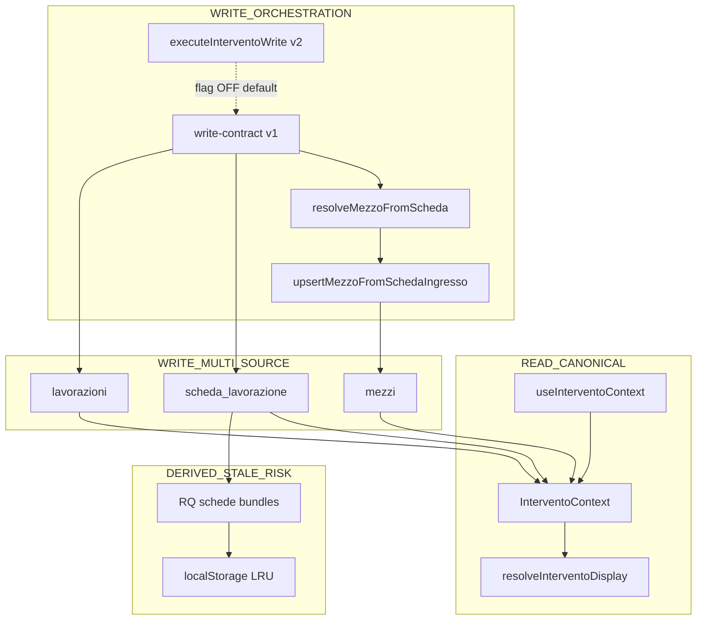
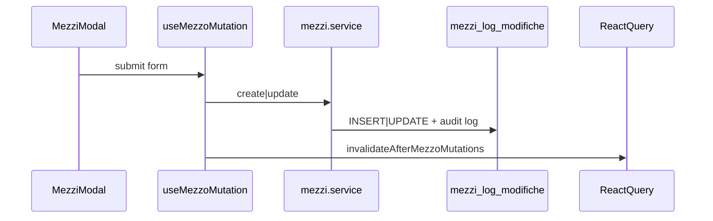
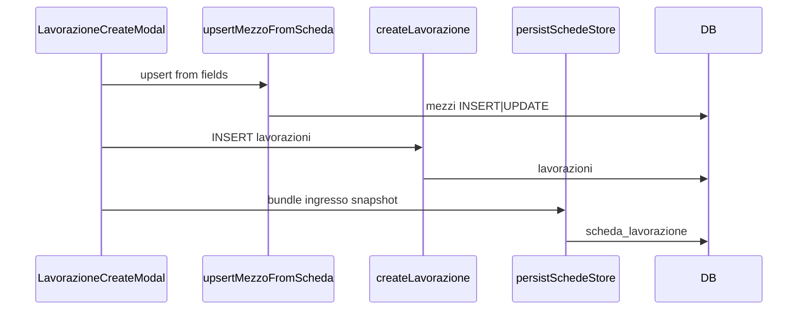
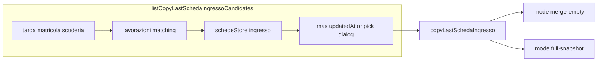
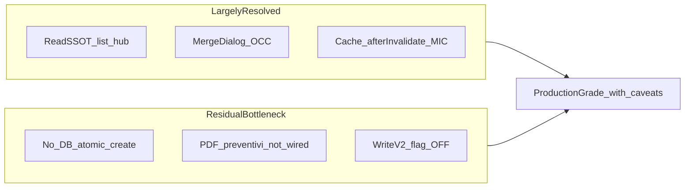

# Audit dataflow — Mezzi / Scheda ingresso / Copy last state

**Data iniziale:** 2026-06-11  
**Revisione post-Domain Consistency Layer:** 2026-06-11  
**Revisione post Write Contract v2 / hardening:** 2026-06-12  
**Scope:** comportamento attuale (as-is), edge case, consistenza dati, raccomandazioni architetturali.  
**Vincolo:** nessuna modifica al codice — solo analisi.

Documenti correlati: [`audit-scheda-ingresso.md`](audit-scheda-ingresso.md), [`audit-submit-layer-scheda-ingresso-2026-06.md`](audit-submit-layer-scheda-ingresso-2026-06.md), [`architecture-intervento-write-v2.md`](architecture-intervento-write-v2.md).

> **Nota revisione:** §1–§12 documentano l’evoluzione storica (pre-layer → DCL → hardening). **Stato corrente del sistema:** **§13–§16**. Le sezioni 2 (dataflow storico) restano riferimento operativo.

---

## 1. Current Architecture (as-is)

### 1.1 Modello entità

| Entità | Storage | Chiave | Contenuto anagrafica |
|--------|---------|--------|----------------------|
| **Mezzo** | Tabella `mezzi` (Supabase) | `mezzi.id` | Cliente, marca, modello, targa, matricola, scuderia, tipo attrezzatura, `meta` JSON |
| **Lavorazione** | Tabella `lavorazioni` | `lavorazioni.id` | `mezzo_id` (FK), `data_ingresso`, `note`, stato, priorità |
| **Scheda ingresso** | Tabella `scheda_lavorazione` | `lavorazione_id` + `tipo=ingresso` | JSON `contenuto.doc.campi` (`SchedaIngressoFields`) — **snapshot** |
| **Bundle UI** | RQ `["schede","bundles"]` + localStorage LRU | `lavorazioneId` | `{ ingresso, lavorazioni, ricambi }` |

**Assumption (pre-layer):** non esisteva un singolo SSOT read per l’anagrafica macchina.

**Stato post-layer:** il **read model canonico** è `InterventoContext` (composto da scheda + lavorazione + mezzo). Il write model resta multi-source (3 tabelle + cache).

### 1.2 Modello di consistenza (post-Domain Layer)

Il sistema è **context-driven read + multi-source write orchestrato**:

**Read path (canonical dove adottato):**

- `composeInterventoContext` / `useInterventoContext` aggregano scheda, lavorazione, mezzo.
- `resolveInterventoDisplay` applica priorità: **scheda (campi presenti) > lavorazione legacy > mezzo**.
- `auditInterventoContext` (dev-only) traccia mismatch ident e source-of-truth usata.

**Write path (invariato a livello DB, orchestrato a livello app):**

- **Snapshot-based:** `SchedaIngressoFields` in `ingresso.campi` — snapshot per intervento.
- **Write-through (forward):** scheda save → `upsertMezzoFromSchedaIngresso` via `resolveMezzoFromScheda`.
- **Orchestrazione v1 (attiva default):** `createInterventoTransaction` (create) e `syncIngressoAfterSave` (edit) in `write-contract.ts`.
- **Orchestrazione v2 (flag-gated):** `executeInterventoWrite` + saga + ledger — `NEXT_PUBLIC_INTERVENTO_WRITE_V2=1` (default OFF).
- **Entry create UI:** `lavorazione-create-modal` → `executeInterventoWrite` (fallback v1 se flag OFF).
- **Autofill (backward, manuale):** mezzo → form + opzionale `copyLastSchedaIngresso({ mode: "merge-empty" })`.



#### Source-of-truth mapping (read vs write)

| Concetto | Ruolo | Canonical? |
|----------|-------|------------|
| **InterventoContext** (composed) | Read model UI | **Sì (read)** |
| `scheda_lavorazione.contenuto.doc.campi` | Snapshot accettazione | **Sì (write ingresso)** |
| `mezzi` | Anagrafica flotta persistente | **Sì (write mezzo)** |
| `lavorazioni` | FK + note/data_ingresso | **Sì (write lav)** |
| RQ `SCHEde_BUNDLES` | Cache sessione | Derived / stale-risk |
| localStorage bundles | Offline LRU | Derived / stale-risk |
| `meta.mezzoId` (create form) | Hint pre-submit | **Non canonical** |

#### Adozione read model per surface (post-hardening)

| Surface | Stato | Note |
|---------|-------|------|
| Lista lavorazioni | **Sì** | `resolveInterventoDisplay` via `lavorazioni-list-row-labels` |
| Kanban + search/filtri | **Sì** | `resolveInterventoIdent` + labels condivise |
| Hub panoramica + copy ident | **Sì** | `useInterventoContext`; fallback `lav.*` solo durante loading |
| PDF ingresso | **Helper sì, wiring no** | `buildIngressoAnagraficaPdfSectionsFromContext` esiste; `ingresso-pdf-layout.ts` non migrato |
| Preventivi | **Helper sì, wiring no** | `anagraficaFromInterventoContext` esiste; `mergeAnagraficaPreventivo` legacy in uso |
| Create modal draft | **Parziale** | Warning mezzoId mismatch sì; `composeInterventoContextFromDraft` non in UI |
| `lavorazione-edit-modal` | **No** | Subset mezzo diretto |
| Catalogo mezzi | N/A | — |

### 1.3 Layer applicativi e file SSOT

| Layer | Ruolo | File chiave |
|-------|--------|-------------|
| UI create | Nuova lavorazione + scheda ingresso | `components/gestionale/lavorazioni/lavorazione-create-modal.tsx` |
| UI edit scheda | Modifica scheda ingresso (hub + form) | `components/lavorazioni/schede/schede-lavorazione-modal.tsx`, `components/gestionale/lavorazioni/scheda-ingresso-form-modal.tsx` |
| UI mezzo | CRUD catalogo mezzi | `components/gestionale/mezzi/mezzi-new-modal.tsx`, `mezzi-edit-modal.tsx`, `mezzi-view.tsx` |
| UI edit lavorazione | Anagrafica inline su lavorazione | `components/gestionale/lavorazioni/lavorazione-edit-modal.tsx` |
| Reuse / copy | Ultima scheda, merge campi | `lib/schede/scheda-ingresso-reuse.ts`, `components/gestionale/lavorazioni/copia-ultima-scheda-ingresso-banner.tsx` |
| Mezzo autofill | Dialog collegamento mezzo | `src/hooks/use-scheda-ingresso-mezzo-prompt.ts`, `lib/schede/scheda-ingresso-mezzo-autofill.ts` |
| Scheda → mezzo | Payload + merge update | `lib/schede/scheda-ingresso-mezzo-payload.ts`, `lib/mezzi/upsert-mezzo-from-scheda.ts`, `lib/mezzi/merge-mezzo-update-from-scheda.ts` |
| Persist scheda | DB + cache locale | `lib/schede/schede-sync-adapter.ts`, `lib/schede/lavorazioni-schede-storage.ts`, `lib/schede/schede-db-mapper.ts` |
| Persist mezzo | Supabase client | `src/services/mezzi.service.ts` |
| Cache UI schede | React Query | `src/hooks/use-schede-store-query.ts`, `components/gestionale/lavorazioni/lavorazioni-view.tsx` |
| Display list | Etichette riga lavorazioni | `lib/lavorazioni/lavorazioni-list-row-labels.ts` → `resolveInterventoDisplay` |
| **Domain read** | Context + display + ident | `lib/domain/intervento-context/` |
| **Domain copy-last** | Entry point unico copy | `lib/domain/scheda-ingresso/copy-last-scheda.ts` |
| **Domain mezzo resolve** | Ident > preferredMezzoId | `lib/domain/mezzo/resolve-mezzo-from-scheda.ts` |
| **Domain write v1** | Orchestrazione create/sync | `lib/domain/intervento-context/write-contract.ts` |
| **Domain write v2** | Saga + ledger (flag-gated) | `lib/domain/intervento-context/write-contract-v2.ts`, `intervento-write-saga.ts` |
| **Domain read surface** | SSOT per surface | `lib/domain/intervento-context/resolve-intervento-display-for-surface.ts` |
| **Domain audit** | Tracing dev drift | `lib/domain/intervento-context/intervento-audit.ts` |
| **Hook UI** | Context in hub | `src/hooks/gestionale/use-intervento-context.ts` |
| **Concurrency UX** | Merge dialog | `components/lavorazioni/schede/scheda-concurrency-merge-dialog.tsx` |
| **Cache patch** | Surgical bundle refresh | `lib/schede/schede-bundle-cache-patch.ts`, `schede-ensure-options.ts` |
| PDF anagrafica | Campi scheda/preventivo | `lib/pdf/anagrafica-pdf-fields.ts`, `lib/pdf/ingresso-pdf-layout.ts` |

### 1.4 Tipi dati scheda ingresso

Definiti in `types/schede.ts`:

- `SchedaIngressoFields` — 20 campi flat (cliente, targa, matricola, telaio, carburante, anomalia, note, …).
- `SchedaIngressoDoc` — meta (`createdAt`, `updatedAt`, `sorgente`, …) + `campi`.
- **Nessun `mezzo_id`** nel documento scheda.

### 1.5 Dead code / scaffolding

- Pulsante **"Salva mezzo"** in `components/gestionale/schede/scheda-ingresso-anagrafica-fields.tsx`: prop `onSaveMezzo` esiste ma **nessun caller** la passa → il bottone non è operativo in produzione.

---

## 2. Dataflow diagram (textual)

### 2.1 Salvataggio mezzo (catalogo)

**Entry points UI:**

| Sorgente | Azione |
|----------|--------|
| `MezziNewModal` | Crea mezzo |
| `MezziEditModal` | Aggiorna mezzo |
| `mezzi-view` `undoUltimoMezzo` | Ripristina da log |
| `lavorazione-edit-modal` | Aggiorna subset anagrafica mezzo collegato |
| `settings-rename-propagation.service` | Batch update su rinomina configurazione |

**Catena:**

```
UI submit
  → useMezzoCreateMutation | useMezzoUpdateMutation
  → mezzi.service.create | .update
      → ensurePermission("editVehicles")
      → sanitizeMezzoWritePayload + attachMezzoEntityKey
      → supabase.from("mezzi").insert | .update
      → writeModificaLog → log_modifiche INSERT
  → invalidateAfterMezzoMutations
      → MIC domain "mezzi"
      → invalidate: QK.mezzi, QK.mezzoQueries, QK.lavorazioniQueries
      → scheduleReportBroadcastRefresh
```

**Tabelle scritte:** `mezzi`, `log_modifiche`.

**Non tocca:** `scheda_lavorazione`, `SCHEde_BUNDLES` cache, form scheda aperti, bundle in editing.



### 2.2 Creazione scheda ingresso (nuova lavorazione)

**Entry:** `LavorazioneCreateModal.onSubmit` (`lavorazione-create-modal.tsx`).

**Sequenza:**

```
1. Validazione campi (cliente, marca, stato, priorità, auth)
2. executeInterventoWrite (write-contract-v2) — se INTERVENTO_WRITE_V2=1
     altrimenti createInterventoTransaction (write-contract v1)
     stage upsert-mezzo: upsertMezzoFromSchedaIngresso
       → resolveMezzoFromScheda (ident > preferredMezzoId / meta.mezzoId)
     stage create-lavorazione: INSERT lavorazioni
     stage persist-scheda: persistSchedeStore → scheda_lavorazione
     → su persist fail: ritorna lavorazioneId per retry (partial create)
     → pre-submit: toast warning se meta.mezzoId ≠ resolved (create modal)
3. dispatchGestionaleLocalMutation(["scheda_lavorazione"])
4. onCreated → parent invalidateSchedeStore + flash row
```

**Relazione mezzo:** snapshot scheda + FK `mezzo_id` sulla lavorazione. La scheda **non** referenzia il mezzo; il mezzo è upsertato dai campi scheda prima dell’INSERT lavorazione.

**Partial failure:** se INSERT lavorazione OK ma `persistSchedeStore` fallisce → `createdLavorazioneIdRef` conserva l’id; retry salva solo la scheda senza duplicare la lavorazione.



### 2.3 Modifica scheda ingresso già salvata

**Entry:** `SchedeLavorazioneModal.applyIngressoCommitAsync` o `SchedaIngressoEditModal.onSave`.

**Sequenza:**

```
applyIngressoCommitAsync(snap)
  → validazione + diffSchedaIngressoCampi (log modifiche)
  → nextDoc = { ...base meta, campi: ig, updatedAt, updatedBy }
  → persistBundle → onPersist → persistSchedeBundle (lavorazioni-view)
       optimistic: applyOptimisticSchedeStore
       DB: syncBundleToDb
       rollback on failure
  → onIngressoCommitted(campi)
  → syncIngressoAfterSave (write-contract)  [lavorazioni-view.tsx]
       refetch QK.mezzi
       resolveMezzoFromScheda + upsertMezzoFromSchedaIngresso
       auditInterventoContext (write-mezzo / write-scheda)
       patch lavorazione se needed: note, data_ingresso, mezzo_id (v1: se vuoto; v2 saga: se resolved ≠ current FK)
```

**Propagazione:**

| Target | Direzione | Quando |
|--------|-----------|--------|
| `scheda_lavorazione` | Forward | Sempre al commit |
| `mezzi` | Forward (merge) | Dopo commit, se cliente+marca presenti |
| `lavorazioni` | Forward (parziale) | note, data_ingresso, mezzo_id se mancante |
| Schede precedenti | Nessuna | Snapshot isolato per lavorazione |
| Report KPI | Indiretta | Dispatch `scheda_lavorazione`; universe report non include scheda table |
| PDF scheda | Da DB scheda | Server artifact legge `scheda_lavorazione` |

### 2.4 Copia ultima scheda ingresso

Entry point unico post-layer: `copyLastSchedaIngresso` (`lib/domain/scheda-ingresso/copy-last-scheda.ts`). Due **mode** intenzionali, non duplicazione architetturale (vedi §3).



---

## 3. Copy-last-scheda behavior (post-Domain Layer)

### 3.1 Entry point unico

**Funzione:** `copyLastSchedaIngresso` (`lib/domain/scheda-ingresso/copy-last-scheda.ts`).

**Lookup:** delega a `listSchedaIngressoMatchesForIdent` in `lib/schede/scheda-ingresso-reuse.ts` (legacy, ancora SSOT lookup).

**Precondizione lookup:** `hasSchedaIngressoIdentLookup(targa, matricola, nScuderia)` — targa, matricola valida, **oppure n. scuderia da sola** (E13 **FIXED**).

**Risultato:**

| `CopyLastResult.kind` | Comportamento UI |
|----------------------|------------------|
| `none` | Nessuna scheda trovata |
| `single` | Applica subito (merge o snapshot) |
| `pick` | `SchedaIngressoCopyPickDialog` — utente sceglie tra duplicati |

**Scelta vincitore (default):** massimo `ingresso.updatedAt`. Esclusi `sorgente === "file_esterno"`.

**Audit:** `auditInterventoContext(..., "copy-last", { copyMode, candidateCount })`.

### 3.2 Mode `merge-empty` (form + mezzo prompt)

| Aspetto | Comportamento |
|---------|---------------|
| Consumer | `scheda-ingresso-form-modal`, `use-scheda-ingresso-mezzo-prompt` |
| Strategia | `mergeSchedaIngressoFields(current, match.campi)` |
| Overwrite | Solo campi vuoti |
| `dataIngresso` | Mai copiato |
| Debounce ident | 300ms su targa/matricola/nScuderia |

### 3.3 Mode `full-snapshot` (hub duplicate)

| Aspetto | Comportamento |
|---------|---------------|
| Consumer | `schede-lavorazione-modal` (`duplicateIngressoPrev`) |
| Strategia | `{ ...match.campi }` via `applyCopyLastSchedaMatch` |
| `dataIngresso` | Copiato (intenzionale — nuova scheda da storico) |
| Multi-match | Toast warning + pick dialog (`confirmLabel: "Crea da selezionata"`) |

### 3.4 Mezzo autofill (`useSchedaIngressoMezzoPrompt`)

1. `buildSchedaIngressoFieldsFromMezzo` → merge mezzo.
2. Se `schedeStore`: `copyLastSchedaIngresso({ mode: "merge-empty" })`.
3. Create modal: imposta `meta.mezzoId` (hint, non canonical).
4. Preventivi editor: **senza** `schedeStore` → solo step 1.

### 3.5 Dopo copia — cambio ident / mezzo

| Evento | Effetto post-layer |
|--------|-------------------|
| Modifica ident dopo copia | Valori copiati restano; lookup si ricalcola su ident debounced |
| `meta.mezzoId` stale in form | **STILL ACTIVE (UX)** — non si azzera su cambio ident |
| Submit create/edit | `resolveMezzoFromScheda` — ident vince su `preferredMezzoId` (**MITIGATED data**) |
| Audit dev | `[INTERVENTO_AUDIT]` logga mismatch preferred vs resolved |

---

## 4. Write/update propagation rules

### 4.1 Matrice evento → target

| Evento | Mezzo DB | Scheda DB | Lav row | Schede RQ cache | Mezzo RQ cache | Report |
|--------|----------|-----------|---------|-----------------|----------------|--------|
| Save scheda ingresso | UPSERT merge selettivo | UPDATE `contenuto` | note, data_ingresso, mezzo_id se vuoto / FK sync v2 | Optimistic + sync | Refetch + invalidate mezzi | Indirect (dispatch) |
| Save mezzo catalogo | UPDATE/INSERT | **No** | **No** | **MIC refresh** (`refreshSchedeBundlesForMezzoId`) | Invalidate | Broadcast |
| Edit lavorazione (anagrafica) | UPDATE subset scalari | **No** | note | **No** | Invalidate | — |
| Delete scheda tipo (hub) | **No** | DELETE row | **No** | Optimistic `null` | **No** | — |
| Soft delete lavorazione | **No** | **Rows remain** | `deleted_at` | **Evict RQ slice** (`evictSchedeBundleForLavorazioneId`) | List invalidate | Counts update |
| Inline addetto row | **No** | PATCH ingresso campi | **No** | Optimistic (`syncAfter: false`) | **No** | Burst mark only |

### 4.2 Campi scheda → mezzo (inclusi / esclusi)

**Inclusi in payload** (`schedaIngressoFieldsToMezzoPayload`):

| Scheda | Mezzo |
|--------|-------|
| `cliente` | `cliente` |
| `utilizzatore` | `utilizzatore` |
| `marcaAttrezzatura` | `marca` |
| `modelloAttrezzatura` | `modello` |
| `targa` | `targa` |
| `matricola` | `matricola` |
| `nScuderia` | `numero_scuderia` |
| `tipoAttrezzatura` | `tipo_attrezzatura` |
| `cantiere`, `tipoTelaio`, `marcaTelaio`, `modelloTelaio`, `oreLavoro`, `km` | `meta` |

**Esclusi (scheda-only / runtime intervento):**  
`dataIngresso`, `descrizioneAnomalia`, `livelloCarburante`, `addettoAccettazione`, `richiedente`, `noteIntervento`.

### 4.3 Regole merge UPDATE mezzo

`mergeMezzoUpdateFromScheda` (`lib/mezzi/merge-mezzo-update-from-scheda.ts`):

- Incoming scalare vuoto o `"—"` → **non sovrascrive** esistente.
- `anno` → **mai** aggiornato da scheda.
- Meta → merge campo per campo (stringhe non vuote; numeri ore/km se ≥ 0).
- Patch vuota → skip API, ritorna id esistente.

### 4.4 Risoluzione target mezzo (`resolveMezzoFromScheda`)

**SSOT:** `lib/domain/mezzo/resolve-mezzo-from-scheda.ts` (usato da `upsertMezzoFromSchedaIngresso` e write-contract).

Priorità:

1. `findMezzoByIngressoIdent` (targa, matricola, nScuderia) → `matchKind: "ident"`
2. `preferredMezzoId` se in catalogo → `matchKind: "preferred"`
3. Altrimenti → `matchKind: "none"` (INSERT nuovo mezzo)

**Ident match vince sempre su `preferredMezzoId`.** Test: `resolve-mezzo-from-scheda.test.ts`, `upsert-mezzo-from-scheda.test.ts`.

### 4.5 Display precedence (post-layer)

**SSOT read:** `resolveInterventoDisplay(ctx)` — regola scheda > lavorazione > mezzo.

| Consumer | Implementazione |
|----------|-----------------|
| Lista lavorazioni | `lavorazioni-list-row-labels.ts` → `resolveInterventoDisplayForSurface` |
| Kanban + filtri | `lavorazioni-kanban-view.tsx`, `lavorazioni-list-ui-filters.ts` |
| Hub panoramica | `useInterventoContext` → `interventoCtx.display` |
| Hub copy-last ident | `interventoCtx.ident` — **P1-4 MITIGATED** |
| PDF | Helper context esiste; **wiring no** — legacy `anagrafica-pdf-fields` |
| Preventivi | Helper context esiste; **wiring no** — `mergeAnagraficaPreventivo` |

### 4.6 Storage scheda — DB vs cache

| Layer | Ruolo | Default |
|-------|--------|---------|
| Supabase `scheda_lavorazione` | Source of truth | `isSchedeDbPrimary()` true salvo `NEXT_PUBLIC_SCHEDE_LOCAL_PRIMARY` |
| React Query `SCHEde_BUNDLES_QUERY_KEY` | UI SSOT in sessione | `staleTime: Infinity` sullo store |
| localStorage `gestionale-lavorazioni-schede-v1` | LRU offline cache | Max 150 bundle, TTL 30 giorni |

`ensureSchedeBundlesInCache`: default skip-if-present; con `force` o `afterInvalidate` (default ON via `SCHEDE_ENSURE_FORCE_ON_INVALIDATE`) refetch anche bundle già in cache. Meta `_revision` / `_fetchedAt` su `BundleCacheMeta`.

### 4.7 Concorrenza scheda (post-hardening)

`schede.service.update`: optional equality su `updated_at`; conflitto → `SCHEDA_CONCURRENCY_CONFLICT` (`PGRST116`).

**UI post-hardening:** `schede-sync-adapter` ritorna `PersistSchedeResult` con `kind: "concurrency"`; `SchedaConcurrencyMergeDialog` in `lavorazioni-view` offre merge server/client + retry. Residuo LOW: doppio conflict se utente sceglie "mantieni mie" e server ha già avanzato.

---

## 5. Edge cases catalog (post-Domain Layer)

| # | Scenario | Status | Reason | Severity | Data loss |
|---|----------|--------|--------|----------|-----------|
| E1 | Modifica scheda dopo copia form (merge) | **STILL ACTIVE** | `merge-empty` by design | LOW | No |
| E2 | Copia da scheda non ultima / duplicati | **MITIGATED** | pick dialog se >1 match; sort `updatedAt` desc | LOW | No |
| E3 | Due utenti edit concorrenti stessa scheda | **MITIGATED** | OCC + `SchedaConcurrencyMergeDialog`; residuo LOW: doppio conflict su "mantieni mie" | LOW | Improbabile |
| E4 | Mezzo catalogo edit durante bozza create | **STILL ACTIVE** | draft locale; no `useInterventoContextFromDraft` | MEDIUM | No in bozza |
| E5 | Eliminazione scheda origine copia | **STILL ACTIVE** | no source pointer | LOW | No |
| E6 | Refresh cache / realtime durante editing | **MITIGATED** | `afterInvalidate` + `_revision`; residuo LOW: localStorage LRU non invalidato | LOW | No |
| E7 | Partial create (lav OK, scheda fail) | **MITIGATED** | `createInterventoTransaction` stages + `lavorazioneId` on persist fail | MEDIUM | Fino a retry |
| E8 | Ident change dopo mezzo accept | **MITIGATED** | Warning create + FK sync v1; hint form può restare stale fino a submit | LOW | No se submit OK |
| E9 | Hub full vs form merge | **MITIGATED** | unified `copyLastSchedaIngresso`; mode split intenzionale | LOW | No |
| E10 | Soft delete lavorazione | **MITIGATED** (cache RQ) / **STILL ACTIVE** (DB) | `evictSchedeBundleForLavorazioneId`; righe `scheda_lavorazione` restano | LOW (UI) / P2 (DB) | Schede DB orfane |
| E11 | Edit mezzo post-save scheda | **MITIGATED** (display) / **STILL ACTIVE** (data) | `resolveInterventoDisplay` mostra scheda; drift DB permane | MEDIUM | No |
| E12 | `file_esterno` scheda | **STILL ACTIVE** | escluso da lookup anagrafica | LOW | No |
| E13 | nScuderia-only lookup | **FIXED** | `hasSchedaIngressoIdentLookup` + ident in copy | — | No |
| E14 | Autosave | **STILL ACTIVE** | solo submit esplicito | LOW | No |
| E15 | Delete scheda ingresso | **STILL ACTIVE** | forward write non reversibile su mezzo | MEDIUM | No |

---

## 6. Identified risks (P0 / P1 / P2) — post-hardening (2026-06-12)

### P0 — Integrità dati

| ID | Descrizione | Status |
|----|-------------|--------|
| — | Nessun P0 residuo | P0-4 **MITIGATED** (merge dialog + typed concurrency result) |

### P1 — Residui operativi

| ID | Descrizione | Status |
|----|-------------|--------|
| P1-1 | Mezzo mutation → schede cache | **FIXED** (`refreshSchedeBundlesForMezzoId`) |
| P1-2 | Bundle cache skip-if-present | **FIXED** (`afterInvalidate` default ON) |
| P1-3 | Soft delete bundle orfani RQ | **FIXED** (`evictSchedeBundleForLavorazioneId`) |
| P1-4 | Hub ident vs scheda | **MITIGATED** |
| P1-5 | Adozione parziale read model (PDF, preventivi, edit modal) | **OPEN** — helpers esistono, wiring incompleto |
| P1-6 | Audit solo dev — no observability produzione | **OPEN** |
| P1-7 | Partial create non atomico | **OPEN** — saga client; RPC stub |
| P1-8 | Drift display scheda/mezzo | **MITIGATED** su surface adottate |
| P1-9 | `mezzoId` meta stale UX | **MITIGATED** — warning create + FK sync |
| P1-10 | Write v2 flag OFF in produzione | **OPEN** — rollout pendente |
| P1-11 | Edit path scheda-first senza saga (W3) | **OPEN** — `syncIngressoAfterSave` diretto in view |
| P1-12 | Stale row sync edit (W5) | **OPEN** — patch condizionale v1 |

### P2 — Cleanup / by design

| ID | Descrizione | Status |
|----|-------------|--------|
| P2-1 | Dual copy entry points | **CLOSED** |
| P2-2 | `onSaveMezzo` unwired | STILL ACTIVE |
| P2-3 | `lavorazione-edit-modal` subset mezzo | STILL ACTIVE |
| P2-4 | Campi scheda-only non su mezzo | by design |
| P2-5 | `findLastSchedaIngressoForIdent` deprecato | deprecato |
| P2-6 | Righe DB `scheda_lavorazione` orfane su soft delete | STILL ACTIVE (E10) |
| P2-7 | RPC `create_intervento_atomic` | Stub only |

### Rischi obsoleti / downgrade

| Ex-ID | Esito post-hardening |
|-------|---------------------|
| P0-4 | **MITIGATED** |
| P1-1, P1-2, P1-3 | **FIXED** |
| P0-1 → P1-8 | **MITIGATED** su surface adottate |
| P0-2 → P1-9 | **MITIGATED** |
| P0-3 → P1-7 | Orchestrato; atomicità DB ancora OPEN |

---

## 7. Inconsistencies found (post-Domain Layer)

### Mitigate / chiuse

1. ~~Dual copy entry points~~ → **chiuso:** `copyLastSchedaIngresso` con mode `merge-empty` | `full-snapshot` (semantica duale **intenzionale**).
2. ~~Display vs hub lookup ident~~ → **mitigato:** hub usa `useInterventoContext.ident`.
3. ~~Nessun read SSOT~~ → **mitigato parzialmente:** `InterventoContext` + `resolveInterventoDisplay`.

### Ancora attive

4. **Sync asimmetrico write** — Scheda → mezzo on save; mezzo → scheda solo manuale. Edit catalogo non propaga a schede esistenti.

5. **Tre percorsi update mezzo** — catalogo (full), scheda (merge selettivo), lavorazione-edit (subset).

6. **Delete lifecycle** — soft delete non cascade schede; bundle cache orfani.

7. **FK vs snapshot** — mitigato al submit via `resolveMezzoFromScheda`; hint `meta.mezzoId` può restare stale in form.

8. **Adozione parziale read model** — PDF/preventivi: helper context esistono ma non wired; `lavorazione-edit-modal` non migrato.

9. **Write non atomico** — v1/v2 orchestrano client-side; RPC atomico stub.

10. **Write v2 non rollout** — `INTERVENTO_WRITE_V2` default OFF; edit usa ancora path v1 diretto.

11. **Report universe** — invariato; `scheda_lavorazione` fuori `REPORT_UNIVERSE_GESTIONALE_TABLES`.

12. **Cross-tab passive tab** — nessun broadcast `schede_bundle_revision_bump`; solo `markSchedeEnsureAfterInvalidate` su prefix invalidate.

13. **Test confermati** — vedi Appendice A; nessun e2e merge dialog.

---

## 8. Recommendations (post-hardening)

### COMPLETATE

| ID | Azione | Esito |
|----|--------|-------|
| **R-4** | Concorrenza scheda: merge UX | **COMPLETATA** — `SchedaConcurrencyMergeDialog` |
| **R-5** | Invalidazione schede su mutazione mezzo | **COMPLETATA** — MIC + `refreshSchedeBundlesForMezzoId` |
| **R-6** | Refetch policy bundle post-invalidate | **COMPLETATA** — `afterInvalidate` default ON |
| **R-9** | Gate UX pre-submit mezzoId | **COMPLETATA** — warning create modal |

### OPEN (P1)

| ID | Azione | Note |
|----|--------|------|
| **R-7** | Wire PDF/preventivi a context helpers | **PARZIALE** — helper esistono, call site mancanti |
| **R-3** | RPC/server transaction create lav+scheda | **OPEN P1** — stub; vedi §13.5 |
| **R-10** | Observability produzione | P1-6 |
| **R-14** | Abilitare `INTERVENTO_WRITE_V2` in staging | P1-10 — vedi NA-2 §15 |
| **R-15** | Edit path via `executeInterventoWrite` | P1-11 — vedi NA-4 §15 |
| **R-8** | `composeInterventoContextFromDraft` in create preview | Bassa priorità — NA-7 |

### CLEANUP (P2)

| ID | Azione | Note |
|----|--------|------|
| **R-11** | Rimuovere call site legacy `findLastSchedaIngressoForIdent` | P2-5 |
| **R-12** | Wire o rimuovere `onSaveMezzo` | P2-2 |
| **R-13** | Documentare UX campi scheda-only | P2-4 |
| **R-16** | Cross-tab bundle revision broadcast | Bassa priorità — NA-6 |
| **R-8-del** | Cleanup righe DB orfane soft delete | P2-6, E10 DB |

### Completate con Domain Layer + hardening

| Ex-ID | Esito |
|-------|-------|
| R-1 (SSOT read) | **Parziale** — lista/kanban/hub sì; PDF/preventivi no |
| R-2 (mezzoId vs ident) | **Completata** — resolve + warning + FK sync |
| R-7 (unificare copy) | **Completata** — `copyLastSchedaIngresso` |

---

## 9. What changed after Domain Layer

| Prima | Dopo |
|-------|------|
| Read multi-source caotico (lista, hub, lookup con regole diverse) | **Read model:** `InterventoContext` + `resolveInterventoDisplay` |
| Copy-last: 2 entry point scollegati | **Entry point unico:** `copyLastSchedaIngresso` (`merge-empty` / `full-snapshot`) |
| Mezzo resolve inline in upsert | **`resolveMezzoFromScheda`** — ident > `preferredMezzoId` |
| Write sparsa in modal/view | **`createInterventoTransaction`** + **`syncIngressoAfterSave`** |
| Nessun tracing drift | **`auditInterventoContext`** dev-only (`[INTERVENTO_AUDIT]`) |
| Lookup scuderia-only assente (E13) | **`nScuderia`** in ident lookup + copy |
| Hub lookup da `lav.targa/matricola` (P1-4) | **`useInterventoContext`** → ident risolto |

**File domain layer:**

- `lib/domain/intervento-context/` — types, build, display, write-contract, audit
- `lib/domain/scheda-ingresso/copy-last-scheda.ts`
- `lib/domain/mezzo/resolve-mezzo-from-scheda.ts`
- `src/hooks/gestionale/use-intervento-context.ts`

**Consumer migrati (DCL):** `lavorazioni-list-row-labels`, `scheda-ingresso-form-modal`, `schede-lavorazione-modal`, `use-scheda-ingresso-mezzo-prompt`, `lavorazione-create-modal`, `lavorazioni-view`.

**Consumer migrati (hardening):** `lavorazioni-kanban-view`, `lavorazioni-list-ui-filters`.

**Non migrati / wiring incompleto:** PDF (`ingresso-pdf-layout` — helper context non wired), preventivi (`mergeAnagraficaPreventivo` legacy), create draft preview, `lavorazione-edit-modal`.

**Rischio eliminato stimato:** ~40–50% dei P0/P1 originali (read SSOT, copy duplication, hub ident, scuderia, write orchestration visibility).

---

## 10. Write flow analysis (post-layer)

### `createInterventoTransaction`

| Aspetto | Valutazione |
|---------|-------------|
| Coerenza logica | Sì — upsert mezzo → create lav → persist scheda |
| Atomicità DB | **No** — 3 operazioni separate |
| Partial create | **Mitigato** — stage espliciti + `lavorazioneId` su persist fail |
| Sufficiente? | Per orchestrazione client sì; per integrità transazionale no |

### `syncIngressoAfterSave`

| Aspetto | Valutazione |
|---------|-------------|
| Coerenza logica | Sì — upsert + patch lav condizionale |
| Audit | Logga preferred vs resolved + ident delta |
| Write contract | Documenta regola scheda → mezzo, mezzo ↛ scheda |

### `upsertMezzoFromSchedaIngresso`

Invariato nel comportamento DB; delega a `resolveMezzoFromScheda`. Ident match batte `preferredMezzoId`.

**Bottleneck reale residuo:** assenza transazione DB/server-side per create intervento completo + cache stale policy.

---

## 11. Final verdict (storico — post-Domain Layer)

| Metrica | Valore |
|---------|--------|
| **System status score** | **7 / 10** (pre-layer ~4–5) |
| **Read consistency** | Significativamente migliorata dove adottato |
| **Write consistency** | Orchestrata ma non atomica |
| **Structural debt** | (1) atomicità write, (2) cache invalidation, (3) concurrency UX, (4) adozione parziale read model |

**Conclusione storica:** il sistema non è più "multi-source chaotic" sul read path adottato. Il bottleneck era passato a write path non atomico + cache stale policy.

> **Verdict corrente:** **§16** (score **7.5/10** post-v2 review). §12 riporta score intermedio 8/10 prima della rivalutazione onesta su flag OFF e wiring incompleto.

---

## 12. Post-hardening (Write Consistency & Cache — 2026-06-11)

Implementazione applicativa documentata in [`architecture-intervento-write-v2.md`](architecture-intervento-write-v2.md).

### Mitigazioni applicate

| Area | Fix | Rischi mitigati |
|------|-----|-----------------|
| Concurrency | `SchedaConcurrencyMergeDialog` + typed `PersistSchedeResult` | P0-4, W8 |
| Cache | `ensureSchedeBundlesInCache` force/afterInvalidate + `_revision` | P1-2, W9 |
| MIC | `refreshSchedeBundlesForMezzoId` + `scheda_lavorazione` in domain mezzi | P1-1 |
| Write v2 | `executeInterventoWrite` + saga + ledger (flag `INTERVENTO_WRITE_V2`) | W2, W4, W5 |
| Read SSOT | `resolveInterventoDisplayForSurface` + list/kanban/filtri; helper PDF/preventivi (non wired) | P1-5 parziale |
| Lifecycle | `evictSchedeBundleForLavorazioneId` on soft delete | E10 |
| UX | Pre-submit mezzoId gate in create modal | P1-9 |

### Priorità aggiornate post-fix

| Tier | ID | Status |
|------|-----|--------|
| **P0** | P0-4 concurrency | **MITIGATED** (merge UX) |
| **P1** | Write atomicity | **OPEN** — saga client; RPC stub only |
| **P1** | P1-1 mezzo→schede | **FIXED** |
| **P1** | P1-2 cache stale | **FIXED** |
| **P1** | P1-5 read adoption | **PARZIALE** — lista/kanban/hub sì; PDF/preventivi helper non wired |
| **P2** | RPC `create_intervento_atomic` | Stub — `intervento-write.service.ts` |

### Score intermedio (pre-v2 review)

| Metrica | Valore |
|---------|--------|
| **System status score** | **8 / 10** (post-hardening, ottimistico) |
| **Nota** | Ricalibrato a **7.5** in §16 dopo verifica flag OFF + wiring PDF/preventivi |

---

## 13. Post Write Contract v2 Review (2026-06-12)

Rivalutazione architetturale dopo hardening Write Consistency & Cache. Riferimento implementativo: [`architecture-intervento-write-v2.md`](architecture-intervento-write-v2.md).

### 13.1 Timeline score

| Fase | Data | Score | Collo di bottiglia principale |
|------|------|-------|------------------------------|
| Audit originale | 2026-06-11 | ~4–5 / 10 | Read multi-source caotico; copy duplicato; nessun write orchestration |
| Post-Domain Consistency Layer | 2026-06-11 | 7 / 10 | Write non atomico; cache stale; concurrency senza UX |
| Post-hardening (§12) | 2026-06-11 | 8 / 10 (ottimistico) | Atomicità DB; PDF/preventivi non wired |
| **Post-v2 review (§16)** | **2026-06-12** | **7.5 / 10** | Atomicità DB create + adozione incompleta export PDF; flag v2 OFF |

### 13.2 Source of Truth

**Read path — largamente risolto dove adottato:**

- `InterventoContext` + `resolveInterventoDisplay` / `resolveInterventoDisplayForSurface` sono SSOT per lista, kanban, filtri, hub schede.
- Ambiguità residua solo su surface non migrate (`lavorazione-edit-modal`) e artifact PDF storici generati prima di eventuale migrazione wiring.

**Write path — tripartito by design (non è un bug di SSOT):**

| Layer | Ruolo | Canonical |
|-------|-------|-----------|
| `scheda_lavorazione` | Snapshot accettazione per intervento | Sì (write ingresso) |
| `mezzi` | Anagrafica flotta persistente | Sì (write mezzo) |
| `lavorazioni` | FK + metadati intervento | Sì (write lav) |
| RQ bundles + localStorage | Cache sessione/offline | Derived |

La reconciliation scheda↔mezzo è **forward-only by design** (E11): edit catalogo non propaga a schede esistenti; display mostra scheda, DB può divergere — comportamento documentato, non inconsistenza accidentale.

### 13.3 Concorrenza

| Scenario | Protezione | Perdita dati residua |
|----------|------------|---------------------|
| Due utenti edit stessa scheda (OCC hit) | `PersistSchedeResult` concurrency + merge dialog | LOW — utente può scegliere merge; doppio conflict su "mantieni mie" |
| Background persist durante submit | `submitLock` guard in `schede-lavorazione-modal` | Improbabile |
| Ultimo writer senza OCC (stesso bundle, no version check) | OCC row-level su `updated_at` | MEDIUM se OCC disabilitato o bypass — non verificato bypass |
| Tab passiva durante edit altrui | `afterInvalidate` su active tab; no cross-tab broadcast | LOW — tab passiva può mostrare bundle stale fino a focus/refetch |

### 13.4 Cache consistency

| Area | Stato | Evidenza |
|------|-------|----------|
| Refetch post-invalidate | **FIXED** | `markSchedeEnsureAfterInvalidate` + `force` default ON |
| MIC mezzo → schede | **FIXED** | `refreshSchedeBundlesForMezzoId` in `invalidate-related.ts` |
| Meta revisione bundle | **FIXED** | `BundleCacheMeta._revision`, `_fetchedAt` |
| Soft delete evict RQ | **FIXED** | `evictSchedeBundleForLavorazioneId` |
| localStorage LRU | **STALE RISK LOW** | Non invalidato su MIC; TTL 30gg; RQ è SSOT sessione |
| Cross-tab passive tab | **RESIDUO LOW** | Nessun `schede_bundle_revision_bump` broadcast |

### 13.5 Write consistency

**Percorsi attivi:**

| Path | Trigger | Stato |
|------|---------|-------|
| v1 create | `createInterventoTransaction` | Default se `INTERVENTO_WRITE_V2=0` |
| v2 create | `executeInterventoWrite` saga | Flag ON; ledger idempotency |
| v1 edit | `syncIngressoAfterSave` diretto in `lavorazioni-view` | **Sempre attivo** — non passa da saga v2 |
| v2 edit saga | `intervento-write-saga` | Solo con flag ON + wiring futuro (NA-4) |

**Failure modes aggiornati (W1–W9):**

| ID | Scenario | Status | Note |
|----|----------|--------|------|
| W1 | Partial create (lav OK, scheda fail) | MITIGATED | Stage espliciti + retry con `lavorazioneId` |
| W2 | Doppio submit create | MITIGATED (v2) / OPEN (v1) | Ledger idempotency solo v2 |
| W3 | Edit scheda-first senza saga unificata | **ATTIVO P1** | `syncIngressoAfterSave` inline in view |
| W4 | mezzo_id FK stale dopo ident change | MITIGATED | Patch v1 se resolved ≠ current; warning create |
| W5 | Stale row fields (note, data_ingresso) su edit | **ATTIVO P1** | Patch condizionale v1; saga v2 più completa ma non wired edit |
| W6 | Mezzo upsert fail post-scheda save | STILL ACTIVE | Scheda salvata; mezzo drift — forward reconciliation manuale |
| W7 | Optimistic rollback fail | LOW | Rollback RQ su persist fail |
| W8 | Concurrency conflict senza UX | **MITIGATED** | Merge dialog |
| W9 | Cache stale post-invalidate | **MITIGATED** | afterInvalidate |

### 13.6 Atomicità RPC — risposta esplicita

| Domanda | Risposta |
|---------|----------|
| **Teorico:** serve transazione DB atomica create intervento? | Sì — upsert mezzo + INSERT lavorazione + INSERT scheda dovrebbero essere all-or-nothing per integrità forte |
| **Reale:** esiste oggi? | **No** — 3 operazioni client-side; RPC `create_intervento_atomic` è stub in `intervento-write.service.ts` |
| **Probabilità failure parziale** | Bassa in condizioni normali; media su rete instabile o timeout Supabase mid-flight |
| **Impatto business** | Medio — partial create mitigato con retry; rischio duplicati mezzo/lavorazione su retry mal gestito; accettabile per team piccolo single-tenant |
| **Raccomandazione** | NA-3 (RPC) dopo validazione saga v2 in staging (NA-2) |

---

## 14. Residual Architecture Risks

Tabella unificata post-v2 review.

| ID | Descrizione | Classificazione | Severità | Evidenza codice |
|----|-------------|-----------------|----------|-----------------|
| R-SSOT-1 | Read SSOT lista/kanban/hub | **RISOLTO** | — | `resolveInterventoDisplayForSurface`, `useInterventoContext` |
| R-SSOT-2 | PDF/preventivi non wired a context | **ATTIVO** | P1 | Helper esistono; `ingresso-pdf-layout.ts`, `generate-preventivo-from-lavorazione.ts` legacy |
| R-CONC-1 | Concurrency merge UX | **RISOLTO** | — | `scheda-concurrency-merge-dialog.tsx` |
| R-CONC-2 | Doppio conflict "mantieni mie" | **MITIGATO** | LOW | Edge case documentato E3 |
| R-CACHE-1 | afterInvalidate + MIC mezzo | **RISOLTO** | — | `schede-ensure-options.ts`, `invalidate-related.ts` |
| R-CACHE-2 | localStorage LRU stale | **MITIGATO** | LOW | TTL + RQ primario |
| R-CACHE-3 | Cross-tab passive tab | **ATTIVO** | LOW | Non implementato plan 4d |
| R-WRITE-1 | DB atomicità create | **ATTIVO** | P1 | RPC stub |
| R-WRITE-2 | Write v2 flag OFF | **ATTIVO** | P1 | `intervento-write-flags.ts` default OFF |
| W3 | Edit path scheda-first senza saga | **ATTIVO** | P1 | `lavorazioni-view.tsx` → `syncIngressoAfterSave` |
| W5 | Stale row sync edit | **ATTIVO** | P1 | Patch condizionale v1 |
| W6 | Mezzo upsert fail post-scheda | **ATTIVO** | P2 | Error handling parziale |
| E10-DB | Righe `scheda_lavorazione` orfane soft delete | **ATTIVO** | P2 | By design — no cascade |
| E11 | Reconciliation scheda↔mezzo forward-only | **IRRILEVANTE** (come bug) | — | By design; display SSOT su scheda |
| R-OBS-1 | Audit solo dev | **ATTIVO** | P1 | `auditInterventoContext` dev-only |
| P2-2 | `onSaveMezzo` unwired | **ATTIVO** | P2 | Nessun caller |
| P2-3 | `lavorazione-edit-modal` non migrato | **ATTIVO** | P2 | Subset mezzo diretto |

---

## 15. Recommended Next Actions

Per ogni azione: ROI, complessità, rischio residuo se non fatta, beneficio atteso.

| ID | Azione | ROI | Complessità | Rischio se omessa | Beneficio |
|----|--------|-----|-------------|-------------------|-----------|
| **NA-1** | Wire PDF/preventivi a `resolveInterventoDisplayForSurface` | Alto | Bassa | Export incoerenti con UI lista/hub | Parità read su tutti gli output |
| **NA-2** | Abilitare `INTERVENTO_WRITE_V2=1` in staging + test edit saga | Alto | Media | Saga non validata in condizioni reali | Idempotency + FK sync edit unificato |
| **NA-3** | Implementare `create_intervento_atomic` RPC | Medio-Alto | Alta | Partial create su failure rete | Integrità transazionale create |
| **NA-4** | Edit path: `executeInterventoWrite` in `lavorazioni-view` | Alto | Media | W3/W5 restano su path v1 | Write path unificato create+edit |
| **NA-5** | Observability prod (audit → structured log) | Medio | Media | Drift invisibile in produzione | Debug e compliance |
| **NA-6** | Cross-tab bundle revision broadcast | Basso-Medio | Media | Tab passiva stale | UX multi-tab |
| **NA-7** | `composeInterventoContextFromDraft` in create preview | Basso | Bassa | Preview create non allineata a submit | Coerenza UX create |

**Ordine suggerito:** NA-1 (quick win) → NA-2 + NA-4 (staging) → NA-3 (dopo validazione saga) → NA-5 → NA-6/NA-7.

Corrispondenza con raccomandazioni §8: NA-1 = R-7; NA-2 = R-14; NA-3 = R-3; NA-4 = R-15; NA-5 = R-10; NA-6 = R-16; NA-7 = R-8.

---

## 16. Final Architecture Verdict

### Score: **7.5 / 10**

**Giustificazione vs 8 in §12:** il hardening ha risolto P0 concurrency e cache MIC, ma la rivalutazione onesta penalizza: (1) `INTERVENTO_WRITE_V2` default OFF — saga e ledger non esercitati in produzione; (2) helper PDF/preventivi esistono ma non sono wired — gap read su export; (3) edit path ancora v1 diretto (W3/W5); (4) RPC atomico stub. Il sistema merita 7.5, non 8, finché questi gap non sono chiusi o rollout v2 validato.

### Confronto triplo

| Dimensione | Audit originale | Post-DCL (§11) | Post-v2 review (§16) |
|------------|-----------------|----------------|----------------------|
| Read consistency | Caotico | Migliorato (~70% surface) | **~85%** — lista/kanban/hub; export no |
| Write consistency | Sparso | Orchestrato client | Orchestrato + saga pronta ma flag OFF |
| Cache | Stale frequente | Policy debole | **Hardened** — afterInvalidate + MIC |
| Concurrency | Ultimo writer | OCC senza UX | **Merge UX** |
| Atomicità DB | Assente | Assente | Assente (stub RPC) |
| Production-grade | No | Con riserve | **Sì, con riserve documentate** |

### Unico collo di bottiglia residuo

Non è più "mancanza SSOT read" né "cache caotica". I colli residui sono:

1. **Assenza transazione DB atomica** su create intervento (3 write separate).
2. **Adozione incompleta read model** su export PDF/preventivi (helper pronti, wiring mancante).
3. **Write v2 non rollout** — edit path non unificato.



### Production-grade

**Sì, con riserve documentate.**

- **Adeguato** per uso operativo single-tenant / team piccolo con concorrenza moderata.
- **Richiede NA-2 + NA-3** (e preferibilmente NA-4) prima di considerare **enterprise-grade** per multi-utente concorrente intensivo su stesse schede/interventi.
- I rischi P0 sono eliminati; i residui P1 sono gestibili con processo operativo (retry partial create, attenzione export PDF) fino a completamento roadmap §15.

---

## Appendice A — Riferimenti test di regressione

| Test | Copertura |
|------|-----------|
| `lib/domain/intervento-context/resolve-intervento-display.test.ts` | Parità display con lista lavorazioni |
| `lib/domain/scheda-ingresso/copy-last-scheda.test.ts` | merge-empty vs full-snapshot |
| `lib/domain/mezzo/resolve-mezzo-from-scheda.test.ts` | Ident vs preferredMezzoId |
| `lib/schede/scheda-ingresso-roundtrip.test.ts` | Normalize, clamp bundle, payload DB |
| `lib/mezzi/upsert-mezzo-from-scheda.test.ts` | Upsert integrato con resolve |
| `lib/schede/scheda-ingresso-reuse.test.ts` | Lookup ident + scuderia + merge |
| `lib/schede/livello-carburante-value.test.ts` | Campo scheda-only (carburante) |
| `lib/domain/intervento-context/intervento-write-saga.test.ts` | Saga ledger + FK sync edit |
| `lib/regression/lavorazioni-schede-badge-cache.test.ts` | ensure force / afterInvalidate |

**Nota:** nessun test e2e per `SchedaConcurrencyMergeDialog` o flusso merge concorrenza end-to-end.

---

## Appendice B — Assumptions esplicite

| ID | Assumption |
|----|------------|
| A1 | `schedeStore` in lookup "ultima scheda" riflette solo bundle già in cache RQ, non full DB scan. |
| A2 | Non esiste autosave scheda; tutto passa da submit esplicito. |
| A3 | Hard delete lavorazione (se presente) non analizzato in questo audit — solo `soft_delete_lavorazione` verificato in `lavorazioni.service.ts`. |
| A4 | Permessi RBAC (`editVehicles`, work orders) filtrano entry point ma non alterano merge logic. |
| A5 | Report PDF live non rilegge mezzo catalog per anagrafica ingresso — usa contenuto scheda da DB artifact (fino a NA-1 wiring). |
| A6 | `InterventoContext` è read model composto, non persistito — richiede bundle/mezzo/lav in input. |
| A7 | `auditInterventoContext` attivo solo in development o con `localStorage.INTERVENTO_AUDIT=1`. |
| A8 | Feature flags default: `INTERVENTO_WRITE_V2=0`, `INTERVENTO_WRITE_RPC=0`, `SCHEDE_ENSURE_FORCE_ON_INVALIDATE=1`. |
| A9 | Esistenza helper context (`buildIngressoAnagraficaPdfSectionsFromContext`, `anagraficaFromInterventoContext`) ≠ adozione — verificare call site. |
| A10 | localStorage bundle LRU non sincronizzato con MIC/refetch RQ — RQ è SSOT sessione attiva. |

---

*Audit aggiornato post-Domain Layer (§9–§11), hardening Write Consistency (§12), rivalutazione Post Write Contract v2 (§13–§16). Verdict corrente: §16 — score 7.5/10, production-grade con riserve.*
