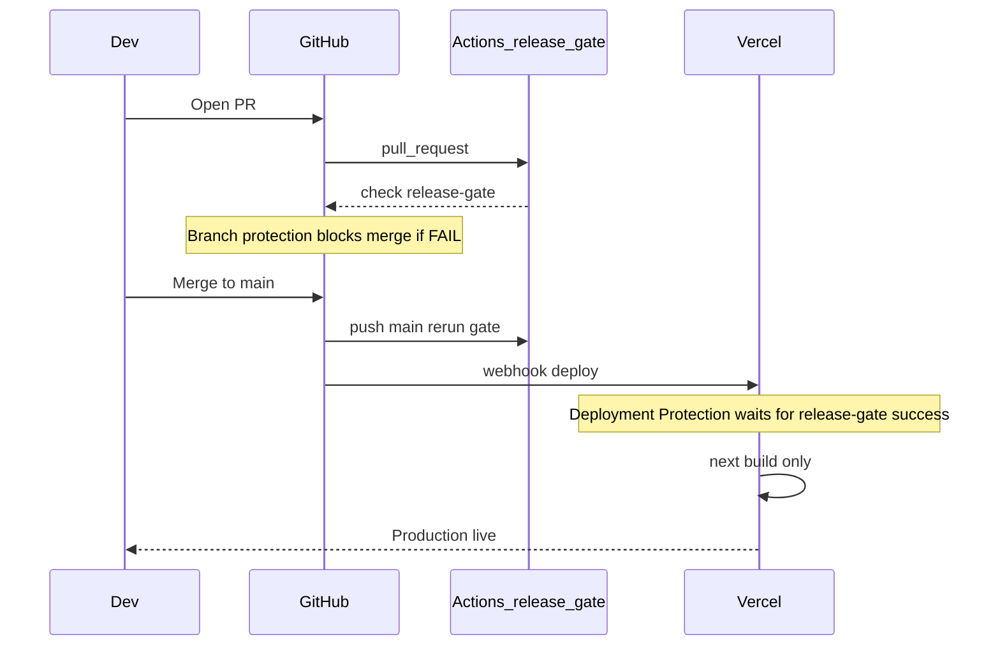

# Release gate — single authority (GitHub Actions)

**Autorità unica:** il workflow GitHub Actions `release-gate` è l’unico sistema che autorizza il rilascio in production. Vercel **non** esegue gate, `production:check`, né script di decisione build: fa solo `npm run build` (`next build`) su commit già ammessi su `main`.

Se un controllo critico fallisce in CI → check rosso → merge bloccato → production Vercel non promossa (Deployment Protection).

## Architettura gate-first



### Flusso release

```
dev branch
  → PR verso main
  → GitHub Actions: release-gate
       (ci:tsc, ci:build, ux:enforce, ux:mobile-gate, production:check + DB, smoke)
  → check verde obbligatorio per merge (branch protection)
  → merge su main
  → GitHub Actions: release-gate (re-run sul commit main)
  → Vercel: webhook deploy, attende check release-gate (Deployment Protection)
  → Vercel: npm run build (next build) — nessun gate script
  → production live
```

## Controlli attivi (solo in GitHub Actions)

| # | Comando | Cosa verifica |
|---|---------|----------------|
| 1 | `npm run ci:tsc` | `npx tsc --noEmit` |
| 2 | `npm run ci:build` | `npm run build` (Next.js) |
| 3 | `npm run ux:enforce` | `window.alert/confirm/prompt`, `useToast` fuori allowlist |
| 4 | `npm run ux:mobile-gate` | Tooltip mobile, scroll-lock modali, containment scroll, … |
| 5 | `npm run production:check` | RBAC/RLS, storage, pilot flags env+DB, legacy URL, bypass RBAC |
| 6 | `npm run smoke:structural` | Shell modali, layout app-shell, KPI report exports, kanban mobile |
| 7 | `npm run smoke:regression` | Matrice RBAC, truth invalidation, production-readiness unit |
| 8 | `npm run smoke:playwright` | Smoke runtime browser (auth, RBAC, dashboard/report, mobile shell) — SKIP senza secrets |

`production:check` aggrega (entry point logico):

- **rbac-rls**: portal `app_settings`, `user_permissions`, moduli SQL, `lib/rbac.ts`
- **storage**: bucket `documenti` privato, URL legacy DB/codice, API `resolveDocumento*`
- **pilot-flags**: `NEXT_PUBLIC_ENABLE_OPERATOR_GLOBAL_SETTINGS` + flag DB
- **legacy-urls**: pattern URL storage pubblici e `documenti.url_file` http(s)

**Non eseguiti su Vercel:** `production:check`, `ux:enforce`, `ux:mobile-gate` — il build Vercel è solo `next build`.

## Output uniforme (script gate)

```
STATUS: PASS|FAIL
BLOCKERS:
- ...
SUMMARY: <nome gate> — PASS|FAIL (N blockers)
```

## CI — workflow

File: [`.github/workflows/release-gate.yml`](../.github/workflows/release-gate.yml)

- Trigger: `pull_request` e `push` su `main` / `master`, `workflow_dispatch`
- Job: **`release-gate`** (nome per branch protection e Vercel Deployment Protection)
- Fork PR: non esegue il job (evita uso secrets da fork)

### Secrets (solo GitHub Actions)

| Secret | Uso |
|--------|-----|
| `NEXT_PUBLIC_SUPABASE_URL` | Snapshot DB production readiness |
| `NEXT_PUBLIC_SUPABASE_ANON_KEY` | Env Supabase pubblico |
| `SUPABASE_SERVICE_ROLE_KEY` | Bucket, `app_settings`, `documenti.url_file` |
| `SMOKE_ADMIN_EMAIL` / `SMOKE_ADMIN_PASSWORD` | Login smoke Playwright |
| `SMOKE_OPERATOR_EMAIL` / `SMOKE_OPERATOR_PASSWORD` | RBAC smoke (opzionale) |
| `SMOKE_DOCUMENTI_LAVORAZIONE_ID` | Upload/delete documenti smoke (opzionale) |

Vedi [`.env.smoke.example`](../.env.smoke.example) e [`.env.production.example`](../.env.production.example).

Checklist operativa completa: [`docs/ops-production-checklist.md`](./ops-production-checklist.md).

Rollout governance: [`docs/checklists/rollout-checklist.md`](./checklists/rollout-checklist.md) · Report piattaforma: [`docs/PLATFORM_STATUS_REPORT.md`](./PLATFORM_STATUS_REPORT.md).

**Vercel:** il deploy production esegue solo `next build`; tutti i gate (inclusi smoke e `production:check`) vivono su GitHub Actions. Non duplicare `SUPABASE_SERVICE_ROLE_KEY` su Vercel.

**Non** configurare questi secrets su Vercel per il gate. Senza secrets in Actions, `production:check` **FAIL** in CI. Senza `SMOKE_*`, Playwright in CI fallisce se eseguito senza skip.

## Checklist GitHub (obbligatoria)

**Settings → Branches → Branch protection rules** su `main`:

1. **Require a pull request before merging**
2. **Require status checks to pass** → **`release-gate`** (in UI: `Release Gate / release-gate`)
3. **Require branches to be up to date before merging** (consigliato)
4. **Do not allow bypassing the above settings** (disabilitare admin bypass se possibile)
5. **Restrict who can push to matching branches** (opzionale)

Senza questa configurazione, il gate in Actions esiste ma il merge/deploy può essere bypassato.

## Checklist Vercel (solo deploy, zero gate in repo)

1. Progetto collegato a GitHub; production branch = **`main`**
2. **Settings → Git → Deployment Protection** (Production):
   - Attendere **GitHub checks** sul commit deployato
   - Richiedere check **`release-gate`**
3. **Rimuovere** (se presenti) variabili usate dal vecchio gate Vercel: `GITHUB_TOKEN`, `GITHUB_REPOSITORY`
4. **Nessun** `vercel.json` con `ignoreCommand` o script gate nel repo
5. Policy team: no `vercel deploy --prod`; no redeploy production manuale senza commit su `main` con check verde

## Locale (advisory only)

```bash
npm run release:gate
```

Replica gli 8 step per sviluppo/pre-push (`smoke:playwright` SKIP senza credenziali). **Non autorizza** deploy production: solo il check GitHub `release-gate` su commit in `main` conta.

```bash
PRODUCTION_CHECK_REQUIRE_DB=1 npm run production:check
```

(con `.env.local` o variabili Supabase esportate)

## Cosa blocca il deploy su FAIL

| Meccanismo | Effetto |
|------------|---------|
| Branch protection + `release-gate` | Merge su `main` impossibile se CI FAIL su PR |
| Re-run su push `main` | Nuovo commit main deve avere check verde |
| Vercel Deployment Protection | Production attende check `release-gate` sullo SHA deployato |
| Assenza gate su Vercel | Nessun secondo giudice; nessuna duplicazione `production:check` |

## Bypass residui (solo policy)

| Vettore | Mitigazione |
|---------|-------------|
| Push diretto / force su `main` senza protection | Branch protection |
| `vercel deploy --prod` da CLI | Policy team |
| Redeploy dashboard su commit senza check | Deployment Protection + policy |
| `npm run release:gate` locale PASS | Non sostituisce CI GitHub |

## Fuori scope del gate

- `npm run lint`
- `npm run test:permissions`
- `npm run ios:check`
- Dashboard Security → Release Control (informativa)
