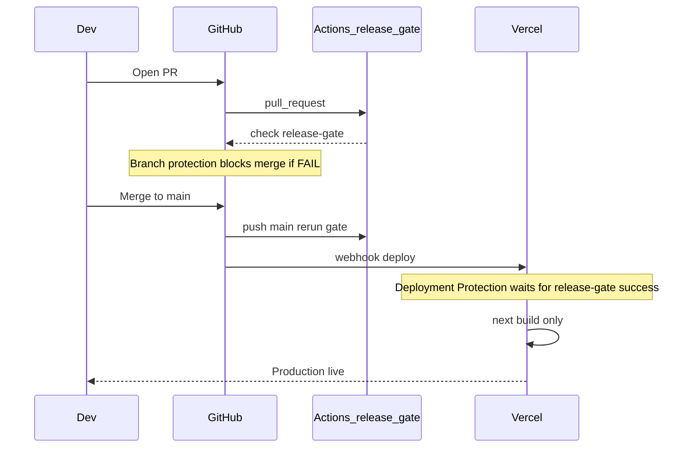

# Release gate — single authority (GitHub Actions)

**Autorità unica:** il workflow GitHub Actions `release-gate` è l’unico sistema che **blocca merge e deploy** in production. Vercel **non** esegue gate, `production:check`, né script di decisione build: fa solo `npm run build` (`next build`) su commit già ammessi su `main`.

Workflow complementari: [`release-gate-cert`](../.github/workflows/release-gate-cert.yml) (tier 2 su `main`) e [`release-gate-nightly`](../.github/workflows/release-gate-nightly.yml) (tier 3 advisory). Matrice SSOT: [`gate-matrix.md`](./gate-matrix.md). Audit: [`audit-release-gate.md`](./audit-release-gate.md).

Se un controllo critico fallisce in CI → check rosso → merge bloccato → production Vercel non promossa (Deployment Protection).

## Architettura gate-first



## Controlli attivi in CI (`release-gate`)

| # | Comando | Cosa verifica |
|---|---------|----------------|
| 1 | `npm run ci:tsc` | `npx tsc --noEmit` |
| 2 | `npm run ci:build` | `npm run build` (Next.js) |
| 3 | `npm run ux:enforce` | `window.alert/confirm/prompt`, `useToast` fuori allowlist |
| 4 | `npm run ux:mobile-gate` | Tooltip mobile, scroll-lock modali, containment scroll |
| 5 | `npm run ios:check` | Heuristics iOS/Safari (100vh, font-size, overflow) — 0 blocker richiesti |
| 6 | Verify Supabase secrets | Presenza env in Actions |
| 7 | `verify-supabase-ci-env.ts` | Connessione Supabase |
| 8 | `npm run production:check` | RBAC/RLS, storage, pilot flags env+DB, legacy URL |
| 9 | `npm run ci:supabase:publication` | Publication realtime sanity (deprecated zero; live se `SUPABASE_DB_URL`) |
| 10 | `npm run smoke:structural` | Shell modali, layout app-shell, KPI report exports |
| 11 | `npm run smoke:regression:core` | ~62 test critici (security, form/modal, sync, magazzino, gate matrix) |
| 12 | `npm run flex:eslint:gate` | Flex baseline — no nuove violazioni |
| 13 | `npm run flex:freeze:gate` | Integrità freeze flex |
| 14 | `npm run smoke:playwright` | Spec 01–12 E2E chromium |
| 15 | `npm run smoke:playwright:ios-smoke` | Spec 13 subset iOS WebKit (1 test) |
| 16 | `npm run smoke:playwright:ricambio:smoke` | Spec 14 Nuovo Ricambio smoke |

`production:check` aggrega: **rbac-rls**, **storage**, **pilot-flags**, **legacy-urls**, **ops-env**.

### Regression tiers

| Script | Uso |
|--------|-----|
| `smoke:regression:core` | PR gate (57 file) — SSOT [`smoke-regression-lists.ts`](../lib/regression/smoke-regression-lists.ts) |
| `smoke:regression:extended` | Cert workflow (46 file) — flex/ui-os/layout advisory |
| `smoke:regression` | Core + extended (locale pre-release) |

**Non eseguiti su Vercel:** tutti i gate sopra — build Vercel = `next build` only.

## Workflow `release-gate-cert` (tier 2)

- Trigger: `push` su `main`/`master`, schedule lunedì 03:00 UTC, `workflow_dispatch`
- `smoke:regression:extended`
- `ci:supabase:publication:full` (blocking)
- `ops:long-session-soak:threshold` (~6 min)
- `audit:supabase` (advisory, `continue-on-error`)
- `smoke:playwright:cert` — spec 13 × 4 progetti
- `smoke:playwright:ricambio:cert` — spec 14 desktop + iOS

Richiedere come check su `main` in branch protection (oltre a `release-gate` su PR).

## Workflow `release-gate-nightly` (tier 3)

- Trigger: cron giornaliero 02:00 UTC, `workflow_dispatch`
- `npm run lint`, `smoke:regression` full, `ops:long-session-soak` extended — **non blocking**

## Output uniforme (script gate)

```
STATUS: PASS|FAIL
BLOCKERS:
- ...
SUMMARY: <nome gate> — PASS|FAIL (N blockers)
```

## CI — file workflow

- PR/main blocking: [`.github/workflows/release-gate.yml`](../.github/workflows/release-gate.yml)
- Cert: [`.github/workflows/release-gate-cert.yml`](../.github/workflows/release-gate-cert.yml)
- Nightly: [`.github/workflows/release-gate-nightly.yml`](../.github/workflows/release-gate-nightly.yml)

- Trigger: `pull_request` e `push` su `main` / `master`, `workflow_dispatch`
- Job: **`release-gate`**
- Fork PR: job saltato (no secrets)

### Secrets (GitHub Actions)

| Secret | Uso |
|--------|-----|
| `NEXT_PUBLIC_SUPABASE_URL` | DB snapshot production readiness |
| `NEXT_PUBLIC_SUPABASE_ANON_KEY` | Env Supabase pubblico |
| `SUPABASE_SERVICE_ROLE_KEY` | Bucket, `app_settings`, `documenti.url_file` |
| `SMOKE_ADMIN_EMAIL` / `SMOKE_ADMIN_PASSWORD` | Login smoke Playwright |
| `SMOKE_OPERATOR_EMAIL` / `SMOKE_OPERATOR_PASSWORD` | RBAC smoke |
| `SMOKE_DOCUMENTI_LAVORAZIONE_ID` | Upload/delete documenti smoke |
| `SUPABASE_DB_URL` | Publication live check (`pg_publication_tables`) — opzionale in PR (`PUBLICATION_CHECK_STRICT=0`) |

Vedi [`.env.smoke.example`](../.env.smoke.example). Checklist: [`ops-production-checklist.md`](./ops-production-checklist.md).

Senza secrets Supabase, `production:check` **FAIL** in CI. Senza `SMOKE_*`, Playwright **FAIL** in CI (secrets obbligatori nel workflow).

## Locale (advisory only)

```bash
npm run release:gate
```

Replica i step critici. Senza secrets Supabase: verify/production **SKIP**. Senza `SMOKE_*`: Playwright **SKIP** (non equivale a CI verde).

```bash
PRODUCTION_CHECK_REQUIRE_DB=1 npm run production:check
npm run smoke:regression          # core + extended
npm run smoke:regression:core     # solo tier PR
npm run smoke:playwright:cert     # spec 13 mobile
```

## Fuori scope del gate PR

- `npm run lint` (nightly advisory)
- `npm run test:permissions`
- `smoke:regression:extended` (cert / nightly)
- `smoke:playwright:cert`, `smoke:playwright:ricambio:cert` (cert workflow)
- `ci:supabase:publication:full` (cert)
- `ops:long-session-soak` full (nightly), `ops:diagnostics`
- Dashboard Security → Release Control (informativa)

Audit completo: [`audit-release-gate.md`](./audit-release-gate.md).

## Branch protection (obbligatoria)

Settings → Branches → `main`: require check **`release-gate`**.

## Vercel

Production attende check `release-gate` sullo SHA deployato. Nessun gate script su Vercel.
