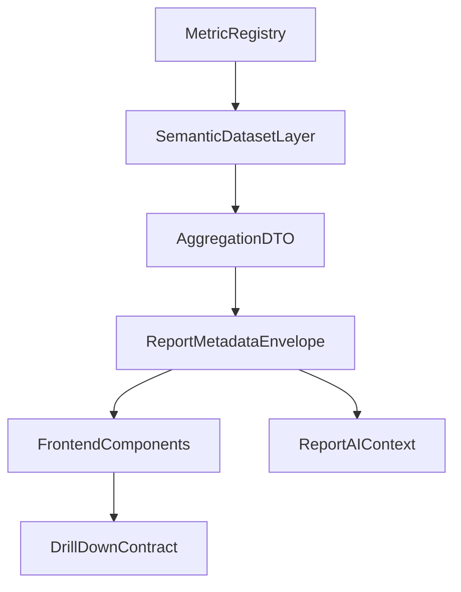

# Report V2 — Implementation Plan

**Versione:** 1.0.0  
**Data:** 2026-07-19  
**Stato:** Piano esecutivo Sprint 0–5 (documentazione only)  
**Ruolo:** Come realizzare la migrazione — ordine, controlli, file, test

---

## Sequenza documentale

```
Audit Report
      ↓
Metric Catalog (78)
      ↓
UX Blueprint
      ↓
Technical Design ✅
      ↓
Metric Migration Map ✅
      ↓
Implementation Plan ← questo documento
      ↓
Sprint 0–5 implementativi
```

| Documento | Domanda |
|-----------|---------|
| [report-v2-technical-design.md](report-v2-technical-design.md) | Cosa deve esistere e quali vincoli architetturali valgono |
| [report-v2-metric-migration-map.md](report-v2-metric-migration-map.md) | Cosa cambia, cosa resta, cosa viene deprecato |
| **Implementation Plan** | In quale ordine e con quali controlli realizzare la migrazione |

**Fonti obbligatorie:** Technical Design, Migration Map, [report-v2-priorities.md](report-v2-priorities.md), [report-analytics-catalog.json](report-analytics-catalog.json), [report-analytics-audit.md](report-analytics-audit.md).

**Prerequisito soddisfatto:** [Migration Map Validation Gate §12](report-v2-metric-migration-map.md#12-migration-map-validation-gate) (tutti ✓).

### Input obbligatori (derivazione)

| Fonte | Utilizzo in questo piano |
|-------|--------------------------|
| [report-v2-technical-design.md](report-v2-technical-design.md) | ADR 001–007, semantic datasets, API, envelope, trust, quality gates §11 |
| [report-v2-metric-migration-map.md](report-v2-metric-migration-map.md) | §2 master (78 metriche), §9 parity, §10 UI, §11 rollout P0–P3 |
| [report-v2-priorities.md](report-v2-priorities.md) | P0.1–P3, complessità, dipendenze |
| [report-analytics-catalog.json](report-analytics-catalog.json) | priority, calculationLayer, owner |
| [report-analytics-audit.md](report-analytics-audit.md) | baseline regressioni, duplicazioni KPI |

**Fuori scope:** modifiche a `lib/**`, `components/**`, registry, API, test, configurazioni runtime.

---

# PARTE A — Preparazione

## 0. Scope, principi e vincoli

### 0.1 Principi

1. **Evoluzione incrementale** (ADR-REPORT-001) — nessun rewrite parallelo.
2. **Metric Registry = SSOT formule** (ADR-REPORT-002) — UI e API consumano DTO, non ricalcolano.
3. **RBAC pre-DTO** (ADR-REPORT-006) — filtro server prima dell'aggregazione.
4. **Observability obbligatoria** (ADR-REPORT-007) — metriche P0/executive monitorate prima di `active`.
5. **Feature flag per ogni superficie V2** — rollback senza deploy.
6. **Sprint 0 = foundation gate** — Sprint 1+ bloccato fino a contratti, fixture, flag.

### 0.2 Ordine implementazione obbligatorio

```
Contracts
  ↓
Semantic datasets
  ↓
Aggregation DTO
  ↓
Envelope + Trust
  ↓
Parity tests
  ↓
UI migration
  ↓
Drill-down
  ↓
Insights
  ↓
AI Context
```

**Vietato:** iniziare da componenti React o modificare sezioni prima che contratti DTO e parity fixtures esistano.

### 0.3 Metric governance (da Migration Map)

| Regola | Dettaglio |
|--------|-----------|
| SSOT fatturato | `eco_fatturato` canonico; `eco_invoices` legacy (`contractImpact: major`) |
| Lifecycle alias | `active → deprecated → archived` — nessuna rimozione diretta |
| Executive row | 6 card: `lav-chiusi`, `lav-aperti`, `lav_late_sla`, `eco_fatturato`, `eco_da_incassare`, `scorta` |
| entityType | Sezioni/componenti UI non entrano nel Metric Registry |

### 0.4 Contract versioning

- Header: `Accept: application/vnd.report.v2+json`
- Ogni DTO: `contractVersion: "2.0"` + `ReportMetadataEnvelope`
- Breaking change solo con `contractImpact: major` documentato in Migration Map §9

### 0.5 Riconciliazione numerazione sprint (vs Technical Design §10)

| Implementation Plan | Technical Design |
|--------------------|------------------|
| Sprint 0 Foundation | Parte iniziale TD Sprint 1 (contratti, fixture, flag) |
| Sprint 1 Semantic Layer | TD Sprint 1 (datasets, envelope) |
| Sprint 2 Executive + Core KPI | TD Sprint 2 |
| Sprint 3 Domain + Cross | TD Sprint 2–3 |
| Sprint 4 Insight Engine | TD Sprint 4 |
| Sprint 5 AI + Rollout | TD Sprint 5 + avvio pipeline P2 |

---

## 1. Stato baseline V1

Derivato da [report-analytics-audit.md](report-analytics-audit.md).

| Area | Stato attuale | Rischio V2 |
|------|---------------|------------|
| Sezioni | 8 accordion (`report-sections-config.ts`) | RBAC, bookmark URL |
| KPI duplicati | `lav_open`/`lav-aperti`, `scorta`/`mag_critical`, ecc. | Numeri divergenti |
| Calcolo KPI | Sparso in `build-report-model.ts`, `build-kpi-performance-model.ts`, section components | Logica UI ≠ SSOT |
| API report | Solo `analysis`, `manual-entries/import` | 7 endpoint TD da creare |
| Executive | `report-executive-kpi-section.tsx` | Nessun drill-down contract |
| Trust | `report-integrity-audit.ts`, badge parziale | Trust non su ogni DTO |
| AI | `build-report-analysis-context.ts` v1 | Context incompleto vs catalog |

**Registry V1:** 37 `metricId` in `lib/report/metrics/report-metric-registry.ts`.

**Catalog V2:** 78 metriche in `docs/report-analytics-catalog.json`.

### 1.1 Codebase baseline (path reali)

| Componente | Path attuale | Stato |
|------------|--------------|-------|
| Registry | `lib/report/metrics/report-metric-registry.ts` | 37 id V1 |
| Sezioni | `components/report/report-sections-config.ts` | 8 sezioni V1 |
| Orchestratore | `components/report/report-analytics-view.tsx` | client compute |
| Executive | `components/report/layout/report-executive-kpi-section.tsx` | da sostituire S2 |
| KPI model | `lib/report/build-report-model.ts` | logica sparsa |
| Performance KPI | `lib/report/kpi-performance/build-kpi-performance-model.ts` | logica sparsa |
| Cross analytics | `lib/report/report-domain-analytics.ts` | client derived |
| AI context | `lib/report/report-analysis/build-report-analysis-context.ts` | v1 |
| AI API | `app/api/report/analysis/route.ts` | esistente |
| Integrity | `lib/report/report-integrity-audit.ts` | parziale |

**API report esistenti:** `analysis`, `manual-entries/import` — **7 endpoint TD da creare** (vedi §3.1).

**Cartelle da creare (Sprint 0–4):** `lib/report/contracts/`, `lib/report/datasets/`, `lib/report/insights/`, `components/report/executive/`, `components/report/insight-strip/`.

### 1.2 Endpoint API target (Technical Design §4)

| Endpoint | Sprint | RBAC modulo |
|----------|--------|-------------|
| `GET /api/report/executive` | 2 | per card dominio |
| `GET /api/report/lavorazioni` | 1 | lavorazioni |
| `GET /api/report/magazzino` | 1 | magazzino |
| `GET /api/report/economico` | 1 | fatturazione |
| `GET /api/report/ore` | 1 | dipendenti |
| `GET /api/report/clienti` | 1 | mezzi/lavorazioni |
| `GET /api/report/cross-analysis` | 3 | multi |
| `GET /api/report/ai-context` | 5 | per dominio visibile |

---

## 2. Dependency graph

```
Metric Registry
       ↓
Semantic Dataset Layer
       ↓
Aggregation DTO
       ↓
ReportMetadataEnvelope
       ↓
Frontend Components
       ↓
Drill-down
       ↓
AI Context
```



### 2.1 Vincoli di import (verificabili in CI)

| Layer | Può importare | Non può importare |
|-------|---------------|-------------------|
| Metric Registry | formule, tipi metrica | React, API routes |
| Semantic Datasets | registry, selectors DB, integrity | componenti React |
| Aggregation DTO | datasets, registry definitions | JSX |
| API routes | aggregation, RBAC, envelope | componenti React |
| Frontend Components | DTO tipizzati, drill-down refs | **formule KPI, registry compute diretto** |
| AI Context | envelope DTO aggregati | accesso DB diretto |

> **Regola:** i componenti React non possono importare formule KPI o registry direttamente.

---

## 3. Feature flags e rollout controls

**Path proposto:** `lib/feature-flags/report-v2-flag.ts`

| Flag | Scope | Default | Sprint |
|------|-------|---------|--------|
| `reportV2Contracts` | Tipi contratto + envelope | off | 0 |
| `reportV2Datasets` | Semantic dataset layer | off | 1 |
| `reportV2Executive` | ReportExecutiveRow | off | 2 |
| `reportV2Sections` | Ristrutturazione sezioni | off | 2 |
| `reportV2DomainDto` | Sezioni dominio su DTO | off | 3 |
| `reportV2Insights` | InsightStrip | off | 4 |
| `reportV2AiContext` | ReportAIContext v2 | off | 5 |

### Rollout sequence

1. **Staging** — tutti i flag on; parity + RBAC audit
2. **Canary** — admin / responsabile officina
3. **Produzione** — flag on progressivo per layer
4. **Rollback** — flag off layer-by-layer; adapter V1 per alias deprecated; nessuna migrazione dati

### 3.1 Endpoint rollout per flag

| Flag on | Endpoint abilitati |
|---------|-------------------|
| `reportV2Datasets` | lavorazioni, magazzino, economico, ore, clienti |
| `reportV2Executive` | executive |
| `reportV2DomainDto` | cross-analysis |
| `reportV2AiContext` | ai-context |

---

# PARTE B — Sprint implementation

Ogni sprint include i **9 campi obbligatori**: Obiettivo, Scope incluso, Scope escluso, metricId, File, migrationStatus, Test, Rollback, Definition of Done.

### Ordine trasversale (vietato invertire)

```
NO UI
  → Metric contracts + registry hardening     (Sprint 0)
  → Dataset adapters + envelope               (Sprint 1)
  → Parity tests                              (Sprint 0–2)
  → UI migration                              (Sprint 2+)
  → Drill-down                                (Sprint 2+)
  → Insight                                   (Sprint 4)
  → AI Context                                (Sprint 4.5.1)
  → Narrative Layer                           (Sprint 5A → 5B → 5C)
```

**Durata stimata totale:** 16–22 settimane (Sprint 0–5).

---

### Sprint 0 — Foundation (gate obbligatorio)

**Durata:** 2–3 settimane. **Blocca Sprint 1+** fino a completamento.

| Area | Task tecnico |
|------|--------------|
| Registry | Deprecare alias V1; redirect adapter; registrare `eco_fatturato`; lifecycle fields |
| Contracts | `lib/report/contracts/` — `ReportMetadataEnvelope`, `KpiMetricDto`, `DrillDownRef`, `contractVersion: "2.0"` |
| Observability | Scaffold metric health logging in aggregation layer (ADR-007) |
| Fixtures | `lib/report/__tests__/fixtures/` — period-lavorazioni, magazzino-scorta, invoices-period |
| Feature flags | `lib/feature-flags/report-v2-flag.ts` + unit test |
| Control plane | Gate `report.v2.contracts` in tier `control:pr` |

| Campo | Dettaglio |
|-------|-----------|
| **Obiettivo** | Congelare contract version, registry hardening, parity fixtures, observability scaffold, feature flags — zero UI visibile. |
| **Scope incluso** | Deprecazione alias V1; registrazione `eco_fatturato`; `lib/report/contracts/`; fixtures parity; `report-v2-flag.ts`; gate control plane `report.v2.contracts`. |
| **Scope escluso** | Executive Row, sezioni UI, API business complete, Insight, AI. |
| **metricId coinvolti** | `lav_open`, `lav_completed`, `lav_avg_close`, `lav_clients`, `mag_critical`, `lav-saldo-periodo`, `lav_backlog`, `mag_parts_qty`, `eco_invoices`, `lav_archived`; registrazione `eco_fatturato` |
| **File interessati** | `lib/report/metrics/report-metric-registry.ts`, `lib/report/contracts/*` (new), `lib/report/__tests__/fixtures/*` (new), `lib/feature-flags/report-v2-flag.ts` (new), `lib/control/` |
| **migrationStatus richiesto** | Alias V1 → `deprecated` con replacement; `eco_fatturato` → `active` |
| **Test richiesti** | Contract compile; fixture load; flag unit; registry lifecycle |
| **Rollback** | Nessun flag on; zero impatto UI |
| **Definition of Done** | Contratti definiti; 10 alias deprecated; fixture parity esistenti; flag testati; Sprint 1 sbloccato |

---

### Sprint 1 — Semantic Layer + Envelope

**Durata:** 3–4 settimane. **Priorities:** foundation dati per P0.

| Campo | Dettaglio |
|-------|-----------|
| **Obiettivo** | Semantic Dataset Layer (6 domini), metadata envelope, trust/freshness, API stub con RBAC pre-DTO. |
| **Scope incluso** | `lib/report/datasets/`; `generatedAt`/`sourceFreshness`; trust da `report-integrity-audit.ts`; stub GET lavorazioni/magazzino/economico/ore/clienti. |
| **Scope escluso** | Executive UI, InsightStrip, AI, RPC/MV/BG. |
| **metricId coinvolti** | P0 client-layer: `lav-periodo`, `lav-chiusi`, `lav-aperti`, `lav-tempo`, `lav_late_sla`, `scorta`, `ric-usati`, `mag_movement_value`, `ore_total`, `cost-tot`, `eco_preventivi`, `clienti`, `cross_efficiency`, `cross_parts_job`, `cross_cost_job`, `cross_value_hour` |
| **File interessati** | `lib/report/datasets/*` (new), `lib/report/contracts/envelope.ts`, `app/api/report/lavorazioni/route.ts` (new), `magazzino/`, `economico/`, `ore/`, `clienti/` (new), `lib/report/report-integrity-audit.ts` |
| **migrationStatus richiesto** | P0 → `mantenuta` o `unificata`; DTO layer pronto |
| **Test richiesti** | Dataset unit; freshness; trust propagation; RBAC 403; contractVersion |
| **Rollback** | `reportV2Datasets=false` |
| **Definition of Done** | Ogni dataset P0 restituisce DTO + envelope; RBAC pre-DTO; nessun React nuovo |

---

### Sprint 2 — Executive Row + Core KPI

**Durata:** 4–5 settimane. **Priorities:** P0.1, P0.2, P0.3, P0.12.

| Campo | Dettaglio |
|-------|-----------|
| **Obiettivo** | ReportExecutiveRow 6 card, dedup KPI P0, ristrutturazione sezioni, drill-down contract, rename `eco_fatturato`. |
| **Scope incluso** | `GET /api/report/executive`; `components/report/executive/`; dedup alias UI; rimozione `grafici_kpi`; 6 sezioni + ANALISI IA; parity regression unificazioni. |
| **Scope escluso** | InsightStrip, AI narrativa, pipeline RPC P2, dominio P1 esteso. |
| **metricId coinvolti** | Executive: `lav-chiusi`, `lav-aperti`, `lav_late_sla`, `eco_fatturato`, `eco_da_incassare`, `scorta`; P0.1–P0.3 |
| **File interessati** | `components/report/executive/ReportExecutiveRow.tsx` (new), `app/api/report/executive/route.ts` (new), `components/report/report-sections-config.ts`, `components/report/layout/report-executive-kpi-section.tsx`, `components/report/report-unified-kpi-grid.tsx`, `components/report/report-analytics-view.tsx` |
| **migrationStatus richiesto** | Executive: `mantenuta`/`unificata`/`rinominata`; `eco_da_incassare` parity pass prima card live |
| **Test richiesti** | Drill-down 6 card; KPI regression; RBAC executive; dedup audit (0 alias UI) |
| **Rollback** | `reportV2Executive=false` + `reportV2Sections=false` |
| **Definition of Done** | 6 card + drill-down; envelope su executive DTO; 0 KPI duplicati P0; parity pass |

---

### Sprint 3 — Domain Analytics + Cross Analysis

**Durata:** 3–4 settimane. **Priorities:** P0.4–P0.9, P1.1–P1.15.

| Campo | Dettaglio |
|-------|-----------|
| **Obiettivo** | Sezioni dominio su DTO, aging backlog, crediti, cross prefetch obbligatorio, fleet ottimizzata. |
| **Scope incluso** | Lavorazioni aging/trend; magazzino (+ `cap` spostato); economico crediti; cross 4 KPI; `GET /api/report/cross-analysis`; prefetch derived. |
| **Scope escluso** | Insight engine, AI Gemini, RPC/MV production. |
| **metricId coinvolti** | `lav_aging_backlog`, `lav_andamento_mensile`, `eco_scadute`, `fleet_disponibilita_cliente`, cross P0; tutte le metriche P1 catalog |
| **File interessati** | `components/report/sections/report-*-section.tsx`, `lib/report/report-domain-analytics.ts`, `lib/report/prefetch-report-economic-queries.ts`, `app/api/report/cross-analysis/route.ts` (new) |
| **migrationStatus richiesto** | `lav_aging_backlog` → `sostituita` (major); crediti → `pending_validation` → `mantenuta` post-parity |
| **Test richiesti** | Cross prefetch; aging delta doc; eco parity; fleet perf+parity; 5k lav staging |
| **Rollback** | `reportV2DomainDto=false` |
| **Definition of Done** | Cross senza expand manuale; aging live; crediti parity; sezioni su DTO |

---

### Sprint 4 — Insight Engine

**Durata:** 2–3 settimane. **Priorities:** P0.10, P1.1.

| Campo | Dettaglio |
|-------|-----------|
| **Obiettivo** | 25 regole deterministiche P0, InsightStrip max 5, payload insight per AI. |
| **Scope incluso** | `lib/report/insights/`; `components/report/insight-strip/InsightStrip.tsx`; drill-down da insight. |
| **Scope escluso** | Narrativa Gemini; `insight_*` in registry. |
| **metricId coinvolti** | Nessun metricId registry nuovo; input da executive + dominio P0 (Migration Map §8.3) |
| **File interessati** | `lib/report/insights/*` (new), `components/report/insight-strip/*` (new), `components/report/report-analytics-view.tsx` |
| **migrationStatus richiesto** | Insight-derived: non-registry fino a validazione |
| **Test richiesti** | Rule unit 25 P0; max 5 insight; drill-down link |
| **Rollback** | `reportV2Insights=false` |
| **Definition of Done** | ≥80% insight P0 con drill-down; strip sotto executive |

---

### Sprint 5 — ReportAIContext + Narrative Layer + Production Rollout

**Durata:** 2–3 settimane. **Priorities:** P1.16–P1.19, P2 pipeline kickoff, P3.1.

**Entry checklist (obbligatoria):** [`docs/report-v2-sprint5-entry-checklist.md`](report-v2-sprint5-entry-checklist.md)

Sprint 5 è suddiviso in tre fasi sequenziali. **Evitare `route → Gemini` nello stesso sprint iniziale.**

#### Sprint 5A — Contracts + API

| Campo | Dettaglio |
|-------|-----------|
| **Obiettivo** | Contratti narrativi versionati + API `ReportAIContextDto` (senza provider LLM). |
| **Scope incluso** | `lib/report/narrative/types.ts`; `NarrativePromptContext` (`NARRATIVE_PROMPT_CONTEXT_VERSION = "1"`); `GeneratedNarrativeDto` (explanatory only); `build-narrative-prompt-context.ts`; `GET /api/report/ai-context` (espone `ReportAIContextDto`, non invoca Gemini). |
| **Scope escluso** | Gemini adapter; chiamate LLM; quality gate narrativo. |
| **File interessati** | `lib/report/narrative/types.ts`, `lib/report/narrative/build-narrative-prompt-context.ts`, `app/api/report/ai-context/route.ts` (new) |
| **Test richiesti** | `narrative-import-boundary.test.ts`; narrative-contract schema; presentation-leak |
| **Gate** | `governance.report.v2.narrative-contract` (`dependsOn: ai-context`) |
| **Rollback** | `reportV2AiContext=false` |

#### Sprint 5B — Provider

| Campo | Dettaglio |
|-------|-----------|
| **Obiettivo** | Provider adapter sostituibile (Gemini) senza cambiare DTO. |
| **Scope incluso** | `lib/report/narrative/providers/gemini-adapter.ts`; rate limit; RBAC AI |
| **Scope escluso** | Quality validation output; rollout produzione |
| **File interessati** | `lib/report/narrative/providers/gemini-adapter.ts`, `lib/report/report-analysis/report-analysis-service.server.ts` |
| **Test richiesti** | Provider adapter mock; RBAC AI; token/rate limit |
| **Gate** | `governance.report.v2.narrative-provider` (`dependsOn: narrative-contract`) |
| **Rollback** | feature flag provider off |

#### Sprint 5C — Quality + Rollout

| Campo | Dettaglio |
|-------|-----------|
| **Obiettivo** | Output validation, no KPI/severity drift, rollout produzione. |
| **Scope incluso** | Quality tests (AI non modifica KPI, severity, metricIds); `build-report-analysis-context.ts` composizione legacy in `NarrativePromptContext`; ANALISI IA enriched; monitoring; max 3 RPC + 2 views P2 |
| **Scope escluso** | Big-bang MV/BG; rimozione adapter V1 (post 1+ release) |
| **metricId coinvolti** | Tutte le metriche P2/P3 catalog: `km_trend`, `rotazione_stock`, `lead_time_ordini`, `dso`, `funnel_preventivi`, `ar_aging`, `cross_anomaly_volume`, `mezzi`, ecc. |
| **File interessati** | `lib/report/report-analysis/build-report-analysis-context.ts`, `report-analysis-schema.ts`, `components/report/sections/report-ai-section.tsx` |
| **migrationStatus richiesto** | Alias V1 → `archived` post-compatibilità; P2 → `pending_validation` → parity |
| **Test richiesti** | narrative-quality (no KPI derivati, no severity drift); AI schema CI; release checklist D |
| **Gate** | `governance.report.v2.narrative-quality` (`dependsOn: narrative-contract + narrative-provider`) |
| **Rollback** | `reportV2AiContext=false` |
| **Definition of Done** | AI RBAC-safe; schema CI; rollout checklist; monitoring attivo |

**Legacy migration:** `ReportAnalysisContext` (KPI/trend aggregati) e `ReportAIContextDto` (segnali decisionali) possono essere composti in `NarrativePromptContext` — non sostituiti l'uno con l'altro. `InsightDto` resta escluso dal flusso AI.

---

# PARTE C — Delivery governance

## 4. Quality gates per sprint

| Gate | Cosa verifica | Sprint |
|------|---------------|--------|
| Contract versioning | `contractVersion: "2.0"` su DTO | 0–2 |
| KPI parity / regression | Unificazioni §9 Migration Map | 2–3 |
| RBAC pre-DTO | 403 o DTO assente | 1–5 |
| Trust propagation | `trustStatus` su envelope | 1–2 |
| Freshness metadata | `generatedAt` + `sourceFreshness` | 1–2 |
| Drill-down contract | KPI P0/executive con target | 2+ |
| AI schema validation | Zod + `contractVersion` su narrative DTO | 5A–5C |
| Narrative quality | no KPI/severity drift; GeneratedNarrativeDto non autorevole | 5C |
| Large dataset perf | 5k lav → executive < 3s | 3 staging |
| Metric observability | execution_time, error_rate (ADR-007) | 2+ |

Integrazione: `lib/report/__tests__/`, `lib/regression/`, `docs/control-plane/README.md`.

## 5. Migration checklist (contractImpact major)

| metricId | Migrazione | Azione sprint |
|----------|------------|---------------|
| `eco_fatturato` | `eco_invoices` → rename | S0 registry; S2 adapter + parity |
| `lav_aging_backlog` | `lav-saldo-periodo` → sostituita | S3 UI + delta release notes |

## 6. Rollback plan

| Layer | Azione |
|-------|--------|
| Feature flag | Off per layer isolato |
| API v2 | Route non chiamate; client V1 |
| Registry alias | Adapter redirect |
| UI | Componenti V1 dietro flag |
| Dati | Nessuna migrazione DB |

## 7. Monitoring (ADR-REPORT-007)

| Segnale | Soglia P0 | Health |
|---------|-----------|--------|
| `execution_time_ms` | >500ms | YELLOW |
| `error_rate` | >0% | RED |
| `freshness_lag_sec` | > SLA dataset | YELLOW |

## 8. Definition of Done globale

Merge sprint consentito solo se:

- [ ] Tutti i test dello sprint passano in CI
- [ ] `migrationStatus` richiesto raggiunto per metricId dello sprint
- [ ] Nessuna formula KPI nuova in componenti React
- [ ] RBAC audit su route e sezioni toccate
- [ ] Feature flag documentato con default off
- [ ] Control plane tier appropriato (`control:pr` minimo)

## 9. Implementation Plan Validation Gate

**PASS obbligatorio prima di avviare Sprint 0 in codice:**

| # | Criterio | Stato |
|---|----------|-------|
| 1 | Technical Design completato | ✓ |
| 2 | Migration Map §12 valido | ✓ |
| 3 | Implementation Plan pubblicato | ✓ |
| 4 | Sprint 0 task e file ownership definiti | ✓ |
| 5 | 78 metriche mappate ad appendice A | ✓ |
| 6 | Quality gates mappati per sprint | ✓ |
| 7 | Rollback plan per ogni sprint | ✓ |
| 8 | Feature flags definiti | ✓ |

---

# Appendice A — Sprint → metricId mapping (78 metriche)

| Sprint | v2MetricId | priority | note |
|--------|------------|----------|------|
| 1 | `lav-periodo` | P0 | DTO foundation |
| 2 | `lav-chiusi` | P0 | executive |
| 2 | `lav-aperti` | P0 | executive |
| 2 | `lav-tempo` | P0 | — |
| 3 | `lav-media-settimanale` | P1 | — |
| 3 | `lav_cancelled` | P2 | — |
| 2 | `lav_late_sla` | P0 | executive |
| 3 | `lav_recidiva` | P1 | — |
| 3 | `lav_heatmap_annuale` | P1 | — |
| 3 | `top_mezzi_interventi` | P1 | — |
| 3 | `lav_andamento_mensile` | P1 | P0.5 |
| 3 | `lav_aging_backlog` | P1 | P0.4 major |
| 3 | `lav_median_close` | P2 | P1.2 |
| 3 | `lav_by_priorita` | P2 | P1.3 |
| 3 | `lav_by_stato` | P2 | — |
| 5 | `lav_mttr` | P2 | P2.3 |
| 5 | `lav_mtbf` | P2 | P2.3 |
| 2 | `clienti` | P0 | — |
| 3 | `flotta-officina` | P1 | — |
| 5 | `mezzi` | P3 | P3 cleanup CLIENTI |
| 3 | `cap` | P1 | UI spostata MAGAZZINO |
| 3 | `fleet_disponibilita_cliente` | P0 | P0.8 pending_validation |
| 5 | `guasti_per_tipo_attrezzatura` | P2 | — |
| 3 | `tempo_fermo_medio` | P1 | — |
| 3 | `frequenza_guasti_alta` | P1 | — |
| 3 | `top_clienti_interventi` | P1 | — |
| 3 | `clienti_redditivita` | P1 | P1.8 |
| 5 | `compliance_scadenze` | P1 | view P1.10 |
| 5 | `pareto_clienti_interventi` | P2 | P2.6 |
| 5 | `km_trend` | P2 | RPC P2.15 |
| 5 | `fleet_disponibilita_trend` | P2 | BG P2.11 |
| 2 | `scorta` | P0 | executive |
| 2 | `ric-usati` | P0 | — |
| 2 | `mag_movement_value` | P0 | — |
| 3 | `mag_orders` | P2 | — |
| 3 | `mag_movimenti_mensili` | P1 | — |
| 3 | `mag_top_ricambi` | P1 | — |
| 3 | `giorni_copertura` | P1 | P1.7 |
| 5 | `margine_ricambio` | P2 | P2.8 |
| 5 | `lead_time_ordini` | P2 | RPC P2.7 |
| 5 | `rotazione_stock` | P2 | MV P2.12 |
| 2 | `ore_total` | P0 | — |
| 3 | `ore_per_job` | P1 | — |
| 5 | `ore_per_dipendente` | P1 | RPC P0.13 |
| 3 | `ore_straordinari` | P1 | — |
| 5 | `ore_assenze` | P2 | — |
| 3 | `manodopera_cost` | P1 | P1.11 |
| 5 | `gap_schede_timesheet` | P2 | P2.9 |
| 5 | `saturazione_team` | P2 | P2.5 |
| 2 | `cost-tot` | P0 | — |
| 2 | `eco_preventivi` | P0 | — |
| 3 | `eco_preventivi_approvati` | P1 | — |
| 2 | `eco_fatturato` | P0 | executive; rename da eco_invoices |
| 3 | `eco_ddt` | P2 | — |
| 3 | `eco_valore_medio_intervento` | P1 | — |
| 3 | `eco_margine_operativo_stimato` | P1 | — |
| 2 | `eco_da_incassare` | P0 | executive; parity prima live |
| 3 | `eco_scadute` | P0 | P0.6 |
| 3 | `fatturato_mensile` | P1 | — |
| 3 | `top_clienti_fatturato` | P1 | — |
| 3 | `win_rate_preventivi` | P1 | P1.5 |
| 5 | `funnel_preventivi` | P1 | view |
| 5 | `ar_aging` | P1 | view P1.4 |
| 5 | `dso` | P1 | RPC P2.2 |
| 3 | `preventivo_vs_consuntivo` | P1 | P1.15 |
| 5 | `mix_righe_fattura` | P2 | RPC P2.14 |
| 3 | `top_mezzi_costo` | P1 | P1.6 |
| 5 | `preventivi_billing_residuo` | P1 | view P2.13 |
| 3 | `cross_efficiency` | P0 | P0.9 |
| 3 | `cross_parts_job` | P0 | P0.9 |
| 3 | `cross_cost_job` | P0 | P0.9 |
| 3 | `cross_value_hour` | P0 | P0.9 |
| 5 | `cross_matrix_ore_ricambi` | P2 | — |
| 5 | `cross_sankey_preventivo_incasso` | P2 | P2.1 |
| 3 | `cross_scatter_costo_fatturato_cliente` | P1 | — |
| 5 | `cross_scatter_ore_ricambi` | P2 | P2.4 |
| 5 | `cross_anomaly_volume` | P2 | BG P3.1 |
| 5 | `cross_matrix_cliente_metriche` | P2 | — |

**Sprint 0 (alias deprecated, non in catalog):** `lav_open`, `lav_completed`, `lav_avg_close`, `lav_clients`, `mag_critical`, `lav-saldo-periodo`, `lav_backlog`, `mag_parts_qty`, `eco_invoices`, `lav_archived`.

---

# Appendice B — File ownership map

| Area | Path | Owner | Sprint |
|------|------|-------|--------|
| Metric Registry | `lib/report/metrics/` | Report Platform | 0 |
| Contracts | `lib/report/contracts/` | Report Platform | 0–1 |
| Semantic Datasets | `lib/report/datasets/` | Report Platform | 1 |
| Aggregation | `lib/report/report-derived-engine.ts`, `build-report-model.ts` | Report Platform | 1–3 |
| API routes | `app/api/report/` | Report Platform | 1–5 |
| UI orchestrator | `components/report/report-analytics-view.tsx` | Report Platform | 2–4 |
| UI sections | `components/report/sections/` | Report Platform | 2–3 |
| Executive | `components/report/executive/` | Report Platform | 2 |
| Insights | `lib/report/insights/`, `components/report/insight-strip/` | Report Platform | 4 |
| AI analysis | `lib/report/report-analysis/` | Report Platform + AI reviewer | 5 |
| Integrity | `lib/report/report-integrity-audit.ts` | Report Platform | 1 |
| Feature flags | `lib/feature-flags/report-v2-flag.ts` | Report Platform | 0 |
| Tests | `lib/report/__tests__/` | Report Platform | 0–5 |
| Control plane | `lib/control/`, `docs/control-plane/` | Governance | 0+ |

---

# Appendice C — Test matrix

| Test | Fixture | Sprint | Gate |
|------|---------|--------|------|
| Contract version | envelope mock | 0–2 | contract versioning |
| lav-aperti unificata | period-lavorazioni | 2 | regression |
| lav-chiusi unificata | period-lavorazioni | 2 | regression |
| scorta unificata | magazzino-scorta | 2 | regression |
| eco_fatturato rename | invoices-period | 2 | parity |
| lav_aging_backlog | aging-backlog | 3 | document-delta |
| eco_da_incassare | invoices-open | 2–3 | parity |
| eco_scadute | invoices-overdue | 3 | parity |
| fleet_disponibilita | fleet-availability | 3 | perf + parity |
| cross 4 KPI | cross-derived | 3 | prefetch |
| RBAC moduli | user-no-perm | 1–5 | RBAC pre-DTO |
| Trust blocked | integrity-blocked | 1–2 | trust |
| Drill-down executive | 6 card refs | 2 | drill-down |
| Insight rules P0 | insight-fixtures | 4 | insight |
| AI context schema | ai-context-v2 | 5 | AI validation |
| Large dataset | 5k-lavorazioni | 3 | performance |
| ore_per_dipendente | timesheet | 5 | parity RPC |
| compliance_scadenze | asset-compliance | 5 | parity view |
| km_trend | fleet-km | 5 | parity RPC |
| rotazione_stock | mag-rotation | 5 | parity MV |
| cross_anomaly_volume | cross-volume | 5 | parity BG |

---

# Appendice D — Release checklist

### Pre-staging

- [ ] Sprint DoD completo
- [ ] Parity snapshot aggiornato
- [ ] Migration Map §12 valido
- [ ] Feature flags default off in prod

### Staging

- [ ] Tutti i flag on
- [ ] RBAC audit (UI + route)
- [ ] Mobile audit
- [ ] PDF smoke
- [ ] Rollback drill

### Canary

- [ ] Admin + responsabile officina
- [ ] Monitoring ADR-007
- [ ] Nessun error_rate RED su executive

### Produzione

- [ ] Flag on progressivo (contracts → datasets → executive → domain → insights → AI)
- [ ] Alias V1 deprecated con adapter
- [ ] Release notes breaking major (`eco_fatturato`, `lav_aging_backlog`)
- [ ] Review `archived` alias dopo 1 release

---

## Riferimenti

| Documento | Path |
|-----------|------|
| Technical Design | `docs/report-v2-technical-design.md` |
| Migration Map | `docs/report-v2-metric-migration-map.md` |
| Priorities | `docs/report-v2-priorities.md` |
| Catalog | `docs/report-analytics-catalog.json` |
| Audit | `docs/report-analytics-audit.md` |
| Blueprint | `docs/report-v2-blueprint.md` |

---

**Fine documento.** Nessuna modifica applicativa. Versione piano: `1.0.0`.
