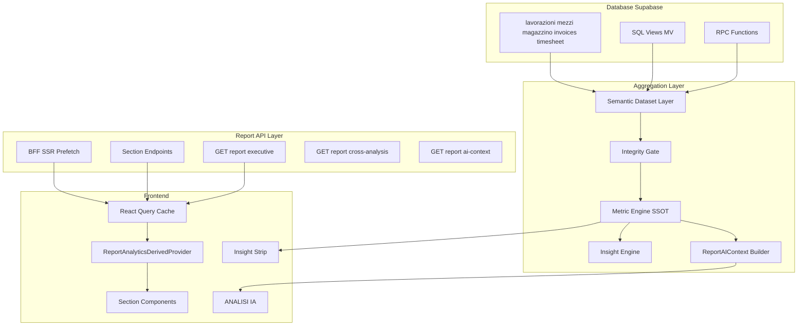
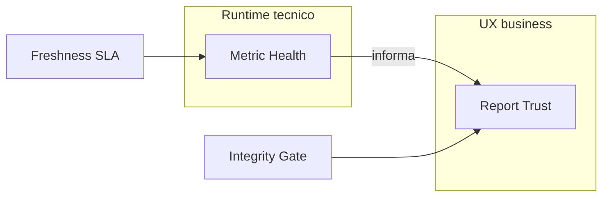

# Report V2 ? Technical Design Document

> **Versione documento:** 1.0.0  
> **Data:** 19 luglio 2026  
> **Stato:** Riferimento architetturale permanente ? dominio analytics gestionale CAB  
> **Fonti:** `docs/report-analytics-audit.md`, `docs/report-analytics-catalog.json`, `docs/report-v2-blueprint.md`, `docs/report-v2-priorities.md`

---

## Indice

**PARTE A ? Vincoli e governance**
- [0. Architecture Decisions](#0-architecture-decisions)
- [0b. Metric Lifecycle](#0b-metric-lifecycle)
- [0c. Non obiettivi V2](#0c-non-obiettivi-v2)
- [0d. Semantic Dataset Ownership](#0d-semantic-dataset-ownership)

**PARTE B ? Architettura tecnica**
- [1. Architettura generale](#1-architettura-generale)
- [2. Semantic Dataset Layer](#2-semantic-dataset-layer)
- [2b. Data Freshness Contract](#2b-data-freshness-contract)
- [2c. Dataset Ownership](#2c-dataset-ownership-dettaglio)
- [3. Strategia calcolo KPI](#3-strategia-calcolo-kpi)
- [4. API Design](#4-api-design)
- [4b. Contract Versioning](#4b-report-contract-versioning)
- [5. Frontend Architecture](#5-frontend-architecture)
- [5b. Drill-down Architecture](#5b-drill-down-architecture)
- [6. Executive Row](#6-executive-row)
- [7. Insight Engine](#7-insight-engine)
- [8. ReportAIContext](#8-reportaicontext)
- [8b. Report Trust Model](#8b-report-trust-model)
- [9. Performance Plan](#9-performance-plan)
- [10. Roadmap implementativa](#10-roadmap-implementativa)

**PARTE C ? Quality e rollout**
- [11. Quality Gates](#11-report-v2-quality-gates)
- [11b. Metric Observability](#11b-metric-observability)
- [11c. Failure Mode Matrix](#11c-failure-mode-matrix)
- [12. Migration Strategy](#12-migration-strategy)

**Appendici**
- [Appendice A ? Metric Mapping](#appendice-a--metric-mapping)
- [Appendice B ? Decision Log](#appendice-b--decision-log)

---

# PARTE A ? Vincoli e governance

## 0. Architecture Decisions

Le seguenti decisioni sono **vincolanti** per ogni implementazione Report V2. Deviazioni richiedono nuova ADR e aggiornamento di questo documento.

### Riepilogo ADR

| ID | Titolo | Vincolo sintetico |
|----|--------|-------------------|
| ADR-REPORT-001 | Evoluzione incrementale | No sistema analytics parallelo |
| ADR-REPORT-002 | Metric Registry SSOT | Parity test per RPC/View/MV |
| ADR-REPORT-003 | DTO semantici al frontend | No logica KPI in React |
| ADR-REPORT-004 | AI senza accesso DB | Solo `ReportAIContext` |
| ADR-REPORT-005 | Insight e AI separati | Engine deterministico ? Gemini |
| ADR-REPORT-006 | RBAC pre-DTO | Mai filtrare solo lato React |
| ADR-REPORT-007 | Metric Observability First | Metrica non osservabile non pu? essere critica |

---

### ADR-REPORT-001 ? Evoluzione incrementale

**Contesto:** Il Report attuale (`/report`) ? client-heavy con BFF prefetch, integrity layer, derived cache e sezioni lazy. Esiste gi? un investimento significativo in `lib/report/` e `components/report/`.

**Decisione:** Report V2 ? un'**evoluzione incrementale** del sistema esistente. Si estendono BFF, aggregation layer, metric registry e componenti UI. Non si crea un secondo modulo analytics, BI tool o data warehouse parallelo.

**Conseguenze:**
- Riutilizzo di `fetchReportDataDTOServer`, `ReportDataIntegrityLayer`, `buildReportModel`, `report-domain-analytics.ts`
- Nuovi endpoint e DTO si aggiungono gradualmente; il client compute resta valido in Sprint 1
- Feature flag `report_v2_enabled` per convivenza V1/V2

**Vietato:**
- Nuovo repository/package analytics separato
- Rewrite completo in un singolo rilascio
- Abbandono del metric registry esistente senza migration map

**Esempio pratico:** L'executive row V2 usa `buildKpiPerformanceModel` esistente in Sprint 2, poi migra a `GET /api/report/executive` quando il contratto DTO ? stabile.

---

### ADR-REPORT-002 ? Metric Registry SSOT

**Contesto:** KPI duplicati (`lav_open`/`lav-aperti`, `scorta`/`mag_critical`) generano confusione e regressioni.

**Decisione:** [`lib/report/metrics/report-metric-registry.ts`](../lib/report/metrics/report-metric-registry.ts) resta **unica fonte di verit?** per formule, formatter, compare mode e trust flags. Ogni implementazione server-side (RPC, SQL view, MV) deve avere **test parity** contro il registry.

**Conseguenze:**
- Nuove metriche: prima entry catalogo JSON + registry, poi implementazione
- Pattern test: [`lib/decision-platform/adapters/__tests__/report-parity.test.ts`](../lib/decision-platform/adapters/__tests__/report-parity.test.ts)

**Vietato:**
- Formule KPI inline nei componenti React
- Duplicazione formule in RPC senza test parity
- Metriche UI-only non registrate

**Esempio pratico:** `lav-chiusi` ha una sola formula `COUNT(data_uscita IN range)` nel registry; RPC futura `report_lavorazioni_summary` deve restituire lo stesso valore su fixture condivise.

---

### ADR-REPORT-003 ? DTO semantici al frontend

**Contesto:** Oggi alcune sezioni calcolano metriche localmente su raw rows.

**Decisione:** Le sezioni React ricevono **DTO semantici** (`SectionDTO`, `KpiCardDTO`, `CompareEnvelope`) prodotti dall'aggregation layer. Il frontend renderizza, non calcola.

**Conseguenze:**
- `ReportAnalyticsView` orchestra fetch + DTO; sezioni sono presentational con drill-down
- Tipi condivisi in `lib/report/contracts/` (da creare Sprint 1)

**Vietato:**
- `COUNT(lavorazioni.filter(...))` nei componenti
- Passaggio raw `LavorazioneRow[]` alle sezioni V2

**Esempio pratico:** `ReportLavorazioniSection` riceve `LavorazioniSectionDTO` con `kpis[]`, `andamentoChart`, `lateSlaTable` gi? calcolati.

---

### ADR-REPORT-004 ? AI senza accesso database

**Contesto:** ANALISI IA usa Gemini via `POST /api/report/analysis` con context builder client.

**Decisione:** Il modello AI **non interroga mai** il database. Riceve esclusivamente `ReportAIContext` costruito dall'aggregation layer (con RBAC gi? applicato).

**Conseguenze:**
- `build-report-analysis-context.ts` ? l'unico builder autorizzato
- `GET /api/report/ai-context` valida il payload server-side prima di Gemini (Sprint 5)
- Nessuna query Supabase nella route analysis oltre rate limit/auth

**Vietato:**
- Prompt con SQL generato dal modello
- Fetch aggiuntivi in `report-analysis-service.server.ts` oltre auth/rate limit

**Esempio pratico:** Per includere fatturato nel report AI, il context builder aggiunge blocco `economic` ? non Gemini che legge `invoices`.

---

### ADR-REPORT-005 ? Insight e AI separati

**Contesto:** Insight strip (deterministico) e ANALISI IA (narrativa) hanno ruoli diversi.

**Decisione:** **Insight engine** (regole IF/THEN) e **AI narrativa** (Gemini) sono sistemi separati. Gli insight alimentano il context AI come fatti strutturati; il modello commenta e collega, non ricalcola.

**Conseguenze:**
- `lib/report/insights/` indipendente da `report-analysis/`
- Max 5 insight in strip; report AI approfondisce on-demand

**Vietato:**
- Sostituire insight strip con sintesi AI
- Duplicare testo strip verbatim nel report AI

**Esempio pratico:** Strip mostra ?N interventi oltre SLA?; report AI spiega cause, priorit? e correlazione con backlog.

---

### ADR-REPORT-006 ? RBAC pre-DTO

**Contesto:** Permessi per sezione definiti in `report-sections-config.ts`.

**Decisione:** RBAC applicato **prima** della generazione DTO (server/BFF/aggregation). Sezione negata ? DTO assente o HTTP 403. Mai filtrare solo lato React mascherando card vuote.

**Conseguenze:**
- Endpoint economico: 403 senza `fatturazione` read
- Executive row: card assenti, layout ricalcolato (4-6 card)
- AI context: blocchi omessi + `dataQualityNotes` su permessi

**Vietato:**
- `if (!canRead) return null` come unica protezione dati sensibili
- Mostrare ?0 per fatturato quando permesso negato

**Esempio pratico:** Utente senza `fatturazione` non riceve `eco_fatturato` n? in executive n? in AI context.

---

### ADR-REPORT-007 ? Metric Observability First

**Contesto:** Il catalogo crescer? oltre 78 metriche. Metriche rotte silenziosamente minano la fiducia direzionale.

**Decisione:** Ogni metrica `active` deve avere segnali di **salute**, **freshness**, **execution time** e **trust**. Una metrica non osservabile **non pu?** diventare critica di produzione (executive, P0 insight, AI context).

**Conseguenze:**
- Campo catalogo `observabilityEnabled: true` obbligatorio per `active`
- Health RED persistente ? `lifecycleStatus: blocked` (vedi ?0b, ?11b)
- Eventi telemetry documentati in ?11b

**Vietato:**
- Promuovere a P0/executive metriche senza monitoraggio
- Ignorare parity failures in produzione

**Esempio pratico:** `fleet_disponibilita_cliente` in executive solo dopo execution time < 200ms monitorato e test parity su ottimizzazione P0.8.

---

## 0b. Metric Lifecycle

### Pipeline concettuale

```
CREATED ? VALIDATED ? PUBLISHED ? MONITORED ? DEPRECATED ? ARCHIVED
```

### Stati operativi (catalogo)

| Stato | Significato | Visibile UI | Transizione da/a |
|-------|-------------|-------------|------------------|
| `draft` | In definizione, non in produzione | No | ? `active` dopo review |
| `active` | Pubblicata, monitorata (ADR-007) | S? | ? `draft`; ? `deprecated`, `blocked` |
| `deprecated` | Sostituita, ancora calcolata per compatibilit? | S? + badge | ? `active`; ? `archived` |
| `archived` | Rimossa da API/UI; storico documentale | No | ? `deprecated` |
| `blocked` | Dati non affidabili / health RED persistente | No / disclaimer | ? `active` dopo fix |

### Regole eliminazione

1. **Vietata** eliminazione diretta di una metrica dal catalogo
2. Percorso obbligatorio: `active ? deprecated ? archived`
3. `deprecated`: minimo **1 release** con redirect UI verso metrica sostitutiva
4. `archived`: entry resta in catalogo per audit; nessun calcolo runtime

### Campi obbligatori per metrica (estensione catalogo)

| Campo | Tipo | Descrizione |
|-------|------|-------------|
| `technicalOwner` | string | Team/persona implementazione |
| `businessOwner` | string | Stakeholder significato business |
| `formulaSSOT` | string | Riferimento `metricId` in registry |
| `parityTestRequired` | boolean | `true` se `calculationLayer != client` |
| `freshnessSLA` | enum | `live`, `5min`, `daily`, `monthly` |
| `lifecycleStatus` | enum | `draft`, `active`, `deprecated`, `archived`, `blocked` |
| `observabilityEnabled` | boolean | `true` per `active` (ADR-007) |

### Esempio transizione

`lav-saldo-periodo` (V1 hero) ? `deprecated` in P0.2 ? redirect UI a `lav_aging_backlog` ? `archived` dopo 1 release stabile.

---

## 0c. Non obiettivi V2

Report V2 **non**:

| Non obiettivo | Motivazione |
|---------------|-------------|
| Sostituisce il database business | Report ? read-only analytics sopra dati operativi |
| Introduce un nuovo ORM | Supabase client + selector/RPC esistenti |
| Crea un data warehouse esterno | Semantic layer interno al gestionale |
| Duplica tutte le tabelle in tabelle analytics | Contratti semantici, implementazione flessibile |
| Sposta tutte le metriche in SQL immediatamente | Client-first P0; SQL solo dove performance lo richiede |
| Elimina ANALISI IA | Sezione dedicata report narrativo settimanale/mensile |
| Elimina il sistema report esistente in un singolo rilascio | Feature flag + convivenza V1/V2 |
| Introduce logiche KPI direttamente nei componenti React | ADR-003 ? calcolo in aggregation layer |

**Frase guida:** *Report V2 ? un semantic analytics layer sopra il gestionale esistente.*

---

## 0d. Semantic Dataset Ownership

Evita dataset "orfani" senza responsabile tecnico e business.

| Dataset semantico | Technical Owner | Business Owner |
|-------------------|-----------------|----------------|
| `report_work_orders` | Report Platform | Responsabile officina |
| `report_assets` | Fleet Domain | Responsabile flotta |
| `report_inventory` | Magazzino Analytics | Responsabile ricambi |
| `report_financial` | Finance Domain | Amministrazione |
| `report_labor` | HR / Timesheet Domain | Responsabile team |
| `report_customers` | Report Platform | Direzione commerciale |

Responsabilit? owner: freshness SLA, approvazione deprecazioni, review su `blocked`, parity test sign-off.

---

# PARTE B ? Architettura tecnica

## 1. Architettura generale

### 1.1 Diagramma flusso dati target



### 1.2 Stato attuale vs target

| Layer | Oggi (V1) | Target V2 | Sprint |
|-------|-----------|-----------|--------|
| Fetch dati | BFF 6-wave full-table light columns | Invariato P0; RPC selettivi P1+ | S1-S3 |
| Integrity | `ReportDataIntegrityLayer` client | Invariato; trust in metadata envelope | S1 |
| Aggregazione | Client `lib/report/*` | Ibrido: client P0 + server DTO P2+ | S1-S3 |
| API sezionali | Solo `POST /api/report/analysis` | +7 GET endpoint | S2-S5 |
| Frontend | 8 sezioni, calcolo locale parziale | 6 sezioni + AI, DTO only | S1-S2 |
| Insight | Nessuno centralizzato | Insight engine deterministico | S4 |
| Caching | RQ + derived fingerprint + AI sessionStorage | + section DTO cache + metadata TTL | S2 |

### 1.3 Componenti frontend (riferimento codebase)

| Ruolo | Path |
|-------|------|
| Pagina RSC | `app/(gestionale)/report/page.tsx` |
| View client | `components/report/report-analytics-view.tsx` |
| Config sezioni | `components/report/report-sections-config.ts` |
| Derived context | `components/report/report-analytics-derived-context.tsx` |
| Live data | `lib/report/use-report-live-data.ts` |
| Prefetch derived | `components/report/use-report-derived-prefetch.ts` |
| AI section | `components/report/sections/report-ai-section.tsx` |

### 1.4 Componenti backend / lib

| Ruolo | Path |
|-------|------|
| BFF bundle | `lib/bff/report-bundle-fetch-server.ts` |
| Metric registry | `lib/report/metrics/report-metric-registry.ts` |
| Domain analytics | `lib/report/report-domain-analytics.ts` |
| Integrity | `lib/report/report-data-integrity-layer.ts` |
| Derived cache | `lib/report/report-derived-cache.ts` |
| AI context | `lib/report/report-analysis/build-report-analysis-context.ts` |
| Invalidazione | `lib/report/invalidate-report-universe.ts` |

### 1.5 Caching (3 tier)

| Tier | Meccanismo | TTL | Invalidazione |
|------|------------|-----|---------------|
| 1 ? Entity | React Query (`GESTIONALE_REPORT_STALE_MS`) | ~5 min | `invalidateReportUniverse()` |
| 2 ? Derived | `report-derived-cache.ts` fingerprint | Sessione | Snapshot fingerprint change |
| 3 ? Section DTO | RQ key `report:v2:{section}:{period}:{compare}` | 30-120s | Periodo / invalidazione entity |

### 1.6 Prefetch

| Cosa | Quando | File |
|------|--------|------|
| Entity bundle (lav, mezzi, mov, mag, manual) | SSR + mount | `prefetchDeferredPage("report")` |
| Executive + cross + derived | Mount + period change | `use-report-derived-prefetch.ts` |
| Economic + timesheet | Lazy on section expand (P0); prefetch executive (P0.9) | `prefetch-report-economic-queries.ts` |
| AI context | Prima di ?Genera report? (Sprint 5) | Nuovo hook |

### 1.7 Confronto periodo

SSOT: [`lib/report/date-ranges.ts`](../lib/report/date-ranges.ts)

**Compare modes:** `none`, `prev_period`, `prev_year`, `avg_12_months`, `same_period_prev_year`, `custom`

**DTO standard `CompareEnvelope`:**

```typescript
// Concettuale ? non codice deploy
interface CompareEnvelope {
  current: number | string;
  previous: number | string | null;
  deltaAbs: number | null;
  deltaPct: number | null;
  compareMode: ReportCompareMode;
  scalingBadge?: boolean;  // true se avg_12_months
}
```

Ogni KPI con `supportsComparison: true` nel catalogo espone `CompareEnvelope` nel DTO.

---

## 2. Semantic Dataset Layer

### 2.1 Principio

Il **Semantic Dataset Layer** ? un **modello semantico**, non un vincolo su tabelle fisiche PostgreSQL. Ogni dataset ? un **contratto** che descrive campi, origine, freshness e implementazione fisica ammessa.

**Implementazioni fisiche ammesse:**

| Implementazione | Quando usarla |
|-----------------|---------------|
| Client selector | Dati gi? in memoria, volume basso, P0 |
| DTO server (BFF) | Aggregazione periodo su fetch esistente |
| SQL view | Join stabili (AR aging, compliance, funnel) |
| Materialized view | Aggregazioni storiche costose (rotazione stock) |
| Snapshot table (BG job) | Trend non retroattivo (disponibilit? flotta giornaliera) |

**Criteri scelta:** volume dati ? frequenza aggiornamento ? costo query Supabase ? necessit? storica.

---

### 2.2 `report_work_orders`

| Campo | Valore |
|-------|--------|
| **Scopo** | KPI lavorazioni, SLA, aging, classifiche operative |
| **Campi** | `id`, `data_ingresso`, `data_uscita`, `archived`, `priorita`, `mezzo_id`, `cliente_label`, `stato`, `days_open`, `sla_breached`, `created_by` |
| **Origine** | `lavorazioni` + join `mezzi` per cliente |
| **Implementazione default** | Client selector ? `lavorazioni-report-selectors.ts` |
| **Implementazione futura** | RPC heatmap/top N su grandi volumi (P1.14) |
| **Freshness default** | `LIVE` |

---

### 2.3 `report_assets`

| Campo | Valore |
|-------|--------|
| **Scopo** | Flotta, disponibilit?, guasti, compliance |
| **Campi** | `mezzo_id`, `cliente`, `targa`, `stato_operativo`, `disponibilita_pct`, `frequenza_guasti`, `km`, `compliance_due_count` |
| **Origine** | `mezzi`, `lavorazioni` attive, `asset_compliance_rules` |
| **Implementazione default** | Client selector ottimizzato O(mezzi) con indice lav attive (P0.8) |
| **Implementazione futura** | BG snapshot `fleet_disponibilita_trend` (P2) |
| **Freshness default** | `NEAR_REAL_TIME` (disponibilit?), `LIVE` (guasti) |

---

### 2.4 `report_inventory`

| Campo | Valore |
|-------|--------|
| **Scopo** | Scorte, movimenti, ordini, top ricambi |
| **Campi** | `ricambio_id`, `codice`, `giacenza`, `scorta_min`, `sotto_scorta`, `uscite_periodo`, `valore_capitale`, `consumo_medio_mensile`, `giorni_copertura` |
| **Origine** | `magazzino_ricambi`, `movimenti_ricambi`, `ordini_fornitori` |
| **Implementazione default** | `magazzino-period-aggregate.ts` |
| **Implementazione futura** | MV `rotazione_stock` (P2), RPC `lead_time_ordini` (P2) |
| **Freshness default** | `LIVE` |

---

### 2.5 `report_financial`

| Campo | Valore |
|-------|--------|
| **Scopo** | Fatturato, crediti, preventivi, costi |
| **Campi** | `invoice_id`, `emission_date`, `totale`, `residuo`, `scaduta`, `cliente_label`, `preventivo_id`, `stato_preventivo`, `costo_manutenzione` |
| **Origine** | `invoices`, `customer_open_items`, `preventivi`, schede/movimenti |
| **Implementazione default** | Lazy client ? `economic-period-aggregate.ts` |
| **Implementazione futura** | SQL view AR aging, preventivi billing (P1) |
| **Freshness default** | `LIVE` (lazy load on expand) |

---

### 2.6 `report_labor`

| Campo | Valore |
|-------|--------|
| **Scopo** | Ore, straordinari, produttivit?, costo manodopera |
| **Campi** | `dipendente_id`, `work_date`, `ore`, `straordinario`, `assenza`, `lavorazione_id`, `costo_manodopera` |
| **Origine** | `dipendenti_timesheet_entries`, schede lavorazione |
| **Implementazione default** | Lazy client ? `use-report-timesheet-kpi.ts` |
| **Implementazione futura** | RPC SUM periodo (P1) |
| **Freshness default** | `LIVE` |

---

### 2.7 `report_customers`

| Campo | Valore |
|-------|--------|
| **Scopo** | Aggregazioni per cliente (join testuale) |
| **Campi** | `cliente_label`, `mezzi_count`, `interventi_periodo`, `disponibilita_pct`, `fatturato_periodo`, `costi_periodo`, `margine_stimato` |
| **Origine** | Join testuale `mezzi.cliente` ? `invoices.cliente_label` |
| **Implementazione default** | Derivato on-demand da altri dataset |
| **Limitazione** | Join testuale fragile ? documentare in UI (P1.8) |
| **Freshness default** | `LIVE` |

---

## 2b. Data Freshness Contract

### Livelli freshness

| Livello | Significato | Esempi V2 |
|---------|-------------|-----------|
| `REAL_TIME` | Aggiornamento su evento push | Non usato P0 |
| `LIVE` | Calcolato su fetch corrente | Lavorazioni aperte, movimenti magazzino |
| `NEAR_REAL_TIME` | Cache < 5 min | Disponibilit? flotta ottimizzata |
| `DAILY` | Snapshot giornaliero | Trend disponibilit? flotta (BG job) |
| `MONTHLY` | Aggregazione mensile | Rotazione stock, year matrix storica |

### Metadata su ogni DTO

Integrato in `ReportMetadataEnvelope` (?4b): `sourceFreshness`, `generatedAt`, `dataWarnings`.

---

## 2c. Dataset Ownership (dettaglio)

| Dataset | Owner tecnico | Owner business | Freshness SLA | Parity | Deprecazione |
|---------|---------------|----------------|---------------|--------|--------------|
| `report_work_orders` | Report Platform | Resp. officina | LIVE | N/A P0 | Team Report |
| `report_assets` | Fleet Domain | Resp. flotta | NEAR_REAL_TIME | RPC P2 | Fleet + Report |
| `report_inventory` | Magazzino Analytics | Resp. ricambi | LIVE | MV P2 | Magazzino |
| `report_financial` | Finance Domain | Amministrazione | LIVE | View P1 | Finance |
| `report_labor` | HR/Timesheet | Resp. team | LIVE | RPC P1 | HR |
| `report_customers` | Report Platform | Direzione commerciale | LIVE | N/A | Report + Commercial |

---

## 3. Strategia calcolo KPI

### 3.1 Tabella per gruppo (78 metriche catalogo)

| Gruppo | N? KPI | Client | View | RPC | MV | BG job | Strategia V2 |
|--------|--------|--------|------|-----|-----|--------|--------------|
| LAVORAZIONI | 17 | 17 | 0 | 0 | 0 | 0 | Live client P0 ? RPC selettivo P1 |
| CLIENTI E MEZZI | 14 | 11 | 1 | 1 | 0 | 1 | Live ottimizzato + view compliance + BG trend |
| MAGAZZINO | 10 | 8 | 0 | 1 | 1 | 0 | Live + RPC lead time + MV rotazione |
| ORE LAVORATE | 8 | 7 | 0 | 1 | 0 | 0 | RPC SUM + live cross |
| DATI ECONOMICI | 19 | 14 | 3 | 2 | 0 | 0 | Lazy client + views AR/funnel + RPC DSO |
| ANALISI TRASVERSALI | 10 | 9 | 0 | 0 | 0 | 1 | Live su DTO prefetch + BG anomaly |

### 3.2 Metriche non-client (implementazione differita)

| metricId | Layer | Priorit? | Motivazione |
|----------|-------|----------|-------------|
| `compliance_scadenze` | view | P1 | Join compliance rules stabile |
| `km_trend` | rpc | P2 | Serie km per mezzo |
| `fleet_disponibilita_trend` | background_job | P2 | Richiede snapshot giornaliero |
| `lead_time_ordini` | rpc | P2 | Timeline status ordini |
| `rotazione_stock` | materialized_view | P2 | Storico capitale |
| `ore_per_dipendente` | rpc | P1 | SUM timesheet efficiente |
| `funnel_preventivi` | view | P1 | Stati in jsonb mappati |
| `ar_aging` | view | P1 | `customer_open_items` |
| `dso` | rpc | P1 | Pagamenti aggregati |
| `mix_righe_fattura` | rpc | P2 | Group by `invoice_rows.tipo` |
| `preventivi_billing_residuo` | view | P1 | View esistente |
| `cross_anomaly_volume` | background_job | P2 | z-score ?12 mesi |

### 3.3 Regola SSOT

Formula definita una volta nel metric registry. Ogni layer alternativo richiede `parityTestRequired: true` e fixture condivise.

---

## 4. API Design

### 4.1 Panoramica endpoint

| Endpoint | Metodo | RBAC | Cache stale | Sprint |
|----------|--------|------|-------------|--------|
| `/api/report/executive` | GET | Per card dominio | 30-60s | S2 |
| `/api/report/lavorazioni` | GET | `lavorazioni` read | 60s | S2 |
| `/api/report/clienti` | GET | `mezzi` OR `lavorazioni` | 120s | S3 |
| `/api/report/magazzino` | GET | `magazzino` read | 60s | S2 |
| `/api/report/economico` | GET | `fatturazione` read | 60s | S2 |
| `/api/report/cross-analysis` | GET | ?2 sezioni fonte | 30s | S3 |
| `/api/report/ai-context` | GET | Filtrato RBAC | no-cache | S5 |
| `/api/report/analysis` | POST | Pagina report | sessionStorage | Esistente |

### 4.2 Parametri comuni (query)

| Parametro | Tipo | Obbligatorio | Descrizione |
|-----------|------|--------------|-------------|
| `preset` | `ReportPeriodPreset` | S?* | Preset periodo toolbar |
| `compareMode` | `ReportCompareMode` | No | Default `none` |
| `periodStart` | ISO date | Se custom | Inizio periodo |
| `periodEnd` | ISO date | Se custom | Fine periodo |
| `includeRankings` | boolean | No | Top N in section DTO |
| `topN` | number | No | Default 5 |

\*Oppure `periodStart` + `periodEnd` per range custom.

### 4.3 `GET /api/report/executive`

**Input:** parametri comuni.

**Output (concettuale):**

```json
{
  "metadata": { "...ReportMetadataEnvelope" },
  "data": {
    "cards": [
      {
        "metricId": "lav-chiusi",
        "label": "Chiusure periodo",
        "value": "42",
        "compare": { "deltaPct": 12.5 },
        "drillDown": { "targetType": "section", "targetRef": "lavorazioni", "initialFilter": {} },
        "trustStatus": "GREEN"
      }
    ]
  }
}
```

**Errori:** `403` RBAC ? `422` periodo invalido ? `503` integrity blocked.

### 4.4 `GET /api/report/lavorazioni`

**Output `data`:** `kpis[]`, `andamentoChart`, `agingBacklog`, `lateSlaTable`, `rankings`.

### 4.5 `GET /api/report/clienti`

**Output `data`:** `disponibilita[]`, `guastiPerTipo`, `topClienti`, `topMezzi`, `compliance` (se view disponibile).

### 4.6 `GET /api/report/magazzino`

**Output `data`:** `kpis` (scorta, uscite, valore), `movimentiMensili`, `topRicambi`, `sottoScortaTable`.

### 4.7 `GET /api/report/economico`

**Output `data`:** `fatturato`, `preventivi`, `costi`, `daIncassare`, `scadute`, `topClientiFatturato`.

**RBAC:** `403` senza `fatturazione` read ? nessun payload parziale con ?0.

### 4.8 `GET /api/report/cross-analysis`

**Output `data`:** `cross_efficiency`, `cross_parts_job`, `cross_cost_job`, `cross_value_hour`, `matrices[]` (P1).

**Prerequisito:** derived operational + warehouse + labor + economic prefetchati.

### 4.9 `GET /api/report/ai-context`

**Output:** `ReportAIContext` completo (?8) con `version: "2.0"`. Non invoca Gemini.

**Uso:** validazione server-side; client pu? passare a `POST /api/report/analysis`.

### 4.10 `POST /api/report/analysis` (invariato)

Riceve `ReportAnalysisContext` + snapshot fingerprint. Rate limit + cache sessionStorage.

---

## 4b. Report Contract Versioning

### ReportMetadataEnvelope (obbligatorio)

**Regola vincolante:** nessun endpoint Report V2 restituisce payload analytics senza `metadata` envelope.

```json
{
  "metadata": {
    "contractVersion": "2.0",
    "generatedAt": "2026-07-19T20:00:00.000Z",
    "requestedPeriod": {
      "preset": "questo_mese",
      "start": "2026-07-01",
      "end": "2026-07-31",
      "compareMode": "prev_year"
    },
    "sourceFreshness": "LIVE",
    "trustStatus": "GREEN",
    "dataWarnings": [],
    "calculationDurationMs": 42
  },
  "data": { }
}
```

### Semver contrattuale

| Tipo cambio | Versione | Esempio |
|-------------|----------|---------|
| Campo opzionale aggiunto | minor `2.1` | `dataWarnings` opzionale |
| Rimozione/rename/tipo breaking | major `3.0` | Rinomina `fatturato` |
| Solo documentazione | patch `2.0.1` | Chiarimento schema |

### Compatibilit? HTTP (modello documentato ? implementazione graduale)

```http
GET /api/report/executive HTTP/1.1
Accept: application/vnd.report.v2+json

HTTP/1.1 200 OK
Content-Type: application/vnd.report.v2+json

{
  "metadata": { "contractVersion": "2.0", ... },
  "data": { "cards": [...] }
}
```

**Supported versions** per endpoint in tabella implementazione. Mismatch ? `406 Not Acceptable` o fallback versione supportata (?11c).

**Superfici da versionare:** API responses, `ReportAIContext`, export PDF, decision-platform adapters, AI sessionStorage cache key.

---

## 5. Frontend Architecture

### 5.1 Struttura cartelle target

```
components/report/
??? executive/                 # NEW Sprint 2
?   ??? report-executive-row.tsx
?   ??? executive-kpi-card.tsx
??? insight-strip/             # NEW Sprint 4
?   ??? insight-strip.tsx
?   ??? insight-card.tsx
??? primitives/                # Wrapper design-system
?   ??? kpi-card.tsx
?   ??? trend-chart.tsx
?   ??? ranking-table.tsx
?   ??? exception-matrix.tsx
?   ??? insight-card.tsx
??? sections/                  # 6 sezioni + analisi_ai
??? layout/                    # toolbar, sections orchestrator
??? hooks/
    ??? use-report-executive.ts
    ??? use-report-section-dto.ts
    ??? use-report-insights.ts

lib/report/
??? contracts/                 # NEW Sprint 1 ? DTO types
??? datasets/                  # NEW Sprint 1 ? semantic selectors
??? insights/                  # NEW Sprint 4
?   ??? metrics/
?   ??? rules/
?   ??? engine.ts
??? [esistenti]
```

### 5.2 Provider e stato

| Provider / stato | Responsabilit? |
|------------------|----------------|
| `ReportAnalyticsDerivedProvider` | Cross-section DTO (operational, warehouse, labor, economic) |
| `ReportSectionVisibilityContext` | Accordion open/close |
| `ReportPerformanceContext` | KPI performance model (transizione ? executive DTO) |
| `ReportInsightProvider` | NEW ? insight strip state |
| React Query | Entity + section DTO server state |
| `report-period-persistence.ts` | Periodo/confronto localStorage |

### 5.3 Stati UI unificati

```typescript
type ReportSectionState =
  | { status: "loading" }
  | { status: "error"; message: string; retry?: () => void }
  | { status: "empty"; message: string }
  | { status: "blocked"; trustStatus: "RED"; reason: string }
  | { status: "ready"; data: SectionDTO };
```

Skeleton: `report-page-structure.tsx`. Mai spinner + skeleton contemporanei per stesso load.

### 5.4 Componenti generici

| Componente | Wrapper su | Props chiave |
|------------|------------|--------------|
| `<KpiCard />` | `design-system/primitives/metric-card` | `metricId`, `value`, `compare`, `drillDown`, `trustStatus` |
| `<TrendChart />` | chart primitive + kpi-series | `seriesId`, `period` |
| `<RankingTable />` | data-table + classifiche | `rows`, `drillDownPerRow` |
| `<ExceptionMatrix />` | matrix primitive | `cells`, `severity` |
| `<InsightCard />` | narrative + badge | `insight`, `onDrillDown` |

**Vincolo ADR-003:** nessun componente riceve raw DB rows.

---

## 5b. Drill-down Architecture

### DrillDownContract

Ogni componente analytics dichiara:

| Campo | Tipo | Descrizione |
|-------|------|-------------|
| `metricId` | string | ID metric registry origine |
| `domain` | enum | `lavorazioni`, `mezzi`, `magazzino`, `economico`, `ore`, `cross` |
| `initialFilter` | object | Filtri pre-applicati |
| `targetType` | enum | `drawer`, `section`, `page` |
| `targetRef` | string | ID sezione, route, drawer config |

### Pattern UX

```
KpiCard / InsightCard / RankingRow
        ? onClick
        ?
DetailDrawer (filtro applicato)  ? oppure scrollToSection
        ?
        ?
Pagina dominio (/lavorazioni, magazzino, fatturazione?)
```

### Esempi obbligatori

| KPI / insight | metricId | targetType | targetRef | initialFilter |
|---------------|----------|------------|-----------|---------------|
| Oltre SLA | `lav_late_sla` | drawer | `lavorazioni-late-sla` | `{ sla_breached: true }` |
| Sotto scorta | `scorta` | section | `magazzino` | `{ sotto_scorta: true }` |
| Cliente top costo | `top_mezzi_costo` | section | `economici` | `{ cliente: "{label}" }` |
| Bassa disponibilit? | `fleet_disponibilita_cliente` | section | `clienti` | `{ disponibilita_pct_lt: 75 }` |
| Fatturato periodo | `eco_invoices` | section | `economici` | `{ tab: "fatture" }` |
| Chiusure periodo | `lav-chiusi` | section | `lavorazioni` | `{ closed_in_period: true }` |

**Regola:** nessun KPI clickable senza `drillDown` nel DTO. Insight strip P0: 100% drill-down.

---

## 6. Executive Row

### Regola fondamentale

La Executive Row **non** ? una seconda dashboard scollegata. ? una **vista compatta** di metriche gi? nel Metric Registry (ADR-002). Ogni card ha `metricId`, formula SSOT, drill-down, sezione proprietaria.

### 6 card V2

| # | Card | metricId | Sezione | Formula (SSOT) | Confronto | Colore/stato | Drill-down |
|---|------|----------|---------|----------------|-----------|--------------|------------|
| 1 | Chiusure periodo | `lav-chiusi` | LAVORAZIONI | COUNT data_uscita IN range | deltaPct | verde ? / rosso ? | Sezione lav, filtro chiusure |
| 2 | Interventi aperti | `lav-aperti` | LAVORAZIONI | COUNT aperte non archived | deltaAbs | amber se > soglia | Lista lav aperte |
| 3 | Oltre SLA | `lav_late_sla` | LAVORAZIONI | COUNT sla_breached | deltaAbs | rosso se > 0 | Drawer lav SLA |
| 4 | Fatturato periodo | `eco_invoices` | ECONOMICI | SUM totale emission IN range | deltaPct | verde/rosso | Tab fatture |
| 5 | Da incassare | `eco_da_incassare` | ECONOMICI | SUM residuo aperto | deltaAbs | amber/rosso | Crediti aperti |
| 6 | Sotto scorta | `scorta` | MAGAZZINO | COUNT giacenza < scorta_min | deltaAbs | rosso se > 0 | Ricambi critici |

**RBAC:** card 4-5 assenti senza `fatturazione` read; layout 4-col.

**Vietato:** KPI executive fuori registry o senza drill-down.

---

## 7. Insight Engine

### Architettura 3 layer (ADR-005)

```
lib/report/insights/
??? metrics/     # Reader su DTO ? no regole
??? rules/       # Definizioni IF/THEN
??? engine.ts    # Valuta regole ? Insight[]
??? types.ts
```

### Formato regola

```
RULE id: backlog_pressure
IF lav_periodo - lav_chiusi > 0 AND deltaPct(lav_chiusi) < -5
THEN "Il carico supera le chiusure di {N} interventi"
SEVERITY warning
PRIORITY 10
ACTION drill ? lavorazioni / andamento
METRIC_IDS [lav-periodo, lav-chiusi]
```

### Insight output type

```typescript
interface Insight {
  id: string;
  message: string;
  severity: "info" | "warning" | "critical";
  priority: number;
  metricIds: string[];
  drillDown: DrillDownContract;
  trustStatus: "GREEN" | "YELLOW";  // mai RED in strip ? se RED, insight omesso
}
```

### Regole P0 (~25, da audit Fase 9)

| Dominio | Esempi condizione |
|---------|-------------------|
| Lavorazioni | carico > smaltimento; tempo medio ?; N oltre 14gg |
| Clienti | disponibilit? < 75%; N clienti sotto soglia |
| Magazzino | ricambi +15%; N sotto scorta |
| Economici | fatturato delta; N scadute ?X |
| Trasversali | efficiency sotto media; cost/job +10% |

**Output:** max 5 insight, ordinati `severity ? priority`. Link ?Approfondisci con report AI ?? verso sezione `analisi_ai`.

---

## 8. ReportAIContext

### Vincolo ADR-004

Solo questo contratto verso Gemini. Versione obbligatoria: `version: "2.0"`.

### Schema concettuale (estensione V1)

```typescript
interface ReportAIContext {
  version: "2.0";
  meta: {
    preset: ReportPeriodPreset;
    compareMode: ReportCompareMode;
    periodStart: string;
    periodEnd: string;
    compareStart?: string;
    compareEnd?: string;
  };
  integrity: {
    status: string;
    findingCount: number;
    manualEntryCount: number;
    queryErrors: string[];
  };
  executive: {
    closedInPeriod: number;
    openCount: number;
    avgCloseDays: number;
    fatturato?: number;
    daIncassare?: number;
    sottoScorta?: number;
  };
  trends: {
    chiusureMensili: { month: string; count: number }[];
    guastiMensili?: { month: string; count: number }[];
    fatturatoMensile?: { month: string; amount: number }[];
  };
  fleet: {
    disponibilitaClienti: { label: string; pct: number }[];
    guastiPerTipo?: { tipo: string; count: number }[];
  };
  economic?: {
    fatturato: number;
    daIncassare: number;
    scadute: number;
    preventiviCount: number;
    winRate?: number;
  };
  labor?: {
    oreTotali: number;
    straordinariPct: number;
    orePerIntervento: number;
  };
  warehouse?: {
    sottoScorta: number;
    topRicambi: { label: string; qta: number }[];
  };
  cross?: {
    efficiency: number;
    costJob: number;
    valueHour: number;
    partsJob: number;
  };
  insights: Insight[];  // fatti strutturati da insight engine
  events: {
    diary: { workDate: string; body: string }[];
    alerts: { type: string; message: string }[];
  };
  tops: {
    mezzi: { label: string; interventi: number }[];
    clienti: { label: string; interventi: number }[];
    ricambi: { label: string; qtaUscita: number }[];
  };
  compareDetail: {
    ingressi: { current: number; previous: number };
    chiusure: { current: number; previous: number };
  };
  dataQualityNotes?: string[];
}
```

### Builder

[`build-report-analysis-context.ts`](../lib/report/report-analysis/build-report-analysis-context.ts) ? estendere in Sprint 5 (P1.16).

### Cadenza consigliata

| Preset | Confronto | Uso |
|--------|-----------|-----|
| `questa_settimana` / `settimana_scorsa` | `prev_period` | Review operativa |
| `questo_mese` / `mese_scorso` | `prev_year` | Chiusura mese |

---

## 8b. Report Trust Model

### Separazione Metric Health vs Report Trust



| Concetto | Scope | Dove |
|----------|-------|------|
| **Metric Health** | Runtime tecnico ? execution, errori, parity, freshness lag | ?11b, aggregation layer |
| **Report Trust** | Affidabilit? business mostrata all'utente | `metadata.trustStatus`, badge UI |

### Matrice incrociata

| Caso | Metric Health | Report Trust | UX |
|------|---------------|--------------|-----|
| Query lenta, dati corretti | YELLOW | GREEN | Nessun badge |
| Dati incompleti costi (`trust: partial`) | GREEN | YELLOW | Badge warning manodopera |
| Formula fallita | RED | RED | KPI nascosto |
| Manual override attivo | GREEN | YELLOW | Badge ?dati manuali? |
| Integrity gate blocked | RED | RED | Sezione empty blocked |
| Freshness SLA superato | YELLOW | YELLOW | Badge freshness |

**Regola:** `metadata.trustStatus` = aggregazione Report Trust a livello sezione/DTO, non health singola metrica.

### Livelli Report Trust

| Status | Significato | UX |
|--------|-------------|-----|
| GREEN | Dati completi, integrit? OK | Nessun badge |
| YELLOW | Parziale, fallback, manual override, trust partial | Badge + tooltip |
| RED | Integrit? insufficiente | KPI nascosti; sezione blocked |

**Regola:** mai mostrare KPI senza indicare limitazioni quando `trustStatus !== GREEN`.

Integrazione: `report-integrity-badge-model.ts`, `report-data-integrity-layer.ts`.

---


## 9. Performance Plan

### 9.1 Cosa precomputare vs live

| Elemento | Strategia | TTL | Sprint |
|----------|-----------|-----|--------|
| Entity rows (lav, mezzi, mov) | RQ prefetch BFF | stale ~5min | S1 |
| Derived bundle (semantic index) | Client fingerprint cache | sessione | S1 |
| Executive DTO | RQ + metadata envelope | 30-60s | S2 |
| Disponibilit? flotta | Indice mezzo_id + lav attive | NEAR_REAL_TIME 2min | S1 P0.8 |
| AR aging | SQL view | 5min refresh | S3 P1 |
| Cross KPI | Derived prefetch obbligatorio | 30s | S3 |
| Insight strip | Derive da executive (no cache separata) | ? | S4 |
| AI analysis | sessionStorage | 24h + fingerprint | S5 |
| Rotazione stock / fleet trend | MV / BG snapshot | DAILY | S4+ P2 |

### 9.2 Target metriche

| Metrica | Target | Gate |
|---------|--------|------|
| Executive row load | < 3s | Large dataset perf test |
| Disponibilit? flotta | < 200ms post-ottimizzazione | P0.8 |
| Section DTO (lav/mag) | < 1s client P0 | CI staging |
| AI context build | < 2s | Sprint 5 |

### 9.3 Impatto Supabase

| Fase | Impatto |
|------|---------|
| Sprint 1-2 | Zero nuove MV; stesso full-fetch light columns |
| Sprint 3 | Max 3 RPC + 2 views; monitorare connection pool |
| Sprint 4+ | BG job snapshot ? scheduling esterno o pg_cron |

**Soglia scalabilit?:** >5000 lavorazioni o >50k movimenti ? RPC aggregazioni obbligatorie (P1.14).

### 9.4 Invalidazione

| Evento | Azione |
|--------|--------|
| Modifica lavorazioni/magazzino/mezzi | `invalidateReportUniverse()` |
| Manual entries import | Bump fingerprint + RQ invalidation |
| Periodo toolbar change | Ricalcolo derived; section DTO stale |

---

## 10. Roadmap implementativa

### Sprint 1 ? Fondazione tecnica (4-6 settimane)

| Campo | Dettaglio |
|-------|-----------|
| **Obiettivo** | Contratti DTO, metric dedup, section restructure, semantic selectors |
| **File** | `report-sections-config.ts`, `report-metric-registry.ts`, `lib/report/contracts/`, `lib/report/datasets/` |
| **Dipendenze** | Nessuna |
| **Rischi** | Regressioni RBAC, bookmark URL |
| **Done** | 6 sezioni + AI; 0 KPI duplicati; contratti TypeScript definiti; feature flag scaffold |

### Sprint 2 ? Executive + sezioni P0 (4-6 settimane)

| Campo | Dettaglio |
|-------|-----------|
| **Obiettivo** | Executive row, aging backlog, crediti, grafico ingressi/chiusure, API thin wrapper |
| **File** | `report-executive-overview.tsx`, `components/report/executive/`, `app/api/report/*/route.ts` |
| **Dipendenze** | Sprint 1 contratti |
| **Rischi** | Cross incompleto senza prefetch |
| **Done** | 6 executive card; P0 KPI visibili; metadata envelope su DTO |

### Sprint 3 ? Cross analytics (2-3 settimane)

| Campo | Dettaglio |
|-------|-----------|
| **Obiettivo** | Prefetch obbligatorio, 4 cross KPI, `GET /api/report/cross-analysis` |
| **File** | `report-domain-analytics.ts`, `use-report-derived-prefetch.ts` |
| **Dipendenze** | Sprint 2 derived |
| **Rischi** | Date mismatch tra domini |
| **Done** | Cross disponibile senza expand manuale |

### Sprint 4 ? Insight engine (2-3 settimane)

| Campo | Dettaglio |
|-------|-----------|
| **Obiettivo** | 25 regole P0, insight strip, drill-down, link AI |
| **File** | `lib/report/insights/`, `components/report/insight-strip/` |
| **Dipendenze** | Sprint 2 executive |
| **Rischi** | Alert fatigue (>5 messaggi) |
| **Done** | ?80% insight P0 con azione drill-down |

### Sprint 5 ? Analisi IA (2-3 settimane)

| Campo | Dettaglio |
|-------|-----------|
| **Obiettivo** | Context V2, shortcut settimana/mese, `GET /api/report/ai-context`, PDF export |
| **File** | `build-report-analysis-context.ts`, `report-ai-section.tsx`, `report-analysis-schema.ts` |
| **Dipendenze** | Sprint 3 cross, Sprint 4 insights |
| **Rischi** | Token limit Gemini; rate limit |
| **Done** | Report AI tutti domini RBAC; Zod `version: 2.0` |

---

# PARTE C ? Quality e rollout

## 11. Report V2 Quality Gates

| Gate | Cosa verifica | Quando |
|------|---------------|--------|
| KPI parity test | Client vs RPC/View/MV su fixture | `parityTestRequired: true` |
| Comparison period test | 6 compare modes, badge scaling | `supportsComparison: true` |
| RBAC visibility test | 403 o DTO assente | Ogni endpoint + sezione |
| Integrity failure test | blocked ? no KPI fuorvianti | Integrity layer |
| Empty dataset test | empty state, no NaN | Ogni sezione |
| Large dataset perf test | 5k lav ? executive < 3s | CI staging |
| AI context schema validation | Zod + `version` | Sprint 5 |
| Drill-down contract test | ogni KPI P0 ha `drillDown` | Sprint 2+ |
| Trust status test | integrity blocked ? RED | Sprint 2+ |
| Freshness metadata test | `generatedAt` + `sourceFreshness` | Sprint 2+ |
| Contract version test | DTO include `contractVersion` | Sprint 2+ |

Integrazione control plane: `lib/report/__tests__/`, `lib/regression/`, `docs/control-plane/README.md`.

---

## 11b. Metric Observability

**Vincolo ADR-007.** Ogni metrica `active` con `observabilityEnabled: true`.

### Segnali monitorati

| Segnale | Soglia esempio | Health |
|---------|----------------|--------|
| `execution_time_ms` | >500ms P0, >2s P1 | YELLOW |
| `error_rate` | >0% | RED |
| `freshness_lag` | > freshnessSLA catalogo | YELLOW ? RED |
| `parity_failures` | test fallito | RED ? `blocked` |
| `trust_degradation` | YELLOW/RED persistente | alert + badge |

### Metric Health (runtime tecnico)

| Health | Significato |
|--------|-------------|
| GREEN | Calcolo corretto, SLA rispettato |
| YELLOW | Degrado performance o freshness |
| RED | Formula fallita ? `lifecycleStatus: blocked` |

### Eventi telemetry

```
metric_calculation_failed
metric_parity_failed
metric_freshness_exceeded
metric_trust_degraded
```

### Implementazione graduale

| Fase | Azione |
|------|--------|
| Sprint 1-2 | Logging strutturato in aggregation layer |
| Sprint 3+ | CI regression su eventi; control plane tier |

**Relazione lifecycle:** health RED persistente ? `active ? blocked` con review owner tecnico.

---

## 11c. Failure Mode Matrix

| Failure | Layer | Comportamento |
|---------|-------|---------------|
| Dataset incompleto | Semantic Layer | trust YELLOW; `dataWarnings` popolato |
| RPC timeout | Aggregation | fallback client se cache; altrimenti trust YELLOW |
| Integrity failure | Trust Layer | trust RED; KPI nascosti; sezione blocked |
| AI provider unavailable | AI Layer | insight deterministici visibili; AI section retry message |
| RBAC denied | API | DTO assente / HTTP 403; no card vuote |
| Parity test failed | Metric Engine | health RED; metrica `blocked` |
| Freshness SLA exceeded | Semantic Layer | health YELLOW; trust YELLOW se impatta decisione |
| Empty dataset | Presentation | empty state; no NaN/zero fuorviante |
| Contract version mismatch | API | 406 Not Acceptable o fallback versione supportata |
| Manual override attivo | Trust Layer | trust YELLOW; badge ?dati manuali? |
| Gemini rate limit | AI Layer | messaggio utente; cache precedente se valida |

---

## 12. Migration Strategy

### Convivenza V1/V2

| Meccanismo | Dettaglio |
|------------|-----------|
| Feature flag | `report_v2_enabled` in app_settings o env |
| Fallback | Flag off ? UI V1 (8 sezioni) |
| Rollback | Disabilitare flag; no migrazioni DB irreversibili S1-S3 |
| Monitoraggio | Confronto KPI V1 vs V2 stesso periodo |
| Component migration | Una sezione alla volta; `grafici_kpi` ? widget embedded |
| API migration | Endpoint opt-in; BFF legacy fino a parity |

### Fasi rollout

1. Internal ? flag on admin only
2. Staging ? parity 2 settimane
3. Produzione ? flag default on
4. Cleanup ? rimozione V1 dopo 1 release stabile

### NOTA IMPLEMENTATIVA ? Metric Migration Map

**Prima di modificare qualsiasi componente UI Report V2**, creare obbligatoriamente **`docs/report-v2-metric-migration-map.md`**.

| V1 | V2 | Stato |
|----|-----|-------|
| `lav_open` + `lav-aperti` | `lav-aperti` | unificata |
| `lav_completed` + `lav-chiusi` | `lav-chiusi` | unificata |
| `mag_critical` + `scorta` | `scorta` | unificata |
| `lav-saldo-periodo` | `lav_aging_backlog` | sostituita |
| `grafici_kpi` (sezione) | widget embedded | sostituita |
| `analisi_ai` | `analisi_ai` (context V2) | mantenuta |

Prerequisito per `docs/report-v2-implementation-plan.md`.

### Sequenza post-Technical Design

```
Technical Design ? Metric Migration Map ? Implementation Plan ? Sprint 1-5
```

Rischio residuo: **prioritizzazione e gestione rollout**, non architettura.

---

## Requisiti finali documento

Riferimento permanente per frontend, backend, revisori, responsabili operativi, manutentori.

Ogni decisione: motivazione + conseguenze + vincoli + esempio pratico.

Preferire tabelle, contratti DTO, diagrammi, regole verificabili, mapping espliciti.

---

# Appendice A ? Metric Mapping

| metricId | Sezione | Priorit? | Layer | Semantic dataset | Endpoint | Componente |
|----------|---------|----------|-------|------------------|----------|------------|
| lav-periodo | LAVORAZIONI | P0 | client | report_work_orders | /api/report/lavorazioni | ReportLavorazioniSection |
| lav-chiusi | LAVORAZIONI | P0 | client | report_work_orders | /api/report/lavorazioni | ReportLavorazioniSection |
| lav-aperti | LAVORAZIONI | P0 | client | report_work_orders | /api/report/lavorazioni | ReportLavorazioniSection |
| lav-tempo | LAVORAZIONI | P0 | client | report_work_orders | /api/report/lavorazioni | ReportLavorazioniSection |
| lav-media-settimanale | LAVORAZIONI | P1 | client | report_work_orders | /api/report/lavorazioni | ReportLavorazioniSection |
| lav_cancelled | LAVORAZIONI | P2 | client | report_work_orders | /api/report/lavorazioni | ReportLavorazioniSection |
| lav_late_sla | LAVORAZIONI | P0 | client | report_work_orders | /api/report/lavorazioni | ReportLavorazioniSection |
| lav_recidiva | LAVORAZIONI | P1 | client | report_work_orders | /api/report/lavorazioni | ReportLavorazioniSection |
| lav_heatmap_annuale | LAVORAZIONI | P1 | client | report_work_orders | /api/report/lavorazioni | ReportLavorazioniSection |
| top_mezzi_interventi | LAVORAZIONI | P1 | client | report_work_orders | /api/report/lavorazioni | ReportLavorazioniSection |
| lav_andamento_mensile | LAVORAZIONI | P1 | client | report_work_orders | /api/report/lavorazioni | ReportLavorazioniSection |
| lav_aging_backlog | LAVORAZIONI | P1 | client | report_work_orders | /api/report/lavorazioni | ReportLavorazioniSection |
| lav_median_close | LAVORAZIONI | P2 | client | report_work_orders | /api/report/lavorazioni | ReportLavorazioniSection |
| lav_by_priorita | LAVORAZIONI | P2 | client | report_work_orders | /api/report/lavorazioni | ReportLavorazioniSection |
| lav_by_stato | LAVORAZIONI | P2 | client | report_work_orders | /api/report/lavorazioni | ReportLavorazioniSection |
| lav_mttr | LAVORAZIONI | P2 | client | report_work_orders | /api/report/lavorazioni | ReportLavorazioniSection |
| lav_mtbf | LAVORAZIONI | P2 | client | report_work_orders | /api/report/lavorazioni | ReportLavorazioniSection |
| clienti | CLIENTI E MEZZI | P0 | client | report_assets | /api/report/clienti | ReportClientiMezziSection |
| flotta-officina | CLIENTI E MEZZI | P1 | client | report_assets | /api/report/clienti | ReportClientiMezziSection |
| mezzi | CLIENTI E MEZZI | P3 | client | report_assets | /api/report/clienti | ReportClientiMezziSection |
| cap | CLIENTI E MEZZI | P1 | client | report_assets | /api/report/clienti | ReportClientiMezziSection |
| fleet_disponibilita_cliente | CLIENTI E MEZZI | P0 | client | report_assets | /api/report/clienti | ReportClientiMezziSection |
| guasti_per_tipo_attrezzatura | CLIENTI E MEZZI | P2 | client | report_assets | /api/report/clienti | ReportClientiMezziSection |
| tempo_fermo_medio | CLIENTI E MEZZI | P1 | client | report_assets | /api/report/clienti | ReportClientiMezziSection |
| frequenza_guasti_alta | CLIENTI E MEZZI | P1 | client | report_assets | /api/report/clienti | ReportClientiMezziSection |
| top_clienti_interventi | CLIENTI E MEZZI | P1 | client | report_assets | /api/report/clienti | ReportClientiMezziSection |
| clienti_redditivita | CLIENTI E MEZZI | P1 | client | report_assets | /api/report/clienti | ReportClientiMezziSection |
| compliance_scadenze | CLIENTI E MEZZI | P1 | view | report_assets | /api/report/clienti | ReportClientiMezziSection |
| pareto_clienti_interventi | CLIENTI E MEZZI | P2 | client | report_assets | /api/report/clienti | ReportClientiMezziSection |
| km_trend | CLIENTI E MEZZI | P2 | rpc | report_assets | /api/report/clienti | ReportClientiMezziSection |
| fleet_disponibilita_trend | CLIENTI E MEZZI | P2 | background_job | report_assets | /api/report/clienti | ReportClientiMezziSection |
| scorta | MAGAZZINO E RICAMBI | P0 | client | report_inventory | /api/report/magazzino | ReportMagazzinoSection |
| ric-usati | MAGAZZINO E RICAMBI | P0 | client | report_inventory | /api/report/magazzino | ReportMagazzinoSection |
| mag_movement_value | MAGAZZINO E RICAMBI | P0 | client | report_inventory | /api/report/magazzino | ReportMagazzinoSection |
| mag_orders | MAGAZZINO E RICAMBI | P2 | client | report_inventory | /api/report/magazzino | ReportMagazzinoSection |
| mag_movimenti_mensili | MAGAZZINO E RICAMBI | P1 | client | report_inventory | /api/report/magazzino | ReportMagazzinoSection |
| mag_top_ricambi | MAGAZZINO E RICAMBI | P1 | client | report_inventory | /api/report/magazzino | ReportMagazzinoSection |
| giorni_copertura | MAGAZZINO E RICAMBI | P1 | client | report_inventory | /api/report/magazzino | ReportMagazzinoSection |
| margine_ricambio | MAGAZZINO E RICAMBI | P2 | client | report_inventory | /api/report/magazzino | ReportMagazzinoSection |
| lead_time_ordini | MAGAZZINO E RICAMBI | P2 | rpc | report_inventory | /api/report/magazzino | ReportMagazzinoSection |
| rotazione_stock | MAGAZZINO E RICAMBI | P2 | materialized_view | report_inventory | /api/report/magazzino | ReportMagazzinoSection |
| ore_total | ORE LAVORATE | P0 | client | report_labor | ore-section | ReportOreSection |
| ore_per_job | ORE LAVORATE | P1 | client | report_labor | ore-section | ReportOreSection |
| ore_per_dipendente | ORE LAVORATE | P1 | rpc | report_labor | ore-section | ReportOreSection |
| ore_straordinari | ORE LAVORATE | P1 | client | report_labor | ore-section | ReportOreSection |
| ore_assenze | ORE LAVORATE | P2 | client | report_labor | ore-section | ReportOreSection |
| manodopera_cost | ORE LAVORATE | P1 | client | report_labor | ore-section | ReportOreSection |
| gap_schede_timesheet | ORE LAVORATE | P2 | client | report_labor | ore-section | ReportOreSection |
| saturazione_team | ORE LAVORATE | P2 | client | report_labor | ore-section | ReportOreSection |
| cost-tot | DATI ECONOMICI | P0 | client | report_financial | /api/report/economico | ReportEconomiciSection |
| eco_preventivi | DATI ECONOMICI | P0 | client | report_financial | /api/report/economico | ReportEconomiciSection |
| eco_preventivi_approvati | DATI ECONOMICI | P1 | client | report_financial | /api/report/economico | ReportEconomiciSection |
| eco_invoices | DATI ECONOMICI | P0 | client | report_financial | /api/report/economico | ReportEconomiciSection |
| eco_ddt | DATI ECONOMICI | P2 | client | report_financial | /api/report/economico | ReportEconomiciSection |
| eco_valore_medio_intervento | DATI ECONOMICI | P1 | client | report_financial | /api/report/economico | ReportEconomiciSection |
| eco_margine_operativo_stimato | DATI ECONOMICI | P1 | client | report_financial | /api/report/economico | ReportEconomiciSection |
| eco_da_incassare | DATI ECONOMICI | P0 | client | report_financial | /api/report/economico | ReportEconomiciSection |
| eco_scadute | DATI ECONOMICI | P0 | client | report_financial | /api/report/economico | ReportEconomiciSection |
| fatturato_mensile | DATI ECONOMICI | P1 | client | report_financial | /api/report/economico | ReportEconomiciSection |
| top_clienti_fatturato | DATI ECONOMICI | P1 | client | report_financial | /api/report/economico | ReportEconomiciSection |
| win_rate_preventivi | DATI ECONOMICI | P1 | client | report_financial | /api/report/economico | ReportEconomiciSection |
| funnel_preventivi | DATI ECONOMICI | P1 | view | report_financial | /api/report/economico | ReportEconomiciSection |
| ar_aging | DATI ECONOMICI | P1 | view | report_financial | /api/report/economico | ReportEconomiciSection |
| dso | DATI ECONOMICI | P1 | rpc | report_financial | /api/report/economico | ReportEconomiciSection |
| preventivo_vs_consuntivo | DATI ECONOMICI | P1 | client | report_financial | /api/report/economico | ReportEconomiciSection |
| mix_righe_fattura | DATI ECONOMICI | P2 | rpc | report_financial | /api/report/economico | ReportEconomiciSection |
| top_mezzi_costo | DATI ECONOMICI | P1 | client | report_financial | /api/report/economico | ReportEconomiciSection |
| preventivi_billing_residuo | DATI ECONOMICI | P1 | view | report_financial | /api/report/economico | ReportEconomiciSection |
| cross_efficiency | ANALISI TRASVERSALI | P0 | client | multi | /api/report/cross-analysis | ReportCrossSection |
| cross_parts_job | ANALISI TRASVERSALI | P0 | client | multi | /api/report/cross-analysis | ReportCrossSection |
| cross_cost_job | ANALISI TRASVERSALI | P0 | client | multi | /api/report/cross-analysis | ReportCrossSection |
| cross_value_hour | ANALISI TRASVERSALI | P0 | client | multi | /api/report/cross-analysis | ReportCrossSection |
| cross_matrix_ore_ricambi | ANALISI TRASVERSALI | P2 | client | multi | /api/report/cross-analysis | ReportCrossSection |
| cross_sankey_preventivo_incasso | ANALISI TRASVERSALI | P2 | client | multi | /api/report/cross-analysis | ReportCrossSection |
| cross_scatter_costo_fatturato_cliente | ANALISI TRASVERSALI | P1 | client | multi | /api/report/cross-analysis | ReportCrossSection |
| cross_scatter_ore_ricambi | ANALISI TRASVERSALI | P2 | client | multi | /api/report/cross-analysis | ReportCrossSection |
| cross_anomaly_volume | ANALISI TRASVERSALI | P2 | background_job | multi | /api/report/cross-analysis | ReportCrossSection |
| cross_matrix_cliente_metriche | ANALISI TRASVERSALI | P2 | client | multi | /api/report/cross-analysis | ReportCrossSection |

### Executive row mapping

| metricId | Executive card |
|----------|----------------|
| `lav-chiusi` | Chiusure periodo |
| `lav-aperti` | Interventi aperti |
| `lav_late_sla` | Oltre SLA |
| `eco_invoices` | Fatturato periodo |
| `eco_da_incassare` | Da incassare |
| `scorta` | Sotto scorta |

---

# Appendice B ? Decision Log

| ADR | Data | Motivazione | Alternative valutate | Decisione | Stato |
|-----|------|-------------|----------------------|-----------|-------|
| ADR-REPORT-001 | 2026-07-19 | Investimento esistente in lib/report | Nuovo BI separato; big-bang rewrite | Evoluzione incrementale + feature flag | Accettata |
| ADR-REPORT-002 | 2026-07-19 | KPI duplicati e regressioni | Formule per-layer senza SSOT | Metric registry SSOT + parity test | Accettata |
| ADR-REPORT-003 | 2026-07-19 | Logica KPI sparsa nei componenti | Calcolo locale continuo | DTO semantici only | Accettata |
| ADR-REPORT-004 | 2026-07-19 | Sicurezza e costi AI | Gemini con accesso SQL | Solo ReportAIContext | Accettata |
| ADR-REPORT-005 | 2026-07-19 | Ruoli diversi strip vs AI | AI sostituisce insight | Engine deterministico separato | Accettata |
| ADR-REPORT-006 | 2026-07-19 | Dati sensibili filtrati solo UI | Filtro React only | RBAC pre-DTO server | Accettata |
| ADR-REPORT-007 | 2026-07-19 | Metriche rotte silenziose | Monitoraggio ad hoc | Observability obbligatoria per active | Accettata |

---

## Riferimenti

| Documento | Path |
|-----------|------|
| Audit | `docs/report-analytics-audit.md` |
| Catalogo | `docs/report-analytics-catalog.json` |
| Blueprint UX | `docs/report-v2-blueprint.md` |
| Priorit? | `docs/report-v2-priorities.md` |
| Dipendenze dati | `docs/report-data-dependencies.md` |
| Prossimo: Migration Map | `docs/report-v2-metric-migration-map.md` |
| Prossimo: Implementation Plan | `docs/report-v2-implementation-plan.md` |

---

**Fine documento.** Nessuna modifica applicativa. Versione contratto iniziale: `2.0`.
