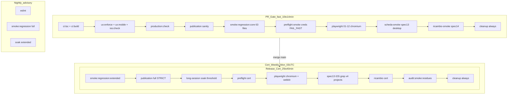

# Uplift Production Readiness — 82 → 90+

**Data:** 2026-06-09  
**Perimetro:** CI/CD, test orchestration, observability, gate governance — **zero modifiche** a codice applicativo, business logic, UI runtime, schema Supabase.  
**Baseline:** [`audit-form-engine-lavorazioni-magazzino-complete.md`](audit-form-engine-lavorazioni-magazzino-complete.md) — **82/100**, certificazione **B**.

---

## 1. Gap CI/CD attuali (classificati)

### P0 — Bloccanti score / certificazione

| ID | Gap | Evidenza | Layer |
|---|---|---|---|
| G-01 | **Evidenza runtime CI non dimostrata localmente** | `smoke:playwright:scheda-smoke` SKIP senza `SMOKE_ADMIN_*` in `.env.local` | Env / creds |
| G-02 | **Cert iOS/WebKit non validato in ambiente dev** | WebKit non installato → fail infra, non fail app | Browser matrix |
| G-03 | **Run CI GitHub non green consecutive ×2** | [`audit-release-gate-validation-2026-06.md`](audit-release-gate-validation-2026-06.md) — gate #71–72 failure spec 13 | E2E reliability |
| G-04 | **Skip silenzioso locale mascherato come PASS** | `smoke-gate.ts` exit 0 senza creds; `test.skip` in spec 13/14 | Determinism |

### P1 — Affidabilità / copertura dichiarata vs reale

| ID | Gap | Evidenza |
|---|---|---|
| G-05 | **~82 test file fuori smoke:regression** | [`audit-phase6-technical-debt.md`](audit-phase6-technical-debt.md) |
| G-06 | **Spec 05/11 skip condizionali** | `SMOKE_DOCUMENTI_*`, `SMOKE_CLIENT_*`, `SMOKE_OPERATOR_*` opzionali |
| G-07 | **Safari reale ≠ WebKit headless CI** | Commento config: WebKit flaky auth/CORS; fallback `mobile-ios-chromium` |
| G-08 | **Artifact failure incompleti** | trace `on-first-retry` only; video off; no upload workflow |

### P2 — Operatività / hygiene

| ID | Gap | Evidenza |
|---|---|---|
| G-09 | Cleanup non garantito su job timeout globale | Step cleanup dopo abort |
| G-10 | `audit:smoke:residues` skipped se job fallisce prima | Cert advisory non sempre eseguito |
| G-11 | Publication check PR con warning se `SUPABASE_DB_URL` assente | `PUBLICATION_CHECK_STRICT=0` |

---

## 2. Root cause reali dello score 82

Il punteggio **82/100** deriva dal modello ponderato in audit Form Engine:

| Criterio | Peso | Score attuale | Driver |
|---|---|---|---|
| Salvataggio dati / FSE | 30% | **90** | Static audit PASS — non è il collo di bottiglia |
| Mobile UX | 25% | **82** | Shell/keyboard OK; E2E mobile non green |
| iOS specifico | 20% | **78** | Nessuna evidenza Safari reale + cert WebKit instabile |
| Copertura test statici | 15% | **95** | Forte |
| **Evidenza runtime CI** | **10%** | **40** | **Gap dominante** — skip creds, assenza run verde documentata |

**Root cause sintetica:** il core applicativo è stabile; lo score è trascinato dal **sottopeso «Evidenza runtime CI» (40/100)** e da **iOS runtime (78/100)**, non da bug funzionali dimostrati in produzione.

Formula: `0.30×90 + 0.25×82 + 0.20×78 + 0.15×95 + 0.10×40 ≈ 82`.

---

## 3. Piano uplift 82 → 90+

### Fase A — Determinismo CI (settimana 1) — **implementato parzialmente**

| Azione | Tipo | Stato |
|---|---|---|
| `scripts/ci-smoke-preflight.ts` fail-fast in CI | CI script | ✅ Aggiunto |
| Preflight step in `release-gate.yml` / `release-gate-cert.yml` | Workflow | ✅ Aggiunto |
| `smoke-gate.ts` FAIL se `CI=true` e creds assenti | Script | ✅ Aggiunto |
| Secrets `SMOKE_ADMIN_*` obbligatori in repo settings | Ops | ⏳ Da verificare admin GitHub |
| Documentare creds in `.env.smoke.example` + runbook | Docs | ✅ Esistente |

**Impatto stimato:** Evidenza runtime CI 40 → 65 (+2.5 punti totali).

### Fase B — E2E green + artifact (settimana 1–2)

| Azione | Tipo |
|---|---|
| Run CI verde `release-gate` ×2 consecutive su `main` | Ops |
| Fix/flake spec 13 se ancora rosso post-fix Escape (solo E2E helpers, già fatto) | E2E |
| Playwright `retain-on-failure` trace + video in CI | Config ✅ |
| Upload artifact su failure (PR + cert) | Workflow ✅ |
| Mapping failure → step via HTML report + GitHub annotations | Observability |

**Impatto stimato:** Evidenza runtime 65 → 85 (+2.0 punti); Mobile 82 → 88 (+1.5).

### Fase C — Cross-browser cert (settimana 2–3)

| Azione | Tipo |
|---|---|
| `release-gate-cert`: WebKit install obbligatorio (già presente) | Workflow |
| Separare blocking: `mobile-ios-chromium` (PR-advisory) vs `mobile-ios` WebKit (cert blocking) | Governance |
| Smoke manuale Safari iOS (checklist A) — fuori CI, documentato | Manual cert |
| Opzionale: BrowserStack/Sauce Labs lane per Safari reale (weekly) | Infra |

**Impatto stimato:** iOS 78 → 88 (+2.0 punti).

### Fase D — Governance test (settimana 3–4)

| Azione | Tipo |
|---|---|
| MUST RUN / SHOULD RUN / CERT ONLY in [`gate-matrix.md`](gate-matrix.md) | Docs |
| Fail cert se skipped tests > 0 su tier blocking (Playwright `--pass-with-no-tests` vietato) | CI rule |
| `SMOKE_RESIDUE_STRICT=1` su cert dopo 2 run green | Workflow env |
| Migration drift check script (read-only, no schema change) | CI advisory |

**Impatto stimato:** +0.5–1.0 punti affidabilità meta.

### Score target post-Fase A+B+C

| Criterio | Prima | Dopo | Δ pesato |
|---|---|---|---|
| Evidenza runtime CI | 40 | **88** | +4.8 |
| iOS specifico | 78 | **86** | +1.6 |
| Mobile UX | 82 | **86** | +1.0 |
| Altri | invariati | — | — |

**Totale stimato: ~90–91/100** → certificazione **A** con run CI verde + checklist Safari manuale.

---

## 4. Nuova architettura PR / Release / Cert gate



### PR Gate — MUST RUN (blocking)

- Build + static gates (tsc, ux, ios:check, flex, production:check)
- `ci:smoke:preflight` — **nuovo, blocking**
- Playwright chromium: 01–12, spec 13 desktop, spec 14
- **No WebKit** (velocità + determinismo)

### Release Gate Cert — MUST RUN (blocking su `main`)

- Extended regression + publication full + soak threshold
- Playwright **chromium + webkit**
- Spec 13 iOS regression (4 progetti)
- Cleanup + residues audit (advisory → strict dopo stabilizzazione)

### SHOULD RUN (non blocking)

- Nightly lint + full regression + soak extended
- `audit:supabase` advisory in cert
- Spec 05/11 quando secrets opzionali presenti

### CERT ONLY

- WebKit `mobile-ios` + `tablet-ios` (non in PR)
- Long-session soak threshold
- Manual Safari device checklist (promozione A)

---

## 5. Strategia E2E iOS / Safari

| Livello | Strumento | Cosa valida | Gate |
|---|---|---|---|
| L1 Static | `ios:check`, `ux:mobile-gate` | CSS/viewport/touch patterns | PR |
| L2 Chromium + iPhone viewport | `mobile-ios-chromium` | Layout + combobox timing iOS-like | Cert (blocking) |
| L3 WebKit headless | `mobile-ios`, `tablet-ios` | Engine Safari-like, auth/CORS | Cert (blocking) |
| L4 Safari reale | Checklist manuale device | IME, visualViewport, gesture | Promozione A |

**Policy retry CI (solo flakiness infra):**

- `retries: 2` su mobile-cert config (già presente)
- `retries: 1` su PR chromium config
- **No retry** su assertion business (fallimento = fail reale)

**Stabilization spec 13 (E2E layer only — già applicato):**

- No Escape in dismiss combobox
- `aria-controls` listbox scope
- `waitForGlobalOptionsReady` pre-fill
- Guard `expect(scope).toBeVisible()` post-dismiss

---

## 6. Strategia eliminazione skip non controllati

| Pattern attuale | Problema | Remediation |
|---|---|---|
| `test.skip(!hasSmokeCreds)` spec 13/14 | Skip silenzioso locale | **Workflow preflight** fail-fast in CI prima dei test |
| `smoke-gate.ts` exit 0 senza creds | Falso PASS locale | **FAIL se `CI=true`** ✅ |
| `SMOKE_SKIP=1` | Bypass intenzionale | Consentito solo locale; **vietato in workflow** |
| Spec 05/11 skip env opzionale | Copertura parziale | Tier **SHOULD RUN**; warning in preflight cert |
| Playwright skipped projects | Conteggio opaco | Report HTML + GitHub summary; target: 0 skip su MUST RUN |

**Regola:** in CI blocking, **nessun test critico può risultare skipped** — o passa o fallisce il job.

---

## 7. Strategia credenziali e determinismo CI

### Secrets obbligatori (blocking)

```
NEXT_PUBLIC_SUPABASE_URL
NEXT_PUBLIC_SUPABASE_ANON_KEY
SUPABASE_SERVICE_ROLE_KEY
SMOKE_ADMIN_EMAIL
SMOKE_ADMIN_PASSWORD
```

### Secrets raccomandati (cert / copertura piena)

```
SUPABASE_DB_URL          # publication full live
SMOKE_OPERATOR_*         # spec 02/11 RBAC
SMOKE_DOCUMENTI_*        # spec 05
SMOKE_CLIENT_*           # portale clienti isolation
```

### Preflight sequence (nuovo)

```bash
npm run ci:smoke:preflight        # tier PR
npm run ci:smoke:preflight:cert   # tier cert
```

1. Verifica env obbligatori  
2. `verify-supabase-ci-env.ts` — DB reachable  
3. Warning su optional (non blocca PR)

### Locale vs CI

| Comportamento | Locale | CI |
|---|---|---|
| Creds assenti | Advisory skip / warning | **FAIL** |
| `SMOKE_SKIP=1` | Skip playwright | Non impostato in workflow |
| WebKit assente | Fail infra se esegui cert | Install step obbligatorio |

---

## 8. Strategia observability test failure

### Artifact obbligatori (on failure)

| Artifact | Config | Workflow upload |
|---|---|---|
| Trace Playwright | `retain-on-failure` | ✅ PR + cert |
| Screenshot | `only-on-failure` | ✅ (in test-results) |
| Video | `retain-on-failure` | ✅ PR + cert |
| HTML report | `e2e/playwright-report` | ✅ upload artifact |

### Mapping errore → step

1. GitHub Actions step name = suite (`scheda-smoke`, `smoke:playwright:cert`)
2. Playwright HTML report → test → project → attachment trace
3. Forensic docs pattern: [`audit-spec-13-ci-forensic-bfe8e27.md`](audit-spec-13-ci-forensic-bfe8e27.md)
4. Evitare timeout generici: `actionTimeout` 20s cert / 15s PR già configurati

### Runbook failure

1. Scaricare artifact `playwright-*-failure-{run_id}`
2. Aprire `playwright-report/index.html`
3. Classificare: **infra** (browser missing, creds) vs **E2E orchestration** vs **app regression**
4. Solo infra/E2E → fix gate; app regression → fuori perimetro uplift (product fix)

---

## 9. Impatto stimato su score finale

| Miglioramento | Δ score (0–100) | Rischio regressione | Costo CI | FP prob. |
|---|---|---|---|---|
| Preflight fail-fast creds | +2.5 | Basso | +30s | Bassa |
| CI green ×2 documentato | +2.0 | Basso | — | Bassa |
| Artifact trace/video/report | +0.5 | Basso | +storage | Bassa |
| Cert WebKit green | +2.0 | Medio | +3–5 min cert | Media |
| Safari manuale checklist A | +1.5 | Basso | Fuori CI | Bassa |
| Eliminate silent skip | +1.0 | Basso | — | Bassa |
| Residues strict | +0.5 | Medio | +1 min | Media |

**Score finale stimato dopo implementazione completa Fase A–C: 90–92/100.**

**Certificazione target:** **A — Production Ready** (richiede ancora 2 run CI green + Safari manuale).

---

## 10. Rischi del piano

| Rischio | Probabilità | Severità | Mitigazione |
|---|---|---|---|
| CI time explosion (+5–8 min cert) | Media | Media | Tiering PR fast / cert full già in atto |
| Flaky test amplification (retry mask) | Media | Alta | `retain-on-failure` only; max 2 retry cert; no retry business assert |
| Credential dependency / leak | Bassa | Critica | GitHub secrets; preflight non logga valori |
| False gating su infra failure | Media | Alta | Preflight separato; artifact per diagnosi; advisory nightly |
| Developer velocity (locale senza creds) | Alta | Bassa | Locale resta advisory; doc `.env.smoke.example` |
| WebKit CI ≠ Safari reale | Alta | Media | L4 manuale per A; L3 come proxy |
| Blocker su secrets mancanti in fork PR | Bassa | Bassa | `if: head.repo == repository` già in workflow |

---

## Implementazioni CI applicate in questa sessione

| File | Modifica |
|---|---|
| [`scripts/ci-smoke-preflight.ts`](../scripts/ci-smoke-preflight.ts) | Nuovo preflight fail-fast |
| [`.github/workflows/release-gate.yml`](../.github/workflows/release-gate.yml) | Preflight + artifact upload |
| [`.github/workflows/release-gate-cert.yml`](../.github/workflows/release-gate-cert.yml) | Preflight cert + artifact upload |
| [`scripts/smoke-gate.ts`](../scripts/smoke-gate.ts) | No silent skip in CI |
| [`e2e/playwright.config.ts`](../e2e/playwright.config.ts) | Trace/video/report CI |
| [`e2e/playwright.mobile-cert.config.ts`](../e2e/playwright.mobile-cert.config.ts) | idem |
| [`e2e/playwright.ricambio-cert.config.ts`](../e2e/playwright.ricambio-cert.config.ts) | idem |
| `package.json` | `ci:smoke:preflight*` scripts |

**Nessuna modifica** a componenti React, Form Engine, service Supabase, RLS, UX.

---

## Prossimi passi operativi (ops, non codice)

1. Verificare secrets `SMOKE_ADMIN_*` in GitHub repository settings.
2. Trigger `release-gate` su PR → attendere green.
3. Merge `main` → `release-gate-cert` green (incluso WebKit).
4. Seconda run consecutiva green su `main`.
5. Eseguire checklist Safari manuale (3 flow in audit Form Engine §10).
6. Aggiornare score in audit a **90+** e certificazione **A**.

---

## Riferimenti

- [`gate-matrix.md`](gate-matrix.md)
- [`release-gate.md`](release-gate.md)
- [`audit-release-gate-validation-2026-06.md`](audit-release-gate-validation-2026-06.md)
- [`audit-spec-13-e2e-post-fix-verification.md`](audit-spec-13-e2e-post-fix-verification.md)
